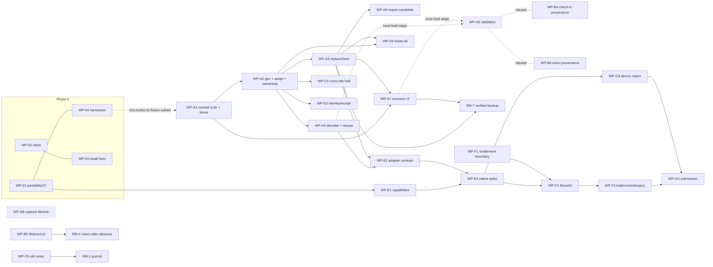

# catkin audit implementation plan

- **Plan date:** 30 September 2026
- **Planned against:** branch `claude/eloquent-hawking-v69lhr`, HEAD `d1554a0`, working tree clean. The only later commit, `e25a2b2`, is a WIP checkpoint of this document made outside this planning task; it changes no application file, so every `file:line` here still refers to the `d1554a0` source.
- **Source audit:** `docs/audits/CATKIN_COMPREHENSIVE_AUDIT_2026-09-29.md` (main pin `c66f588`, first integrated pin `7d16f11`).
- **Brief:** `docs/audits/OPUS_5_5_AUDIT_IMPLEMENTATION_PROMPT.txt`.
- **Status of this document:** planning only. No application source, test or configuration was changed to write it, and this task made no commit. Nothing here has been implemented. The recommended first package (§7.5) has not been started.

This plan maps every audit finding, every deeper second-pass entry, every substantive unnumbered risk and opportunity, and the native/subscription/release items to a current disposition, the evidence for it, and a work package or an explicit decision. It then orders the work, specifies each package, and defines how the fixes will be validated.

---

## How to read this plan

**Status vocabulary (at HEAD `d1554a0`):**
- **still present**: the defect or gap exists in current code.
- **partly fixed**: part of it has been fixed and a named residual remains.
- **fixed**: no repair is needed; a regression guard may still be recommended.
- **superseded**: the historical statement no longer describes the code; any residual is folded into a named item.
- **unconfirmed**: a source-only hypothesis that has not been executed. It must be validated before it is claimed.
- **disputed**: refuted as a bug, or an accepted design trade-off.
- **decision needed**: a product or engineering choice is needed before code.
- **future requirement**: a new requirement (native, subscription, store), not a regression.

**Evidence labels are kept from the audit:**
- **reproduced**: executed against real modules. At HEAD this means the tracers' scratch tests pass while *asserting the defective behaviour*.
- **source-only hypothesis**: the sequence was traced in source but not executed.
- **future-schema**: requires a schema upgrade or a newer build to occur.
- **product opportunity**: needs a product decision, not a bug patch.

A green scratch reproduction is evidence of a defect, never an acceptance test. §5.1 explains how each one becomes a failing-first regression.

**Identifiers:**
- Audit IDs are used unchanged.
  - Registered: `data-d*`, `domain-d*`, `domain-w2-d*`, `integration-i*`, `creative-cr-*`, `creative-cr-d*`.
  - Deeper: `FS*`, `UI2-*`, `HM*`, `SHIP1`.
  - Release: `IOS*`, `SUB*`, `GLOBAL1`, `ACCESS1`.
  - First-pass aliases map as follows: first-pass persistence D1–D12 are `data-d1…d12`; first-pass domain D1–D7 are `domain-d1…d7`; first-pass I1–I7 are `integration-i1…i7`; W2-D1–D4 are `domain-w2-d1…d4`; CR-0x are `creative-cr-0x`; R201–R214 are reproduction numbers, not findings.
- Local planning IDs give every unnumbered risk or opportunity a home: `P-persistence-NN`, `P-history-NN`, `P-ui-NN`, `P-creative-NN`, `P-release-NN`, the roadmap items `RM-1…RM-7`, the validation items `VAL-1…VAL-3`, and three new plan-level items `X-01…X-03`. Where two families named the same risk, one ID is primary and the others are listed as aliases. Aliases are never counted twice. A row that is a variant or named consequence of a registered ID says so ("**variant of …**") and is not counted as an independent defect (§7.1).
- `REQ-*` are owner requests for evidence (§7.2), not decisions.
- Work packages are `WP-0x` (foundations), `WP-A*` (data protection), `WP-B*` (history), `WP-C*` (interaction and accessibility), `WP-D*` (creative and product completion), `WP-E*` (native feasibility), `WP-F*` (subscriptions) and `WP-G*` (release validation). §4 maps them to the tracers' working names (WP-P1…, WP-H1…, WP-U1…, WP-C1…).
- Decisions are `DEC-*` (§7.2). Product decisions are labelled **[Product decision]**.

---

## 0. Current baseline

### 0.1 What changed since the audit pin

HEAD is 12 commits past `c66f588`:

`64406a1`, `bedb2a0`, `c942ccf`, `0433299`, `4e84724`, `c77ae7d`, `dd6aff2`, `98373af`, `6aad1d3` (audit docs), `2c21a6a`, `a163825` and the merge `d1554a0`.

**None of these commits fixed a registered finding.** What matters for this plan:

- **`src/state/**` and `src/app/pwa.ts` are byte-identical to the pin** (`git diff c66f588..HEAD -- src/state src/app/pwa.ts` is empty). Every `src/state` line number in the audit's second pass still holds, and the tracers rechecked each one.
- **The after-frame save is not new.** NOTES-open.md:373-375 describes the "save just after the tap's frame" behaviour. It arrived in `a094261`, which is an ancestor of the pin (`git merge-base --is-ancestor a094261 c66f588` is true). The durability contract, and therefore FS1's preconditions, are unchanged. `pull`, Special Order and import still save before they return (`store.ts:686-703`, `:920-932`).
- **`dd6aff2` moved screen chrome copy into `src/catalog/lines.ts` / `linesCore.ts`.** `src/features/you/copy.ts` now re-exports it. Copy line numbers moved: the SHIP1 credit is now at `lines.ts:1193`, the storage banner at `lines.ts:739`, the reset disclosure at `lines.ts:1167`, and the no-undo copy at `lines.ts:1160-1161`.
- **`a163825` makes a celebration banner step aside when a sheet opens.** This is the visual half of P-ui-15. Focus ownership (UI2-04) is unchanged.
- **`bedb2a0` added a second consumer of `monthJarStems`** (the Today band jar, `Band.tsx:272`), so domain-d7 is now more visible.
- **`0433299` added a PlantArt composition cache.** CR-02's damp derivation feeds its key (`PlantArt.tsx:176,201`), so the CR-02 fix must also cover the cache key.
- **`4e84724` regenerated the PWA screenshots** from the demo household. This partly addresses P-release-12.
- **`98373af` deleted `NOTES-w2-progress.md`** (and the other wave-2 notes). Their requests either landed or moved to `NOTES-open.md`. The audit asked for the latest disposition of the six Progress requests; §1.4 ("Wave-2 Progress requests") gives each one, read from `git show 98373af^:NOTES-w2-progress.md` and the current source.

### 0.2 Read-only checks run at HEAD

| Check | Result | Establishes |
|---|---|---|
| Persistence scratch suite `persistence-head.test.ts` (22 tests, real `src/state` modules, memory/fake adapters) | all pass, asserting defects | D1, D2, D3, D5, D6, D7, D8, D11, FS1, FS2, FS3, FS4, FS5 (reset variant), FS7, FS8, FS9, FS10 and snapshot-restore-without-migrate all still reproduce |
| Persistence tracer suite `persistence/current-repros.test.ts` (23 tests, the same modules through a fake browser; re-run for this revision: 23/23 pass) | all pass, asserting defects | independently re-confirms D1 (probe), D2, D3, D6 (two), D7, D8, D11, FS1, FS2, FS3, FS4, FS5, FS7, FS8 (four), FS9, FS10 and the snapshot migration gate; **and reproduces two items that were previously labelled source-only:** P-persistence-02 ("failed real write, enter and leave demo: the disk version wins") and P-persistence-11 ("four imports leave four pre-import copies (KEEP is 3)") |
| History scratch suite (18 tests) | all pass, asserting defects | d1, d2, d3, d4, d5, d6, d7, w2-d1, w2-d3, HM1, HM2, HM3, HM4 arithmetic, data-d9 (both repros), P-history-01, P-history-02 |
| UI scratch jsdom suite (20 tests) | all pass, asserting defects | UI2-01, UI2-02, UI2-03, UI2-04 (DOM level), UI2-05, UI2-06, UI2-07 (partial), i3, i4, CR-D1, CR-D2, CR-D3, P-ui-02, P-ui-03, P-ui-11 |
| Creative scratch suite (5 tests) | all pass, asserting defects | CR-02, CR-03 (adapter), CR-05 (contract), i5 (navigation), domain-d5 |
| `tsc --noEmit` (Linux) | exit 0 | Linux only; says nothing about Windows (i1) |
| `vite build` + `scripts/size-budget.mjs` | 138.9 KB gzip first paint against a 150 KB budget | i2 fixed; 11.1 KB of headroom |
| Simulated case-insensitive resolver (`caseResolve.mjs`) | 9 imports resolve to a different file | i1 still present |
| `detectInstallPlatform` with a default WKWebView UA | returns `'ios-safari'` | a new, concrete IOS4 hazard (install-first gate in a native wrap) |
| `npm audit` | one advisory (GHSA-82fw-gwwq-j7x9), 2 moderate entries; fixed only in a vitest major | P-release-03 still present |
| grep of built `dist/` for licence text | none | SHIP1 notices still missing |

In all, **88 scratch tests in five suites** (22 + 23 + 18 + 20 + 5) pass at HEAD while asserting defective behaviour. The two persistence suites overlap by design: the second was written independently by the persistence tracer, so a defect confirmed by both is still one defect.

The scratch harnesses live outside the repository, under the session scratchpad (`auditplan/`). They may not survive the session. §5.1 lists every case to port into `tests/` with inverted assertions, so this plan does not depend on them.

The **audit's 33 green reproductions** are the historical equivalent. They are covered by the cases above and by R201–R214 in §5.1.

### 0.4 Evidence that is not available here

- **`catkin-combined-evidence.zip` is not in the repository or anywhere on this machine** (a filesystem search for `*catkin*evidence*` and `*.zip` found nothing). The brief names it as holding the audit's reproduction harnesses, logs and the preserved first audit.
- What this costs the plan:
  - The audit's own R201–R214 harness files and logs could not be read. This plan re-derived every reproduction it relies on from current source (the 88 scratch tests above), so no status here depends on the ZIP.
  - **The audit's Windows test log** (2,496 passed, 15 failed, 1 skipped; "primarily the known UI import collisions plus crescent-generation precision", audit line 1294) is the only evidence that names the crescent failure. P-release-02 therefore stays **unconfirmed**, and its suspected test (`crescents.test.ts:74-84`) is a hypothesis.
- **Owner request REQ-1 (§7.2):** supply the ZIP, or at least the Windows test log. Until then, WP-01 identifies P-release-02 by running the full unit suite on the new `windows-latest` lane before changing any tolerance.

### 0.3 Status tally

| Set | Items | Still present | Partly fixed | Fixed | Other |
|---|---|---|---|---|---|
| Original register (audit "37") | 37 | 34 | 1 (integration-i5) | 2 (integration-i2, integration-i7) | none |
| Deeper second pass (FS1–10, UI2-01–08, HM1–4) | 22 | 22 (HM4 is a spec/copy mismatch; the code is correct) | 0 | 0 | none |
| Attribution correction | 1 (SHIP1) | 1 | 0 | 0 | none |
| First-pass ID outside the registers | 1 (data-d12) | 1 | 0 | 0 | none; an extension of data-d10 (§1.2a) |
| Release/platform/business | 10 (IOS1–5, SUB1–3, GLOBAL1, ACCESS1) | 2 (GLOBAL1, ACCESS1) | 0 | 0 | 7 future requirement, 1 decision needed (SUB3) |

The first three rows match the audit's pin exactly. **No finding changed status between the pin and HEAD.** data-d12 is a first-pass persistence ID from the audit's `7d16f11` delta (audit lines 768 and 1578-1584) that the audit's 37-item register does not list. It is still present and is tallied separately, so it neither inflates nor disappears from the register counts. The unnumbered items are tallied in §7.1.

---

## 1. Coverage matrix

Columns:
- **HEAD status** uses the vocabulary above.
- **Label** is the audit's evidence label, updated where a tracer executed a source-only case at HEAD.
- **Current evidence** is `file:line` at HEAD.
- **Cause** is the shared cause from §2.
- **Home** is the work package or decision that owns it.

### 1.1 Original registered findings (37)

| ID | Pri | HEAD status | Label | Current evidence | Cause | Home |
|---|---|---|---|---|---|---|
| data-d1 | P1 | still present | reproduced | `persist.ts:77-88` probe `setItem` catches every exception and returns null; `store.ts:161,200-201` substitute `memoryStorage()`; `hydrate` `store.ts:439-440` reads the empty store; the UI knows only `storage-full` (`DataSection.tsx:64-85`, `App.tsx:49-53`) | SC-1, SC-7 | WP-A1 (`openBrowserStorage`, `volatile` status), WP-A7 (banner) |
| data-d2 | P1 | still present | reproduced | `persist.ts:302-315` sets `pending=null` before `write()` and never restores it; `flushSaves` `store.ts:500-502`; copy promises a retry (`shellCopy.ts:11` → `lines.ts:739`) | SC-1 | WP-A1 |
| data-d3 | P1 | still present | reproduced | `replaceState` `store.ts:350-360` publishes before `persist(force)` and ignores its status; `applyImport` returns `{ok:true}` unconditionally (`:931-932`); `undoImport` removes its token regardless (`:946-948`); `restoreSnapshot` returns true (`:962-963`); the UI trusts all of these (`ImportSheet.tsx:152-166`, `DataSection.tsx:105-111,249-251`) | SC-3 | WP-A3 |
| data-d4 | P1 | still present | source-only (no IndexedDB shim) | `snapshots.ts:101-106` `req()` resolves on `onsuccess`; the transaction is dropped at `:122`; `put`/`remove` `:131-136` | SC-3 | WP-A3 (adapter half) |
| data-d5 | P1 | still present | reproduced, future-schema | `useHere` `store.ts:490-497` builds a rev-0 queue for any non-ok result and clears read-only; `adoptFromStorage` `:419-425` ignores non-ok; `exitDemo` `:1019-1021` | SC-2, SC-4 | WP-A2 (adopt routine), WP-A4 (decode) |
| data-d6 | P1 | still present | reproduced | `migrate.ts:167-180,197` blanket fill applies even to current-schema saves; `persist.ts:134-143` migrates before validating; `:159-173` backup fallback only on corrupt; imports use the same path (`handoff.ts:186-189`) | SC-4 | WP-A4, DEC-E1 |
| integration-i2 | P1 | **fixed** | measured at HEAD | 138.9 KB against 150 KB (`scripts/size-budget.mjs:21,27`, `KNOWN_OVERAGE=null`); `tests/unit/build/firstPaintImports.test.ts` | n/a | WP-E1 keeps native and entitlement code out of first paint (residual guard only) |
| data-d7 | P2 | still present | reproduced | `validate.ts:150-176` `checkLetter` never checks `stems`/`quote`/`readAt`/`ps.timeOfDay`; consumer throws at `views/pets.ts:376` | SC-5 | WP-A5 |
| data-d8 | P2 | still present | reproduced (scratch at HEAD) | `store.ts:957-964` swallows the protective `snapshotCurrent` failure (`.catch(()=>null)`); no undo token is written; the comment at `:956` promises undo | SC-3 | WP-A3 |
| data-d11 | P2 | still present | reproduced (scratch at HEAD: A→B→C with no-undo C, then Undo returns to pre-B) | `store.ts:929` writes the token only when a snapshot exists and never clears a stale token; `ImportSheet.tsx:165` always calls `toastImported()` (24 h Undo promise, `:49-65`), even after `doImport(true)` (`:238`) | SC-3 | WP-A3 (exact undo token), WP-A6 (UI receipt) |
| data-d10 | P2 | still present | source-only | `loadIssue` only in hidden `Diagnostics.tsx:10,61`; `ShellBanners` `App.tsx:46-83` shows other-window, newer and storage-full only; `saveStatus 'unavailable'` has no UI; `DataSection.tsx:67,75` says "Saved on this device" for every non-full status; silent fallback at `store.ts:447,456-464` | SC-7 | WP-A7 |
| domain-d1 | P2 | still present | reproduced | per-grant `round6` `economy.ts:367` (total `:344`), `company.ts:215-224`; 1e-9 comparisons at `growth.ts:58,67-71`, `economy.ts:851`, `company.ts:303`; scratch: nine M/W/F check-ins give sunshine 20.999997 (Leafy, not Budding) | SC-8a | WP-B2, DEC-P12a |
| domain-d2 | P2 | still present | reproduced | `pruneOldStamps` `logging.ts:403-415` (its comment at `:399-401` is wrong); `stacking.ts:79-84,106` count missing stamps as kept together; scratch: 0 → 14 kept-together days after compaction | SC-8b | WP-B4 (urgent within B) |
| domain-d3 | P2 | still present | reproduced | `rituals.ts:130-140` P.S. counts the whole week for the current companion (`:135`); stage-up highlight `:83-87`; only first-ever `since` is kept (`company.ts:99-106`) | SC-8c | WP-B6 |
| domain-d4 | P2 | still present | reproduced | recomputation with the current `dayStartsAt` at `rituals.ts:42-43,220-221`, `letters.ts:89,105`, `friendship.ts:143`, `views/pets.ts:201`, `gacha.ts:399`; scratch: arrival moves from 29 Sep to 28 Sep | SC-8c | WP-B6, DEC-P12f |
| data-d9 | P2 | still present | reproduced | `selectors.ts:39` `hourNow = floor(now/3.6e6)*3.6e6` feeds `hourEnv` `:44` and `todayVM` `:46,83`; IST 11:05 → hour 10; a 03:30 day start at 03:35 → previous evening | SC-8e | WP-B3 |
| integration-i3 | P2 | still present | reproduced | `usePull.ts:52,57` adopt only in initializers when active; neighbours pre-mount inactive (`MachineCarousel.tsx:130-155`); Capsules defaults to Cats (`CapsulesScreen.tsx:20`); seasonal filter (`:25-27`, `views/capsules.ts:119`); `todayVM.pendingReveal` has no consumer | SC-6 | WP-A8 |
| integration-i4 | P2 | still present | reproduced | `app/SheetHosts.tsx:7-13` `load().then()` has no rejection path, and deps never change; duplicate loader at `ProgressScreen.tsx:49-56` | SC-10 | WP-C4 |
| creative-cr-01 | P2 | still present | source-only | `petCopy.ts:21` `FEED_ROW=6`; `PetCard.tsx:327-331` slice is the only `feedPet` UI; `PetCardHost.tsx:57-58` opens `BasketSheet` with no pet/feed context (`BasketSheet.tsx:36-39,46-56`) | SC-11 | WP-C7 |
| creative-cr-02 | P2 | still present | reproduced | `PlantArt.tsx:192,197` `damp = !!props.damp \|\| waterings > 0` (also feeds the `0433299` cache key at `:176,201`); band `WindowsillBand.tsx:149,159-161,168-176` sticky Set and uncancelled timer; `SillSegment.tsx:120`, `PotSlot.tsx:71` | SC-12 | WP-D1 |
| creative-cr-03 | P2 | still present | reproduced at adapter level | `features/shelf/model.ts:42-74` drops flourishes, partner colour, resting and retired looks; `ShelfScreen.tsx:50-61`; three divergent adapters (`Band.tsx:65-80`, `progress/looks.ts:8-15`) | SC-12 | WP-D2 |
| creative-cr-04 | P2 | still present | source/integration | promises L5/L7/L8/L9 at `linesCore.ts:147-156` (and L11–L14 `:158-161`, a trace extension); the scene contract has no level or friend (`art/scene/model.ts:46-64`, `shelf/model.ts:92-103`, `behavior/plan.ts:56-81`) | SC-12 | WP-D4 (copy step), WP-D5 (behaviour), DEC-P9 |
| integration-i5 | P2 | **partly fixed** | reproduced | fixed: sidebar wallet, check-in, notices, rituals, keepsakes and detail quiet paths. Residual: both navs map every route (`Sidebar.tsx:31`, `TabBar.tsx:28`), digit 3 opens Capsules (`routes.ts:63-66`); trace residuals (a) Shelf header coins `ShelfScreen.tsx:187-198,459`, (b) empty-pets link `:222-233`, (c) prices on the pet card and places map, (d) `DoneTodayStep.tsx:50-67` | SC-12 | WP-D3, DEC-P6 |
| integration-i6 | P2 | still present | source-only | `RevealCard.tsx:149-153` falls back to `location.hash='#/shelf'`; routed `CapsulesScreen` gets no handlers (`routes.ts:24`, `ScreenHost.tsx:83`); `petCardRequest` is a bare id (`habits/open.ts:16,30-32`) | SC-11 | WP-C7 |
| domain-d5 | P2 | still present | reproduced | `domain/places.ts:44-47` `loves.includes(species)` against the catalogue's "empty means everyone" (`catalog/places.ts:14-15,23`) | SC-12 | WP-B7, DEC-P10 |
| domain-d6 | P2 | still present | reproduced at HEAD (source-only at the pin) | `seasonReview.ts:344` and `habits.ts:256` clamp the last day to `startedOn`; `inLifetime` includes it (`activity.ts:47-49`); validator enforces `archivedOn >= startedOn` (`validate.ts:95`) | SC-8d | WP-B5, DEC-P12b |
| domain-w2-d1 | P2 | still present | reproduced (view-model level) | `calendar.ts:97,127` mark unlogged flexible days 'unscheduled' while `Calendar.tsx:276-278` hides the action; post-archive days get edit 'history' (`calendar.ts:91`) but `editHistory` rejects (`logging.ts:379-381`) | SC-10 | WP-B8 |
| domain-w2-d2 | P2 | still present | source-only | `Calendar.tsx:250-253` bare `href '#/today'`; `HabitDetailHost.tsx:14-37` stays open; `router.ts:26-58` never closes sheets; `selectDay` is not called | SC-11 | WP-C7 |
| domain-w2-d3 | P2 | still present | reproduced | `rituals/lookup.ts:5-19` resolves live icon/plant; `words.ts:42-44,61,101-108` | SC-8c | WP-B6 |
| domain-w2-d4 | P2 | still present | source-only | `ProgressScreen.tsx:145` `hasHabits = vm.garden.length > 0` gates `:156-167` | SC-10 | WP-B8 |
| creative-cr-d1 | P2 | still present | reproduced at HEAD (source-only at the pin) | `store.ts:319-336,829-835` `act` returns the fallback `[]`; `Onboarding.tsx:160-172` advances unconditionally; `flow.ts:75-80,142-152` | SC-10 (refusal truth) | WP-C5 |
| creative-cr-d2 | P2 | still present | reproduced at HEAD | `CapsuleSteps.tsx:53` `picked=null`, `:96-122` never consults `pendingReveal`; `gacha.ts:295` blocks a new pull | SC-6 | WP-A8 (resume authority), WP-C5 (initial `picked`) |
| integration-i1 | P2 | still present | reproduced (simulated resolver, 9 imports) | `src/ui/CheckRing.tsx` + `checkRing.ts`; `src/features/capsules/Leaflet.tsx` + `leaflet.ts` (and their tests); importers include `src/ui/index.ts:5` | SC-13 | WP-01 |
| integration-i7 | P2 | **fixed** | source | `App.module.css:23-37` padding formula gives a 720 px column at 1280 px | n/a | Residual X-02 checked in WP-G1 |
| domain-d7 | P3 | still present | reproduced | `views/today.ts:230-243` `l.count > 0` and no lifetime bound; consumers `Hero.tsx:89-95` and the new Today band (`Band.tsx:272`, `WindowsillBand.tsx:280-283`) | SC-12 | WP-B7, DEC-P12e |
| creative-cr-05 | P3 | still present (latent) | contract reproduced | `lines.ts:132-141` positional lines vs `art/plants/flourishes.tsx:16`; `VOICE.md:397`; `FLOURISH_LINES` still has no consumer | SC-12 | WP-D4 |
| creative-cr-d3 | P3 | still present | reproduced at HEAD | `Onboarding.tsx:76-89` swallows the rejection and runs once; `:234` lead with nothing to choose | SC-10 | WP-C4 |

### 1.2 Deeper second-pass findings (22) and the attribution correction

| ID | Pri | HEAD status | Label | Current evidence | Relationship (no new count where noted) | Cause | Home |
|---|---|---|---|---|---|---|---|
| FS1 | P1 | still present | reproduced (R201; scratch at HEAD) | `saveSoon` captures the queue (`persist.ts:269-281`); `dispose()` `:338-341` clears only the debounce handle; the stolen-lock branch (`store.ts:411-414`) disposes without `discardPending` (compare the refusal branch `:393-397`); `hydrate` `:433` likewise; `browserAfterFrame` 100 ms fallback `:129-139` | new regression with RC-B's missing fence | SC-2 | WP-A1 |
| FS2 | P1 (upgrade) | still present | reproduced, future-schema (R202); unreadable-newer variant source-only | `persist.ts:136-138` stamps a newer state with `SCHEMA_VERSION`; `store.ts:452,842-851`; `handoff.ts:31-33`; Save/Copy enabled while read-only (`DataSection.tsx:266-267`) | new upgrade gate | SC-4 | WP-A4 |
| FS3 | P2 | still present | reproduced (R203); lower-rev variant source-only | `resetAll` `store.ts:984-991`; storage handler `:478-483` adopts only a higher non-null rev; `useHere` `:490-497` | **extends data-d5** | SC-2 | WP-A2 |
| FS4 | P2 | still present | reproduced (R210) | `saveNow` returns `flush() ?? 'saved'` (`persist.ts:257-260`), and a held flush returns null (`:307`); `hydrate` holds (`store.ts:469`) while `writable()` stays true; `pull` `:686-691` | new timing defect; RC-A plus RC-B | SC-1, SC-2 | WP-A1 (queue half), WP-A2 (ownership half) |
| FS5 | P2 | still present | reproduced (R211, reset variant); demo and ownership variants source-only | `store.ts:921-925,930-931,943-946,958-962` check only at entry; `ImportSheet.tsx:184-186` close/Keep stay live | deepens first-pass risk 1 | SC-3, SC-6 | WP-A3 (store), WP-A6 (UI) |
| FS6 | P2 | still present | source-only hypothesis | `ImportSheet.tsx:91,93-100,102-109,118-124,132-148` | deepens delayed-read risk | SC-6 | WP-A6 |
| FS7 | P2 | still present | reproduced (R205) | `validate.ts:83` any non-empty id without `\|`; bracket access on `{}` maps (`domain/tx.ts:99-103`, `defaults.ts:30-41`) | new validation class | SC-5 | WP-A5 |
| FS8 | P2 | still present | reproduced (R204); month/quote/ps consumer crashes source-only | `validate.ts:167,295`; `handoff.ts:177` (`exportedAt`); `persist.ts:147` (rev 1e309 → Infinity); crash sites `features/rituals/words.ts:97,137`, `when.ts:4-7` | **extends data-d7** | SC-5 | WP-A5 |
| FS9 | P2 | still present | reproduced (R212) | `snapshots.ts:109-111` null without IndexedDB; `store.ts:202` silent memory fallback; durable token `:930`; `canUndoImport` `:936-939` | new recovery defect | SC-3 | WP-A3, DEC-P13 |
| FS10 | P2 | still present | reproduced (R214) | `wish` `store.ts:700-703` via `act` `:319-331`, which ignores the status; the `saveNow` result from the `pendingReveal` change is dropped (`:299`); `SpecialOrder.tsx:152-175` | **extends data-d2/d3** | SC-1 | WP-A1 |
| UI2-01 | P2 | still present | reproduced (R209; scratch at HEAD); cross-save consequence source-only | `usePull.ts:180-199` untracked rAF ids, `:94-108,201-235,256-268` post-await continuations, `:324-330` cleanup clears two timers only; `TabBar.tsx:16-23` navigates while busy | new lifecycle defect | SC-6 | WP-A8 |
| UI2-02 | P2 | still present | reproduced at HEAD (source-only at the pin) | module `Map` `usePull.ts:26` outranks `state.pendingReveal` (`:35-41`); argumentless `finishReveal()` (`:296-299`, `store.ts:696-698`); replacement paths never invalidate it | new cache defect | SC-6 | WP-A8 |
| UI2-03 | P2 | still present | reproduced at HEAD | `features/today/state.ts:16` `HIDDEN_RESET_MS`; `TodayScreen.tsx:72-91,123,209,296` bind the pad by id and the render-time date | new date-identity defect | SC-6 | WP-C1 |
| UI2-04 | P2 a11y | still present | reproduced at DOM level at HEAD; VoiceOver unverified | `main.tsx:69` Toaster outside `#app`; `Toaster.tsx:49-58` portal; `Sheet.tsx:334` `trapTab(panel)`; `toast.ts:95-97,107-108` | new accessibility defect | SC-10 | WP-C3 |
| UI2-05 | P2 | still present | reproduced at HEAD (Sheet touchcancel; arrange pointercancel); OS triggers need a device | `Sheet.tsx:251-268,283-286,309-310`; `HabitsSection.tsx:135-148,193-194`; `NoteSheet.tsx:27-44` | new cancellation defect | SC-9 | WP-C2 |
| UI2-06 | P3 | still present | reproduced (R208; plus limit-disable variant) | `Stepper.tsx:45-64,71-76` | new narrow defect | SC-9 | WP-C2 |
| UI2-07 | P2 | still present | partly reproduced at HEAD (read-only tab writes the sidecar; a removal event is ignored); full two-tab resurrection source-only | `onboarding/progress.ts:48-58,61-63,69`; storage listener `store.ts:478-483` handles the save key only | new sidecar-ownership defect; RC-B | SC-2 | WP-C5 (after WP-A2), DEC-E3 |
| UI2-08 | P2 control | still present | source-only (call-site inventory) | only product `setNote` UI is `NoteSheet.tsx:35`; Moments star only (`habits/detail/Parts.tsx:171-207`); Calendar read-only (`Calendar.tsx:201-233,246-303`); domain already supports edit and clear (`logging.ts:68-77,97-101,339-352`) | new control gap | SC-10 | WP-C6, DEC-P7 |
| HM1 | P2 | still present | reproduced (R206 exactly) | `periods.ts:156-169` counts active days through `inLifetime` (`activity.ts:109-111`); Finish shortens lifetime (`seasonReview.ts:338-349`); contract `rules.ts:160-175` | new history defect | SC-8d | WP-B5, DEC-P12c |
| HM2 | P2 | still present | reproduced (R213) | refund window `activity.ts:117,130-132` (today−6…today) vs ledger retention `economy.ts:107` (`LEDGER_DAYS=7`); `deleteHabit` `habits.ts:305-322` reverses every retained entry | new boundary defect | SC-8 | WP-B1 |
| HM3 | P2 | still present | reproduced (R207) | `withStamp` `logging.ts:84-86` keeps the last 24; `stacking.ts:79-84,106` | **same root cause as domain-d2** (15 mechanisms for 16 history IDs); keeps its own acceptance tests | SC-8b | WP-B4 |
| HM4 | P3 | still present (spec/copy mismatch; code correct) | source plus exact probability | `DESIGN.md:266-267` promise vs `gacha.ts:155,170-192`; `OddsSheet.tsx:62`; owned Special 3.571% < unowned Rare 4.286% | promise mismatch, not an RNG bug | SC-12 | WP-D4 |
| SHIP1 | P3 | still present | source plus upstream authors | `lines.ts:1193` (moved from `you/copy.ts` in `dd6aff2`) and `VOICE.md:1476` credit "Tiffany Wardle"; upstream TiroTypeworks credits John Hudson and Paul Hanslow, assisted by Kaja Słojewska; built `dist/` has no OFL or MIT notices | attribution correction plus notice gap | SC-12 | WP-D4 |

### 1.2a First-pass ID outside the registers

The audit's first-pass persistence review numbered D1–D12, and its families list "D10–D12" (audit line 582). The 37-item register lists D1–D11 only. D12 has its own mechanism and remedy (audit lines 1578-1584), so it gets its own row. It is an **extension of data-d10** (the same "recovery states are not shown" family), not a new cause, and it is not added to the 37.

| ID | Pri | HEAD status | Label | Current evidence | Relationship | Cause | Home |
|---|---|---|---|---|---|---|---|
| data-d12 | P2 | still present | source-only hypothesis (failure injection not run at the pin or at HEAD) | `DataSection.tsx:94-97` maps a rejected `listSnapshots()` to `[]`, so the sheet shows the empty line "The first daily copy is made tonight." (`lines.ts:731`); `restore` `:102-111` awaits `restoreSnapshot` with no `try/finally`, so a rejected snapshot read leaves `busy` true until remount; `undo` `:249-252` has no `catch` (unhandled rejection, no note); the toast Undo `ImportSheet.tsx:61-66` has `.then` only; the store's snapshot `get` and `list` can reject (`store.ts:943,951,958`) | **extends data-d10** (store half shares data-d3's result contract) | SC-3 (store half), SC-7 (UI half) | WP-A3 (store methods return results instead of rejecting), WP-A7 (three-state list, `try/catch/finally`, failure notes) |

### 1.3 Release, platform and business items

| ID | HEAD status | Label | Current evidence | Home |
|---|---|---|---|---|
| IOS1 | future requirement | source inventory | no Xcode project, Info.plist, entitlements, `.storekit`, privacy manifest or Capacitor config; CI `ubuntu-latest` only; `DESIGN.md:44-53` chose the PWA. New hazard: `installPrompt.ts:25-35` classifies a default WKWebView UA as `'ios-safari'`, so `InstallGuide.tsx:95-99` would gate a native first launch (reproduced for the pure function only) | WP-E4 (spike); hazard fixed in WP-E1 |
| IOS2 | future requirement | source | synchronous whole-state localStorage envelope (`persist.ts:2-5,319-335`); FS4 `'saved'` fabrication; FS1 after-frame lifetime | WP-E2, after WP-A1–A4 |
| IOS3 | future requirement | source | replace-only transfer (`handoff.ts:1-11`); no payload in URLs; no stable save identity in `types.ts` | WP-E3 |
| IOS4 | future requirement (plus one concrete web-code hazard) | source; WKWebView UA reproduced | direct browser APIs in features: files `features/you/files.ts:14-131`, `.ics` reminders `RemindersSection.tsx:3,35`, hidden-switch haptics `fx/haptics.ts:3-60`, service-worker auto-reload `pwa.ts:63-78,120-124`, About copy `lines.ts:1188`. Sub-item P-release-19 (keep the one-time `.ics` export, never claim catkin can remove an imported event, and the reminder test cases) | WP-E1; RM-5 (P-release-19) |
| IOS5 | future requirement | source plus Apple sources rechecked 30 Sep 2026 (§5.14) | no in-app privacy/terms/support link (`AboutSection.tsx`, `ABOUT_COPY` `lines.ts:1180-1200`); no network client in `src/`. Sub-items with their own IDs: P-release-15 (not positioned as clinical or a regulated medical tool), P-release-16 (never select the Kids category), P-release-17 (a record of what ships in each binary), P-release-18 (China mainland ICP and other per-territory requirements) | WP-G4 |
| SUB1 | future requirement | source; Apple sources rechecked (§5.14) | no purchase or entitlement code; no "free forever" or "no in-app purchases" copy. Sub-item P-release-20: subscriptions must work "on all of the user's devices where the app is available" (guideline 3.1.2(a)), which makes iPhone-only versus iPhone-and-iPad availability a decision | WP-F2; DEC-P3 (P-release-20) |
| SUB2 | future requirement | source; Apple sources rechecked (§5.14) | replacement paths that must never affect paid access: `store.ts:490,920,941,957,971,997,1015,1033` | WP-F1 |
| SUB3 | decision needed | product requirement | no paid features exist; guideline 3.1.2 consent content needed | WP-F3, DEC-P1 |
| GLOBAL1 | still present (English-only by design, plus one concrete input bug) | source; IME gap source-only | `formatCore.ts:20` `en-GB`; `dates.ts:357-362` "no Intl"; am/pm `you/calendar.ts:35-45`; Latin fonts `styles/fonts.css:1-30`; Profile name Enter handler without `isComposing` (`ProfileSection.tsx:84-89`; no `isComposing` anywhere in `src`). Sub-item P-release-14: four-season hemisphere prose (`domain/hemisphere.ts:1-3,45-52`) does not fit tropical climates | WP-03 (IME guard now); WP-G4 and DEC-P5 (locale scope and seasonal voice, P-release-14) |
| ACCESS1 | still present (verification gap, not a defect claim) | source | `playwright.config.ts:27` forces Chromium for the iPhone profile, `:64` reduced motion for every project; `e2e/today.spec.ts:16`. Sub-item P-ui-21: the task matrix must also cover forced colours, keyboard-open flows, the capsule gesture alternative, import confirmation, landscape and small screens | WP-G1 (web), WP-G3 (device) |

### 1.4 Unnumbered risks and opportunities (local planning IDs)

Where two families raised the same item, the first ID is primary and the alias is shown in brackets. An alias is not a second item.

**Variants.** Six local rows describe a variant, a sub-variant or a named consequence of a registered ID. They keep a row because each has its own acceptance scenario and sometimes its own home, but **they are not independent defects**. Each is marked "**variant of …**" in its row, and §7.1 subtracts them when it counts independent items:
- P-persistence-01 is a consequence of data-d2 (the audit calls it "a specific integration consequence of D2").
- P-persistence-03 is a variant of FS4 (its ownership half).
- P-persistence-15 is the UI half of FS5.
- P-persistence-23 is a sub-variant of UI2-07.
- P-ui-03 is a variant of UI2-06.
- P-ui-14 is a variant of UI2-03.

#### Persistence, recovery and privacy (P-persistence-01…25)

| ID | Item | HEAD status | Label | Evidence | Home |
|---|---|---|---|---|---|
| P-persistence-01 | **Variant of data-d2** (its named consequence): PWA auto-reload while a save is unsaved | still present | source | `pwa.ts:64-66` `busy()` ignores save state; `:119-127` reloads a hidden app | WP-A1 (`hasUnsaved` gate), WP-A7 (manual Reload warning) |
| P-persistence-02 | Demo round-trip drops failed-write real changes | still present | **reproduced** (scratch at HEAD: `current-repros` "failed real write, enter and leave demo: the disk version wins") | `lock.ts:17`; `DataSection.tsx:272-279`; `enterDemo` ignores flush (`store.ts:999`); `exitDemo` prefers disk (`:1019-1021`) | WP-A1 |
| P-persistence-03 | **Variant of FS4** (ownership half): snapshot, backup, quarantine and theme writes before the lock is granted | still present | source | `store.ts:448,460,473,486`; `snapshotToday` checks optimistic `writable()` (`:370`) | WP-A2 (a planning row with its own acceptance case, SC-2 (4); not an independent defect) |
| P-persistence-04 | Snapshot restore/undo validate without migrating (schema-upgrade gate; audit "further gate 1", first-pass risk 4) | still present | future-schema (scratch confirms a repairable snapshot is refused) | `store.ts:945,960` call `validateState` directly | WP-A4 (one decoder); WP-A3 routes through it |
| P-persistence-05 | IndexedDB adapter caches a failed open; no versionchange/blocked handling (further gate 2) | still present | source | `snapshots.ts:112-121` | WP-A3 |
| P-persistence-06 | Unbounded import file, decompression and object size (further gate 3, first-pass risk 7) | still present | source-only hardening, not an exploit | `features/you/files.ts:123-131`; `handoff.ts:101-104,121-145,156-190` | WP-A5 |
| P-persistence-07 (alias P-release-04) | Scale fixtures underrepresent journaling and durable-save cost (further gate 4, first-pass risk 6) | still present | measurement gap | `tests/unit/state/bigsave.ts:71` (52-char notes on 4% of logs); `size.test.ts:30-31`; `perf.test.ts` excludes stringify/setItem | WP-G2 |
| P-persistence-08 (alias P-release-07) | Container-migration identity and receipt (further gate 5) | future requirement | future requirement | envelope has only `rev` (`persist.ts:44-50`) | WP-E3 (builds on WP-A2 `gen`) |
| P-persistence-09 | Entitlement must stay outside importable state (further gate 6) | future requirement | future requirement | no entitlement code | WP-F1 |
| P-persistence-10 (aliases P-creative-25, P-release-08) | Start over retains daily copies; no erase-all operation (further gate 7, first-pass risk 5) | partly fixed | product decision / privacy | second dialog now discloses retention (`lines.ts:1167`); first dialog still says "Every habit, plant and pet on this device goes" (`linesCore.ts:443`); no `deleteDatabase` path | WP-A9, DEC-P8 |
| P-persistence-11 | Pre-import snapshots never pruned at write; `list()` materialises full states (first-pass risk 8) | still present | **reproduced** for the pruning half (scratch at HEAD: `current-repros` "four imports leave four pre-import copies (KEEP is 3)"); the listing cost is unmeasured | `store.ts:910-917`; `snapshots.ts:77,125` | WP-A3 (prune after commit); metadata listing deferred to WP-G2 measurements |
| P-persistence-12 | Offline/update/import lifecycle lacks real-browser persistence tests (first-pass risk 9) | still present | test gap | `e2e/pwa.spec.ts` covers offline launch/navigation only | WP-G1 |
| P-persistence-13 (alias P-creative-21, receipt part) | Backup receipt marked before delivery | partly fixed | previously reported | fixed for share/copy (`DataSection.tsx:220-239`, `InstallSection.tsx:29-35`); residuals: legacy `exportData`/`exportPayload` still mark eagerly (`store.ts:880-893`, no production caller), and `'downloaded-instead'` marks without confirmed delivery (`DataSection.tsx:222-225`) | WP-03 (remove legacy exports); download semantics and verification go to RM-7 |
| P-persistence-14 | Import preview counted archived habits | fixed | n/a | `handoff.ts:196-198` counts live habits | none; keep the test |
| P-persistence-15 | **Variant of FS5** (its UI half): import sheet close/Keep stay active during an in-flight import | still present | source | `ImportSheet.tsx:173-187` | WP-A6 |
| P-persistence-16 | Name draft commit on hide vs mobile suspension | unconfirmed | source-only lifecycle edge | ProfileSection commits on hide after the store's visibility flush (`main.tsx:54-65`, `ProfileSection.tsx:62-68`) | WP-G3 device test before any claim; related P-ui-08 |
| P-persistence-17 (alias P-creative-20) | Recovery preview showing actual differences | decision needed | product opportunity | preview is counts only (`ImportSheet.tsx:44-47`; `store.ts:903-906`) | RM-7 step 3 (after WP-A3) |
| P-persistence-18 (alias P-creative-22) | First external-backup assistance | decision needed | product opportunity (absence is intentional) | `DataSection.tsx:55-58`, pinned in `pure.test.ts:130` | RM-7 step 2, DEC-P15 |
| P-persistence-19 (alias P-creative-23) | Human-readable private notes export | decision needed | product opportunity | CSV columns `linesCore.ts:436` have no notes | RM-1 step 3 |
| P-persistence-20 | Optional password-protected backups | decision needed | product opportunity, low | none | **DEC-P16(e)**: rejected for now; re-decided at the M-Paid review, triggered by the P-persistence-25 copy test or any cloud-backup proposal. Never a prerequisite for local use |
| P-persistence-21 | Imported far-future clock guard accepted | unconfirmed | source-only (validation acceptance confirmed; paused-rewards consequence not run) | `domain/wallet.ts:127-129`; `repairClock` never lowers the guard (`store.ts:1033-1038`) | WP-A5 (folded into FS8), DEC-P14 |
| P-persistence-22 | Refuted: CSV injection, ICS escaping, exfiltration/XSS, unknown catalogue IDs, stack cycles, economy edits | disputed | refutation | CSV defuse `domain/profile.ts:154-159`; ICS escaping; no outbound transfer | none; keep existing tests |
| P-persistence-23 | **Variant of UI2-07** (sub-variant): stale onboarding sidecar survives an import | unconfirmed | source-only | `progress.ts:48-58`; `DataSection.tsx:257,286`; `InstallSection.tsx:52`; `Onboarding.tsx:63-69` | WP-C5 |
| P-persistence-24 | storage-full is intentionally not a hard action guard | decision needed (recorded) | design choice | `lock.ts:12-13`, `store.ts:254` | Keep. WP-A1 and WP-A7 make the unsaved state truthful instead. Recorded as DEC-E10; not a defect |
| P-persistence-25 | Backup and clipboard privacy is not explained: the audit's SHIP1 note "a checksum/compressed text payload is not encryption; explain backup and clipboard privacy appropriately" | still present | source-only (copy gap) | the CK1 payload is `base64url(gzip(json))`, readable by anyone who has it (`handoff.ts:5,106-107`); it carries every note; the copy says only "keep it somewhere safe" (`lines.ts:1171`) and "Copied. Open catkin…" (`lines.ts:763`), with nothing on clipboard history or sync | RM-7 step 1 (copy and VOICE rows under DEC-V); WP-G4 privacy policy wording |

#### History, time and rewards (P-history-01…16, R1…R4)

| ID | Item | HEAD status | Label | Evidence | Home |
|---|---|---|---|---|---|
| P-history-01 | Backdating re-anchors the multi-week/month period grid | decision needed | reproduced at grid level (the overpayment variant is not reproduced) | `rules.ts:245-248`; `schedule.ts:158-160`; `periods.ts:71`; `habits.ts:395-400` | WP-B5, DEC-P12d |
| P-history-02 | Signature reads the last tap, not the completing check-in | decision needed | reproduced at HEAD | `signature.ts:5,120`; `logging.ts:212-231` | WP-B4 (`DayLog.done`), DEC-P11 |
| P-history-03 | Unbounded backdating and whole-lifetime cold-path cost | still present | risk (unmeasured) | `habits.ts:395-400`; `growth.ts:261`; `activity.ts:238`; `streaks.ts:74` | WP-G2 (budgets); backdate bound DEC-P12g |
| P-history-04 | Worldwide time semantics: old stamps reread in the current zone; signature memo lacks zone | future requirement | risk | `signature.ts:106-114,121` | WP-B3 (zone in the clock key and signature memo), WP-B6 (event day keys) |
| P-history-05 (alias P-creative-19) | Avoidance habits are self-reported successes | decision needed | product opportunity | `formatCore.ts:48-57`; `DESIGN.md:98` | RM-2 copy (creation examples); a reduction goal is a future contract |
| P-history-06 (alias P-creative-02) | Sparse schedules never earn Blooms Like You (first-pass R1) | decision needed | design gap | `signature.ts:44-58` (`minEligibleDays:10`, 120-day window) | WP-D6, DEC-P11 |
| P-history-07 (alias P-creative-03) | Catch-up and night filters exclude short routines and night-shift users (R2) | decision needed | product trade-off | `signature.ts:7-14,43-49` | WP-D6, DEC-P11 |
| P-history-08 (alias P-creative-04) | Favourite places and best friends are heuristics, not learned history (R3) | decision needed | specification mismatch | `places.ts:64-104` | WP-D5, DEC-P9 (wording now); the evidence-based co-presence tally is DEC-P16(f), decided at the M-Web-Complete review after VAL-3 |
| P-history-09 | Memory dates for favourite discovery and "the day it bloomed" | still present | source-only hypothesis | `friendship.ts:147,149,229-233`; `views/pets.ts:237-238` | WP-B6 |
| P-history-10 | Aggregate calendar note markers go stale after a note-only edit (W2 supplemental P3) | still present | source-only hypothesis | `Calendar.tsx:46,79-88` | WP-C6 (it must ship with old-note editing) |
| P-history-11 | Best/current run tile compares lengths across rhythm units | still present | low-priority presentation | `habits/detail/Parts.tsx:139-142` | WP-B8 |
| P-history-12 (alias P-creative-15) | Reviewable edits and trustworthy history explanation | decision needed | product opportunity | rule history VM unused (`state/views/habit.ts:83-84,200`; only `vm.upcoming` renders at `HabitDetail.tsx:66`) | RM-2 |
| P-history-13 (aliases P-creative-16, P-creative-17, P-creative-18) | Factual record with provenance; finite/sparse habits first-class ("bring back next season"); explain personalisation uncertainty | decision needed | product opportunity / future-schema | `types.ts:114`; `seasonReview.ts`; the "waiting" look state | RM-2 (provenance), RM-4 (bring back), WP-D6 ("still learning") |
| P-history-14 | Offer-decline persistence and one-day phrase (wave-2 Progress requests 9 and 5) | fixed | n/a | `habits.ts:445-457`; `economy.ts:930-933`; `formatCore.ts:67-69` | none |
| P-history-15 | Cold `progressVM` cost on a mature save (wave-2 Progress request 11: about 155–175 ms cold and about 50 ms after any store change on a 3-year × 20-habit save) | partly fixed | measurement gap | per-habit memoisation now keeps records, statistics and plants until their own inputs change (`state/views/progress.ts:91-103`; NOTES-open.md:376-377); the **cold** path is unmeasured at HEAD | WP-G2 (budget on phone-class hardware; split further only if the budget fails) |
| P-history-16 | First-period goal-bonus exclusions are anti-farming policy but unexplained (audit domain refutation: they "may merit later UX explanation"; no lost-bonus defect is alleged) | still present | product opportunity | only periods the habit covered from their first day pay a goal bonus (`economy.ts:561-566`); no user-facing explanation | RM-2 step 2 ("why did this count?" explanation, including why a first partial week pays no goal bonus) |
| P-history-R1 | Baking at 99 servings loses value | disputed | UI guard in place | `BasketSheet.tsx:24`; `PetCard.tsx:362`; the domain would silently cap (`pantry.ts:70-76`) | optional domain guard in WP-03 (defence in depth) |
| P-history-R2 | Backup/snapshot replay of spent rewards | disputed (accepted trade-off) | design choice | local-first; entitlement kept separate | recorded; never add a server for this (WP-F1 boundary) |
| P-history-R3 | DST and leap arithmetic | disputed at domain level | refuted | `dates.test.ts:200-311` | selector-level zone tests in WP-B3 |
| P-history-R4 | Capsule guarantees, undo/repricing conservation, high-water growth, archive-to-pause | disputed | refuted | unchanged since the pin | the HM4 property tests extend coverage (WP-D4) |

#### Interaction, lifecycle and accessibility (P-ui-01…21)

| ID | Item | HEAD status | Label | Evidence | Home |
|---|---|---|---|---|---|
| P-ui-01 | Sheet mouse-drag window listeners outlive the effect | still present | source-only | `Sheet.tsx:288-305,312-318` | WP-C2 |
| P-ui-02 | Toaster treats pointercancel as a flick and dismisses an actionable toast | still present | reproduced at HEAD (new variant) | `Toaster.tsx:100-112,126` | WP-C2 |
| P-ui-03 | **Variant of UI2-06**: a Stepper press reaching min/max disables the button, so the flag never clears | still present | reproduced at HEAD | `Stepper.tsx:47-48,71` | WP-C2 |
| P-ui-04 | Stale click-suppression in HabitCard long-press and RevealOverlay | unconfirmed | source-only | `HabitCard.tsx:161-187`; `RevealOverlay.tsx:215-230,279` | WP-C2 |
| P-ui-05 | Reduced-motion crank still animates for 420 ms | still present | source-only | `usePull.ts:186` vs `DESIGN.md:294` | WP-A8, DEC-E7 |
| P-ui-06 | Toast lifetime ignores document visibility | still present | source-only | `Toaster.tsx:78-83` | WP-C3 |
| P-ui-07 | Medium-detent sheets have no explicit expand control | unconfirmed | source plus device need | `BasketSheet.tsx:50`; `Sheet.tsx:223-249` | WP-G3 measurement; fix only if it fails |
| P-ui-08 | No general draft restoration; NoteSheet discards on close | decision needed | future hardening | `NoteSheet.tsx:27-44`; precedent `HabitEditorHost.tsx:33-40` | WP-C2 (dirty confirm); app-owned drafts per DEC-E8 |
| P-ui-09 | Long-history rendering (Moments, memory shelf) unmeasured | unconfirmed | measurement gap | `Parts.tsx:180`; `Keepsakes.tsx:196` | WP-G2 |
| P-ui-10 | Sound and haptics rely on browser techniques | future requirement | platform | `fx/haptics.ts` | WP-E1 (feedback capability), WP-G3 |
| P-ui-11 | Onboarding step has no h1 or focus target while its chunk loads or fails | still present | reproduced at HEAD (new observation) | `Onboarding.tsx:125-138,234` | WP-C4 |
| P-ui-12 (alias P-creative-05) | Onboarding draws planted habits at stage 0 after the first watering | still present | source-only | `SillStage.tsx:46,53`; `CapsuleSteps.tsx:232` | WP-D2 |
| P-ui-13 (alias P-creative-06) | PlaceStep name suggestion followed by Skip discards the name | still present | source-only | `CapsuleSteps.tsx:159-162,202-208`; `Onboarding.tsx:165-173,212` | WP-C5 |
| P-ui-14 | **Variant of UI2-03**: CardMenu and off-day dialog bind the page date at render | unconfirmed | source-only hypothesis | `TodayScreen.tsx:170-185,303-307` | WP-C1 |
| P-ui-15 | Celebration banner step-aside (`a163825`): visual overlap fixed, focus ownership not | partly fixed | source plus test | `CelebrationBanner.tsx:126-136`; `tests/unit/fx/host.test.tsx:111-125` | WP-C3 |
| P-ui-16 | Onboarding boundary journeys lack tests (import mature/quiet save, demo round trip, mid-onboarding import, async focus) | still present | coverage gap, not a defect | `Onboarding.test.tsx`, `e2e/onboarding.spec.ts` | WP-C5 acceptance suite |
| P-ui-17 | Native interaction and accessibility device matrix | future requirement | validation | see ACCESS1 | alias of P-release-06; WP-G3 |
| P-ui-18 (aliases P-creative-08, P-creative-13) | Private history archive: search, filter, jump | future requirement | product opportunity | `Parts.tsx:180` linear lists | RM-1 step 2 (after WP-C6) |
| P-ui-19 (alias P-creative-24) | Shared navigation-command contract for intents across screens and future widgets | future requirement (in-app subset still present) | product opportunity plus source | bare hash/id hand-offs (`RevealCard.tsx:152`, `Calendar.tsx:252`, `open.ts`) | WP-C7 (in-app); RM-5 (widgets and App Intents) |
| P-ui-20 | Mount the ritual reader in the shell so Today's note can open it (wave-2 Progress request 2) | fixed | n/a | `app/SheetHosts.tsx:20` lazily mounts `RitualReaderHost` on `ritualRequest` | none; its load failure is covered by integration-i4 (WP-C4) |
| P-ui-21 | ACCESS1 task-matrix completeness: forced colours, keyboard-open flows, the capsule gesture alternative, import confirmation, landscape and small screens (ACCESS1 and first-pass M3 list: also 200% text, calendar import, clipboard/share permission, background suspension, haptics and motion-on touch choreography) | still present (verification gap) | validation | no forced-colours or keyboard-open coverage in `playwright.config.ts` or `e2e/` | WP-G1 (forced colours, keyboard-only import confirmation, the capsule keyboard/button alternative) and WP-G3 (device rows) |
| P-ui-22 | Found while implementing WP-C4 (30 Sep 2026): a screen's chunk (`ScreenHost` through `loadScreen`) and onboarding's first chunk (`App.tsx`'s loader) show an error with Try again, but Try again imports again in the same page, which Chromium refuses for the life of the page (the WP-C4 e2e: the re-import fails at once after the route is restored), so it cannot recover without a reload | fixed (WP-C4 follow-up, 30 Sep 2026) | reproduced (WP-C4 e2e, for the sheet and step-4 chunks that share the mechanism); failing-first in `src/app/ScreenLoad.test.tsx` | `app/ScreenHost.tsx` and `app/App.tsx` now load through `useLazyModule`, so a failed retry reloads through `reloadToRetry` | WP-C4 follow-up (WP-C4 Status) |
| P-ui-23 | Found in WP-C4's review (30 Sep 2026): a shared sheet's first load shows nothing while it is in flight (the error sheet opens only on an error or a retry), so a stalled chunk fetch leaves a tap with no visible answer until the browser gives up. The service worker precaches every JS chunk (`vite.config.ts` `PRECACHE_GLOB`), so this can happen only before its first install finishes | fixed (WP-C4 follow-up, 30 Sep 2026) | failing-first in `src/app/SheetHosts.test.tsx` | `app/SheetHosts.tsx` `LazySheet`: after `SLOW_SHEET_MS` the same small sheet says "One moment" with Close | WP-C4 follow-up (WP-C4 Status) |

#### Creative and product (P-creative-01…28)

Only the primary rows are listed here. For the aliases, see the rows above (P-creative-02→P-history-06, -03→P-history-07, -04→P-history-08, -05→P-ui-12, -06→P-ui-13, -08/-13→P-ui-18, -15→P-history-12, P-creative-16/P-creative-17/P-creative-18→P-history-13, -19→P-history-05, -20→P-persistence-17, -21→P-persistence-13 and RM-7, -22→P-persistence-18, -23→P-persistence-19, -24→P-ui-19, -25→P-persistence-10).

| ID | Item | HEAD status | Label | Evidence | Home |
|---|---|---|---|---|---|
| P-creative-01 | CR-06: most free starter plants barely express Blooms Like You | decision needed | product decision | `art/plants/looks.tsx:6-8,25-36` petal-only; tags hidden on the band | WP-D6, DEC-P11 |
| P-creative-07 | Quiet journey acceptance: complete tracker value before breadth | still present | acceptance gap | no quiet end-to-end test | WP-D3 (acceptance), RM-3 |
| P-creative-09 | Currency goals and place saving (about 71–100 days at the target pace) | decision needed | arithmetic, not an observation | `DESIGN.md:239`; `catalog/places.ts:19-25` | **DEC-P16(d)** via VAL-2 (economy pace check); decided at the M-Web-Complete review. Until then, a rule: no new coin sink is added |
| P-creative-10 | Static screenshots and gallery are not integration evidence | future requirement | validation gate | `public/screenshots/*` | WP-G1 / WP-G3 |
| P-creative-11 | O1: optional planning inside flexible periods | decision needed | product opportunity, future-schema | none in `types.ts` | **DEC-P16(a)** via VAL-1 (flexible-habit study); decided at the M-Web-Complete review; if VAL-1 does not run, recorded as rejected for now |
| P-creative-12 | O2: recurrence measured from actual completion | decision needed | product opportunity, new schedule contract | `catalog/templates.ts` | **DEC-P16(b)** via VAL-1; decided at the M-Web-Complete review and, if accepted, built only after INV-5 and INV-8 hold; default rejected for now (high risk) |
| P-creative-14 | O4: quantity per period | decision needed | validate demand first | flexible quantity refused by validation | **DEC-P16(c)** via VAL-1; decided at the M-Native-Proof review; default rejected for now (lowest priority) |
| P-creative-26 | The large Habit Detail resident lacks its outfit, although the smaller company portrait passes it (audit `7d16f11` domain delta; "shared with the creative reviewer for ownership rather than counted twice") | still present | source-only | `habits/detail/HeroPlant.tsx:56-65` renders `PetArt` without `outfit`; `habits/detail/Parts.tsx:337` passes `outfit={pet.outfit}` | WP-D2 (earned presentation includes the outfit; a Detail-hero parity test) |
| P-creative-27 | Species-distinct Herbarium pressings (wave-2 Progress request 10) | fixed | n/a | `art/progress/index.tsx:247` `pressedForm(species, …)`, tested at `art/progress/progress.test.tsx:69-71`; NOTES-open.md:385 | none |
| P-creative-28 | CR-06 sub-item: the snake plant has flowering Blooming prose ("sent up a spike of flowers", `lines.ts:116`) and draws a cream flower spike (`art/plants/species/snakeplant.tsx:150-154`), but it has no `PETAL_INKS` entry (`art/plants/looks.tsx:25-36`), so a Blooms Like You look cannot tint the flowers it does draw | still present | source-only | as cited | WP-D6 under DEC-P11 (the cheapest foliage starter to give a visible look: tint the spike); WP-D4's copy contract keeps the prose true to the art |

#### Release (P-release-01…20)

| ID | Item | HEAD status | Label | Evidence | Home |
|---|---|---|---|---|---|
| P-release-01 | `e2e:preview` script is POSIX-only | still present | source | `package.json:17` `E2E_TARGET=preview playwright test` | WP-01 |
| P-release-02 | Windows geometry (crescent) precision test failure | unconfirmed | source-only hypothesis (no Windows host; the audit's Windows log is in the unavailable evidence ZIP, §0.4) | likely `src/art/scene/crescent/crescents.test.ts:74-84` with data rounded to 0.1 (`generate.ts:193`) | WP-01 (identify it from REQ-1's log if supplied, otherwise from the first full run on the new `windows-latest` lane) |
| P-release-03 | Vitest advisory GHSA-82fw-gwwq-j7x9; dev servers bound with `--host` | still present | dev-only; no production exposure | `npm audit`; `package.json:8,12` | WP-02 |
| P-release-04 | = P-persistence-07 | see alias | | | WP-G2 |
| P-release-05 | CI runs preview e2e only; seeded Today journeys skipped; Linux only; skipped counts as not covered | still present | source | `.github/workflows/ci.yml`; `e2e/today.spec.ts:84,139,162,174,236` | WP-01 |
| P-release-06 (alias P-ui-17) | Real-device platform and lifecycle matrix | unconfirmed (never run) | validation | none | WP-G3 |
| P-release-07 | = P-persistence-08 | see alias | | | WP-E3 |
| P-release-08 | = P-persistence-10 | see alias | | | WP-A9 |
| P-release-09 | Age assurance for an adults-only app (new since the audit) | future requirement | Apple sources rechecked 30 Sep 2026; needs counsel | birthday is `MM-DD` only (`types.ts:292-293`) | WP-F4, DEC-P4 |
| P-release-10 | Web/PWA/single-file edition vs the paid native app | decision needed | business decision | CI deploys the Pages PWA; `dist-single/catkin.html` | DEC-P2 (blocks WP-F1's web implementation) |
| P-release-11 | Native reminders, shortcuts and widgets | future requirement | product opportunity | `.ics` only (`RemindersSection.tsx:3`) | RM-5 |
| P-release-12 | Store metadata and screenshot accuracy | partly fixed | source | PWA narrow screenshot now shows Today from the demo household (`4e84724`); no App Store assets | WP-G4 |
| P-release-13 | Register `e2e/progress.spec.ts` in a Playwright project (wave-2 Progress request 1) | fixed | n/a | `playwright.config.ts:30` includes `progress` in the `screens` pattern used by the four `screens-*` projects (`:39-42`) | none; WP-01 keeps skipped counts visible |
| P-release-14 | GLOBAL1 sub-item: northern/southern four-season prose does not fit tropical climates; the audit asks for "a neutral seasonal voice or explicit preference before claiming universal fit" | still present | product opportunity | the season follows a hemisphere setting or the zone's guess (`domain/hemisphere.ts:1-3,45-52`); Season Review and seasonal copy assume four seasons | DEC-P5 (seasonal voice); WP-G4 (no "everywhere" claim in metadata until decided) |
| P-release-15 | IOS5 sub-item: do not describe catkin as clinical treatment or a regulated medical tool | future requirement | product/compliance | no such claim in `src/` or `public/` today | WP-G4 checklist row (metadata, screenshots and review notes) |
| P-release-16 | IOS5 sub-item: never select the Kids category; set a higher age override if the adult terms require it | future requirement | compliance | no App Store record exists | WP-G4 checklist row; DEC-P4 |
| P-release-17 | IOS5 sub-item: keep a record of what ships in each binary | future requirement | release process | the build ID exists (`__BUILD_ID__`, NOTES-open.md:390) but no per-binary manifest | WP-G4 checklist row (a per-build manifest of commit, schema version, bundled content version, SDKs and privacy manifests) |
| P-release-18 | IOS5 sub-item: China mainland ICP filing and other per-territory requirements; selecting all territories does not complete compliance | future requirement | compliance | none | WP-G4 checklist row; DEC-P5 (territory list) |
| P-release-19 | IOS4 sub-item: keep the one-time `.ics` export and never claim catkin can remove an event already imported into Calendar; reminder test cases (DST, travel, notification denial, changed schedule, archived habit, expired subscription, reopened device) | future requirement (the `.ics` half is correct today) | source | `.ics` export `features/you/RemindersSection.tsx:3,35`; no removal claim in the copy today | WP-E1 (capability tests) and RM-5 step 2 (reminder test list) |
| P-release-20 | SUB1 sub-item: a subscription must work "on all of the user's devices where the app is available" (guideline 3.1.2(a)), so iPhone-only versus iPhone-and-iPad availability must be decided | decision needed | product decision | no native target exists | DEC-P3; WP-E4 records iPad layout cost; WP-F2 tests restore on a second device |

#### Plan-level items found while reconciling the audit's historical statements (X-01…03)

| ID | Historical statement | HEAD status | Evidence | Home |
|---|---|---|---|---|
| X-01 | First-pass risk 9: "the existing `pwa.ts` update behaviour differs from DESIGN §11.1" | superseded (residual unconfirmed) | `pwa.ts` now checks on resume after 30 min, applies a waiting worker on hide when not `busy()`, and About offers Check for updates and Reload (`pwa.ts:63-78,95-130`). DESIGN §11.1 says "on the next hide→show" and "cold launch before input"; the cold-launch path was not re-verified | Unsaved gate: P-persistence-01 (WP-A1). Cold-launch check and a DESIGN wording alignment: WP-G1 |
| X-02 | integration-i7 residual: `100vw` includes a classic scrollbar, so on Windows desktop the column is about 720 px minus the scrollbar | unconfirmed | `App.module.css:23-37`; `Toaster.module.css:25`; `CelebrationBanner.module.css:15` share the formula | WP-G1 desktop visual check; fix only if it measurably matters |
| X-03 | First-pass risk 3: "save/lock/recovery banners not wired; `YouScreen.tsx` is a placeholder" | superseded | the You screen and `ShellBanners` exist (`App.tsx:46-83`) and show other-window, newer and storage-full. Residual: `loadIssue`, `unavailable` and `volatile` are still not surfaced | residual = data-d10 / data-d12 / data-d1 (WP-A7) |

#### Wave-2 Progress requests (the audit's "verify their latest disposition")

The audit lists six requests from `NOTES-w2-progress.md` as acknowledged work, not new bugs (audit line 1841). The file was deleted in `98373af`; this table gives each request's disposition at HEAD. It adds no bug count.

| Request (number in the deleted file) | Disposition at HEAD | Evidence | ID and home |
|---|---|---|---|
| Persistent offer decline (9) | fixed | `habits.ts:445-457`, `economy.ts:930-933`; NOTES-open.md:371 | P-history-14 |
| Cold Progress cost (11) | partly fixed: memoised by input; the cold path is unmeasured | `state/views/progress.ts:91-103`; NOTES-open.md:376-377 | P-history-15 → WP-G2 |
| Formatter one-day plural (5) | fixed | `formatCore.ts:67-69`; NOTES-open.md:378 | P-history-14 |
| Species-distinct pressings (10) | fixed | `art/progress/index.tsx:247`; NOTES-open.md:385 | P-creative-27 |
| Mount the ritual reader in the shell (2) | fixed | `app/SheetHosts.tsx:20` | P-ui-20 (load failure: integration-i4, WP-C4) |
| e2e project registration for `progress.spec.ts` (1) | fixed | `playwright.config.ts:30,39-42` | P-release-13 |

### 1.5 Crosswalk: audit sections to IDs

This shows that every list in the audit's detailed sections has a home. It is not a second count.

| Audit section | Items | Mapped to |
|---|---|---|
| Original register and impacts (lines 64–405) | 37 | §1.1 |
| Deeper register and impacts (lines 406–575) | 22 + SHIP1 | §1.2 |
| Shared repair families (lines 576–591) | 7 families | §2 (SC-1…SC-14) |
| Persistence second pass: "Further release and platform gates" 1–7 | 7 | P-persistence-04, -05, -06, -07, -08, -09, -10 |
| Persistence second pass: "Grounded utility improvements" | 3 | P-persistence-17, -18, -19 |
| Persistence second pass: "Refutations and boundaries" | 6 | P-persistence-22 |
| Persistence first pass: "Additional risks and integration gates" 1–9 | 9 | FS5 (1), FS4 (2), X-03 (3), P-persistence-04 (4), -10 (5), -07 (6), -06 (7), -11 (8), -12 and X-01 (9) |
| Persistence first pass: opportunities | 3 | P-persistence-17, P-persistence-13 / RM-7, P-persistence-19 and -20 |
| Persistence 7d16f11 delta: D10, D11, D12, "update amplifies D2", demo during storage-full, backup receipt, import lifecycle, name-on-hide | 8 | data-d10, data-d11, data-d12 (§1.2a; an extension of data-d10, with its own row), P-persistence-01, -02, -13, -15 / FS5 / FS6, -16 |
| UI second pass: "Additional bounded risks" (6 bullets) | 6 | P-ui-01, -05, -06, -07, -08, -09, -10 |
| UI second pass: "Creative and utility priorities" 1–5 | 5 | RM-1 (1), P-ui-19 / RM-5 (2), RM-6 (3), RM-7 (4), RM-3 (5) |
| UI second pass: first-audit reconciliation at c66 | n/a | §1.1 statuses |
| History second pass: "Further integration risks" (6 paragraphs) | 6 | P-history-01, -02, -03, -04, -05, -06/-07 (sparse/quick/night) and P-history-13 (bring back) |
| History second pass and domain first pass: refutations | 4 + 1 | P-history-R1…R4; the first-period bonus "may merit later UX explanation" note → P-history-16 |
| Domain first pass: R1–R3 | 3 | P-history-06, -07, -08 |
| Domain first pass: opportunities 1–4 | 4 | P-history-12, -13 |
| Domain 7d16f11 delta: W2-D1–D4, W2 supplemental P3, run-tile note, the Habit Detail resident's missing outfit, the NOTES-w2-progress requests, the Progress/Detail/reader current-state correction | 8 + 6 requests | domain-w2-d1…d4, P-history-10, P-history-11, P-creative-26 (outfit), the six requests in the "Wave-2 Progress requests" table (P-history-14, -15, P-creative-27, P-ui-20, P-release-13); the current-state correction is §0.1 context, not a finding |
| Creative second pass: CR-06 (including the snake-plant Blooming prose), craft observations, acceptance risks, O1–O4 | about 13 | P-creative-01, P-creative-28 (snake plant), P-ui-12, P-ui-13, P-creative-07, -08, -09, -10, -11, -12, -13, -14 |
| Native pass: IOS1–5, SUB1–3, GLOBAL1, ACCESS1, SHIP1 | 11 | §1.3 and §1.2 |
| Native pass sub-items without audit IDs | 9 | GLOBAL1 tropical seasons → P-release-14; SHIP1 backup/clipboard privacy → P-persistence-25; IOS5 clinical positioning, Kids category, per-binary record, China ICP → P-release-15…18; IOS4 `.ics` honesty and reminder tests → P-release-19; ACCESS1 task matrix → P-ui-21; SUB1 device availability → P-release-20; SUB2 billing retry and reinstatement, SUB3 annual price prominence → WP-F3 and §5.12 (requirements inside existing IDs, not new items) |
| Native pass: "Product opportunities ranked" 1–7 | 7 | RM-1…RM-7 (§6) |
| Native pass: "Recommended order and exit criteria" stages A–E | 5 | §3 phases and §7.4 exit criteria |
| First pass integration: I1–I7, performance/security assessment | 7 + 1 | integration-i1…i7; P-release-03 (vitest), P-persistence-07 / P-ui-09 (performance), P-persistence-22 (security refutation) |
| New since the audit (primary-source recheck, trace residuals) | 5 | P-release-09 (age assurance), the IOS1 WKWebView install-gate hazard, i5 residuals (a)–(d), the CR-03 Paired partner-derivation extension, the CR-04 L11–L14 lines |

---

## 2. Shared causes and the smallest coherent fixes

The audit's 59 registered and deeper IDs (37 + 22) plus SHIP1 come from far fewer mechanisms. Each of the 59 belongs to exactly one family tally below (20 + 16 + 14 + 9 = 59):
- **Persistence:** 20 registered IDs (10 `data-d*`: d1–d8, d10, d11; and 10 FS) come from 7 causes (RC-A…RC-G). data-d12 (§1.2a, outside the registers) is an extension of data-d10 in the same family. data-d9 is **not** counted here, although the persistence tracer re-ran it; it belongs to history (SC-8e, WP-B3).
- **History:** 16 IDs (domain-d1…d7, domain-w2-d1…d4, HM1…HM4 and data-d9) come from 15 mechanisms, because domain-d2 and HM3 share one.
- **UI:** 14 IDs (UI2-01…08, integration-i3, -i4, -i6, creative-cr-d1, -d2, -d3) come from 7 causes (RC-U1…U7).
- **Creative, portability and build:** the remaining 9 (creative-cr-01…05, integration-i5; integration-i1, -i2, -i7). Most creative items reduce to "presentation not taken from the earned facts" or "hand-off drops its intent". The creative tracer also re-read domain-d5, domain-d7 and HM4; they are counted once, in history.
- Cross-family causes (for example creative-cr-01 in SC-11 with the UI family's i6) are shown in the table below; a shared cause never adds a count.

**Merging a cause never merges acceptance.** Every original ID keeps its own failing-first scenario below or in §4.

**What this plan deliberately does not do:**
- It does not rewrite the store or the domain.
- It introduces no cloud account or sync.
- It does not bump `SCHEMA_VERSION` now.
- It does not move the main save to IndexedDB before the scale measurements in WP-G2 justify it.
- It adds no server for reward integrity (P-history-R2).

Every fix below keeps:
- the pure deterministic domain;
- optimistic ordinary taps and after-frame paint (the tap paints first, then saves);
- commit-before-animate for capsules;
- the local-first backup model.

| Shared cause | IDs (primary) | Mechanism | Smallest coherent fix | Merged acceptance scenarios (each must fail on HEAD and pass after) |
|---|---|---|---|---|
| **SC-1 Commit truth** (RC-A) | data-d1, data-d2, FS4 (queue), FS10, P-persistence-01, -02; data-d3 partly | "Queued", "held" and "volatile" are collapsed into `'saved'`. Pending work is dropped before a write succeeds, and only `pull()` checks status. | One SaveQueue contract. A state stays dirty until a write returns `'saved'`, with bounded retry. `SaveStatus` gains `'held'` and `'volatile'`. `saveNow` never fabricates `'saved'`. One shared `commitDurable(prev,out)` serves commit-before-reveal commands. A `hasUnsaved()` signal gates PWA reload and entering the demo. `openBrowserStorage()` separates readable from writable. | (1) D1: a quota-0 store that holds a valid save loads it in mode `full`, and no fresh volatile profile is shown as saved. (2) D2: a failed write followed by freed space writes the same state on retry. (3) FS4: while ownership is `acquiring`, a free pull returns `acquiring`, and neither memory nor disk shows the pet or the charge; after the grant, a user retry commits exactly once (one pet, one charge, on disk). (4) FS10: wish under quota returns `storage-full`; memory and disk are unchanged; the retry is not duplicated. (5) P-01: an update is ready, a write fails, the page is hidden: no reload. (6) P-02: a dirty real state survives a demo round trip, or entering the demo is refused. |
| **SC-2 Writer fencing, ownership and save identity** (RC-B) | FS1, data-d5, FS3, FS4 (ownership), P-persistence-03, UI2-07, P-persistence-23; later P-persistence-08, IOS3 | A retired queue can still write. There is no save identity separate from `rev`, and no single adoption routine. Sidecars live outside the lock. | (a) A generation fence in SaveQueue (`disposed`, a captured generation, an injected `canWrite()`), with the stolen-lock branch discarding pending work (WP-A1). (b) An optional envelope `gen` (a random identity minted at fresh start, reset, import and restore), `peekHead() → {gen, rev}`, and one `adopt(result, context)` used by hydrate, the storage event, `useHere`, `exitDemo` and the lock grant (WP-A2). (c) An ownership signal (`acquiring`/`owner`/`other`/`unlocked`). (d) Onboarding progress moves under the lock (WP-C5). | (1) R201: stolen lock, the other owner writes rev 99, a captured after-frame callback runs: rev 99 survives. (2) D5: Use here over a v2 save makes the tab read-only 'newer-version' and v stays 2. (3) R203: Use here after a reset elsewhere, then an edit: no old habits on disk. (4) P-03: no snapshot or `:backup` write before the grant. (5) UI2-07: the owner finishes onboarding and the other tab exits; a read-only tab cannot write progress. (6) P-23: importing an onboarded save discards a stale late-step sidecar. |
| **SC-3 Transactional replacement** (RC-C) | data-d3, data-d4, data-d8, data-d11, FS5 (store), FS9, data-d12 (store half), P-persistence-05, -11 | Memory is published before a checked write. The undo token is not bound to the operation. IndexedDB success is taken at request level, not commit. Snapshot durability is not modelled. There is no operation token or abort. | One `replaceSave({kind, next, signal})` protocol: op token → decode → protective snapshot committed at IDB `oncomplete` → exact undo token `{id, until, gen, kind}` → checked primary write → publish, emit, mint `gen` → result `{ok, undo}`. On failure it rolls back the token and removes the fresh snapshot. `SnapshotStore.durable`. Store methods return results instead of rejecting. | (1) D3: a failing SAVE_KEY write returns `not-saved`; state, disk and undo token are unchanged. (2) D4: request success followed by `tx.abort()` rejects and takes the no-undo path. (3) D8: a failing protective `put` returns `no-undo`; the state is unchanged. (4) D11: A→B, then a no-undo import of C: no Undo is offered, and the stale token is cleared. (5) FS5: a reset between put and resolve returns `superseded`; the state stays fresh. (6) FS9: without IndexedDB, import requires the no-undo confirmation (or session undo, per DEC-P13), and there is no durable token. (7) D12: an injected `get` rejection re-enables the controls. |
| **SC-4 Schema-aware decode and rescue** (RC-D) | data-d6, FS2, P-persistence-04, data-d5 (newer decode) | Blanket defaults hide missing core data. Snapshot and undo paths skip migration. Rescue export serialises a presentation state instead of the original bytes. | One `decodeState(obj, source)` (migrate, then validate, with an explicit `ADDITIVE_DEFAULTS` allowlist) for main, backup, import, snapshot and undo. A rescue record `{raw, version}` for newer or corrupt loads; newer-mode export writes the original bytes. **Must land before any `SCHEMA_VERSION` bump.** | (1) D6: a version-only save is corrupt; a populated save missing logs falls back to a valid `:backup`. (2) FS2: rescue export from v2 has v 2 and byte-equal state. (3) P-04: old main, old external backup, old daily snapshot, active undo and newer rescue fixtures all go through one decoder. |
| **SC-5 Consumer-safe validation** (RC-E) | data-d7, FS7, FS8, P-persistence-06, P-persistence-21 | The validator checks shape, not the fields consumers use. Maps are prototype-bearing. There are no resource bounds. | Complete discriminated-union and range validation of consumed fields; reserved-key rejection; own-property accessors in `domain/tx.ts`; safe-integer rev and `exportedAt`; file, expanded-byte and count limits; an accepted-state consumer property test. Unknown catalogue IDs stay tolerated. | (1) D7: `stems:7` is rejected. (2) FS7: `__proto__`/`constructor` IDs are rejected, and setNote round-trips. (3) FS8/R204: createdAt 1e20, month 99, bad quote/ps, `exportedAt` 1e20 and rev 1e309 are each rejected with no throw. (4) P-06: an oversized file and a decompression bomb return `too-large`. (5) Property: no accepted state throws in selectors, renderers, CSV/ICS, round trip or hydrate. |
| **SC-6 Operation and context identity in the UI** (RC-F, RC-U1, RC-U2) | FS6, FS5 (UI), P-persistence-15, UI2-01, UI2-02, integration-i3, creative-cr-d2, UI2-03, P-ui-14 | Continuations, caches and editors are bound to "whatever is current", not to the save, reveal, file or date they started with. | An in-memory `saveEpoch` (bumped by every replacement or adoption; later fed by WP-A2's `adopt`). Hooks register every rAF and timeout and do nothing after unmount or an epoch change. Persisted `pendingReveal` is the only authority. `finishReveal(expected?)`. An immutable import candidate `{gen, text, hash, preview}` with an AbortSignal. Editors hold `{habitId, date}`. | (1) R209/UI2-01: unmount mid auto-turn: no pull, wallet unchanged. (2) UI2-02: cache A with state B shows B; a stale A dismissal leaves B pending. (3) i3: a pending Cows reveal resumes whichever cabinet opens. (4) CR-D2: a reload at the first capsule resumes the same pet. (5) FS6: a slow file A and a fast file B: B wins; closing and reopening leaves it empty. (6) UI2-03: 61 s hidden with the pad open: +1 still edits the shown past day. |
| **SC-7 Recovery visibility** (RC-G) | data-d10, data-d12 (UI half; an extension of data-d10), data-d1 (volatile banner), X-03 residual | The store knows `loadIssue`, `unavailable` and `volatile`, but the shell shows only three states. | Persistent shell notes with actions (Save a backup, Daily copies, Save the damaged file, Try again); a truthful StatusRow; a three-state snapshot list. New VOICE rows. | (1) Each `loadIssue` and status renders its note. (2) Corrupt main plus a valid backup shows "recovered" and keeps the raw bytes. (3) A list rejection shows an error with Retry, not "The first daily copy is made tonight". |
| **SC-8 Historical truth** | (a) domain-d1; (b) domain-d2 + HM3 (one cause), P-history-02; (c) domain-d3, domain-d4, domain-w2-d3, P-history-09; (d) HM1, domain-d6, P-history-01; (e) data-d9, P-history-04; plus HM2 | (a) No precision contract. (b) A bounded, prunable stamp array is used as lifetime provenance. (c) Only instants or live metadata are stored, not the event's day or meaning. (d) A lifetime cannot be empty, and cut periods read a later-shortened lifetime. (e) Clock invalidation uses the UTC hour. HM2: reversal is tied to retention, not eligibility. | Optional additive fields whose absence means "unknown" (`DayLog.first`/`done`, `PetState.arrivedOn`, `Profile.createdOn`, pairing stints, `favoriteKnownOn`, frozen routine and plant IDs), set at the event and backfilled by idempotent `openDay` reconcilers. A shared `reaches()` helper. Cut-time evaluation for tail days. A semantic clock key. One refund predicate. **No schema bump.** | A **metamorphic harness**: snapshot derived facts, apply compaction / `dayStartsAt` change / zone move / icon or plant edit / unrelated delete / Finish, and compare. Plus each ID's own case: d1 nine M/W/F check-ins reach Budding; d2/HM3 unchanged kept-together counts across 120-day compaction and the 24/25/26-tap cap; d3 P.S. counts only shared days; d4 arrival fixed under `dayStartsAt` changes; w2-d3 note text frozen; HM1 R206 inverted; d6 no missed day after a same-day Finish; HM2 age 7 not refunded; d9 IST 11:05 is Midday. |
| **SC-9 Gesture abort semantics** (RC-U3) | UI2-05, UI2-06, P-ui-01, -02, -03, -04 | Cancel is mapped to release/commit; pointer flags are cleared only on a click that may never arrive. | Every gesture has begin, move, release and **abort**. Cancel, lost capture without up, unmount and blur all abort. Click suppression is bound to one pointer sequence and never applies to `detail===0`. | (1) Sheet touchcancel: the sheet stays and the draft is intact. (2) Arrange pointercancel: the order is unchanged. (3) Stepper cancel, then a keyboard click changes the value (including at max). (4) Toast cancel: the toast stays. (5) Unmount mid-drag leaves no window listeners. |
| **SC-10 Accessible complete tasks** (RC-U4, RC-U5, RC-U6; capability vs glyph) | UI2-04, P-ui-06, P-ui-15; integration-i4, creative-cr-d3, P-ui-11; creative-cr-d1; UI2-08, P-history-10; domain-w2-d1, domain-w2-d4 | Actions sit outside the focus scope; lazy loads have no error state; refusal looks like success; old notes have no editor; the UI infers editability from a glyph; a global empty-state hides records. | A notes slot in the top layer with a visibility-aware lifetime; `useLazyModule` (loading/error/ready with retry); `completeOnboarding` returns a result; NoteSheet opened by date from Moments and Calendar; a `historyEdit()` domain capability; per-section empty states. | (1) Keyboard-only: Undo in CountPad is reachable without leaving the modal. (2) Reject-then-retry a sheet chunk. (3) A read-only onboarding refusal stays on picks, then Use here and retry. (4) Edit or remove a year-old note on an archived habit with non-note history byte-identical. (5) A weekly add in a closed period works; a post-archive day has no Water button. (6) Deleting the last habit keeps badges and keepsakes visible. |
| **SC-11 Intent-carrying navigation** (RC-U7) | integration-i6, creative-cr-01, domain-w2-d2, P-ui-19 / P-creative-24 (in-app) | Hand-offs change the route but drop the entity, date or action, and leave modals open. | One navigation-command shape `{target, entityId?, date?, intent?}`: `openPetCard(id, {intent})`, date-carrying Open Today (close the detail sheet, `selectDay`, navigate, focus), route-default PlaceHandlers, and an in-card "All treats (N)" list. | (1) Routed Capsules: "Find {name} a plant" opens the Pet Card with focus on the chooser. (2) Open Today from Detail leaves no dialog, selects the date, and the habit can be logged. (3) The 8th treat can be fed. |
| **SC-12 Truthful creative presentation** | creative-cr-02, creative-cr-03, P-ui-12, P-creative-26, creative-cr-04, creative-cr-05, HM4, domain-d5, domain-d7, integration-i5, SHIP1 | Presentation re-derives facts ad hoc (damp from an animation counter, identity per adapter), and copy promises what code or data does not do. | Damp from state only; one `plantPresentation()`; soften or wire friendship copy; key flourish copy by id; DESIGN/Odds wording; universal place affinity; the jar uses the shared `showedUp`; a single quiet-mode contract; correct credits plus generated notices. | (1) Undo dries the soil. (2) Parity: a Paired plant with 5 flourishes looks identical on Today, Shelf, retired and Detail, and the Detail hero's resident wears the same outfit as its company portrait. (3) A copy-contract test: every behaviour-claiming level line has a consumer. (4) The Balcony appears in `lovedPlaces`. (5) A tiny check-in earns a stem on both jars. (6) Quiet mode: no capsule link or coin text on the daily journey. (7) The credits name Hudson and Hanslow, and `dist` carries the notices. |
| **SC-13 Portability and platform capability** | integration-i1, P-release-01, -02, -05, IOS4 (including the WKWebView gate), P-ui-10 | Case-only module names; POSIX-only scripts; browser APIs called directly from features. | Rename to distinct stems, add a case-collision test and a Windows lane; a node launcher for `e2e:preview`; an injected `PlatformCapabilities` whose web implementation is today's code, unchanged. | (1) The case-collision test fails at HEAD (9 hits) and passes after. (2) `install:'native'` shows no install gate or Reload row. |
| **SC-14 Paid-access boundary** | SUB1, SUB2, SUB3, P-persistence-09, P-release-09, P-release-10 | New requirement: journal state is portable, editable and resettable by design. | A separate `src/entitlement/` service, fed natively by StoreKit 2 `Transaction.currentEntitlements` plus `Transaction.updates`, exposed to the UI as a signal. Never stored in AppState, backups, snapshots or reset-cleared keys. The domain never reads it. | Every AppState replacement path leaves the entitlement unchanged; AppState has no entitlement keys at the type level; the StoreKit matrix (§5.12). |

---

## 3. Phases, invariants and dependencies

### 3.1 Invariants that gate later work

Several packages must not start, or must not ship, until an earlier package has established one of these invariants. Each invariant is stated so it can be tested.

| Invariant | Statement | Established by | Gates |
|---|---|---|---|
| INV-1 Commit truth | No UI or API reports `'saved'`/ok unless the bytes were written by a writer that owned the save. Held, failed and volatile states are distinct and visible, and dirty state is retained and retried. | WP-A1 (+ WP-A7 for visibility) | WP-A3, WP-A9, WP-E2, RM-1 "saved" claims, RM-7, WP-F* (never gate paid access on an unverified save) |
| INV-2 Writer fence | A disposed, stolen or superseded writer never writes, including from after-frame, timer or debounce callbacks. | WP-A1 | WP-A2, WP-E2 |
| INV-3 Save identity | Every save lineage has a `gen`. Adoption, takeover and replacement compare `{gen, rev}` through one `adopt()`. | WP-A2 | WP-C5 cross-tab half, WP-E3, P-persistence-23, RM-5 command freshness |
| INV-4 Atomic replacement | Import, undo and restore either commit the state and an exact undo capability, or change nothing and say why. A superseded operation never commits. | WP-A3 | WP-A6, WP-A9, RM-7 preview/undo receipt, WP-E2 adapter conformance |
| INV-5 One decoder | Every historical source (main, `:backup`, import, snapshot, undo, rescue) goes through `decodeState`. Newer and corrupt bytes are preserved for rescue. | WP-A4 | **any `SCHEMA_VERSION` bump**, domain-d6 Option B, WP-E3 migration receipt, native migration |
| INV-6 Accepted means usable | Any state the validator accepts can be rendered, exported, round-tripped and hydrated without throwing, and never loses data through JSON. | WP-A5 | new optional fields from WP-B4, WP-B6 and WP-C5 (each adds a clause and joins the property corpus) |
| INV-7 UI lifetime | Nothing a component or hook scheduled acts after unmount or after a `saveEpoch` change. Persisted state is the only authority for pending rewards. | WP-A8 (+ WP-C1, WP-C2) | WP-C5, RM-5 |
| INV-8 Historical facts | Derived historical facts are invariant under compaction, preference changes, unrelated edits and later lifecycle actions, except for an edit's documented forward effects. | WP-B1…B6 plus the metamorphic harness (WP-04) | RM-2, RM-4 |
| INV-9 Entitlement separation | Paid access is never derived from, stored in, or changed by AppState or any journal replacement path. | WP-F1 | WP-F2, WP-F3 |

### 3.2 Phases

| Phase | Purpose | Packages | Can start |
|---|---|---|---|
| **0 Foundations** | Make the problems testable and the build portable. No behaviour change. | WP-01 portability and CI; WP-02 test-tool upgrade; WP-03 small independent fixes; WP-04 test harnesses and failing-first ports | **Now**, all in parallel |
| **A Urgent data protection** | Nothing the user did is silently lost, overwritten or misreported. | WP-A1 → WP-A2 → WP-A3; WP-A4 (before any schema bump); WP-A5 (parallel); WP-A6 (after WP-A3's API); WP-A7 (after WP-A1 statuses and WP-A3 results); WP-A8 (parallel; spends currency); WP-A9 (after WP-A2/A3 and DEC-P8) | WP-A1 (A1a builds the WP-04 fixtures it needs), WP-A5's import stage and WP-A8 **now**; WP-A5's local-load stage after WP-A4 and WP-A7; the rest in order |
| **B History correctness** | Historical facts stay true. | WP-B1 refund predicate; WP-B2 precision; WP-B3 clock key; WP-B4 check-in provenance (**start early**: compaction destroys evidence 120 days after each day); WP-B5 lifetime and cut; WP-B6 event provenance; WP-B7 small consistency; WP-B8 history UI capability | WP-B1, WP-B2, WP-B3 and WP-B4 **now** (domain-only, independent of Phase A); WP-B5, WP-B6 and WP-B7 once their decisions land |
| **C Interaction and accessibility** | Complete tasks stay operable when interrupted, backgrounded, cancelled or keyboard-driven. | WP-C1 editor identity; WP-C2 gesture abort; WP-C3 modal-owned actions (prototype first); WP-C4 lazy retry; WP-C5 onboarding truth and ownership; WP-C6 old-note control; WP-C7 intent-carrying navigation | WP-C1, WP-C2, WP-C4 and WP-C7 **now**; the CR-D1 half of WP-C5 now, its UI2-07 half after WP-A2; WP-C6 code now, with Remove shipping after DEC-P7 |
| **D Creative and product completion** | Earned identity and promises are truthful and consistent. | WP-D1 watering truth; WP-D2 plant presentation; WP-D3 quiet mode; WP-D4 truthful catalogue and credits; WP-D5 friendship behaviour; WP-D6 personalisation honesty | WP-D1, WP-D2 and WP-D4 **now**; WP-D3 after DEC-P6; WP-D5 after DEC-P9 and WP-D4; WP-D6 after DEC-P11 (and WP-B4 for sparse samples) |
| **E Native feasibility** | Prove a signed iPhone build keeps data, works offline, is accessible and can hold one verified subscription, before committing to an architecture. | WP-E1 capability layer (web implementation first); WP-E2 storage adapter contract; WP-E3 save identity and migration receipt; WP-E4 bounded spike | WP-E1 **now** (after WP-01); WP-E2 after INV-1, -2, -4, -5; WP-E3 after INV-3; WP-E4 after WP-E1 plus the WP-E2 draft and i1 |
| **F Subscriptions** | Paid access that is honest, store-verified and independent of journal state. | WP-F1 entitlement boundary; WP-F2 StoreKit integration; WP-F3 trial, consent and post-expiry experience; WP-F4 age assurance | Only after DEC-P1, DEC-P2 and DEC-P3 (WP-F1 design may be drafted earlier); WP-F2 after WP-E4 chooses the stack; WP-F4 after DEC-P4 (counsel) |
| **G Release validation** | Evidence that matches each claim. | WP-G1 browser matrix (WebKit, normal motion, lifecycle e2e); WP-G2 scale and long history; WP-G3 physical-device matrix; WP-G4 store submission, privacy, notices, metadata and locale scope | WP-G1 and WP-G2 **now**, non-blocking at first and made blocking at the end of phase C; WP-G3 inside WP-E4 and TestFlight; WP-G4 last |

### 3.3 Dependency graph

**Independent now:**
- WP-01…04;
- WP-A1 (it does not wait for the rest of WP-04: A1a builds the deferred lock manager, capturing `afterFrame` and fault-injecting Storage it needs, and WP-04 reuses them);
- WP-A5's import stage (its local-load stage waits, below);
- WP-A8;
- WP-B1…B4;
- WP-C1, WP-C2, WP-C4, WP-C7, and the CR-D1 half of WP-C5;
- WP-D1, WP-D2, WP-D4;
- WP-E1;
- the non-blocking parts of WP-G1 and WP-G2.

**Waits for an invariant:**
- WP-A2 needs INV-2;
- WP-A3 needs INV-1 and INV-3;
- WP-A4 needs INV-3, because its `newer` and `corrupt` results feed WP-A2's single `adopt()` (the `decodeState` core and its fixture corpus can be drafted earlier behind tests);
- WP-A5's local-load stage needs INV-5 (WP-A4, raw bytes kept) and WP-A7's visible recovery; its import stage does not wait;
- WP-A6 needs INV-4;
- WP-A9 needs INV-3 and INV-4;
- the cross-tab half of WP-C5 needs INV-3;
- WP-E2 needs INV-1, -2, -4 and -5;
- WP-E3 needs INV-3;
- any schema bump needs INV-5;
- RM-7 needs INV-1 and INV-4;
- RM-1's "saved" claims need INV-1.

**Waits for a decision:**
- the copy of WP-A1, WP-A3, WP-A5, WP-A7, WP-A9, WP-D3 and WP-D4 (DEC-V: VOICE rows approved before each merges);
- the WP-04 IndexedDB fault tests and WP-A3's data-d4 test (DEC-E2, `fake-indexeddb`);
- WP-A4's allowlist (DEC-E1);
- WP-A5's imported clock guard (DEC-P14);
- FS9 (DEC-P13);
- WP-A9 (DEC-P8);
- WP-B5 (DEC-P12b/c/d);
- WP-B6's legacy freeze (DEC-P12f);
- WP-B7 (DEC-P10, DEC-P12e);
- WP-C5 representation (DEC-E3);
- shipping Remove in WP-C6 (DEC-P7);
- WP-D3 (DEC-P6);
- WP-D5 (DEC-P9);
- WP-D6 (DEC-P11);
- all of phase F (DEC-P1…P4);
- the gated product bets O1, O2, O4, the economy pace, password backups and the co-presence tally (DEC-P16, each with a named review point, §6.2).

### 3.4 Milestones

Each milestone is a release gate, not a date.

1. **M-Web-Safe:** Phase 0 and WP-A1…WP-A8 complete (WP-A9 belongs to M-Web-Complete), with DEC-E1, DEC-E2, DEC-P13, DEC-P14 and the phase A DEC-V rows recorded. This is the minimum before any wider user trial of the web build. It makes the web build honest about saving, safe from stale writers and cross-window resurrection, transactional on replacement, schema-safe, and validated.
2. **M-Web-True:** Phases B and C complete (except decision-blocked items, which carry a recorded decision), and WP-G1 blocking.
3. **M-Web-Complete:** Phase D and WP-A9 complete. RM-1 step 1 (included in WP-C6) and the RM-3 acceptance pass. The **M-Web-Complete review** records DEC-P16(a), (b), (d) and (f) from VAL-1…VAL-3 (§6.2).
4. **M-Native-Proof:** WP-E1…E4 and the WP-G2/G3 spike measurements. The outcome decides the native architecture (DEC-E9). **Calendar estimates for later phases are made only after this milestone.** Its review records DEC-P16(c).
5. **M-Paid:** WP-F1…F4 with the StoreKit matrix green in Xcode, sandbox and TestFlight. Its review records DEC-P16(e).
6. **M-Release:** WP-G3 device beta and WP-G4 submission checklist complete, plus a rehearsed migration and rollback drill.

---

## 4. Work packages

**Sizing.** Sizes are by complexity, not time:
- **S**: one module and its tests;
- **M**: several modules or a small protocol;
- **L**: cross-cutting, or a new boundary.

Uncertainty is low, medium or high. No calendar estimates are given; native-dependent estimates wait for M-Native-Proof.

**Template.** Every package lists:
- covered IDs;
- files;
- failure mechanism;
- design and alternatives;
- migration and compatibility;
- preserved behaviour;
- regression tests (failing first);
- fault-injection or device tests;
- completion criteria;
- rollback.

Every package in this section fills every field (a mechanical check of the ten labels across all 46 packages finds none missing). A bare "none" has a fixed meaning: under **Migration** it means the package changes no persisted format and no stored value; under **Fault/device tests** a package states why none applies (pure domain, test-only or build-only code).

**Tracer names.** The tracers' working names map as follows:
- WP-P1…P8 → WP-A1…A7 and WP-A9, with parts of WP-P8 in WP-E3, WP-F1 and WP-G2;
- WP-H1…H9 → WP-B1…B8 and WP-D6;
- WP-U1…U9 → WP-A8, WP-C1…C7 and WP-G1/G3;
- the creative tracer's WP-C1…C8 (written here as creative-trace C1…C8, to avoid clashing with this plan's WP-C*) → WP-D1…D5, WP-B7, WP-C7 and WP-C5.

### Phase 0: Foundations

#### WP-01 Portability and CI coverage (S, low)

**Status — partial: crescent rounding portability reproduced and fixed; other WP-01 work remains.** A full B8 gate reproduced `crescents.test.ts` committed-data failure on Linux / Node 24.19.0, independently of B8 (the unchanged baseline fails too). Node 22.23.3 passes the baseline. The first `pond.pebble0.top` intersection is mathematically 76.85: Node 22 produces 76.8499999999999801 and Node 24 produces 76.8499999999999943, so multiplying by ten straddles the half-tenth rounding boundary. Eight regression cases cover both runtime values, either side of the tie, negative coordinates and values outside the narrow normalization band; three new cases fail before the fix. The offline generator now snaps only roundoff within 1e-10 art units of a half-tenth before applying the existing `Math.round` convention. Exact committed-table equality remains mandatory; regenerated data canonicalizes seven paths (including collinearity consequences), with the full 13-case crescent suite passing on both Node versions. No stored data, user wording or runtime generator is changed. Two independent adversarial reviews found no further issue; the resumed full gate remains pending. The audit's Windows-specific report remains unverified; case collisions, the Windows CI lane, portable scripts and seeded preview journeys are still outstanding.

- **Covers:** integration-i1, P-release-01, P-release-02, P-release-05.
- **Files:**
  - `src/ui/checkRing.ts` becomes `checkRingModel.ts`, and `src/features/capsules/leaflet.ts` becomes `leafletModel.ts`, each with its test (`git mv`).
  - Update the importers: `src/ui/index.ts:5-6`, `features/today/HabitCard.tsx:23`, `CountPad.tsx:12`, `features/onboarding/DoneTodayStep.tsx:14`, `features/capsules/MachineCarousel.tsx:9`, `LineupSheet.tsx:3`, `Leaflet.test.tsx:6`, `src/dev/sections-capsules.tsx:24`, `tests/unit/ui/checkRing.test.tsx:6`.
  - `tsconfig.json`: set `forceConsistentCasingInFileNames` explicitly.
  - `package.json:17`: replace with `scripts/e2e-preview.mjs`.
  - `.github/workflows/ci.yml`: add a `windows-latest` job (typecheck, the full unit suite, build); a macOS lane is added before WP-E4 starts (§5.10).
  - `e2e/today.spec.ts`: seed through `page.evaluate` with an encoded envelope, as `scripts/manifest-assets.mjs` already does, so the five `test.skip(PREVIEW, …)` journeys run in CI.
  - `src/art/scene/crescent/crescents.test.ts` (P-release-02).
- **Failure mechanism:**
  - Module stems that differ only by case resolve to the `.ts` sibling on case-insensitive file systems.
  - An inline POSIX environment assignment fails in the Windows shell.
  - Seeding imports dev-server modules.
- **Design:**
  - Rename the helpers, not the components, so that fewer consumers change. Exported names stay the same.
  - For P-release-02, **first identify the failing test**: from the audit's Windows log if the owner supplies it (REQ-1, §0.4), otherwise from the first full unit run on the new `windows-latest` lane. Only then compare parsed numbers within ±0.1, or apply an epsilon before rounding. Keep the generated data committed.
- **Alternatives:** rename the components instead (more churn); use `cross-env` (adds a dependency).
- **Migration:** none.
- **Preserved:** every export name and the public `src/ui/index.ts` surface.
- **Regression tests:**
  - A new `tests/unit/build/caseCollisions.test.ts`, ported from `caseResolve.mjs`. It asserts (a) no two tracked files in one directory share a lower-cased stem, and (b) every extensionless import resolves to the same file under case-sensitive and case-insensitive resolution. It fails at HEAD with 9 hits.
- **Fault/device tests:** the Windows lane itself; a macOS lane before the native spike (macOS checkouts are case-insensitive).
- **Done when:**
  - the Windows job is green for typecheck, unit tests and build;
  - the case test passes;
  - CI reports the seeded Today journeys as executed, and the skip count drops by at least five.
- **Rollback:** revert the renames. No data is involved.

#### WP-02 Test-tool advisory and dev-server exposure (S, medium)
- **Covers:** P-release-03.
- **Files:** `package.json`, `package-lock.json`, `vitest.config.ts`, and any config changes the major upgrade needs.
- **Failure mechanism:** the lockfile pins vitest 3.2.7 and `@vitest/mocker`, which GHSA-82fw-gwwq-j7x9 affects (`>=2.1.0 <4.1.11`), and `dev`/`preview` bind every interface with `--host`, so a dev server on an untrusted network is reachable.
- **Design:**
  - Upgrade to a patched vitest major (≥ 4.1.11; npm proposes 5.0.2) in its own PR. **Never run `npm audit fix --force`.**
  - Drop `--host` from `dev`/`preview` (`package.json:8,12`) and add an explicit `dev:lan`.
- **Alternatives:** stay on vitest 3 and accept a dev-only advisory. Rejected, because it must be cleared before a release build pipeline exists.
- **Migration:** none for data. Configuration options that the vitest major removes are migrated in the same PR.
- **Preserved:** the unit test count. Record it before the upgrade and require equality.
- **Tests:** the full suite; `npm audit` is clean for GHSA-82fw-gwwq-j7x9.
- **Fault/device tests:** none needed, because no runtime code changes. The checks are the full suite, `npm audit` in CI, and a manual check that `npm run dev` no longer answers on a non-loopback address.
- **Done when:** the advisory is gone and the test count and results are unchanged.
- **Rollback:** revert the lockfile.

#### WP-03 Small independent correctness fixes (S, low)
- **Covers:**
  - the GLOBAL1 IME guard;
  - the P-persistence-13 residual (legacy eager-marking exports);
  - P-history-R1, an optional domain guard.
- **Files:**
  - `features/you/ProfileSection.tsx:84-89`: ignore Enter while `isComposing` or `keyCode === 229`. Audit every other `onKeyDown` Enter handler with `grep -n "key === 'Enter'" src`.
  - `state/store.ts:880-893`: delete `exportData`/`exportPayload`, which have no production caller, or make them non-marking. Update their tests.
  - `domain/pantry.ts:70-76`: refuse `bakeTray` when servings plus a tray would exceed `PANTRY_MAX`.
- **Failure mechanism:**
  - `ProfileSection.tsx:84-89` commits on Enter without checking `isComposing`, so confirming an IME candidate commits a half-composed name.
  - `exportData`/`exportPayload` (`store.ts:880-893`) mark `lastBackupAt` before anything is delivered.
  - `bakeTray` silently caps at `PANTRY_MAX` (`pantry.ts:70-76`); only the UI guard (`BasketSheet.tsx:24`) prevents a lost purchase.
- **Design:** guard, delete (or make non-marking), refuse. Each is local and changes no production API.
- **Alternatives:** a shared `onEnterCommit` helper for every Enter handler (chosen if the grep finds more than one); keeping the legacy exports behind an explicit `markBackup()` (more surface to maintain); leaving the cap to the UI (the current state; defence in depth is cheap).
- **Migration:** none.
- **Preserved:** Enter still commits a finished name; `backupJson`, `backupPayload` and `markBackup` are unchanged; baking at 0 or 1 servings is unchanged.
- **Tests:**
  - keydown Enter with `isComposing:true` neither commits nor blurs (fails at HEAD);
  - no production code path marks `lastBackupAt` before delivery (a grep-backed unit test);
  - `bakeTray` near the cap is refused.
- **Fault/device tests:** a jsdom composition sequence (`compositionstart`, keydown Enter with `isComposing:true`, `compositionend`); a real CJK IME check on iPhone and desktop Safari in WP-G3 before any localised release.
- **Done when:** the three tests pass.
- **Rollback:** revert.

#### WP-04 Test harnesses and failing-first ports (M, low)
- **Covers:** the test infrastructure that every later package needs. It turns the scratch reproductions (§5.1) into committed tests.
- **Files:**
  - `tests/unit/state/fixtures.ts`, which gains:
    - a **deferred lock manager** that can grant, refuse and steal under test control (today's fake grants synchronously, `fixtures.ts:99-111`, which masks FS4);
    - a **capturing `afterFrame`**;
    - a **fault-injecting Storage** (quota per key, a throwing `getItem`/`setItem`, recovery after N writes);
    - a **fault-injecting SnapshotStore** (deferred, rejecting `put`/`get`/`list`).
  - A **two-runtime store harness**: two module instances via `vi.resetModules`, sharing one Storage and a `storage`-event bus.
  - A **metamorphic history harness** (`tests/unit/domain/metamorphic.ts`): derive facts, apply an operation, compare.
  - A seeded **accepted-state generator**.
  - `fake-indexeddb` and, optionally, `fast-check` as devDependencies (DEC-E2).
- **Failure mechanism:** the committed fixtures cannot express the failing orders. The fake lock grants synchronously (`fixtures.ts:99-111`), `afterFrame` cannot be captured, Storage and SnapshotStore cannot fail on demand, and nothing runs two store runtimes, so every reproduction lives only in scratch files.
- **Design:**
  - Port each scratch reproduction that can be expressed against the *current* API as `test.fails(...)`, written to the **intended invariant** and annotated with its owning WP.
  - The owning WP flips it to `test(...)`. A WP is not done while any of its `.fails` remain.
  - Where the intended API does not exist yet (for example, new result shapes), the owning WP writes the test instead.
- **Alternatives:** keep the reproductions as scratch notes (rejected: they vanish with the session); Playwright-only reproductions (too slow, and they cannot reach store internals); `fast-check` (optional, DEC-E2).
- **Migration:** none; test-only.
- **Preserved:** CI stays green, because `test.fails` passes while the defect exists.
- **Tests:** each harness has a self-test (the deferred lock grants, refuses and steals in the order asked; the fault Storage throws exactly when configured; two runtimes see each other's storage events), plus the `.fails` ports from §5.1.
- **Fault/device tests:** the harnesses are the fault-injection tools for phases A–C. No device work.
- **Done when:**
  - every reproduction in §5.1 is either ported as `test.fails` or explicitly assigned to its WP;
  - each harness has at least one consumer.
- **Rollback:** the package is test-only.

### Phase A: Urgent data protection

#### WP-A1 Commit truth and writer fencing (M, low–medium). Tracer WP-P1. Recommended first package (§7.5)

> **Status (30 September 2026): WP-A1a is implemented on `claude/cool-hopper-0cgkon` (PR wktw/lookwhaticando#1), with most of WP-A1b.** The owner approved its DEC-V rows (the §10 capsule and order notices and the §18 volatile and demo lines) on 30 September 2026, so it is ready to merge.
>
> - **Done:** FS1, data-d2, FS4, FS10, `commitDurable` for `pull` and `wish` with `storage-full | unavailable | volatile | acquiring`, the `usePull`/onboarding/Special Order "one moment" handling, D1 storage mode, the volatile status and banner, the PWA and demo gates, and RISK-01 (snapshot and onboarding sidecar wait for ownership). Tests: `tests/unit/state/save-integrity.test.ts` and `save-integrity-ui.test.tsx`, plus component tests in `CapsuleMachine`, `CapsulesScreen`, `Onboarding` and `copy`. Each regression fails on the code before the change.
> - **Where it departs from the design below:**
>   - `'held'` is a `FlushOutcome` that `saveNow`/`flush` return, not a `SaveStatus` shown in the interface.
>   - Ownership is `unsupported | acquiring | granted | refused | stolen`. `unsupported` is the plan's `unlocked`, `granted` its `owner`, and `refused`/`stolen` its `other`.
>   - Fencing uses a `disposed` flag on every retired queue (one `retireQueue()` on the stolen, refused, hydrate, reset, use-here and demo paths) instead of a generation plus an injected `canWrite()`. A queue is never reused, so the flag is enough.
>   - `browserStorage()` keeps its name. It returns localStorage whenever `getItem` works, so a full store is used and reports `storage-full` on its first write. Only unreadable storage falls back to memory, which reports `volatile`.
>   - The backoff is 1 s, 4 s, 15 s, then every 60 s. It also retries at once on visible, pageshow, focus and online, but not on the 30-second clock tick.
> - **Not done:** the envelope `gen` (out of scope for A1a, as below).
- **Covers:** FS1, data-d2, FS4 (queue half), FS10, data-d1, P-persistence-01, P-persistence-02. It also records P-persistence-24 as a decision (DEC-E10).
- **Files:**
  - `src/state/persist.ts`: `SaveQueue`, `SaveStatus`, and `browserStorage` replaced by `openBrowserStorage`.
  - `src/state/store.ts`:
    - `makeQueue`, `persist`, `act`;
    - `acquireLock`, stolen branch at `:411-414`;
    - `hydrate` (`:433,469`);
    - `pull` (`:686-691`), `wish` (`:700-703`);
    - `flushSaves` (`:500-502`), `enterDemo`/`exitDemo` (`:999,1019-1021`);
    - the new `ownership` and `hasUnsaved` signals and `commitDurable`.
  - `src/state/api.ts`: the `PullError` union (`:128`, gains `acquiring`) and the `WishOutcome` error union (`:155-157`, gains `storage-full`, `unavailable` and `acquiring`).
  - `features/capsules/copy.ts`: `pullErrorNotice` (`:172-199`, a case for `acquiring`, and its hard-coded storage-full sentence moves to `lines.ts`) and `orderErrorText` (`:201-215`, the new wish errors).
  - `features/capsules/usePull.ts:236-244`: the existing failure path already resets the crank, refunds nothing because nothing was charged, and shows the notice. It gains the `acquiring` notice and re-enables the handle when the ownership signal turns `owner`.
  - `features/capsules/CapsuleMachine.tsx` and `features/onboarding/CapsuleSteps.tsx`: onboarding's free first pull runs through the same `usePull`. Under `acquiring` it stays on the capsule step with the free gift unspent and can be retried.
  - `features/capsules/SpecialOrder.tsx:152-175` (shows the new order errors).
  - `src/app/pwa.ts:64-66` (`busy`).
  - `features/you/DataSection.tsx` (demo row), `lock.ts`.
  - `catalog/lines.ts` and `docs/VOICE.md` rows (VOICE first).
  - Tests: `tests/unit/state/persistence.test.ts`, `store.test.ts`.
- **Failure mechanism:**
  - `flush()` nulls `pending` before `write()` (`persist.ts:302-315`).
  - `dispose()` clears only the debounce handle, so a captured `saveSoon` callback still flushes (`persist.ts:269-281,338-341`).
  - The stolen-lock branch disposes without discarding.
  - `saveNow` turns a held `null` into `'saved'` (`:257-260`).
  - `wish` ignores status.
  - One probe conflates "readable" with "writable" (`persist.ts:77-88`).
- **Design:**
  1. **Fence.**
     - `SaveQueue` gets a `disposed` flag and a generation.
     - `dispose()` clears `pending`, `handle` and `soon`.
     - Every after-frame, timer or retry callback captures the generation and returns if the queue is disposed or the generation has moved on.
     - `flush`/`write` consult an injected `canWrite()` (this queue is the store's current queue, and ownership is `owner` or `unlocked`).
     - The stolen and hydrate branches call `discardPending()`, like the refusal branch at `:393-397`.
  2. **Dirty retention.**
     - `pending` is cleared only after `'saved'`.
     - On failure the state stays dirty, with a bounded backoff (about 2 s, 10 s, capped at 60 s).
     - It also retries on `visibilitychange→visible`, `focus`, `pageshow` and the next mutation.
     - Retries are throttled so a large save is not stringified in a loop.
     - `hasUnsaved()` exposes the dirty state.
  3. **Truthful status.**
     - `SaveStatus` becomes `'saved' | 'held' | 'storage-full' | 'unavailable' | 'volatile'`.
     - `saveNow` returns `'held'` while held.
  4. **Storage mode.** `openBrowserStorage()` returns `{storage, mode: 'ok' | 'full' | 'volatile'}`.
     - It uses localStorage whenever `getItem` works, and a probe quota failure means `full`.
     - The memory fallback is used only when localStorage is absent or `getItem` throws. It is `volatile`, and the queue reports `'volatile'`, never `'saved'`.
  5. **`commitDurable(prev, out)`** is shared by `pull`, `wish` and every commit-before-reveal command.
     - On any non-`'saved'` result it restores memory to `prev` and returns `storage-full | unavailable | volatile | acquiring`.
     - The `WishOutcome` error union, `pullErrorNotice` and `orderErrorText` gain these cases.
     - **The FS4 invariant this gives:** while ownership is `acquiring`, a pull or wish returns `acquiring`, and neither memory nor disk shows the pet, the item or the charge. It does not queue the command. After the grant, the user's retry commits exactly once. (A queued, awaited pull that completes by itself after the grant is the alternative below; it is not part of WP-A1.)
  6. **Ownership** is `acquiring | owner | other | unlocked`, at the minimum needed here; WP-A2 completes it.
     - Commit-before-reveal commands return `acquiring`, and the UI shows a brief "one moment" and re-enables on the signal.
     - Ordinary taps stay optimistic.
  7. **Gates.** `pwa.ts busy()` also returns true when `hasUnsaved()` (P-persistence-01). Entering the demo is refused while `hasUnsaved()` (P-persistence-02).
- **Alternatives:**
  - Manual-only retry plus a copy change: simpler, but the shell copy promises a retry (`lines.ts:739`).
  - Synchronous durable save on every tap: it would lose the after-frame paint, so it is rejected.
  - Blocking every action under storage-full: this contradicts P-persistence-24 (DEC-E10), so it is rejected.
  - For `acquiring`, an awaited, queued pull that completes on its own after the grant: it would need a cancellable pending-command record and a second reveal path, so it is deferred to WP-E2's asynchronous adapter. The user-retry design keeps "commit before animate" simple.
- **Migration:** none; the persisted format does not change.
- **Preserved:**
  - after-frame paint then save (NOTES-open.md:373-375);
  - the debounce for notes, feeding and places;
  - optimistic ordinary actions;
  - storage-full is still not a hard guard;
  - `pull` still commits before animating.
- **Regression tests:**
  - R201 inverted: rev 99 survives.
  - `saveSoon`, then `dispose`, then the captured callback, on both the rAF and 100 ms timer paths: nothing is written.
  - D2: a failure, freed space, then advancing time writes the same state at rev+1; `flushSaves()` after a failure writes; repeated failures stay bounded.
  - R210 inverted (FS4): with a deferred lock, a free pull returns `acquiring`; memory, disk, wallet and `pendingReveal` are unchanged; after the grant, one retry gives exactly one pet and one charge on disk, and a second retry is refused as `reveal-pending`.
  - `usePull` under `acquiring`: the crank resets, the "one moment" notice shows, and the handle re-enables on the ownership signal; onboarding's free pull stays on the capsule step with the gift unspent.
  - R214 inverted (FS10), including no duplicate item after a retry.
  - D01 inverted: mode is `full`, the saved profile shows, and the status is never `'saved'` while volatile.
  - P-01: no reload while unsaved.
  - P-02: entering the demo is refused while unsaved.
- **Fault injection:**
  - quota on SAVE_KEY only;
  - `setItem` throwing SecurityError;
  - `getItem` throwing;
  - quota recovering after N ms;
  - a deferred, refused, or stolen-mid-debounce lock.
- **Device:** the WebKit private-mode probe (WP-G1) and iOS storage pressure (WP-G3).
- **Done when:**
  - An instrumented storage property holds: every `'saved'` event is preceded by a successful `setItem` from the current owner's queue.
  - Every test above passes, and the existing suite's count and results are unchanged.
- **Rollback:** revert. No data format changed.
- **Slicing:**
  - A1a is the first bounded package: FS1, D2, FS4 and FS10, **including** the `acquiring` result for pull and wish and its UI (`usePull.ts`, `CapsuleSteps.tsx`/`CapsuleMachine.tsx`, `copy.ts`). Its DEC-V rows (the held/acquiring capsule notice and the storage-full, unavailable and acquiring order errors) must be approved before A1a merges.
  - A1b is D1 storage mode plus the P-01 and P-02 gates.

#### WP-A2 Save identity, one adoption routine and ownership (M, medium). Tracer WP-P2

> **Status (30 September 2026): implemented on `claude/eloquent-hawking-v69lhr` (local commits, not pushed), on top of WP-A1.** Its one new VOICE row (§18, "Started over in another window") is marked **DEC-V: pending owner approval**, so it is not ready to merge until the owner approves that line.
>
> - **Done:** the optional envelope `gen` (`mintGen()`, 128 random bits as 32 hex digits) minted at a fresh start, a reset, an import, an undo of an import and a restore, and by the first write of a legacy save; `peekHead() → {gen, rev} | null`; a write-free `readSave()`; one `adopt(result, context)` in `store.ts` with the rule table below, used by hydrate, the storage event, Use here, leaving the demo and the lock grant (`adoptFromStorage` and `peekRev` are gone from the store); a re-read of the save inside every grant (`whenOwned()`), before the held changes are released; `:backup`, `:corrupt`, the daily snapshot and the pre-import snapshot and undo note written only once ownership is `granted` or `unsupported` (the theme mirror stays ungated); a stale lock answer given straight back (a request ticket); the calm "started over in another window" note with Close in `ShellBanners`. Tests: `tests/unit/state/save-identity.test.ts` (38, of which 19 were added after the adversarial review) and `save-identity-ui.test.tsx` (2), and the two-page `e2e/windows.spec.ts` (Chromium, project `two-windows`). All but two of the new unit cases, and the e2e, fail on the code before the change; the two that already passed are guards (a reset then a new rev-1 profile reaching a read-only tab whose queue WP-A1 had already retired, and a late older rev being ignored).
> - **Where it departs from the design below:**
>   - Ownership keeps WP-A1's vocabulary (`unsupported | acquiring | granted | refused | stolen`). A window that gives the lock up for a newer catkin's save reads `refused`.
>   - **corrupt:** `adopt()` never writes the main save, and the damaged text is kept aside under `:corrupt` only by the owner, and only while it is still the main save. Boot then starts a fresh lineage, as it already did. Every other path (Use here, leaving the demo, a storage event, the grant) keeps the good save the window already shows, never a blank one, on a new `gen`, so other windows take in what it writes next. Its next write replaces the damaged text after it has been kept aside; if that copy fails (full storage) the damaged text is lost as at boot. There is no separate read-only "damaged" state; WP-A7 makes `loadIssue` visible.
  - **Recovery copies are copies of the disk as it is at the grant**, not of the text read at boot: `:backup` gets the good save on disk then (the one read at boot, or whatever replaced it), so a reset or import in another window is never undone through the backup fallback.
  - Every queue made while ownership is `acquiring` is held (leaving the demo, starting over), not only the one made at boot.
>   - **ok** from a legacy writer (no `gen`) is compared by `rev` alone. A window showing a newer catkin's save read-only that sees an ordinary save come back goes to `other-window`, so Use here can take it.
>   - The note is shown only for a deletion (`empty` after a save this window had on disk), not for every change of `gen`. The demo's own key going away is not adopted at all: a window in the demo keeps showing it (a new demo lineage), and adopts the real save's deletion when it leaves the demo. A window showing a newer catkin's save that sees it deleted goes to `other-window`, so Use here can take the empty save.
>   - WP-A8's `saveEpoch` does not exist yet. `saveReplaced()` in `store.ts` is the named hook, called after every adoption that replaces what the window shows; WP-A8 bumps its epoch there.
>   - `loadSave()` still keeps a damaged text aside at once (tools and the existing persistence test use it); the store uses `readSave()`.
>   - While the lock is still `acquiring`, import is refused (`read-only`) and undo import and restore return false, because their snapshot and undo note are sidecars.
>   - Entering the demo reads the demo's own save directly; it is not an adoption of the real save, and leaving the demo is.
> - **Not done:** the WebKit run of the two-page journey (WebKit is not installed here; WP-G1); randomised event-ordering fault injection (the deterministic orderings are covered: a v2 write between the request and the grant, a deletion whose event was never seen, a deletion during a debounced or held change, a new lineage written before the grant, a late older rev, and a late answer to an older lock request); the newer-save rescue record (WP-A4); gating Start over itself on ownership while `acquiring` (WP-A9); reloading a follower window's onboarding progress after it adopts a deletion (UI2-07 and P-persistence-23, WP-C5). WP-A9's erase must not reuse this note's second sentence, since an erase removes the daily copies too.
- **Covers:** data-d5, FS3, FS4 (ownership half), P-persistence-03. It is the prerequisite for UI2-07, P-persistence-23 and P-persistence-08.
- **Files:**
  - `persist.ts`: an optional envelope `gen` and `peekHead() → {gen, rev} | null`.
  - `store.ts`:
    - a new `adopt(result, context)`;
    - the storage handler `:478-483` and `adoptFromStorage` `:419-425`;
    - `useHere` `:490-497`, which re-reads inside the grant callback;
    - `exitDemo`, hydrate, and the lock grant;
    - bumping WP-A8's `saveEpoch`.
  - `App.tsx`: a "Started over in another window" notice.
  - Copy in VOICE and `lines.ts`.
- **Failure mechanism:**
  - Adoption compares only a higher non-null rev, so deletions and new rev-1 lineages are ignored.
  - `useHere` builds a rev-0 queue for any non-ok result.
  - Sidecar writes happen before the grant.
- **Design:**
  - `gen` is a random 128-bit id minted at fresh start, reset, import and restore.
  - `adopt()` applies one rule table, used everywhere:

    | Result | Action |
    |---|---|
    | newer | read-only `newer-version`; no lock request; rescue record kept (WP-A4) |
    | corrupt | recovery state; no writes |
    | empty | adopt the deletion, with a notice |
    | ok | adopt when `gen` differs or `rev` is higher |

  - Snapshot, backup and quarantine writes run from the grant callback, and only when ownership is `owner` or `unlocked`. The theme mirror stays ungated, because it is pre-paint only.
- **Alternatives:**
  - Compare `savedAt` wall clocks: rejected, because clocks differ.
  - Put identity in AppState: rejected here; container identity is WP-E3 (DEC-E4).
- **Migration:**
  - `gen` is optional in the envelope, not in AppState or backups. Absent means `legacy`, and the first write mints one.
  - `parseEnvelope` reads only `v/rev/savedAt/state`, so older builds ignore the field and a downgrade is safe.
- **Preserved:** adoption of a newer rev from another window; the Use here flow and read-only banner.
- **Regression tests (two-runtime harness):**
  - D5, including a v2 write that lands between the lock request and the grant;
  - R203 inverted;
  - a reset followed by a new rev-1 profile is adopted by a read-only tab holding rev 5;
  - a deletion event gives a fresh state;
  - no `snapshots.put` or `:backup` write happens before the grant.
- **Fault/device:** randomised event ordering (steal during debounce, grant delayed past a storage event); a two-page Playwright journey (WP-G1).
- **Done when:**
  - `grep` shows every adoption goes through `adopt()`;
  - the tests pass;
  - the two-page e2e passes in Chromium and WebKit.
- **Rollback:** revert. The stray `gen` field is harmless to old code.

#### WP-A3 Transactional replacement: import, undo, restore (L, medium). Tracer WP-P3

> **Inherited wording followup (2 October 2026):** the shared `pre-import` snapshot kind covers imports, restores and Undo, so its former “Before an import” label was not truthful for every record. The displayed label is now **“Safety copy”**, drafted in VOICE first and still pending owner approval. No snapshot kind, schema, migration, metadata or replacement behavior changes; existing records receive the same truthful label. Three actual import/restore/Undo interface journeys failed first on the old text, then passed while checking the preserved snapshots and unchanged Restore controls. Forty replacement/store-interface cases and typecheck pass. Both independent reviewers approve source `26173fe`: root independently passes all 11 interface controls; the runtime reviewer passes all 40 interface/store controls, restores the old string to make each of the three actual UI regressions fail, then restores the clean source. The ordered integration/full-gate acceptance remains pending.

> **Status (30 September 2026): implemented on `claude/eloquent-hawking-v69lhr` (local commits, not pushed), on top of WP-A1 and WP-A2.** It records DEC-P13 and DEC-E2 (§7.2; decided 30 September 2026, owner delegated). Its new VOICE rows (§21: the no-undo "Imported" note, the restore no-undo question, "Undo last replacement" and its "Back to how things were before the restore.", the four "nothing changed" lines, and "That Undo isn’t on offer any more, so nothing changed.") are marked **DEC-V: pending owner approval**, so it is not ready to merge until the owner approves them.
>
> - **Done:** one `replaceSave()` protocol in `store.ts` behind `applyImport`, `undoImport` and `restoreSnapshot`: an op token (`{epoch, gen, demo, owner, signal}`) checked after every await and again at the commit; the new state read and validated; a protective copy committed at IndexedDB `oncomplete`, and taken again if the save shown changed while it was being written (a new day, the Sunday Note), so it is exactly what the commit replaces; a new `gen` (`mintGen`) and the exact undo note `{id, until, gen, kind: 'import' | 'restore'}`, written and checked; the save written at once and checked through `queue.writeNow(state, gen)`, which never touches memory; only then memory, the theme mirror and `saveReplaced()`. On any failure before the commit the earlier note is put back and the fresh copy removed. Results are `{ok: true, undo: {until} | null}` or `{ok: false, error}` (`ReplaceResult` in `api.ts`) and nothing rejects. Replacements are single-flight (`busy`) with a `replacing` signal that You › Data uses to disable Import, the Undo row, Restore, the demo and Start over. A replacement with no Undo clears any earlier note (data-d11); Undo takes a note only for the lineage shown (an older build's `{id, until}` note is honoured until it expires); a copy that is gone clears its note. With a non-durable copy store (no IndexedDB, FS9) an import or restore of something worth keeping answers `no-undo` until confirmed, and no note is written. Pre-import copies beyond `KEEP['pre-import']` are pruned after each commit, and `retentionPlan(metas, keep)` (also used by the daily snapshot) never removes the copy the active note names. `SnapshotStore.durable`; the IndexedDB adapter resolves writes and reads at `txDone(tx)`, forgets a failed, blocked or closed connection (`dbp` reset), closes on `versionchange` and answers a blocked open at once; `safely(store)` gives result-returning methods, and `listSnapshots()` returns `SnapshotList`. `ImportSheet`, `DataSection`, `InstallSection` and `Onboarding` show a success note or row only from `{ok: true}`: "Imported." carries Undo import only when `undo` is set, a restore's note carries Undo, a failed restore re-enables its controls and says why, and closing the Import sheet aborts an import that has not committed. `fake-indexeddb` is a devDependency. Tests: `tests/unit/state/save-replace.test.ts` (29), `snapshots-idb.test.ts` (9), `save-replace-ui.test.tsx` (8), and a Chromium e2e (import → reload → Undo import, in `e2e/you.spec.ts`). Of the first 38 unit cases, 37 fail on the code before the change (b3bea3a), 35 of them marked "failed before". Their first failing assertion is behaviour in 22 (a write, a copy, a token or a result that was wrong: D3 ×4, D4, D8, the other-lineage Undo, FS5 ×4, FS9, the rejected reads, P-11 ×2, P-05 ×4, and the not-saved and no-undo import notes and the busy restore in the interface). In the other 13 it is an API, result shape or line that did not exist yet: `writeNow` ×2, `durable` ×2, `safely` ×2, `replacing`, `SnapshotList`, and `ReplaceResult`'s `undo` (the exact note, D11 ×2, a copy that is gone) and the "Undo last replacement" line. Mutations at the change show the D11 cases (dropping the clear at the commit) and the exact note (dropping its `gen`) do fail on behaviour. The two unmarked cases (an older build's `{id, until}` note honoured until it expires, and an import with nothing yet to lose) are guards that fail there only on the result's shape; the one that passed is a guard too (an import with a copy still says Imported with Undo import). The e2e is a guard too: Chromium's IndexedDB commits, so it passed before as well. The review round added eight: four fail on the code before it (a change to the save shown during the protective copy was lost to Undo; a failed replacement, and any failed write, deleted the kept-aside damaged save under `:corrupt`; an Undo kept no copy of what it replaced; an Undo refused as `expired` said the copy was gone), and four are guards checked by mutation (the daily copy's retention keeps the copy the Undo note names; Start over, the demo and Import are disabled while `replacing`; closing the Import sheet aborts the import). Existing tests moved to the new result shape assert the exact result, `undo` included.
> - **Where it departs from the design below:**
>   - The op token is `{epoch, gen, demo, owner, signal}`, with no `rev`: an ordinary change to the save shown (same lineage) does not stop a replacement. Instead the protective copy is taken again when `state.value` changed while it was being written (up to three tries, then `superseded`), so the copy, and so the Undo, is exactly what the commit replaced. One counter (`opEpoch`) is bumped by `saveReplaced()` (every adoption that replaces what is shown, Start over, entering and leaving the demo, a new boot, and this protocol's own commit) and by every ownership change (`setOwnership`). `ownerEpoch` is that same counter.
>   - The new `gen` is minted before the undo note is written, because the note names it; it becomes the queue's when `writeNow` succeeds (step 6 publishes it).
>   - The `SnapshotStore` adapters still reject; `safely()` wraps any store in result-returning methods, and the store uses only those. Test doubles that reject therefore keep working.
>   - `withoutUndo` skips the protective copy altogether, so a confirmed import or restore never leaves a note, even if the copy store has recovered in the meantime.
>   - With nothing yet to lose (not onboarded), an import needs no confirmation. It still keeps a copy and an Undo when a durable store takes one.
>   - The undo note is also written for a restore (`kind: 'restore'`). The Data row then reads "Undo last replacement" (DEC-P13), and the restore's note carries "Undo" (the existing label).
>   - A no-undo replacement clears the earlier note only at its commit, so a failed one leaves it as it was.
>   - `volatile` from `writeNow` counts as written, as for every write in volatile mode.
  - An Undo keeps a protective copy of what it replaces too (a `pre-import` copy under Daily copies, with no undo note of its own, so there is no Undo of an Undo), but only when it can: with no lasting copy store, or a refused copy, the Undo still goes ahead, because the person asked to go back and the copy it goes back to was just read.
  - A save write that runs out of room lets the kept-aside damaged save (`:corrupt`) go only if the write then succeeds; one that fails anyway puts it back, as it already did for `:backup`. This applies to every write, not only `writeNow`.
  - An Undo refused as `expired` (over 24 hours, or the save shown is another lineage) says "That Undo isn’t on offer any more, so nothing changed.", not that the copy is gone, since the copy may still be under Daily copies.
>   - The openDay events of the replaced state are not emitted, as before.
> - **Not done:** the WebKit run of import → reload → Undo (WebKit is not installed here; WP-G1); the three-state snapshot list with Retry (a list that can't be read still shows as empty; WP-A7, data-d12 UI half); the immutable import candidate and read cancellation (FS6, WP-A6: only closing the sheet aborts the import itself); routing snapshot and undo copies through `decodeState` (WP-A4, P-persistence-04: they are validated only); a metadata-only listing (P-persistence-11 listing cost, WP-G2); WP-A8's `saveEpoch` (the protocol's commit calls `saveReplaced()`, its hook). The copies kept before a restore or an Undo are listed under Daily copies with the existing "Before an import" label (their kind is `pre-import`); a wording that fits all three awaits a DEC-V row.
- **Covers:** data-d3, data-d4, data-d8, data-d11, FS5 (store half), FS9, data-d12 (store half), P-persistence-05, P-persistence-11. It also routes through WP-A4's decoder (P-persistence-04) once that exists.
- **Files:**
  - `store.ts`: new `replaceSave`, plus `applyImport`, `undoImport`, `restoreSnapshot`, `canUndoImport`, `snapshotCurrent` and the undo token (`:907-964`).
  - `snapshots.ts`: `txDone(tx)`, a `durable` flag, resetting `dbp` on reject or close, `onversionchange`/`onblocked`, and result-returning methods.
  - `persist.ts`: `queue.writeNow(state)` returns a status without touching memory.
  - Callers that adopt the new result shape: `ImportSheet.tsx`, `DataSection.tsx`, `InstallSection.tsx`, `Onboarding.tsx`.
- **Failure mechanism:**
  - Memory is published before a checked write (`store.ts:350-360`).
  - The protective snapshot failure is swallowed.
  - The undo token is neither exact nor cleared.
  - IndexedDB success is taken at request level.
  - The snapshot store's durability is not modelled.
  - Checks happen only at entry.
- **Design (the protocol):**
  1. Capture an op token `{epoch, gen, demo, ownerEpoch}`. The epoch is bumped by reset, demo enter/exit, hydrate, adopt and ownership change.
  2. Decode, abortably.
  3. Take a protective snapshot, committed at `oncomplete`.
  4. Write the exact undo token `{id, until, gen, kind: 'import' | 'restore'}` and check it.
  5. Write the primary envelope with `writeNow` and check it.
  6. Publish memory, emit, and mint the new `gen`.
  7. Return `{ok:true, undo:{until} | null}` or `{ok:false, error: 'not-saved' | 'no-undo' | 'superseded' | 'aborted' | 'read-only' | 'demo-mode' | 'too-large' | …}`.

  **Rules around the protocol:**
  - The op token is re-checked after every await and at commit.
  - On failure at step 5, restore the previous token and remove the fresh snapshot.
  - Replacements are single-flight. A `replacing` signal disables reset and demo during the synchronous commit.
  - A no-undo import **clears any earlier token** (D11).
  - Undo accepts a token only when the current `gen` equals the replacement's `gen`.
  - Restore uses the same protocol. With no protective copy it returns `no-undo` until the user confirms, reusing the dialog.
  - When `SnapshotStore.durable` is false, the result is `no-undo`, or session-only undo per DEC-P13.
  - Pre-import copies are pruned after commit, never the one the active token references.
- **Alternatives:**
  - A write-ahead journal key: heavier, and not needed with a single-writer lock.
  - Keep memory-first publishing and roll back on failure: this still shows state that never persisted, so it is rejected.
- **Migration:**
  - The undo token gains fields. A legacy `{id, until}` token is honoured until it expires (at most 24 h).
  - The IndexedDB database stays at v1 with the same store.
- **Preserved:**
  - 24 h Undo when a durable copy exists;
  - replace-never-merge;
  - the existing no-undo confirmation;
  - daily snapshots and their retention.
- **Regression tests:**
  - D3: a failing write returns `not-saved`, and state, disk and token are unchanged.
  - Undo with failing writes keeps its token.
  - D8: a rejected `put` returns `no-undo`; with confirmation it is ok with no token; after a successful restore, Undo returns exactly the pre-restore state.
  - D11 (A→B, then no-undo C): no token remains. Test this with the old snapshot readable and with it unavailable.
  - FS5: a reset between put and resolve, `enterDemo` mid-op (`DEMO_KEY` unchanged), and a lock stolen mid-undo each return `superseded`.
  - FS9: with a null IndexedDB, the result is `no-undo`; with `withoutUndo`, no token; after reopening, `canUndoImport` is false.
  - D12 store half: methods return results, not rejections.
  - P-11: many same-day imports keep at most `KEEP['pre-import']`, and the active target survives.
- **Fault injection:**
  - `fake-indexeddb`: request success, then `tx.abort()` (D4);
  - `open` fails once, then succeeds (P-05);
  - `versionchange` closes the connection;
  - a deferred `put`/`get`;
  - quota on SAVE_KEY.
- **Device:** import → reload → Undo in Chromium and WebKit (WP-G1).
- **Done when:**
  - no replacement path writes to `state.value` before a checked durable write;
  - every success toast or row is driven by `{ok:true}`;
  - Undo restores exactly the pre-replacement state.
- **Rollback:** revert. Tokens stay readable by old code, which reads `{id, until}` and ignores the extra fields.

#### WP-A4 One decoder and schema-safe rescue (M, medium). Tracer WP-P4. **Must land before any `SCHEMA_VERSION` bump**

> **Status (30 September 2026): implemented on `track/save` (local commits, not pushed), on top of WP-A1, WP-A2 and WP-A3.** It records DEC-E1 (§7.2; decided 30 September 2026, owner delegated). Its three new VOICE rows (§21: the partial CSV of a newer save and its file name, the CSV of a newer save this catkin can't read, and "That copy is from a newer catkin. Update, then restore it.") are marked **DEC-V: pending owner approval**, so it is not ready to merge until the owner approves them.
>
> - **Done:** one `decodeState(input, source, {declaredVersion})` in the new `src/state/decode.ts` (`{kind: 'ok', state, from, migrated, filled} | {kind: 'newer', version, raw, state?} | {kind: 'corrupt', raw, reason, errors}`), used by the main save and its `:backup` (`parseEnvelope`), import (`parseBackupText`), a daily copy and an Undo's copy (`loadCopy`, which now migrates: P-persistence-04), and the live state before it is copied (`decodesAsSave`, for the daily copy and the protective copy). `validateState(` in `src/state` is called only in `decode.ts`, and a test checks it. The blanket `fillDefaults` is gone: `migrate()` fills only `ADDITIVE_DEFAULTS` at the save's own schema, before the migrations, and reports what it `filled`; anything else missing is `corrupt` (data-d6), so it falls back to a valid `:backup`, keeps its bytes under `:corrupt` once this window owns the save, and an import of it is `damaged-backup`. The allowlist is exactly three fields, `settings.showCompanions`, `compactToday` and `quoteNotes` (added in `57c0faa`), because a corpus written by the builds' own code shows nothing else was ever left out: `tests/fixtures/saves/` (five builds, f6ed7ea, 57c0faa, cf30bcf, 5e4fa89 and b053e0a: a fresh and a lived-in save each, and the oldest one's backup file, daily copy and clipboard payload), rebuilt by `scripts/save-corpus/build.mjs`, which bundles `gen-historical.ts` against each commit's own `src`. A newer catkin's save keeps its bytes in a `rescue` record (`{kind: 'newer', raw, version, readable}`), set by `adopt()` (boot, Use here, another window's write, the grant: the data-d5 decode part), and `backupJson()`/`backupPayload()` then give those bytes exactly, still stamped with their `v`, so this catkin refuses to import them and never exports a fresh profile or a presentation state (FS2, R202 inverted); inside the demo the real save is read from disk the same way. `exportCsv()` from a newer save is only what this catkin can read, labelled partial (`partial: true`, "…-partial.csv", and its own note), and null when it can read none of it (You › Data then says so). A newer catkin's daily copy is refused as `newer-copy`, with its own line. A damaged save's text is the `rescue` record too (`{kind: 'damaged', raw}`), for WP-A7's "Save the damaged file". A wrapper whose `v` is newer than its state's `version` reads as newer, whatever its `state` holds (a non-object, null or missing state under a newer `v` is newer, not damage, so this catkin never starts over on it). Tests: `tests/unit/state/decode.test.ts` (63), `decode-schema2.test.ts` (7: the test-only `SCHEMA_VERSION = 2` build of §5.5, a stub v1 → v2 migration run over the corpus: old main, old external backup, old daily copy, an active Undo's copy and a v3 rescue, through the store and through `decodeState`) and `decode-ui.test.tsx` (4). Of these 74, 53 fail on the code before the change (0e1fe70). In 44 the first failing assertion is behaviour: a version-only save or one missing any of 14 sections or 11 core fields loaded as good (26), a save missing its logs did not fall back to `:backup` (at load and at boot) and imported as good, a save cut after its habits loaded, a boot with a save missing its wallet said nothing and kept nothing aside, the newer save's backup was stamped v1 or was a fresh profile (readable, unreadable, Copy backup, Use here, another window's write, inside the demo, and in the interface), the unreadable newer save's CSV was an empty profile's, an old daily copy restored without its filled settings, the schema-2 build refused the old daily copy and the Undo's copy as damaged and exported the v3 save as v2, and `validateState` was called from four files. In the other 9 it is an API, result value or line that did not exist yet: `decodeState` (×4), `ADDITIVE_DEFAULTS`, `rescue`, `exportCsv`'s `partial`, the `newer-copy` error, and the two new lines. The 21 that passed there are guards: the corpus itself (every build's saves, the oldest backup file and payload, 12), a save missing its habits or its pets (already corrupt, because its logs and ledger name them), the three allow-listed settings filled, a truncated envelope that is no longer JSON, a newer save giving way to an ordinary one, a damaged daily copy, and the schema-2 build's check, old main and old backup (3). One existing case changed: `persistence.test.ts` "missing additive sections are filled from defaults" asserted the blanket fill (pantry, offDays and `ledger.daily` filled, a wallet of `{coins: 7}` completed), which is data-d6 itself; it now asserts that those are damage and that only the allowlist is filled. `m1-store.test.ts` reads `exportCsv()!` for its new nullable type. `firstPaintImports.test.ts` now also covers `decode.ts` and `migrate.ts` (the store imports the partial CSV's file name from `linesCore`). First-paint JavaScript goes from 142.1 to 142.6 KB gzip (budget 150). The full gate (`TZ=UTC npm run check`) passes: 2,714 unit tests (1 skipped) and 261 e2e.
> - **Review (30 September 2026):** the adversarial review's findings are fixed, each with a regression test in `decode.test.ts` ("WP-A4 review", 24 cases; 16 fail on the first WP-A4 code and 8 are guards for claims above that had no test: the declared version, a `v 1` wrapper around a non-object state, and the damaged rescue set on a `:backup` recovery, cleared by a deletion from another window, reset on a clean boot and never set in the demo). A damaged main save that can't be copied to `:corrupt` for lack of room is no longer written over by the fresh start (T2, T2b); a damaged write after a newer save no longer replaces the newer rescue (so the backup stays the newer bytes, T1); a damaged main save over a newer catkin's `:backup` opens it read-only instead of starting fresh (T3); a `:backup` that doesn't decode is kept aside before it is rotated out; and a newer `v` around a non-object, null or missing state is newer, not damage. The failing-first count above for the version-only, 14-section and 11-field cases was 26, not 27. The full gate (`TZ=UTC npm run check`) passes: 2,738 unit tests (1 skipped), first paint 142.9 KB gzip (budget 150), 261 e2e.
> - **Where it departs from the design below:**
>   - The results carry a `kind` (`'ok' | 'newer' | 'corrupt'`), like `LoadResult`, and `raw` is the object given (the loaders keep the text: `LoadResult.raw`, `rescue.raw`).
>   - The allowlist is keyed by the schema whose builds left a field out and filled inside `migrate()`, before that schema's migrations, so a migration always sees a complete state of its own schema; `decodeState` is `migrate` then `validateState`.
>   - The "core sections" are every section and field the validator requires, not the ten named below: offDays, pity, pets, pantry, shelf and badges were never left out by any build either, so missing them is damage too (DEC-E1).
>   - Only the main save's decode computes the read-only presentation of a newer save; a newer backup, daily copy or Undo copy is simply `newer`.
>   - A newer backup is the raw envelope text, not a `catkin-backup` file around it: byte-equal, and import already reads a raw envelope (and refuses it as newer). `makeBackup` is unchanged: the store never hands it a presentation state, because `backupJson` answers from the rescue record first.
>   - The mochi-meadow era (45eff40, 27d3898, f783fc8 and the merges around them) never built, since its domain imported catalog names that did not exist yet, so no save, backup (`mochi-meadow-backup`) or `MM1:` payload of it can exist, and none is read.
>   - `rescue` for a damaged save lasts until Start over, a deletion adopted from another window, or the next boot; after a reload the damaged text is still under `:corrupt`, but `rescue` starts empty. While a newer catkin's save is shown, damaged text found beside it (a damaged main save over a newer catkin's `:backup`, or a damaged write arriving after the newer save) is kept as that record's `damaged`, and the newer bytes stay the rescue.
  - (Review.) A damaged main save whose text can't be kept under `:corrupt` (storage too full) is never written over: this window's writes wait and storage full is said (`readOnly` 'storage-full', a pull or Special Order is refused as `storage-full`, and an import, Undo or restore as not saved), and the copy is tried again whenever catkin comes back into view. A `:backup` that doesn't read as a good save here (damaged, or a newer catkin's) is kept aside under a free `:corrupt` before the boot's rotation replaces it, and otherwise left in place (a damaged one may still go once `:corrupt` holds something; a newer one never does). An older write of the same lineage is rotated as before, without decoding it. A damaged main save over a newer catkin's `:backup` opens that backup read-only ('newer-version'), so neither is written over.
> - **Not done:** the interface for the damaged-save rescue ("Save the damaged file", and making a corrupt boot visible at all: WP-A7; until then a save that is damaged beyond its `:backup` still opens fresh, as before, with its bytes kept under `:corrupt` and in `rescue`, or, when storage has no room for that copy, opens fresh with every change waiting and storage full said); round-tripping a rescue through a real newer decoder (no newer schema exists); a metadata-only snapshot listing (WP-G2). The CSV of a newer save that is shared or downloaded instead ("Saved to Downloads instead.") says only that, though its file name still says partial.
- **Covers:** data-d6, FS2, P-persistence-04, and the data-d5 decode part.
- **Files:**
  - `migrate.ts:167-197`: an explicit `ADDITIVE_DEFAULTS` allowlist.
  - `persist.ts:134-173`: `parseEnvelope` and `loadSave` keep the rescue raw bytes.
  - `handoff.ts`: `makeBackup`/`parseBackupText` use the decoder, and backups are built from rescue bytes in newer mode.
  - `store.ts`: `ownSave`, `backupJson`, `backupPayload` (`:842-851`), plus undo and restore.
  - A new fixture corpus in `tests/fixtures/saves/`, built from the git history of `defaults.ts`/`types.ts` (for example the `54fde34` shape).
- **Failure mechanism:** blanket defaults fill missing core sections, including on current-schema saves. Undo and restore skip migration. Rescue exports a presentation state stamped v1.
- **Design:**
  - `decodeState(obj, source)` returns `{ok, state} | {newer, raw, version} | {corrupt, raw, reason}`.
  - Core sections are required: profile, core settings, habits, logs, wallet, lifetime, ledger, collection, clock, inbox. A missing core section is `corrupt`, which falls back to `:backup` or to visible recovery with the raw bytes kept in `:corrupt`.
  - Newer-mode `backupJson`/`backupPayload` export the original envelope bytes with their original `v`. A CSV exported in this mode is labelled partial.
  - Never build a backup from a presentation state.
- **Alternatives:** move to schema 2 with an explicit v1→v2 fill. Not needed now; it stays possible once this package exists.
- **Migration:**
  - No data change.
  - The risk is rejecting a dev-era save a real user holds (DEC-E1). This is mitigated by the fixture corpus and by never destroying bytes: the raw bytes are always rescuable.
- **Preserved:** additive compatibility for the allow-listed historical omissions; the `:backup` fallback.
- **Regression tests:**
  - version-only is corrupt;
  - populated minus logs, with a valid backup, loads with `fromBackup`;
  - `parseBackupText` of the same returns `damaged-backup`;
  - each allow-listed fixture loads;
  - R202 inverted (the rescue has v 2 and a byte-equal state);
  - an unreadable v2 save never exports a fresh profile;
  - one test drives old main, old external backup, old daily snapshot, active undo and newer rescue through `decodeState`.
- **Fault:** a truncated envelope and a mixed-version snapshot list.
- **Done when:**
  - `grep validateState(` in `src/state` shows direct calls only inside `decodeState`;
  - the corpus is green.
- **Rollback:** revert. An over-strict allowlist is recoverable because the raw bytes are kept.

#### WP-A5 Consumer-safe validation and resource bounds (M, low–medium). Tracer WP-P5
> **Status (1 October 2026): implemented on `track/save` (local commits, not pushed), on top of WP-A1…A4, WP-A7 and WP-A8, both stages at once (imports, and local loads, since WP-A4 keeps the raw bytes and WP-A7 makes a rejected save visible).** It records DEC-P14 (§7.2; decided 30 September 2026, owner delegated) and uses DEC-E2's seeded generator (no `fast-check`). Its one new VOICE row (§18: "That’s too big to be a catkin backup.") is marked **DEC-V: pending owner approval**, so it is not ready to merge until the owner approves that line.
>
> - **Done:** `validate.ts` checks every field a consumer reads. The letters' unions are complete: the Monthly Bouquet's legacy `stems` (`{habitId, plant, count 0–7}`, data-d7), the Sunday Note's `quote` (`{habitId, date, text}`), every known highlight kind with the fields its line reads (an unknown kind stays tolerated: its reader skips it), the P.S. (`companion` with a `timeOfDay` from the four, or `found` with a day and a seed; nothing else), `readAt`, `showUpDays`, `bestHabitId`, `previousPct`, `growingBonus`, `firstPage` and the lists' items. A month is 01–12; a birthday is an `MM-DD` that exists (29 February included); every day a save names lies between `DAY_MIN` 1900-01-01 and `DAY_MAX` 2999-12-31, so a consumer can step a year either way without leaving the calendar `formatDateKey` knows (1000–9999); every timestamp lies between 0 and `MAX_TIME`, 1 January 3000 (fixed, never "now"); counts are safe integers and every number is within `Number.MAX_SAFE_INTEGER`; a check-in count is at most `MAX_COUNT`; strings are at most `MAX_TEXT` (10,000 characters) and lists and maps at most `MAX_ITEMS` (100,000 entries); a stack has no anchor cycle; a look's evidence is complete (band, the day counts, a usual minute 0–1439, an optional kept-together); seasons' plants, pressings' plants, outfits, decor items, pending reveals and favourite treats are checked as ids. No id or map key may be an `Object.prototype` name (`__proto__`, `constructor`, `prototype`, `toString`, `hasOwnProperty`…; FS7): every `checkRecord` key, every top-level key, and every id field (habit, pet, collectible, treat, plant, pot, icon). Unknown catalogue ids are still accepted. `domain/tx.ts` reads and writes the id-keyed maps (`logs(habitId)`, `pet(id)`) through own properties (`hasOwnProperty`, `defineProperty`), so even an id the validator never saw writes an own entry that JSON keeps. `parseEnvelope` (every local load) calls a save whose `rev` is not a whole number ≥ 0 (1e309 parses as Infinity) or whose `savedAt` is not a timestamp damaged, so it falls back to `:backup` or is kept aside with WP-A7's note; a newer catkin's save is still never damage (its unusable `rev` is just left out of its head). `parseBackupText` refuses a backup file whose `exportedAt`, or a raw envelope whose `savedAt` or `rev`, is not a real one as `not-a-backup`, so the preview never formats an invalid date (FS8). Resource bounds (P-persistence-06): `MAX_IMPORT_BYTES` (64 MB) of text or file, checked before anything is parsed, and a file by its `size` before a byte of it is read (`readImportFile` in `features/you/files.ts`, used by the Import sheet); a CK1 payload is expanded as a stream with a running byte count that cancels at `MAX_EXPANDED_BYTES` (128 MB); both answer `too-large` (a new `BackupError`), with its own line in the sheet. DEC-P14: `capImportedClock` caps an imported guard at when the backup was made, plus 36 hours (`maxEpochMs`, `lastCheckinAt`), and its day at the backup's own day on this device (`maxDateKey`), so an import from a device whose clock ran ahead neither pauses rewards for years nor fixes today on a future day. Tests: `tests/unit/state/consumer-safe.test.ts` (107), `consumer-safe-ui.test.tsx` (1) and `acceptedState.property.test.ts` (2: the 14 seeds, and 10,000 generated states). Of the 108 regression cases, 98 fail on the code before the change (416f43d; re-run with the copy commit set aside, so the new line was absent too). In 94 the first failing assertion is behaviour: the 39 table rows were accepted by the validator (data-d7's stems ×3; nine timestamp rows, past the ceiling or not a number, R204 among them; the month ×2, birthday ×2 and edge-day ×2 rows; the quote ×2, P.S. ×3 and highlight ×2 rows; the look evidence; the anchor cycle; three numbers past a count; a 20,000-character name; eight reserved ids and keys, FS7) and each was imported as good (39); the Memory shelf of stems:7 threw; R204's import threw; `Tx.logs('__proto__')` set the logs map's prototype, so the note was not an own key and JSON dropped it, and `Tx.pet('toString')` copied a function as a pet (FS7); the five envelope rows (`exportedAt` 1e20, -1 and "today" read as backups, a raw envelope's `savedAt` 1e20 and `rev` 1e309 too, a local save at rev 1e309 and at a negative, fractional or string rev opened as good); 64 MB of pasted text was parsed; a CK1 payload expanded whole; the imported clock guard came in at 2031 and today with it; a local save with stems:7, or a `__proto__` habit, opened as good; and the Import sheet read an oversized file whole. In the other 4 it is an API or line that did not exist yet (the limits, `readImportFile` ×2, the too-large line). The 10 that passed there are guards: the lived-in sill accepted, real saves' unknown catalogue ids and an older build's Bouquet stems accepted, the renaming the FS7 rows use, 29 February, `Tx.logs('constructor')` (an inherited function spread to an empty map, so it already ended up an own key), setNote's JSON round trip, the corpus envelopes' numbers, a truncated CK1 payload, a real CK1 backup, and a clock guard within the cap.
> - **The property test (INV-6):** the seeds are the corpus (every save, backup file and daily copy in `tests/fixtures/saves`, DEC-E1), a 60-day demo sill and a fresh profile. A seeded generator makes 10,000 states from them, each with one to three edits (an adversarial value: reserved names, impossible and edge dates, numbers past a count, a timestamp or JSON, a 20,000-character string, the wrong type; another part of the same save in the wrong place; a deleted key; an added key, reserved or not, as an own key). Decoding must never throw; every accepted state goes through the view models of every screen (Today, Progress, the Memory shelf, Habit Detail for each habit, the Pet Card and its company for each pet, Capsules, the wish list, the collection, the wallet, the Shelf, pins, the month calendar and year quilt, the Season Review and its tune), the ritual words (Sunday Note, Herbarium page, anniversary, every season), the CSV and the calendar files, a day opened on it with a note written in it (which must JSON round-trip and decode again), its own JSON round trip, and, for every 25th, the real store's hydrate from storage (no load note). At the default seed 1,286 of the 10,000 are accepted and 51 are reopened by the store (about 45 s here); a run of 60,000 with another seed (777) found nothing either. `CATKIN_PROPERTY_N` and `CATKIN_PROPERTY_SEED` run more or other sequences; the loop yields every 25 states (every 250 until the WP-A5 review, when gate runs at a load average near 30 on this 4-core machine saw the worker's RPC time out) so a long run doesn't time out the worker's RPC. On the code before the change the generated-state case fails (its first five failures by state #692: a quote that isn't text, a P.S. with no time of day, stems that aren't a list, and two dates that aren't dates, each accepted and then thrown by the Sunday Note, the Memory shelf or a view model); the seed case passed there too (a guard: every corpus save is accepted and usable). Gate (each step of `TZ=UTC npm run check`, run in turn): typecheck clean; vitest 152 files, 2,954 passed, 1 skipped (149 files and 2,844 before); first-paint JavaScript 145.9 KB gzip (144.3 KB before; budget 150 KB); build:single and e2e:preview 261 passed, 50 skipped. (One vitest run under load, alongside other worktrees' runs, failed only `src/features/you/perf.test.tsx`'s 400 ms jsdom guard at 1,002 ms; alone it took 370 ms and it passed in the full run, at 233 ms.)
> - **Adversarial review (1 October 2026), all nine findings fixed:**
>   - (blocker) The validator's calendar (1900–2999) refused days the app itself wrote: "Start tracking from…" took any day before a habit's start and a pause's "Back on…" any later day (years 1000–9999), so a typo (1899, 3026) left a live state that no longer decoded. The next load fell back to an older `:backup` (losing the session) or, with both slots alike, opened an upgraded save as a blank, un-onboarded app; daily copies stopped, Save a backup gave `damaged-backup` and an import with Undo `no-undo`. Fixed at both ends. What is already stored is repaired as it is read, never refused (`repairDays` in `migrate.ts`, run on schema-1 states inside `migrate`, so every source gets it; `decodeState` reports the paths in a new `repaired` list; DEC-E1 records it): a `startedOn` or rule `from` before 1900-01-01 becomes 1900-01-01 (a first rule that then shares that day with a later rule gives way to it), a pause's end after 2999-12-31 is dropped (a pause with no end, still paused), a pause that starts after it is dropped, and a season end (`endsOn`) after it is dropped. A value that isn't a day stays damage. Nothing new is written outside it: the bounds moved to `src/domain/dayRange.ts` (`DAY_MIN`, `DAY_MAX`, `inDayRange`; `validate.ts` re-exports them), and `setStartedOn`, `pauseHabit` and `validateHabitInput`'s season end (create, edit, grow offer, onboarding's own habits) refuse a day outside it; Habit Detail's two date inputs carry both `min` and `max`, and a day typed past them neither pauses nor says it did. The other actions that take a day (check-in, count, note, rest, day off, history edit) only accept days within a fortnight of today, so they stay inside unless the device clock itself is outside 1900–2999. The rejection table's "a habit started on 1000-01-01" row became "a habit created on 1000-01-01" (no screen picks `createdOn`), since an earlier build's save with that start is now repaired, not refused.
>   - (major) The CK1 bomb test passed a 1 MB `maxBytes` and could not tell streaming from buffering. Added: a real bomb with no override (200 MB of zeros, compressed a megabyte at a time into a payload under 1 MB) is `too-large` through `previewImport` and `applyImport` (the Import sheet's two calls), with the state unchanged; and a stand-in `DecompressionStream` handing out 8 MB chunks on demand proves the read stops at the first chunk past `MAX_EXPANDED_BYTES` (17th pull, at most one read ahead) and cancels the stream.
>   - Coverage the review found missing, each now pinned: a local save whose `savedAt` is not a timestamp is damaged and falls back to `:backup`; a newer catkin's save at rev 1e309 is newer with no `rev` in its head; a raw save envelope caps the imported clock guard at its own `savedAt` (DEC-P14); `MAX_ITEMS` (rows for a habit with 100,001 pauses and a collection of 100,001 entries); a truncated CK1 payload at 50, 90 and 99% is exactly `damaged-payload`; and the Import sheet keeps the too-large line when an earlier paste's preview resolves after an oversized file was chosen.
>   - Tests: `tests/unit/state/reachable-inputs.test.ts` (98, new: the converse property, every store action that takes a day, a count or text driven with the extremes its screens can hand it, at the `isDateKey` and calendar edges, the longest text, the largest and odd counts, decor far off the shelf, birthdays, then `decodeState(live)` is ok, the envelope on disk parses, and a reload has no load note and the same state; plus the domain refusals, the repairs and the review's upgraded-save case), `consumer-safe.test.ts` (116, +9) and `consumer-safe-ui.test.tsx` (4, +3). Against the code before the review (558876b), 27 fail: 14 action rows (start tracking from 1000 and 1899; pause until, and from, 3000, 3026 and 9999; a new habit and an edit ending on each), the 3 domain refusals, the 6 repair cases (one, the guard, only because `repaired` didn't exist), the 2 upgraded-save cases (a blank, un-onboarded app; damaged backup, no new daily copy, `no-undo`) and the 2 date-input cases. The other new cases pinned behaviour that was already right, so each was checked by a mutation instead, all caught: `maxBytes ?? Infinity`, buffering the whole stream before counting, no `savedAt` check, a newer save keeping an unusable rev, no `run.current++` in the sheet, no `MAX_ITEMS` on maps or on lists, the raw envelope's `savedAt` ignored by the cap, no `repairDays`, no range check in `setStartedOn`, and no `DAY_MAX` check in the sheet's pause handler.
>   - Gate after the review (each step of `TZ=UTC npm run check`): typecheck clean; vitest 152 files, 3,064 passed, 1 skipped; first-paint JavaScript 146.3 KB gzip (budget 150 KB); build:single and e2e:preview 261 passed, 50 skipped. Three earlier runs, alongside other worktrees' Playwright runs (load average 20–30 on 4 cores), failed only on load: `src/features/you/perf.test.tsx`'s 400 ms jsdom guard (857 and 431 ms; 312 and 153 ms alone) and vitest's own "Timeout calling onTaskUpdate" worker RPC error; the whole unit suite run alone at a load near 6 was clean (no errors), and so was the gate run that followed. The property test now yields every 25 states, not 250, so its worker answers sooner under load.
> - **Where it departs from the design below:**
>   - Both stages ship together: WP-A4 and WP-A7 are in place, so a local save these rules newly refuse falls back to `:backup` (the recovered note) or is kept byte for byte (the damaged note, Save the damaged file), never a silent fresh start. The rules are the same for every source, as WP-A4's one decoder requires.
>   - The timestamp ceiling is 1 January 3000 and days are bounded to 1900–2999, not the full `Date` range: `formatDateKey` throws outside the years 1000–9999, and consumers step a day, a week or a year from what a save holds (a clock guard on 9999-12-31 has no tomorrow), so a century of margin either way keeps every step inside it. Neither bound is based on now.
>   - The "accepted means usable" consumers are the view models and the ritual words the screens render, not the Preact components themselves (a rendering pass over generated states is left, below).
>   - Anchor invariants: only cycles are refused. A live habit following an archived one is still accepted (no consumer fails on it, and its followers are unstacked when an anchor is archived, so no build wrote one).
>   - Unknown highlight kinds and unknown margin kinds stay tolerated (their readers return no line), like unknown catalogue ids; the known kinds are complete.
>   - DEC-P14's day cap is the backup's own day as this device reads it, with no tolerance: a tolerance on the day would move today forward. The 36 hours apply to the epoch fields only.
>   - String and count bounds are one generous pair (10,000 characters, 100,000 entries) for every field, not per field: the byte bounds already limit the whole, and these keep any one value from swamping a screen.
>   - Copy: one line for every `too-large` (a file, pasted text, a payload that expands too far); a file that can't be read at all still says "That file isn’t a catkin backup."
>   - The property test reopens every 25th accepted state through the real store's hydrate (51 of the 1,286 at the default seed), not every one as the Property and Fault-injection lines below ask: each hydrate builds a store, so every state would add many minutes to each gate run. Every accepted state still goes through `JSON.parse`, the decoder, every consumer and its own JSON round trip.
>   - A day an earlier build let her pick outside the calendar is repaired as it is read (the review's blocker, DEC-E1), not refused: no state is ever refused whole for one.
> - **Not done:** the validator clauses for WP-B4, WP-B5, WP-B6 and WP-C5's optional fields (they don't exist on this branch; each package adds its clause and joins the property seeds, as INV-6 gates); making the import cancellable while it validates (WP-A6's candidate and AbortSignal; a 64 MB file is still parsed in one go once read); a renderer-level property run (above); WebKit (WP-G1) and device memory pressure (WP-G3). The clipboard ("Paste my plants") can't be bounded before it is read (the browser hands over the whole text); it is bounded before it is parsed.
- **Covers:** data-d7, FS7, FS8, P-persistence-06, P-persistence-21. It also adds the validator clauses for the optional fields introduced by WP-B4, WP-B5, WP-B6 and WP-C5.
- **Files:**
  - `validate.ts`;
  - `handoff.ts` (`exportedAt`, streaming decompression with a running byte count);
  - `persist.ts:147` (rev must be a safe non-negative integer);
  - `features/you/files.ts:123-131` (check `file.size` before reading);
  - `domain/tx.ts:99-103` (`Object.hasOwn`/`defineProperty`, or null-prototype maps from `defaults.ts:30-41`);
  - a new `tests/unit/state/acceptedState.property.test.ts`;
  - copy for `too-large`.
- **Failure mechanism:** the validator checks shape, not the fields consumers read (`validate.ts:150-176`). ID maps are plain objects, so `__proto__` passes `validate.ts:83` and bracket writes in `domain/tx.ts:99-103` reach the prototype. Timestamps, month keys, `rev` and `exportedAt` have no range. Import reads and decompresses a file with no size limit (`files.ts:123-131`, `handoff.ts:121-145`).
- **Design:**
  - Complete letter unions: legacy `stems[]` as `{habitId, plant, count 0..7}`; `quote {date, text}`; a `ps.timeOfDay` enum; `readAt`.
  - Month is 01–12.
  - The rest of the audit's data-d7 remedy: birthday and calendar-key checks (a real `MM-DD`, `types.ts:292-293`), anchor invariants for stacks, and PlantLook evidence validation, each checked for the fields consumers read, without turning every historical omission into a crash.
  - Timestamps must fall within the valid `Date` range, with a generous fixed ceiling. The ceiling is not based on `now`, so a backup from a device with a fast clock is not rejected.
  - Reject reserved keys (`__proto__`, `constructor`, `prototype`, any `Object.prototype` key) for every ID family and every `checkRecord` key.
  - Bound strings and item counts generously: about 64 MB per file, about 128 MB decompressed.
  - Imported clock guard: cap it at `exportedAt` plus a tolerance (DEC-P14; recommended).
  - Unknown catalogue IDs stay tolerated. **Do not tighten the ID grammar beyond reserved keys** without a corpus check.
- **Alternatives:** a schema library. Rejected: it adds bundle weight (11.1 KB of first-paint headroom) and amounts to a rewrite.
- **Staged rollout:** because a stricter validator can newly reject an existing local save, the new rules apply to **imports immediately**, and to **local loads only once WP-A4 and WP-A7 are in place** (rescue bytes kept, recovery visible). The failure mode is then a visible, recoverable load, never a silent fresh start.
- **Migration:** no data change. A stricter rule can newly reject an existing local save, so local loads get the new rules only in the staged step above, with the raw bytes kept (WP-A4).
- **Preserved:** forward-compatible catalogue IDs; generated `h-xxxxxxxx` IDs; all real exported backups in the corpus.
- **Regression tests:**
  - a rejection table for `stems:7`, createdAt 1e20, month 99, quote `{text:7}`, a bad `ps`, `exportedAt` 1e20, rev 1e309, `__proto__`/`constructor`/`toString` IDs and keys;
  - `setNote` then a JSON round trip preserves logs;
  - previewing `exportedAt` 1e20 shows not-a-backup with no throw;
  - an oversized file is refused without being read;
  - a small CK1 payload that expands past the limit returns `too-large`.
- **Property:** 10k seeded generated states plus the corpus. For every accepted state, `memoryShelfVM`, `todayVM`, `progressVM`, `sundayNoteWords`, CSV, ICS, the JSON round trip and hydrate do not throw.
- **Fault injection:** a decompression bomb, an oversized file, a truncated CK1 payload, and 10k generated states through `JSON.parse`, hydrate and every consumer.
- **Done when:** the property test and the table are green, and every real backup in the corpus still validates.
- **Rollback:** revert. No data changes.

#### WP-A6 Import candidate identity and cancellation (S–M, low). Tracer WP-P6

> **Status (1 October 2026): implemented on `track/save` (local commits, not pushed), on top of WP-A1…A5, WP-A7 and WP-A8.** It depends on no DEC-P or DEC-E decision. Its one new VOICE row (§21 and the `DATA_COPY` table: "Reading the backup…") is marked **DEC-V: pending owner approval**, so it is not ready to merge until the owner approves that line.
>
> - **Done:** the Import sheet (`ImportSheet.tsx`, shared by You › Data, the shell's recovery Import, the install gate's Paste my plants and onboarding) keeps a selection generation, bumped by every file chosen, Paste my plants, the clipboard read its opener started (`clip`), every typed change, and every open and close. A new selection lets everything about the one before go at once: what was described, its error line, the no-undo question, its reads (an `AbortController` per selection) and an import of it that hasn't committed yet; the sheet says "Reading the backup…" until the new one is described. A file read, clipboard answer or description that belongs to an earlier selection is dropped when it comes in (no preview, no error line). Import and the no-undo question's "Import anyway" take an immutable candidate `{gen, text, preview}`, the exact text that was described, so neither can import text that was never described. Closing the sheet still lets an import go (WP-A3); choosing another backup now does too, and Import waits (`loading`) while a let-go replacement is still finishing (`replacing`), so a quick second Import is never silently refused as `busy`. An import that had already committed when it was let go still closes the sheet and says Imported (with Undo import only when `undo` is set), because it happened; since the review the sheet closes the moment the import commits (below). The reads stop as well as stop counting (WP-A5's "cancellable while it validates", in part): `readImportFile(file, {maxBytes, signal})` reads a file that can be streamed chunk by chunk and cancels at the next chunk ('aborted'); `previewImport(text, {signal})` and `applyImport`'s load pass the signal to `parseBackupText`, so a CK1 payload stops expanding at the next chunk (`through` cancels its stream) and nothing is parsed once let go ('aborted'). The data-d11 receipt (Imported with Undo only when one was kept) was already WP-A3's (`toastImported(res.undo)`, tested in `save-replace-ui.test.tsx`), as was closing mid-import (its guard there). FS6, a source-only hypothesis in the audit, is now reproduced: on the code before, a slow file read, clipboard answer or preview overwrote a later choice. Tests: `tests/unit/state/import-candidate-ui.test.tsx` (13 at first, 21 after the review, 25 after the second; jsdom, controllable promises for the file, the clipboard, the preview and the copy store) and `import-candidate.test.ts` (7 at first, 11 after the review). Of the first 20, 15 fail on the code before the change (f6d620d, re-run with the new code set aside). In 10 the first failing assertion is behaviour: a file chosen while another backup was described left that preview and its Import on offer while the new one was read; slow file A after fast file B replaced B's preview, and Import imported A; a slow Paste my plants answer replaced a backup pasted into the box; a file read, a preview and the opener's clipboard read that came in after the sheet was closed and opened again showed there (three cases), and an earlier clipboard answer replaced the new visit's; "Import anyway" imported a clipboard answer that came in while the no-undo question was open, which was never described; choosing another backup while an import was under way let the first import commit; and an import let go while its CK1 payload was expanding read all 129 chunks (to the 128 MB bound) before stopping. In the other 5 the `signal` option or the line did not exist yet: `previewImport`'s signal (cancel mid-expansion; never parse once let go), `readImportFile`'s signal, the reading line during a clipboard read, and the line itself. The 5 that passed there are guards: a real CK1 backup still described without a signal, a streamed read equal to reading the file whole (a character split across chunks included), a file past the bound still refused by its size before it is read, late answers after the sheet is unmounted, and an import let go after its commit (while older copies are pruned) still saying Imported with Undo import. Six mutations each fail at least one case: dropping the generation check after a file read (a stale read then showed "That file isn’t a catkin backup."; the two file cases now assert no error line), after a preview, or for a clipboard answer (three cases); not letting the import go on a new choice; not passing the signal to applyImport's decoder; and parsing after the signal aborted. Gate before the reviews (`TZ=UTC npm run check`): typecheck clean; vitest 154 files, 3,084 passed, 1 skipped (+20); first-paint JavaScript 146.4 KB gzip (146.3 KB before; budget 150 KB); build:single and e2e:preview 261 passed, 50 skipped.
> - **Adversarial review (1 October 2026): one behaviour fix, five coverage gaps closed.**
>   - (minor, behaviour, fixed) An import that had committed but was still pruning older copies left the sheet open, so she could choose backup B, see B's preview, and then have the sheet close over it with "Imported." (it was A that was imported). Now the store tells the sheet the moment it commits: `applyImport(text, {onCommit})` calls the hook once, synchronously, right after the commit and before pruning (inside a `try`, so a throwing hook can't turn a commit into a refusal; it is not called for a replacement that changes nothing). The sheet closes in a microtask from that hook, before any tap can land, so nothing can be chosen over an import that has happened. The Imported note (and `onImported`) still waits for the answer, so its Undo import is never tapped while the replacement is still `replacing` and silently refused as busy; a visit opened in between is not closed by the late answer. The reviewer's other options (a toast naming the import, or keeping the sheet open on B) were not taken: the first needs a new DEC-V line, the second leaves "Imported." beside another backup's preview. Tests: `import-candidate-ui` "an import that commits closes the sheet at once…" (failed before: `onClose` was called 0 times while pruning) and `import-candidate` "onCommit is called once, at the commit, before older copies are pruned…" (failed before: the option is new) and its guard (not called for an aborted or refused import).
>   - (major, coverage) Import waiting while a let-go replacement finishes, and B then importing, had no test. New case: A is let go while holding its protective copy, B is described, Import is `aria-busy` and a tap calls `applyImport` no second time; once A ends, Import imports Bea (`applyImport` called with A then B). It fails under `loading={busy}` and under not clearing `busy` in `select()`.
>   - (major, coverage) A new choice while the no-undo question was open had no test, and the existing no-undo test clicked Import anyway only if it was still there. New case: the question open for B, file A chosen (a current choice): the old Import anyway button imports nothing and the question closes; it fails without `setAskNoUndo(null)` in `select()`, alone or with the `current(cand.gen)` check in `doImport` also removed. That check alone is defence in depth and cannot be observed: once `select()` has cleared the candidate and the question, no rendered control holds the old one. The existing test now clicks Import anyway unconditionally and asserts Bea was imported with no Undo, `applyImport` called with B twice (without and then with `withoutUndo`).
>   - (major, coverage) Nothing showed the sheet passes or aborts its reads' signals. New cases read the signal given to `readImportFile` (now wrapped in a `vi.fn`) and `previewImport`: aborted by the next choice, by closing and by unmounting. They fail without the signal on either call and without `reads.current?.abort()` in `select()`.
>   - (minor, coverage) `readImportFile` with a signal already aborted answers 'aborted' with nothing read (streamed or not); a file that can't be streamed, let go while read whole, has its text dropped; a `previewImport` that rejects shows "That file isn’t a catkin backup." and no reading line; Paste my plants clears the box at the tap and an empty clipboard leaves it empty. Each fails under the mutation the reviewer named (M6, M7, M19, M13).
>   - The UI test file now resets its wrapped functions after each case (`mockReset`, which keeps the real implementation), so a held preview a failing case never used can't leak into the next one.
> - **Second adversarial review (1 October 2026): one behaviour fix (blocker), one accessibility fix, two coverage gaps closed, first paint below where WP-A6 started.**
>   - (blocker, behaviour, fixed) With no lasting copy store, "Keep what's here" on the no-undo question (or Esc, or a tap on its scrim) while Import anyway was still under way only hid the question: the import went on and replaced her save with no Undo after she chose to keep it (FS5, P-persistence-15; the window is a CK1 payload expanding, the iPhone Paste my plants path). The question's Keep now lets that import go, as the sheet's own Keep and Close do (`letImportGo()`, shared with `select()`); the backup stays described, so she can still change her mind. Test: `import-candidate-ui` "the no-undo question's Keep what's here, tapped while Import anyway is under way, lets that import go" (failed before: the signal was not aborted, and with that assertion set aside the save became Bea and the note said "Imported. There is no Undo import this time.").
>   - (minor, accessibility, fixed) "Reading the backup…" reached sighted people only: after choosing a file or Paste my plants (or the opener's clipboard read), a screen reader heard nothing until the preview, so a slow or unanswered read hid that the earlier preview and its Import had gone. Those reads now also `announce()` the line (polite). A typed change does not, since it is described at once and its preview is announced (announcing every keystroke would be noise). Test: "a file or clipboard read is announced as reading" (failed before: nothing was announced). Three older tests waited for the preview as any `[role="status"]`, which the shared announcer's region also is; they now wait for `[role="status"]:not([aria-live])`, the preview card, as they meant.
>   - (minor, coverage) Unmounting mid-import had no test (removing the cleanup's `importing.current?.abort()` passed every import test), and the unmount guard could not fail without the cleanup's generation bump. New cases: unmounted while the import holds its protective copy, before the commit (the signal is aborted, the save and the disk are unchanged, no Imported note, no `onImported`); and unmounted while the opener's clipboard read is out (its late answer is never passed to `previewImport`). Each fails under its mutation.
>   - (minor, size, fixed) WP-A6 had added about 0.1 KB gzip to first paint (the abort plumbing in `handoff.ts` and `onCommit` in the store), with the merged main at its limit. The reading side of the handoff (`base64UrlDecode`, `decodePayload`, `parseBackupText`, `capImportedClock`, `describeBackup`) is now loaded by the store with `import()` when a backup is previewed or imported; the export side (format, bounds, `makeBackup`, `deviceLabel`, `encodePayload` and the bounded stream both directions share) moved to `handoffCore.ts`, loaded with the app and re-exported by `handoff.ts`, so every existing import of `@/state/handoff` is unchanged. `files.ts` takes `MAX_IMPORT_BYTES` from `handoffCore`. First paint: 146.4 KB before this round, 145.7 KB after (a lazy `handoff` chunk of about 1.6 KB gzip, precached with the rest), so WP-A6 as a whole now costs nothing at first paint. The chunk comes from the same build as the Import sheet that asks for it; if it could not be loaded, a preview rejects (the sheet says it isn't a backup) and an import answers 'not-saved'.
>   - (minor, docs) The gate after both reviews: `TZ=UTC npm run check` passed (typecheck clean; vitest 155 files, 3,100 passed, 1 skipped, of which the first review added 12 and this one 4; first-paint JavaScript 145.7 KB gzip, budget 150 KB; build:single; e2e:preview 261 passed, 50 skipped). The review rounds are committed under their own message, not the WIP checkpoint's.
> - **Where it departs from the design below:**
>   - The candidate has no `hash`: it holds the described text itself (a JavaScript string can't change), so Import is bound to those exact bytes by identity, and a hash would only repeat that check at the cost of reading up to 64 MB once more.
>   - The inputs (Choose a file, Paste my plants, the paste box) stay live while an import is under way, and a new choice there lets that import go, as Close and Keep what’s here do. "Disabled only during the synchronous commit" needs no code: the commit (`replaceSave` steps 4–6) runs without an await, so no tap can land inside it.
>   - Typing in the paste box is a selection like any other, so each change clears the preview and shows the reading line until it is described (for plain JSON that is the next microtask).
>   - A file that can't be streamed (no `Blob.stream`, as in jsdom's stand-ins) is read whole and its text dropped if let go meanwhile; only a streamed read actually stops. Decoding the expanded JSON (`JSON.parse`, `decodeState`) can't be interrupted once it starts; it is not started once the signal has aborted.
>   - Paste my plants clears the box and the preview at the tap, before the clipboard answers; if the clipboard has nothing to give, the sheet is left empty with Paste my plants to try again.
> - **Not done:** the Files and clipboard handoff on an iPhone (WP-G3) and WebKit (WP-G1); a stuck store-level replacement (an IndexedDB call that never answers keeps `replacing` set, so Import waits until the sheet is closed and the call ends; WP-E2's adapter timeouts); interrupting `JSON.parse`/validation of a large pasted backup mid-way (they run to the end once started; a worker would be needed, WP-G2 measures whether it is).
- **Covers:** FS6, FS5 (UI half), P-persistence-15, and the UI receipt half of data-d11.
- **Files:** `features/you/ImportSheet.tsx` (`:44-65,91-187,230-239`); its call sites in `DataSection.tsx`, `InstallSection.tsx:52` and `Onboarding.tsx`.
- **Failure mechanism:** the sheet keeps one mutable `text`/`preview` pair. A slower earlier read (file or clipboard) overwrites a later one (`ImportSheet.tsx:91-109,118-124`). Import binds to whatever text is current. Close and Keep stay live during the awaited import (`:173-187`, the FS5 UI half). The toast always offers Undo (`:49-65,165`).
- **Design:**
  - A selection generation is bumped on every file, paste, clipboard, open and close.
  - Preview and pending text are cleared immediately, and the sheet shows "Reading…". Stale results are dropped.
  - Import binds to an immutable candidate `{gen, text, hash, preview}`.
  - Close or unmount aborts, via WP-A3's `AbortSignal`, before the commit point. Controls are disabled only during the synchronous commit.
  - The toast text comes from the result: "Imported" with Undo only when `undo` is non-null.
- **Depends on:** WP-A3.
- **Alternatives:** disable every input while any read is pending (simple, but a stuck read strands the sheet); a serial queue of reads (still binds Import to the latest bytes, not the previewed ones).
- **Migration:** none.
- **Preserved:** file, paste and clipboard entry; the preview counts; the no-undo confirmation; the Onboarding and Install entry points.
- **Tests (jsdom, controllable promises):**
  - A previewed and B pending imports nothing (or Import is disabled);
  - slow A and fast B: B wins;
  - close and reopen before A resolves: empty;
  - a late clipboard result after close is ignored;
  - closing mid-import prevents the replacement;
  - a no-undo import shows no Undo action.
- **Fault/device tests:** controllable promises for file, clipboard and `applyImport`, with an abort after every await; Files and clipboard handoff on an iPhone (WP-G3).
- **Done when:** the import button is only ever bound to the exact previewed bytes.
- **Rollback:** revert.

#### WP-A7 Visible recovery states (S–M, low; copy review). Tracer WP-P7

> **Status (30 September 2026): implemented on `track/save` (local commits, not pushed), on top of WP-A1…A4 and WP-A8.** It depends on no DEC-P or DEC-E decision. Its new VOICE rows (§18: "catkin couldn’t read the latest save on this device, so it opened the one before it.", "catkin couldn’t read the save on this device. The file is kept just as it was." (reworded in the review so it is true while the file still waits for room to be put aside), "catkin needed the room to save your changes, so the damaged file isn’t kept on this device any more. Save it now to keep it." (added in the review), "Save the damaged file", "Try again", "Still not saved. catkin keeps trying.", "Your latest changes aren’t saved yet. Reloading now would clear anything that isn’t saved." and "Reload anyway"; §21 and §24: "Getting ready to save", "The daily copies can’t be read on this device right now.", "The damaged file is saved." and the file name "catkin-damaged-save-{date}.txt") are marked **DEC-V: pending owner approval**, so it is not ready to merge until the owner approves them. The other buttons reuse existing lines ("Save a backup", "Daily copies", "Import a backup").
>
> - **Done:** `ShellBanners` (`App.tsx`) gives every note about the save a way forward: a save recovered from its `:backup` ("recovered": Save a backup, Daily copies, Close), a save that couldn't be read at all ("corrupt": Save the damaged file, Daily copies, Import a backup, Close), a change that didn't save, full or unavailable (the existing line, plus Try again and Save a backup; a Try again that still fails says so), a browser that keeps nothing and a newer catkin's save (the existing lines, plus Save a backup: for a newer save, its own bytes). Daily copies and Import open right where she is, in the shell, from a lazily loaded `src/features/you/recovery.tsx` (fetched as soon as a note offers an action, so a tap finds it in), because the fresh start after a damaged save shows onboarding, which has no tabs; a restore or import from there ends onboarding's late-step progress. `retrySaving()` in the store is Try again (it retries keeping a damaged save aside first, then writes what waits); `damagedSave()` is the damaged text: the one only in memory (`damagedUnkept`, below), else from `rescue` or, after a reload, `:corrupt`. The recovered and damaged notes go with the save they were about: Start over, a deletion adopted from another window, a committed import, restore or Undo, and (since the review) another window's save of another lineage taken in here (a storage event, the grant, Use here) clear `loadIssue` (Diagnostics still shows it until then); a damaged write to the demo's own key raises none. You › Data: the storage row (`storageLine`) says the §18 lines while a change is failing or nothing can be kept, and "Getting ready to save" while this window waits for the writer lock, never "Saved"; a "Save the damaged file" row stands while a damaged save is kept aside (until Start over); Daily copies, now `SnapshotsSheet.tsx`, has three states (being read, with "One moment" for screen readers; unreadable, with its line and Try again; read, where the empty line is kept for a list that really is empty); a restore is wrapped in `try/catch/finally`, and a restore, an Undo (the Data row and both notes' Undo) or an import whose call rejects says so ("That copy can’t be read on this device right now, so nothing changed." or "That couldn’t be saved on this device, so nothing changed.") and leaves its controls usable, with no unhandled rejection. Reload app and the update note's Reload (`reloadApp` in `pwa.ts`) write a waiting change first and, if something still isn't written, say so with "Reload anyway" instead of reloading (P-persistence-01, manual half; the automatic reload on hide keeps WP-A1's `busy()` gate). Tests: `tests/unit/state/recovery-ui.test.tsx` (26, real store) and `recovery-faults-ui.test.tsx` (6, the store's replacement and list calls wrapped so one can reject). Of these 32, 27 fail on the code before the change (b2061e5). In 25 the first failing assertion is behaviour: no recovered or damaged note, or no action on it (the note, Save a backup, Close, Save the damaged file, Daily copies, Import, Start over: 8), no Try again or Save a backup on the failing, full, volatile, newer and held-for-damage notes (5), the reload with a failing save went ahead with no warning, the storage row said "Saved in this browser tab" with no storage and while a change was held for the lock (2), no damaged-file row, an unreadable list shown as none and a list still being read shown as nothing, and the six rejections (a restore stuck busy, three Undos and an import with unhandled rejections and no note, a rejected list). One fails only on shape (the new lines pinned between `shellCopy.ts` and `lines.ts`), and one only because the test has no `pagehide` (Reload writes a debounced change before reloading; a real reload's pagehide wrote it before). The 5 that passed are guards: the started-over note alone after another window starts over (with the damaged note cleared), the failing-write row, the ordinary row, no damaged row on a healthy save, and the empty line for a list with no copies yet. Nine mutations (dropping each `loadIssue` clear, the Undo catch, the restore catch, the flush before a reload, the unreadable state, the acquiring line, and `:corrupt` in `damagedSave`) each fail at least one test. Existing test changed: `save-integrity-ui.test.tsx` reads a note's text from its `
` (as `save-identity-ui.test.tsx` already did), since the notes now carry buttons; its assertions are unchanged. The failing-first run was repeated after a container restart against b2061e5 and against 9d88cee (the new lines alone): 27 and 26 fail, the one difference being the lines test. Gate: typecheck clean; vitest 148 files, 2830 passed, 1 skipped; first-paint 144.1 KB gzip (143.1 KB at b2061e5; budget 150 KB); build:single and e2e:preview 261 passed, 50 skipped.
> - **Adversarial review (30 September 2026), all seven findings fixed:**
>   - (major) A full disk could take the room of the damaged save kept aside under `:corrupt` (WP-A3's trade-off: a write that succeeds may drop it) while the note still said it was kept, and a reload then lost it. Her changes still come first, but it is no longer silent: `SaveQueue` hands the dropped text to `onDamagedDropped`, the store keeps it in `damagedUnkept` (memory; the person's save only, not the demo's), and the shell shows a note in the damaged note's place ("catkin needed the room to save your changes, so the damaged file isn’t kept on this device any more. Save it now to keep it.", with Save the damaged file, plus Daily copies and Import a backup when the damaged note showed; no Close) until the file is saved (`markDamagedSaved`), Start over, or an adopted deletion. The You › Data row saves the same text. The update that applies itself while catkin is hidden waits while that text is only in memory (`busy()` in `pwa.ts`); a manual Reload does not warn about it (the note is in front of her).
>   - Save a backup no longer marks another save as backed up: `saveBackupNow` notes `saveEpoch` before the share sheet and calls `markBackup()` only if it is unchanged (INV-7; the toast still says the file was saved, because it was).
>   - The load notes are cleared by another window's save of another lineage, and not raised for the demo's key (above). `decode.test.ts`'s demo guard asserted the old `corrupt-save` note in the demo; it now asserts none.
>   - The corrupt line is worded to be true while the file still waits for room to be put aside (`heldForDamage`): "The file is kept just as it was." The VOICE §18 row says the note shows in both states, so the owner approves it knowing that.
>   - Tests added: `recovery-ui.test.tsx` +13 (39) and `persistence.test.ts` +1 (the queue hands on the dropped text, and puts it back when the write fails anyway). Of these 14, 8 fail on the code before (6706fb0): 7 on behaviour (the damaged note still claiming "kept" after its room was taken, the text gone after a reload, the queue not reporting the drop, the other save marked as backed up, the recovered note after another window's import, the damaged note in a read-only window after the owner's import, the demo's damaged write raising a note) and 1 because the new line did not exist; the changed demo guard fails there too. The other 6 are guards and coverage the review asked for: a backup still marking the save it was made from, a newer write of the same save keeping the note, the corrupt note without damaged bytes offering no Save the damaged file (mutation: always offering it fails it), Reload's warning in a browser that keeps nothing and while the writer lock hasn't answered, and a restore from the corrupt note during onboarding's late steps with `<App />` mounted, ending onboarding and showing the tabs (mutation: dropping `saveProgress(null); navigate('today')` fails it). The shell's Import test now closes its sheet (the sheet signal is module state and leaked an open layer into later cases). The demo case and the `<App />` case get a 30 s timeout, as `save-epoch.test.ts` does for the demo: on this shared machine under load (load average about 20) the demo build ran past 5 s once; alone they take about 1 s. Gate after the review: typecheck clean; vitest 149 files, 2844 passed, 1 skipped; first-paint 144.3 KB gzip (budget 150 KB); build:single and e2e:preview 261 passed, 50 skipped. (The first gate run failed only on `src/features/you/perf.test.tsx`, 571 ms against its 400 ms jsdom guard under the same load; 189 ms when run alone, and it passed in the later runs.)
> - **Where it departs from the design below:**
>   - A browser that keeps nothing (volatile) has Save a backup but no Try again: its storage couldn't be read at boot, so a save may sit there unread, and writing this window's state into it once it works could replace that save. Trying again means reloading, which clears what is only in memory; the note already says to save a backup first.
>   - The newer catkin's note gains Save a backup (not in the table): WP-A4 made that backup the newer save's own bytes, and it is the one way to keep them.
>   - The load notes can be put away (Close) for this visit, and "Save the damaged file" is also a You › Data row while a damaged save is kept aside, including after a reload (from `:corrupt`), so the bytes stay reachable. A later write on a full disk may still take `:corrupt`'s room (WP-A3); the text then stays in memory and the note above says so, so after a reload it is gone only if she left that note unanswered. `:corrupt` can also hold a newer catkin's `:backup` kept aside at boot (the WP-A4 review); the row saves that too, under the same name.
>   - The storage row keeps "Saved on this device" / "in this browser tab" while another window or a newer catkin owns the save (it is saved, by them; the shell note says who), and says "Getting ready to save" while the lock is `acquiring`.
>   - The failure notes for a rejected restore, Undo or import reuse WP-A3's lines; there is no new generic failure line.
>   - The "being read" state is screen-reader text only, so opening Daily copies doesn't flash a line.
>   - The Reload warning is a note with "Reload anyway", not a dialog, so it works from the update note in the shell without loading a dialog.
> - **Not done:** WebKit private mode (WP-G1) and device storage pressure (WP-G3); a failure state for the recovery module itself (if its chunk can't load, a note's button does nothing; WP-C4's lazy-module state); an e2e of a damaged boot (unit tests cover it with the real store); the "Before an import" wording for copies kept before a restore or an Undo (still WP-A3's open DEC-V row). WP-A5's local-load stage can now start (INV-5 and visible recovery are in place).
- **Covers:** data-d10, data-d12 (UI half), the data-d1 volatile banner, the P-persistence-01 manual-reload warning, and X-03's residual.
- **Files:**
  - `App.tsx:46-83` `ShellBanners`;
  - `features/you/shellCopy.ts`, `catalog/lines.ts`, `docs/VOICE.md` (rows first);
  - `DataSection.tsx`: the StatusRow `:64-85`, the snapshot sheet `:94-116`, `restore` `:102-112`, `undo` `:249-252`;
  - `ImportSheet.tsx:58-64` (`.catch`).
- **Failure mechanism:** the store knows `loadIssue`, `unavailable` and (after WP-A1) `volatile`, but `ShellBanners` shows only other-window, newer and storage-full (`App.tsx:46-83`). The StatusRow says "Saved on this device" for every non-full status (`DataSection.tsx:64-85`). The snapshot list, restore and undo turn rejections into an empty list, a stuck busy flag or an unhandled rejection (data-d12).
- **Design:**
  - Persistent shell notes, each with actions:

    | State | Actions |
    |---|---|
    | recovered-from-backup | Save a backup, Daily copies |
    | corrupt-save | Save the damaged file (the `:corrupt` bytes), Daily copies, Import |
    | unavailable | a "Not saved yet" note with Try again and Save a backup |
    | volatile | a "Not saved yet" note with Try again and Save a backup |

  - The StatusRow reports the true status.
  - The snapshot list has three states (loading, error with Retry, items).
  - `try/catch/finally` around restore and undo, with a failure note.
  - "catkin is trying again" stays, because it becomes true after WP-A1.
- **Alternatives:** recovery only in Diagnostics (rejected: hidden); a blocking modal at load (rejected: a persistent note with actions is enough, and launch stays calm).
- **Migration:** none.
- **Preserved:** the three existing banners and their copy; "catkin is trying again" (true after WP-A1); the retention of daily copies.
- **Tests:**
  - an App-level render for each `loadIssue` and status;
  - a malformed main with a valid backup shows the note and keeps the raw bytes;
  - a non-quota write failure shows the unsaved notice;
  - an injected list rejection shows the error with Retry, not the empty-state line;
  - an injected `get` rejection re-enables the dialog, and a second attempt works without remounting;
  - an undo rejection shows a note and raises no unhandled rejection.
- **Fault/device tests:** the WP-04 fault Storage and SnapshotStore (a corrupt main with a valid backup, unavailable writes, list/get/undo rejections); WebKit private mode (WP-G1).
- **Done when:** every non-`ok` persistence state visible in the store has a user-facing note with an action.
- **Rollback:** revert.

#### WP-A8 Capsule interaction lifetime and pending-reveal authority (M, low–medium). Tracer WP-U1

> **Status (30 September 2026): implemented on `track/save` (local commits, not pushed), on top of WP-A1…A4.** It records DEC-E7 (§7.2; decided 30 September 2026, owner delegated). It adds no user-facing copy, so it has no DEC-V rows and nothing waits on the owner.
>
> - **Done:** `saveEpoch` in `store.ts`, a signal bumped by `saveReplaced()` (WP-A2's hook: every boot, adoption that replaces what is shown, Start over, demo in and out, and WP-A3's commit of an import, an Undo or a restore), never persisted. `finishReveal(expected?)` in `domain/gacha.ts` (`RevealKey {machineId?, itemId, at?, order?}`, `isReveal`) and in the store (which also takes the `epoch` the reveal was shown at), both answering whether anything was cleared; an argumentless call still clears whatever waits. `usePull` keeps a lifetime (`alive`, the epoch it began on, a generation): every frame and timeout goes through `frame`/`later` and is cancelled on unmount or when the save is replaced, `wait` became a `sleep` that never resolves once cancelled, and each awaited step asks `live()` before it carries on, so before the commit an interruption pulls nothing and after it a dead hook does nothing (UI2-01, R209 inverted). The module cache holds only a committed capsule's look (`{data, key, epoch}`) and is used only while the store's `pendingReveal` is that capsule in that save; `resumeFor` derives from `pendingReveal` alone; the close clears only the reveal it showed, and a close left over from another reveal or save does nothing (UI2-02). A mounted cabinet whose save is replaced drops what it was doing and shows the new save's own waiting capsule, if any; an inactive neighbour that becomes active opens its waiting capsule. `CapsulesScreen` opens on the cabinet a capsule waits in (preselecting `lastMachine`, and again when another save comes in while it is open; the carousel now scrolls to an index chosen for it), and shows a capsule whose cabinet has left the counter (its season ended) in a screen-level `RevealOverlay` until it has been opened (integration-i3). Its Special Order close goes through `finishReveal({itemId, order: true, epoch})`, which absorbs the old `finishOrder` check. Onboarding's step 4 starts on the cabinet whose capsule is committed (`CapsuleSteps.tsx`, the initial `picked` from `pendingReveal`), so a reload resumes the same pet (creative-cr-d2, resume half). Under reduced motion a tap, Enter or Space turns the handle round in one step, with the slider still reaching 100% and "One full turn" (P-ui-05, DEC-E7). Tests: `src/features/capsules/usePull.lifecycle.test.tsx` (16, real store and fake timers with animation frames), `tests/unit/state/save-epoch.test.ts` (6), `tests/unit/domain/gacha.test.ts` (+7), `CapsulesScreen.test.tsx` (+9: i3 for the seven ordinary cabinets and autumn in season, and autumn after its season), `Onboarding.test.tsx` (+4: CR-D2 for each of the four first cabinets, a real commit then a re-boot from disk). Of these 42, 40 fail on the code before the change (62c0421), each run on its own (the old module cache leaks between tests in one file, which is the bug). In 33 the first failing assertion is behaviour: a pull after unmount mid-turn (in memory and on disk; with an injected pull), a pull into the demo, an imported save and a reset demo entered mid-turn, three timers or frames left after unmount post-commit, the cached A shown over B (remounted after an import, and on a cabinet left mounted), a stale close clearing B, a phantom A after Start over, after an import with nothing waiting and inside the demo, an inactive neighbour never resuming, no pull within the tap under reduced motion, a refill timer left after closing and leaving, i3 on seven cabinets and after the season, CR-D2 on all four cabinets, and `finishReveal` clearing a reveal other than the one named (five in the domain, one in the store). In the other 7 it is an API or result that did not exist yet: `saveEpoch` (five store cases) and the boolean answer of `finishReveal` (two domain guards). The 2 that passed there are guards: Start over mid-turn (a fresh jar can't pay, so nothing was pulled even before), and i3 on Cats (the default cabinet already resumed). One mutation check: dropping the owed-capsule refill on cancel is caught (the pile comes back one short). Existing tests changed: `CapsuleMachine.test.tsx`'s store doubles now do what the store does (the fake pull commits `pendingReveal`, the fake `finishReveal` clears only the reveal named), because a cabinet now resumes only from `pendingReveal`; "keeps an unopened capsule" and every other case pass unchanged. `CapsulesScreen.test.tsx`'s IntersectionObserver stub gained `unobserve` (a revealed plant's card uses it). The full gate (`TZ=UTC npm run check`) passes: 2,780 unit tests (1 skipped), first paint 143.0 KB gzip (budget 150; 142.9 before), 261 e2e.
> - **Where it departs from the design below:**
>   - The tint cache is keyed `{epoch, machineId, itemId, at}` as designed, but the identity is read from the store's `pendingReveal` right after the commit (the pull result carries no `at`); a stand-in pull (the dev gallery) commits nothing, so its capsule is never cached or cleared in the store.
>   - `saveEpoch` is a signal (components re-render when the save is replaced) and is bumped only in `saveReplaced()`, not by ownership changes: a stolen or refused lock does not change what is shown, and `pull` already refuses when this window can't write. It names the save, not its revision: another window's newer write of the same save (the same `gen`, a higher `rev`, taken in by a storage event or at the grant) goes through `saveUpdated()`, which supersedes a replacement under way (`opEpoch`) but leaves `saveEpoch` alone. A load (boot, Use here, leaving the demo), another lineage, a recovery from the backup and leaving a newer catkin's save still move it (review, below).
>   - Besides the per-interaction checks, `finishReveal` in the store refuses a close whose `epoch` is not the save shown, so a stale close is stopped twice.
>   - Closing a reveal owes the cabinet's pile a fresh capsule after 260 ms; if the cabinet goes or its save is replaced first, the capsule goes back at once without animating (`useDome` no longer renders or animates once unmounted), so leaving never costs the session's pile a capsule.
>   - The epoch reset shows the new save's capsule at once; there is no transition or note for a turn that was abandoned before its commit (nothing was spent, and the crank simply comes back).
>   - The carousel's scroll now follows its `index` whenever the page shown is not the one being scrolled to, so the screen can choose the cabinet (the waiting capsule's).
> - **Review (30 September 2026).** Six minor findings from adversarial review, all taken:
>   - **The Special Order reveal now belongs to its save.** It kept the epoch it was opened at, so after another window started over it stayed on screen over the new save ("Your order: a Bell Collar" for an item the save no longer had), and after a newer write of the same save was taken in (no Web Locks) its close was refused and the order played again on every visit. `CapsulesScreen` now replaces it with the new save's own unfinished order (or nothing) when `saveEpoch` moves (an import whose save has an order of its own shows that one), and renders it only while its epoch is the save's (`key`ed on it).
>   - **A newer write of the same save no longer moves `saveEpoch`** (the `saveUpdated()` departure above). Before, a read-only window with the Capsules tab open popped up the capsule the owner had just pulled, could not clear it, and popped it up again on each later write by the owner (a name change, a check-in). Without Web Locks a capsule pulled in another window is no longer popped up here either; a pull tried on that cabinet meanwhile is refused as before (`reveal-pending`, nothing charged: "There's a capsule in the tray. Open that one first.") and now opens the waiting capsule, so the tray it names is never empty.
>   - **Tests pin INV-7's frame and timer lifetime, not only the reset.** The per-callback `current()` checks in `frame`/`later`, `complete()`'s own check, the epoch effect's `cancelAll()`, `life.alive = false` on unmount and the `live()` checks after the sink and after the chute could each be removed, even all of the first four together, with every test still passing. New cases: a replacement after the commit with the capsule in the chute (nothing of the cabinet's left scheduled, nothing opens); a replacement mid auto-turn whose old frames run before the screen re-renders (the handle doesn't move, no ratchet sounds, no pull); a replacement while the clicks of a step by hand are still due (they stay quiet); a replacement just before the last click of a turn by hand (no pull into the new save); unmount while the sink, and while the chute, is still animating (a 300 ms Web Animations stand-in), after which no timer is left. `useDome`'s unmounted guard is pinned by the pile case run under full motion (no frame after unmount).
>   - **The resume while the counter is open, and the scroll to it, are tested:** an import with a capsule waiting in another cabinet moves the counter there and opens it; the counter opens on the waiting cabinet at once, never showing another first (no `aria-current` change after mount); the carousel scrolls to the cabinet the screen picks (a stubbed `clientWidth` and `scrollTo`).
>   - **The order's and the season-gone capsule's closes clear only their own reveal:** closing the order leaves a capsule another window pulled into the same save meanwhile; the season-gone capsule's close, heard before the screen has re-rendered for a newer write, leaves the capsule that write brought.
>   - Tests: `CapsulesScreen.replace.test.tsx` (8, real store), `usePull.lifecycle.test.tsx` (+9), `save-epoch.test.ts` (+1). Of these 18, 7 fail on 55266fe (the three order cases that follow a replacement, the read-only pop-up, the pull tried without Web Locks, the same-save epoch, and the order-only close, where the cabinet's own reveal of the other window's capsule popped up over the order). The other 11 pin guards. Each of the 17 mutations tried (the reviewers' M5, M6, M17, M19 and the four together, M25, M23, M24, M15, M9, M10, M11, M20, M21, plus dropping the order's epoch effect, `saveUpdated()` → `saveReplaced()`, and the resume on `reveal-pending`) now fails at least one test, run over `src/features/capsules/`, `Onboarding.test.tsx`, `save-epoch.test.ts` and `gacha.test.ts`. The full gate (`TZ=UTC npm run check`) passes: 2,798 unit tests (1 skipped), first paint 143.1 KB gzip (budget 150), 261 e2e. A first run with the machine's load average near 25 (other tracks' gates) failed two timing guards (`perf.test.ts`, `you/perf.test.tsx`) and timed out one capsule test at 5 s; all three pass on their own and in the rerun at a lower load, and none was changed.
> - **Not done:** the optional quiet Today notice from `todayVM.pendingReveal` (it lives in `src/features/today`, which another track is changing; the Capsules tab now always opens on the waiting capsule, so nothing is unreachable); the normal-motion WebKit Playwright run (WebKit is not installed here; WP-G1); device checks with people who rely on Reduce Motion (DEC-E7's confirmation, WP-G3). The initial-`picked` half of creative-cr-d2 is done here, since it is a one-line read of `pendingReveal`; WP-C5 keeps the rest of onboarding's ownership.
- **Covers:** UI2-01, UI2-02, integration-i3, the resume half of creative-cr-d2, and P-ui-05.
- **Files:**
  - `features/capsules/usePull.ts`: a registry for every rAF and timeout, `alive`, an epoch guard, a derived `resumeFor`, an effect that adopts when inactive turns active, and a reduced-motion `autoTurn`;
  - `CapsulesScreen.tsx`: `unfinishedReveal`, a screen-level overlay for an unavailable machine, and preselecting `lastMachine`;
  - `features/onboarding/CapsuleSteps.tsx:53`: the initial `picked` comes from `pendingReveal`;
  - `state/store.ts`: an in-memory `saveEpoch` bumped by `replaceState`, `resetAll`, demo enter/exit, `adoptFromStorage`, `useHere` and hydrate (and later WP-A2's `adopt`); `finishReveal(expected?)`;
  - `domain/gacha.ts`: `finishReveal(tx, expected?)`;
  - tests: `CapsuleMachine.test.tsx`, a new `usePull.lifecycle.test.tsx`, `gacha.test.ts`.
- **Failure mechanism:**
  - Hook continuations and a module-level cache outlive their mount and their save.
  - Resume depends on mount timing and availability.
- **Invariant:** the persisted `pendingReveal` is the only authority for "a capsule waits". UI state is choreography keyed to `{saveEpoch, pending identity}`. Nothing acts after unmount or after an epoch change.
- **Design:**
  - Cleanup cancels everything that was registered.
  - Before commit, an interruption resets the crank with no pull. After commit, a dead hook does nothing, and `pendingReveal` drives the resume.
  - The tint cache is kept only when its `{epoch, machineId, itemId, at}` key matches.
  - `finishReveal(expected)` clears only a matching reveal. This absorbs `CapsulesScreen.finishOrder`'s ad-hoc check.
  - Resume comes from `unfinishedReveal`: preselect the machine if it is available, otherwise show a screen-level `RevealOverlay`.
  - An optional quiet Today notice comes from `todayVM.pendingReveal`, suppressed under Quiet rewards.
  - Under reduced motion, `autoTurn` advances to `TURN_TARGET` in one step and still updates aria (DEC-E7).
  - Tab navigation is **not** blocked while busy. That alternative was rejected.
- **Alternatives:** block tab navigation while a turn is busy (rejected: it traps the user and does not cover other unmount causes); keep the tint cache in AppState (rejected: presentation state in the save); keep the module `Map` and clear it on every replacement (still races with a remount).
- **Migration:** none. An argumentless `finishReveal()` still works.
- **Preserved:** commit-before-animate; leaving mid-drop and returning to the same capsule; one charge; the Special Order resume.
- **Regression tests:**
  - R209 inverted;
  - `enterDemo`, `applyImport` or `resetAll` mid-turn: nothing is written to the new save;
  - unmount after commit: no setState after unmount, zero live timers, and a remount shows the same item once charged;
  - cache A with state B shows B, and a stale A dismissal leaves B;
  - A pending, then a fresh B with nothing pending: no reveal;
  - i3 inactive→active adoption for each ordinary cabinet and one seasonal cabinet, including a season that expires between commit and return;
  - CR-D2 for each of the four first cabinets;
  - reduced motion: `complete()` runs within one frame, and aria reaches 100%.
- **Fault/device:** advance frames and timers after unmount; bump the epoch mid-turn; normal-motion WebKit Playwright (WP-G1).
- **Done when:**
  - the scratch reproductions `ui2-01`, `ui2-02a/b`, `i3` and CR-D2 all flip;
  - the existing capsule tests pass, including "keeps an unopened capsule".
- **Rollback:** revert. No data change.

#### WP-A9 Erase everything on this device (S–M, low). Gated on DEC-P8

> **Status (2 October 2026): implementation, two adversarial reviews and full track gate complete on `track/a9`; main integration pending.** DEC-P8 is taken as recommended (owner delegated). Start over discloses retained daily copies in its first confirmation and requires writer ownership. Its separate erase choice names the irreversible scope, offers a backup, removes unknown `catkin:*` sidecars too, and deletes the entire IndexedDB database, including stores this build cannot read. Blocked/error/partial outcomes stay visible with Retry; ordinary writes remain fenced while retry is needed. The snapshot adapter fences late operations while deletion is pending; daily-copy continuations capture an operation epoch, and erase waits for their in-flight writes before deletion. Follower deletion wording no longer promises retained daily copies. New and changed wording is in VOICE §18/§21, **pending owner approval**, as the owner's ongoing wording list requests. Failing-first: 9 store/database cases and 3 UI cases were run red before implementation (scratch evidence `/workspace/a9-evidence.md`). Real two-window erasure coverage added; verification remains in progress. No schema migration. Physical iPhone relaunch remains WP-G3.
>
> - **Adversarial review fixes (2 October):** a partial erase can no longer erase a newer save after Use here, and a changed ordinary lineage is adopted before a fresh confirmation is required. The initial erase and post-await boundaries recheck disk authority too. On platforms without Web Locks, delayed storage events no longer let an old debounce or daily-copy continuation recreate erased data: every queue write and snapshot continuation rechecks the on-disk identity. Unrelated storage events do not cancel erasure. Deferred clipboard/export completion only marks the save it actually backed up. Full-storage recovery can reach Erase and retry. The longer first dialog keeps its action position in the second, so a quick double tap still chooses Keep everything. New concurrency tests reject a second erase and erase during a protective import copy; both fail when the busy guard is removed. Review repros were run red before their fixes. The adapter also passes real blocked-delete/late-success and pending-open controls. Targeted browser evidence: all 3 two-window journeys and 4 phone/desktop Start over/double-tap journeys pass. A second guard review caught unreadable storage being mistaken for deletion and recovered-backup edits being dropped; strict head reads now report unavailable with pending changes and automatic retries intact, and only exact known damaged bytes may be replaced without adoption. Unknown damage is kept aside first. A legacy save’s first failed write may already have minted a gen in memory, so its retry still compares the legacy disk revision. Erasing a known recovered save is allowed. These regressions and their fixes were run red/green. The writer calls the existing shared decoder before trusting a matching revision or lineage: four same-revision newer-schema regressions cover legacy/current gen and wrapper/inner version differences. Erase uses the same 700 ms pointer arming as Start over, with cancellation focused first; an immediate carried-over tap was proved destructive before this fix, while deliberate keyboard confirmation remains available. All 792 state tests pass before those final two additions. First-paint JS is 134.6 KB gzip of 150. The shared reviewed Node 24 crescent-generation portability repair is merged; its typecheck and affected tests pass. Both independent reviewers signed off the final schema and armed-confirmation fixes. The first full gate found two SheetHosts fixture failures: real pending store callbacks survived its simulated page reloads. They reproduce in the full file but pass alone; ending the old page’s writes before module reset/teardown fixes both without changing assertions or timeouts (all 30 pass independently for both reviewers). The exact full track gate (`TZ=UTC npm run check`, 81162a8) was read through EXIT 0: typecheck, 3,586 unit tests passed (1 skipped), both builds, 134.8 KB first-paint JS of 150, and 321 browser tests passed (52 skipped; no failures). Skipped browser cases are not newly verified. Both reviewers independently approved the fixture fix. Main merge and its required full gate remain; no push has occurred.

- **Covers:** P-persistence-10 (aliases P-creative-25, P-release-08).
- **Files:**
  - `store.ts`: a new `eraseEverything()`;
  - `snapshots.ts`: `deleteDatabase('catkin')`, handling `onblocked`;
  - `features/onboarding/progress.ts`: clear the sidecar;
  - `DataSection.tsx`: an entry behind Start over;
  - copy: align the first Start over dialog (`linesCore.ts:443`) with the retention disclosure (`lines.ts:1167`);
  - later, the WP-E2 adapter's native stores.
- **Failure mechanism:** Start over (`resetAll`, `store.ts:984-991`) intentionally keeps daily copies, the onboarding sidecar and undo data. No `deleteDatabase` path exists, and the first dialog says "Every habit, plant and pet on this device goes" (`linesCore.ts:443`).
- **Design:**
  - Requires ownership.
  - Removes every `catkin:*` key: main, `:backup`, `:corrupt`, demo, undo, onboarding and theme.
  - Deletes the snapshot database and reports each failure honestly ("Some copies couldn't be erased: …").
  - Offers "Save a backup first".
  - Other windows adopt the deletion through WP-A2.
  - Start over stays reversible and distinct.
- **Alternatives:** make Start over erase everything (rejected: it loses the reversible safety net); fix only the copy (rejected by DEC-P8's recommendation, because a shared-device handoff needs a real erase).
- **Migration:** none; erase removes data and changes no format.
- **Preserved:** Start over stays reversible, with its retention disclosure; the normal retention of daily copies; demo keys are removed only by erase.
- **Tests:**
  - after erase, no `catkin:*` keys remain and IndexedDB is empty;
  - an injected `deleteDatabase` block or failure is reported and success is never claimed;
  - a second tab adopts the deletion.
- **Fault/device tests:** an injected `deleteDatabase` `onblocked` (another tab holds the connection) and error; an erase interrupted by a page hide; two tabs (adoption through WP-A2); erase then relaunch on an iPhone (WP-G3).
- **Done when:** the privacy policy can truthfully describe on-device erasure.
- **Rollback:** code revert. An erase is intentionally irreversible, so the confirmation must say so.

### Phase B: History correctness

**Shared rules for phase B:**
- Every new field is **optional and additive**, and its absence means "legacy/unknown".
  - `validateState` ignores unknown fields (`validate.ts:9`), and spread-copy reducers preserve them, so older builds keep the fields and no `SCHEMA_VERSION` bump is needed.
- Each new field gets:
  - a validator clause (WP-A5);
  - an accepted-state corpus entry;
  - a mutate → serialize → reload round-trip test.
- One-time derivations are **idempotent `openDay` reconcilers**, not `MIGRATIONS` entries. They must be idempotent because a stale writer can replay an older state until WP-A1/A2 land.
- **Do not change an invariant old validators enforce** (for example `archivedOn >= startedOn`, `validate.ts:95`). Doing so makes older builds classify the save as corrupt.
- Frozen letters are never rewritten.
- Every package adds cases to the **metamorphic harness** (WP-04) for INV-8.

#### WP-B1 Refund window predicate (S, low). Tracer WP-H2

> **Status (30 September 2026): implemented on `track/history` (local commits, not pushed), from `b3bea3a`.** It needs no decision and adds no copy, so no DEC-V row is pending.
>
> - **Done:** one refund predicate, `isSettleableDay(s, date, env)` in `domain/economy.ts` (the refund window today−6 … today, and the clock trusted). `isRewardableDay` is now that predicate plus its lifetime and creation-day clauses, so an un-check and a delete share it. `deleteHabit` reverses an entry's coins, sunshine and check-in count only when its day passes it; an older entry the ledger still retains (the extra `LEDGER_DAYS` day) is dropped without reversal. `LEDGER_DAYS`, compaction and the keep-plant archive are unchanged, and so is everything a delete does inside the window. R213 is inverted. Tests: the `delete reverses only refundable grants (HM2, WP-B1)` block in `tests/unit/domain/habits.test.ts` (14 cases): ages 6, 7 and 8 with enough and too few coins, comparing wallet, `lifetime` (coins earned and check-ins), lifetime sunshine and The Cutting, on a save whose lifetime sunshine sits exactly on the Cutting's first threshold, so the two outcomes differ in the gauge (`toNext` 16 against 15) while the high-water stage hides it; ages 7 and 8 ending identically (the outcome no longer depends on whether compaction has run); keep-plant stays distinct; the clock guard (undo and delete both reverse nothing while the clock is 48 h behind, and the same delete reverses once it catches up); and a seeded property over ages 0–10 and balances 0–20. Five of them fail on the code before the change (age 7 with each balance, ages 7 and 8 alike, delete under the clock guard, and the property, whose first failing draw is age 7 with 18 coins); the other nine pass before and after, as controls and guards (`habits.test.ts:114` among the existing ones keeps passing).
> - **Where it departs from the design below:** none in behaviour. The predicate is a named export (`isSettleableDay`) rather than a call to `isInBackfillWindow` plus `rewardsPaused` at the delete site, so there is literally one definition. It leaves out `isRewardableDay`'s lifetime and creation-day clauses: a retained entry was paid, so both held when it was written, and reversal follows only the entry's day and the clock.
> - **Not done:** the case does not join the shared metamorphic harness, because WP-04 has not built it yet on this branch; the ages-7-and-8 test is the compaction case to move into it. DESIGN §5.5 still says only an un-check removes sunshine; it does not mention delete at all, before or after this change.
- **Covers:** HM2.
- **Files:** `domain/habits.ts:292-322` (`deleteHabit`); reuse the undo path's predicate (`activity.ts:117,130-132` `isInBackfillWindow` plus the `rewardsPaused` clock guard, `domain/wallet.ts:127-129`).
- **Failure mechanism:** reversal eligibility is coupled to ledger retention (`LEDGER_DAYS=7`, `economy.ts:107`) instead of the refund window (today−6…today).
- **Design:**
  - Reverse an entry only when it passes the undo predicate.
  - Older retained entries are deleted without reversal.
  - `LEDGER_DAYS` is unchanged.
- **Alternatives:** shorten `LEDGER_DAYS` to 6. Rejected, because other readers depend on it.
- **Migration:** none.
- **Preserved:** keep-plant archive stays distinct; `habits.test.ts:114` keeps passing.
- **Tests:** ages 6, 7 and 8, each with sufficient and insufficient balance, comparing wallet, lifetime sunshine, `lifetime.checkins` and Cutting progress. Include a next threshold that falls between the two outcomes. The clock-guard bypass gets its own test (a source-only hypothesis).
- **Fault injection:** a delete while the `rewardsPaused` clock guard is active (`domain/wallet.ts:127-129`); a property over random ledger ages 0–10 and balances. No device work (pure domain).
- **Done when:** R213 is inverted.
- **Rollback:** revert.

#### WP-B2 Sunshine precision contract (S–M, low–medium). Tracer WP-H1

> **Status (30 September 2026): implemented on `track/history` (local commits, not pushed), from `43b331f` (WP-B1 and WP-B3 on top of `b3bea3a`).** It depends on DEC-P12(a), taken as recommended and recorded in §7.2 ("Decided 30 Sep 2026 (owner delegated): quiet"). It adds no user-facing copy, so no DEC-V row is pending.
>
> - **Done:** a new `domain/precision.ts` (`THRESHOLD_EPS = 1e-3`, `reaches`, `shortfall`, `stepsReached`, `occurrencesToReach`, `sameAmount`, `addToTotal`). Grants are no longer rounded: `settleTo` records `sunshinePerOccurrence` as it is, and the habit totals, the companion shares and pair totals (`company.ts`) and the total left after a delete (`habits.ts`) move through `addToTotal` (never below 0, float residue at 0 cleared) instead of `round6`. Every threshold reader goes through the helpers: `stageOn` (plant stages and The Cutting), `extraBloomsFor`, `flourishesFor`, `sunshineToNextStage`, the Cutting's `toNext`, `recordCutting`, `nextStory`, and the three forecasts that counted check-ins with `ceil(x / per − 1e-9)` (`plantVM.checkinsToNext`, `checkinsToStage`, `companionVM` story `remaining`). A rule edit that leaves a day's price unchanged leaves an entry an older build stored rounded (2.333333) as it is (`sameAmount`, 1e-6), so its un-check takes back exactly what it added. The reconciler is `reconcilePrecisionMarks` in `economy.ts`, run by `openDay` on every open (a new day and the same day), before anything else can celebrate: for a plant whose old reading (a 1e-9 tolerance on the rounded total, `stageBeforeContract`) holds it at its `bestStage` while the contract's reading passes it, it lifts `bestStage` to the stage the contract gave at the plant's last check-in (`plantStage` with the completed-occurrence cap and the calendar pace of the latest day with a check-in logged, any count or the tiny version; a note alone is not a check-in), and only when that is above the mark; it then dates the crossed stages today in `stageDates`, leaves the keepsakes and (at Evergreen) the Laurel Sprig those stages bring, raises the Flourish mark of a plant already at Evergreen and The Cutting's mark, then drops every event it emitted, and pays nothing (DEC-P12a). It writes nothing when the marks agree, so it is idempotent and a stale writer's replay is lifted again the same way. DESIGN §5.5 states the contract. Tests: the block `the sunshine precision contract: repeating-fraction grants reach their thresholds on time (domain-d1, WP-B2)` in `tests/unit/domain/growth.test.ts` (19 cases, all through real check-ins or the real settlement): nine Mon/Wed/Fri check-ins reach Budding on the ninth with its `plantStage` event and stage date, the forecast before the ninth is 1 check-in (not 2) and after it 9 to Blooming; a total left at 20.999997 reads as Budding with 0 to go; a 3×/week flexible habit reaches Budding on its ninth; a Mon/Wed/Fri companion's first story comes at the third check-in and the second at the ninth, and the forecast before the third says 1; The Cutting reaches stage 2 at 14 (Mon/Wed/Fri) + 6 (daily) = 20 and records its mark; tiny → full, undo and re-check, and a repricing to 7×/week and back conserve sunshine exactly (total = Σ entries = 14/3, pair = Σ shares = 14/3, within 1e-9); a seeded ten-year property over seven rhythms (Mon/Wed/Fri, six days, 3×, 5× and 2×/week, monthly, daily; full and tiny) through `settleTo` and `compactLedger`, in which every habit's stage, extra blooms and Flourishes and The Cutting equal those of the exact sum in 1/840ths every day; an old save left at 20.999997 and Leafy is lifted to Budding on the same day's next open with its stage date and keepsake, no `plantStage`, `keepsake` or `exclusive` event and no coins, a second open changes nothing, and the next check-in does not celebrate Budding again; and a guard that a stage held by the calendar pace is celebrated at the next check-in as before (its total is exactly 21, which the old reading also reaches, so the reconciler never considers it: it pins the check-in path, not the reconciler's caps). Added after review, on an old save's stored totals: lifetime 19.999998 with The Cutting's mark at 1 is lifted to 2 at day open with no events, and stays 2 after an un-check; an Evergreen plant at 239.99995 with no Flourish mark gets mark 1 at open with no events, and keeps its Flourish after an un-check; a Flourishing plant at 179.99995 whose last check-in (the tiny version, a day-based log at count 0) came 184 days after its creation is lifted to Evergreen, dated today, with the Laurel Sprig in the collection and no `exclusive` event or coins; habit sunshine 8 × 2.333333 forecasts 1 check-in to Budding (`plantVM.checkinsToNext` and `checkinsToStage`), and the ninth check-in reaches it; a pair at 2 × 2.333333 forecasts 1 check-in to its first story and the third check-in tells it; and deleting a habit leaves the four grants before the refund window at 28/3 within 1e-9. Added after the second review, on the reconciler's caps: a daily habit checked in 2–14 March with its total left at 20.999997 is not lifted when 15 March opens (day 14, the pace holds Leafy: no Budding stage date); the same save opened on 15 and 16 March, with a note written on the 16th, keeps its mark at Leafy, and the check-in on the 16th celebrates Budding and dates it that day; a 1×/week habit with three check-ins and its total left at 20.999997 is not lifted (four check-ins are needed for stage 4) and its fourth check-in celebrates Budding; and a total of exactly 21 banked without a stage update after the pace allows Budding (day 15) is not lifted, because the old reading reaches it too, and is celebrated at the next check-in. Each of these fails when one reader or reconciler step is put back to its pre-contract form (the reconciler's `recordCutting` or Evergreen `recordFlourishes` removed, `grantExclusive` removed, `nextStory`, `recordCutting`, the three forecasts and `deleteHabit` given back their 1e-9 or `round6` formulas). Two lines have no such test because no input changes what they do: the lift branch's `recordFlourishes`, now removed (a lift crosses only a threshold the total sits within 1/1000 below, so a plant lifted to Evergreen holds under 180 and has no Flourish yet; the next open records it through the Evergreen branch), and the Cutting's `toNext` through `shortfall`, kept for consistency (its stage already counts every threshold `reaches` passes, so the next threshold is never reached and `shortfall` equals the plain difference). Plus `tests/unit/domain/precision.test.ts` (13 cases on the helpers, added with the module). **Eight of the nine `growth.test.ts` cases fail on the code before the change** (the forecast says 2; 20.999997 reads Leafy; the flexible habit and the story come a check-in late; The Cutting stays at stage 1; the conserved total is 4.666666; the property's first misses are the 3×/week and Mon/Wed/Fri habits at 20.999997/20.999998 reading Leafy; the old save stays Leafy); the pace guard passes before and after.
> - **Where it departs from the design below:**
>   - **An existing test changed with the contract.** `tests/unit/domain/adversarial-math/streaks-and-growth.test.ts` ("blooms, flourishes and The Cutting switch exactly at their thresholds") pinned the old 1e-9 boundary: 209.999 and 239.999 not yet a bloom, and every Cutting threshold minus 1e-6 still the stage below. Under `THRESHOLD_EPS = 1e-3` those totals reach their thresholds, as the design below intends (an older save's rounded totals fall short by up to about 1e-4, so no tolerance below 1e-6 can serve them, and a tighter contract would need the stored totals repaired, which cannot be done once compaction has folded the grants). The rows now pin both sides of the new boundary (209.998 and 239.998 short; 209.9995 and 239.9995 reached; threshold − 2e-3 is the stage below and threshold − 1e-6 the stage itself). Please review this change.
>   - Nothing rounds the stored totals either: rounding a total to 6 places after each unrounded grant quantises exactly as rounding the grants did (the total stays on the 1e-6 grid), so "round only the stored total" would not have fixed d1. A total may therefore carry float noise (about 1e-13 per addition) in the JSON.
>   - The reconciler also runs on a same-day open, so a save loaded mid-day is lifted before its next check-in, and it is limited to gaps the precision contract causes, so pace-held stages keep their check-in celebration. It lifts no further than the completed check-ins and the calendar pace allowed on the plant's last check-in day, so a stage the pace held then is celebrated at the next check-in even when the pace allows it by the day the save is opened (an exact total would be celebrated there too). It leaves the keepsakes and the Laurel Sprig silently rather than withholding them (a lift without them would lose them for good, since they come only with a crossing); the plant's look reading is left to the next check-in, as before.
>   - Companion stories have no reconciler: a pair left at 6.999999 gets its story at its next completing check-in, the design's "one story per check-in".
>   - The monthly and weekly limits (`RULE_LIMITS`) put every single-rhythm grant on a 1/720 grid at worst (not "denominators up to 360": tiny halves double it), still above `THRESHOLD_EPS`; only sums that mix rhythms can come within 1/1000 of a threshold and read as reaching it that little early. This is documented in `precision.ts`.
> - **Not done:** the creative-cr-05 coordination is limited to the flourish thresholds going through the contract; the keyed flourish copy is WP-D4's. The cases do not join the shared metamorphic harness, because WP-04 has not built it yet on this branch; the ten-year property is the case to move into it. The §0.2 scratch d1 reproduction was not available on this branch; it was re-derived from the audit (nine Mon/Wed/Fri grants at 20.999997, Leafy) and is inverted.
> - **Re-verified (30 September 2026) at `915da78`, after WP-B7 and WP-B4 landed on top.** Nothing in WP-B2 was left to build, so nothing was changed in code. No later commit reads a threshold around the helpers: `src/` has no `round6`, and the only 1e-9 tolerances left are in counts of days and shares (`schedule.ts`, `signature.ts`, `insights.ts`, the perfect-day share in `economy.ts`), not in sunshine. Failing-first was proved again, in a scratch export of `43b331f` (the tree before WP-B2) with the WP-B2 tests from `7e63671` copied in: **14 of the 15** `growth.test.ts` cases in the block fail (the eight above, plus the six added after review: The Cutting stays at 1, the Flourish mark stays at 0, the Flourishing plant stays at stage 6, both forecasts on rounded totals say 2, and the total left after a delete is off by 1.3e-6), and only the pace guard passes. `precision.test.ts` fails because its module does not exist, and the changed `streaks-and-growth.test.ts` row fails at `blooms @209.9995`. At `915da78` all three files pass (97 tests), and `TZ=UTC npm run check` is clean: typecheck, vitest 2720 passed and 1 skipped (142 files), first-paint JS 141.9 KB gzip of 150, the single-file build, and e2e 259 passed.
> - **Second review (30 September 2026): the reconciler's caps (behaviour changed).** The reconciler read the calendar pace on the day the save is opened. On an old save whose next stage the pace still held at its last check-in, it lifted that stage quietly on the first open after the pace released it, while an exact total would have been celebrated at the next check-in. Now `reconcilePrecisionMarks` reads the pace on the latest day with a check-in logged (`lastCheckinDay`: any count or the tiny version; a note alone does not count). A check-in is made on its day or later, so that pace is never above the pace the last check-in read. The `before` reading and its check (`before > best`) are removed: after the first guard (`stageBeforeContract(sun) > best` skips the plant) they could never decide anything. The four cases above were added (the second fails on the code before this fix with "expected 4 to be 3"), and the Flourishing → Evergreen case now checks in, with the tiny version, on its 184th day, as a save that had reached 179.99995 would have. Each of these mutations is killed by one or more cases: the lifted stage as `stageFromSunshine(sun)` (3 fail), the completed cap removed (1), the pace read on the open day (1), the first guard's `stageBeforeContract` clause removed (1), a log at count 0 counted as a check-in (1), and a count-0 tiny log not counted (1). `TZ=UTC npm run check` is clean: typecheck, vitest 2724 passed and 1 skipped (142 files), first-paint JS 141.9 KB gzip of 150, the single-file build, and e2e 259 passed.
- **Covers:** domain-d1. Also coordinate its flourish thresholds with creative-cr-05.
- **Files:**
  - a new `domain/precision.ts` (`reaches(sunshine, threshold)` and `THRESHOLD_EPS ≈ 1e-3`, far below the smallest grant of 0.5);
  - `growth.ts:58,67-71` (`stageOn`, `progressOn`), `flourishesFor`, `extraBloomsFor`, `sunshineToNextStage`/forecast;
  - `economy.ts:344,367,851`;
  - `company.ts:215-230,303`;
  - an `openDay` reconciler that lifts `bestStage`/`stageDates`.
- **Failure mechanism:** each grant is rounded to 6 places (`economy.ts:367`, `company.ts:215-224`) while thresholds are compared with a 1e-9 tolerance (`growth.ts:58,67-71`, `economy.ts:851`, `company.ts:303`). Nine grants of 7/3 sum to 20.999997 and miss 21.
- **Design:**
  - Stop rounding individual grants; round only the stored total if clean JSON is wanted.
  - All threshold readers go through `reaches()`.
  - A late crossing is celebrated quietly, with no retroactive coins (DEC-P12a).
- **Alternatives:** exact rational or fixed-point storage (impractical: denominators up to 360 and beyond); cumulative rounding (breaks when rule edits reprice).
- **Migration:** no schema change. The reconciler is idempotent, and high-water marks mean nothing visibly shrinks.
- **Preserved:** coin and refund paths are untouched; the existing unrounded-maths test stays.
- **Tests:**
  - nine M/W/F check-ins reach Budding, and the forecast shows 0 remaining;
  - a 3×/week flexible habit;
  - the first companion story at the 3rd check-in;
  - Cutting thresholds across habits;
  - tiny→full, undo/recheck and rule repricing conserve sunshine;
  - property: 10 years of 7/3 grants give the same stage as the exact sum.
- **Fault injection:** the 10-year repeating-fraction property above. No device work (pure domain).
- **Done when:** the scratch d1 case is inverted.
- **Rollback:** revert. The reconciler's lifted stages remain, which is harmless (high-water).

#### WP-B3 Semantic clock key (S, low). Tracer WP-H7

> **Status (30 September 2026): implemented on `track/history` (local commits, not pushed), from `04383fc` (WP-B1 on top of `b3bea3a`).** It needs no decision and adds no copy, so no DEC-V row is pending.
>
> - **Done:** `hourNow` is gone from `state/selectors.ts`. A `clockKey` signal is worked out from `local(now)` on every tick and joins the zone, the local hour, the Today block (to the minute, with `dayStartsAt`), the greeting period and whether the clock is behind; `hourEnv` recomputes only when the key changes and carries the real `now.peek()`. A `zone` signal (`zoneKey` in `domain/dates.ts`: the IANA name plus the reader's UTC offsets in mid-January and mid-July) is read again on every tick, because the runtime gives no event for a move; `dayEnv` now also recomputes on a zone change, so the hemisphere, arrival days and plant readings follow a move. The `eligibleTimes` memo in `domain/signature.ts` is keyed by `today` and `zoneKey(local, timeZone)`, and the zone is passed through `readLook`/`readPlantLook`, `timeNudge`/`answerTimeNudge` (from `tx.env.timeZone`) and `gardenJournal`/`habitDetailVM` (from `env.timeZone`). Tests (18 new): in `tests/unit/state/selectors.test.ts`, the block `the selectors follow the local wall clock, not the UTC hour` (14 cases, through the real store on a fake browser): IST 11:05 is Midday and 12:05 is the afternoon (d9 A); a 03:30 day start at 03:35 in UTC is the new morning (d9 B); a 24-hour, five-minute-step matrix in which the view's block, greeting hour and period equal the wall clock's at every step and `today` equals `appDayKey` (Kathmandu, IST, Chatham, Lord Howe across its half-hour DST change, St John's, and as P-history-R3's selector-level cases New York fall-back and spring-forward and London spring-forward); a leap day in Kathmandu; a zone change mid-session (London → Sydney: block, greeting and hemisphere follow at the next tick); the clock banner read at the real instant (5 minutes inside the 36-hour tolerance is not behind, 1 minute past it is); and recomputation bounded over two days of 30-second ticks (Today between 24 and 30 times a day, the day views at most 4). In `tests/unit/domain/signature.test.ts` (3): another zone's reader, with or without its name, is read again; the device's own reader after a move (the same function) is read again, and its usual time, band and nudge follow; a repeat in one zone is still a memo hit. In `tests/unit/state/progressMemo.test.ts` (1): the Progress statistics recompute in another zone. **Twelve fail on the code before the change** (d9 A, d9 B, the five fractional-zone matrix rows, the zone change, the clock banner, both memo cases and the Progress case); the other six pass before and after, as controls and guards (the three integer-zone DST rows, the leap day, the recomputation bound and the memo hit).
> - **Review follow-up (3 tests, no behaviour change):** an adversarial review showed that three parts of the keys could be removed with every test still passing, so each now has a test that fails without it (checked by removing that part). In `selectors.test.ts`: a move between two zones with the same offset (Johannesburg to Berlin in July), where only the zone part of `clockKey` makes the Today view's own `season.hemisphere` turn north; and a day start at 03:30 after a westward move (London to New York, `today` held at 1 Oct), where only the minute in `clockKey` turns the Today view from Evening at 03:10 to Morning at 03:35. In `progressMemo.test.ts`: a habit created at 02:30 UTC, whose first day is 25 Sep in UTC and 26 Sep in Chatham, so with the device's one reader the garden memo's zone key is what moves the plant from Leafy to Potted after the move.
> - **Where it departs from the design below:**
>   - The key also holds the local hour, not only the greeting period, because `TodayVM.greeting` carries the hour. So the Today view still recomputes about 24 times a day, plus the block boundaries that fall off the hour (the day start, a fractional zone) and the clock banner; it is no longer tied to the UTC hour.
>   - A zone change is noticed on the next clock tick (at most 30 s later) or on coming back into view, since there is no zone-change event to listen to.
>   - The zone key uses the reader's offsets as well as the name. With no IANA name (an unusual runtime), two zones with the same January and July offsets but different transition dates share a key; with a name they never do.
>   - Not listed in **Files**: the two `progressVM` memos (`state/views/progress.ts`) are keyed by the zone too, because the Progress statistics read stamps in local time (the busiest time of day) and had the same stale-memo fault as the signature.
>   - The d9 cases live in `selectors.test.ts` as §5.1 says, but run through the store (`fakeBrowser`, `hydrate`, `startClock`), because the fault is in the store-bound signals, not in the pure view functions.
> - **Not done:** travel across zones on an iPhone (WP-G3). The zone-move case does not join the shared metamorphic harness, because WP-04 has not built it yet on this branch; the zone-change test is the case to move into it. Old stamps are still read in the current zone, and event days are not stored (the event-day half of P-history-04 is WP-B6). The §0.2 scratch reproductions were not available on this branch; the two d9 cases were re-derived from the audit's description and fail as it describes (11:05 IST shows Morning with hour 10; 03:35 after a 03:30 day start shows the previous evening).
- **Covers:** data-d9, and the zone half of P-history-04. It also adds the selector-level tests for P-history-R3.
- **Files:** `state/selectors.ts:39-46,83`; `domain/signature.ts:106-114` (add the zone to the memo key).
- **Failure mechanism:** `hourNow = floor(now/3.6e6)*3.6e6` (`selectors.ts:39`) invalidates on UTC hours, so zones at :30 or :45 offsets and a non-hour `dayStartsAt` read the previous block until the next UTC hour.
- **Design:**
  - Replace `hourNow` with a key computed from `local(now)`: current block (using minutes and `dayStartsAt`), greeting period, `clockBehind` and zone.
  - Recompute when the key changes, and pass the real `now.peek()` on invalidation.
- **Alternatives:** a minute tick (more recomputation); invalidate only on `visibilitychange` (misses a boundary while visible).
- **Migration:** none.
- **Preserved:** recomputations stay bounded (the memo still exists).
- **Tests:**
  - IST 11:05 is Midday;
  - Kathmandu +05:45, Chatham +12:45, and Lord Howe DST;
  - a 03:30 day start at 03:35 in an integer zone;
  - a zone change mid-session;
  - recomputation count per day stays bounded.
- **Fault/device tests:** the zone matrix with a mocked TZ (Kathmandu, IST, Chatham, Lord Howe DST) and a zone change mid-session; travel across zones on an iPhone (WP-G3).
- **Done when:** both scratch reproductions are inverted.
- **Rollback:** revert.

#### WP-B4 Check-in provenance that survives compaction (M, medium). Tracer WP-H4. **Start early**

> **Status (30 September 2026): implemented on `track/history` (local commits, not pushed), from `975cbd0` (WP-B1, WP-B3, WP-B2 and WP-B7 on top of `b3bea3a`).** It needs no `SCHEMA_VERSION` bump and no change to the envelope or the decoder (WP-A4): the new `DayLog` fields are optional and additive, and `validate.ts` gains only type clauses for them. It depends on DEC-P11 and DEC-P12(h). Both are taken as recommended and recorded in §7.2 ("Decided 30 Sep 2026 (owner delegated)"). DEC-P12(h) is narrowed for compacted days (see below). It adds no user-facing copy, so no DEC-V row is pending. First-paint JS +0.5 KB gzip (141.4 → 141.9 KB, measured on scratch exports of `975cbd0` and `12769b3`): `provenance.ts` and the new logging code are in the first-paint chunk. On main (about 147 of 150 KB) that is about 147.5 KB.
>
> - **Done (domain-d2, HM3, P-history-02):**
>   - **New fields.** `DayLog.first` is the day's first live check-in. `DayLog.done` is the live check-in that made the day count as showing up: the completing tap, a pad entry that completes it, or the tiny version.
>   - **Writes.** Live check-ins alone write them (`withStamp`, `applyCheckin` in `domain/logging.ts`), and the 24-stamp cap never drops them. Over-target taps, number-pad entries and decreases leave `done` where it was. A live check-in that makes the day count again, after an undo or a decrease took it below, moves `done` to itself. A log left with no check-in and no live stamp loses both (`writeLog`, `withoutStaleProvenance`), and a note alone does not keep them. Backfill, history edits, pad entries on past days and a paused clock write neither.
>   - **Reads.** A new `domain/provenance.ts` holds the readers. `firstCheckinAt` is `first`, else the earliest stamp. `completedAt` is `done` while the day still counts as today's check-ins are judged (the target or the tiny version), else settled from the stamps only when every counted tap was live. That means one live stamp on a flexible or tiny-version day, or exactly `step` counted per stamp (`at.length × step === count`, the plan's rule generalised to steps above 1). A day that closes on its tiny count reads the tap that reached it. Anything else is unknown and left out. A `done` that an undo or a decrease took back stays on the log but is not read (review fix, below).
>   - **Consumers.** `keptTogetherDays` compares `firstCheckinAt` (`stacking.ts`). `eligibleTimes` reads `completedAt` (`signature.ts`), so a day's time describes completion (DEC-P11).
>   - **Compaction** (`pruneOldStamps`, run from `openDay` through `compactSave`) is the day's reconciler. Before a day's stamps go after 120 days, it writes `DayLog.beforeAnchor` (the anchor's id) on a follower's day whose first live check-in came before its anchor's. `keptTogetherDays` reads that day as not kept together for ever after. Then the stamps, `first` and `done` go. It writes only from evidence that is still there, so a second pass changes nothing and a stale writer's replay is folded the same way.
>   - **Docs.** The wrong comment on `pruneOldStamps` is fixed, and DESIGN §14.2 states the rules.
>   - **Tests (41 new, written first).** Of these, **30 fail on the code before the change**. The other 11 pass before and after, as controls and guards.
>     - `tests/unit/domain/stacking.test.ts` (19). d2: fourteen reversed live days stay 0 after compaction (the audit's 0 → 14), and read Classic, not Paired. Fourteen kept days stay 14 and Paired. The 120/121-day boundary. One-sided backfill counts before and after. The anchor change: days are read against the current anchor, a day compacted under Walk keeps its verdict against Walk, and it is unknown against Tea. HM3: 24, 25 and 26 live taps on the anchor and on the follower, in valid and reversed order, each checked before and after compaction. Direct count entry. Undo of an over-target tap. Undo then re-check, with and without a note. **13 fail.** The controls that pass before and after: 14 kept days, one-sided backfill, 24 anchor taps in order, and the three follower-in-order cases.
>     - `tests/unit/domain/signature.test.ts` (8). P-history-02: over-target taps, a pad entry past the target and then a decrease, undo of an over-target tap, and undo below the target then re-completion. A completion that outlives the 24-stamp cap. Tiny then full. A count that closes on its tiny count. Ten dawn completions with evening extras read Dawn, not Twilight. An older build's day is read from its stamps when every tap was live and left out otherwise, before and after a new-day open. **7 fail.** The tiny-count close is the control.
>     - `tests/unit/domain/provenance.test.ts` (13). What writes and clears the fields. Compaction keeps them for 120 days and drops them after. The folded verdict survives the cap. An older build's reversed day keeps its verdict. Idempotence and a stale writer's replay. A save round trip through `encodeEnvelope`/`parseEnvelope`, with and without a folded verdict. The validator clauses. **10 fail.** Three pass before and after: backfill and a paused clock write nothing, a rest day carries nothing, and the idempotence guard.
>     - `tests/unit/state/size.test.ts` (1, a guard). With `first` and `done` on every day that still has its stamps, the five-year save is 847,967 characters, against 811,331 without and the 1,000,000 budget.
>   - **Review fixes (1 October 2026).** An adversarial review found one behaviour bug and five untested branches.
>     - **Stale `done` after an undo** (fixed in `completedAt`). Water, target 3 and tiny count 2: taps at 07:00 and 07:05, a mistaken tap at 20:00 that completes the day, then an undo. The day closes on its tiny count, and it read 20:00 (Twilight), the tap taken back. It now reads 07:05, as the code before WP-B4 did. A number-pad decrease to the tiny count keeps every stamp, so which tap reached it is unknown and the day is left out. New case in `signature.test.ts`; it failed first (1200 for 425, and 1200 for nothing).
>     - **The older build's unknown day** in `signature.test.ts` could not fail: Pages had 2 stamps against target 3, so no stamp reached the target with or without the `at.length × step === count` guard. Pages now has target 2, so only the guard keeps the day out. Removing the guard fails it.
>     - **Five new cases in `provenance.test.ts`**, each shown to fail under the mutation it guards: a step-10 older build's day is read from its stamps (step taken as 1); a flexible older build's day with two stamps (tiny, then full) is unknown and one stamp is read (single-stamp guard removed); on the day an older build's save is opened, a follower's `first` is its earliest stamp, before its anchor, so the day stays not kept together and is folded as such (`withStamp` writing `now`); a log with `first` and `done` but no stamps (a pad entry, then an undo) loses them after 120 days (compaction looking only at `at`); a follower checked in at the same millisecond as its anchor stays kept together through compaction (the fold's `f >= a` made strict).
>   - **Existing tests.** One existing test title in `signature.test.ts` now says "the stamp that completed a count habit's day" instead of "last stamp". Its assertions are unchanged and it passes before and after.
> - **Where it departs from the design below:**
>   - **Compaction does not keep `first` and `done`.** The design keeps both on every day for ever. That breaks the existing save budget. On the five-year, twelve-habit save the compacted size goes from 811,331 to 1,374,588 characters (`size.test.ts`, limit 1,000,000): about 40 characters a logged day, and even `first` alone in its most compact form does not fit. Kept instead is the one fact a later reader needs: the reversed-order verdict, only on the days that have one. Blooms Like You reads only the last 120 days, so it loses nothing.
>   - **DEC-P12(h) is narrowed for compacted days.** Days whose stamps are still kept are read against the current anchor, as recommended. A day compacted under one anchor keeps only its verdict against that anchor. Read against a new anchor it is unknown and counts on showing up alone, as backfill and pre-WP-B4 compacted days do. Compaction itself never changes the count for a given anchor, which is INV-8.
>   - **No separate backfill writes.** The design's `openDay` reconciler that writes `first = min(at)` and a derivable `done` onto older builds' days is replaced by read-time fallbacks, which give the same answers while the stamps exist. Compaction's fold is the reconciler that writes. The backfill would only have added size.
>   - **"Undo removes them only when the day becomes empty"** reads here as "when no check-in and no live stamp remain". A note alone keeps the log but not its provenance, so an undo-then-re-check on a day with a note starts over, as its stamps do. A live re-completion after the day stopped counting moves `done` to itself instead of keeping the earlier completion.
>   - **The derivation rule** accepts `at.length × step === count` rather than `at.length === count`, so step-10 habits are not all unknown. Tiny-then-full days and pad entries stay unknown.
>   - **`beforeAnchor` is a third field** not in the design's list. It has a validator clause (type only) and is covered by the round-trip test.
> - **Not done:**
>   - The cases do not join the shared metamorphic harness, because WP-04 has not built it yet on this branch. The compaction and cap cases in `stacking.test.ts` are the ones to move into it.
>   - Reconciler cost was not measured on a 10-year note-heavy fixture (WP-G2). The fold walks followers' logs once a day, as the old prune already walked every log.
>   - The accepted-state corpus entry and the property clause for the new fields wait for WP-A5's corpus.
>   - WP-D6's sparse-routine sample ("reusing WP-B4's `done`") will find `done` only for the last 120 days. Keeping completion times longer needs its own compact form and a size budget.
>   - The §0.2 scratch d2 and R207 reproductions were not available on this branch. Both were re-derived from the audit (fourteen reversed live pairs, 0 → 14 after compaction; a 25-count anchor whose first stamp falls off the cap, 1 → 0) and are inverted.
- **Covers:** domain-d2 and HM3 (one mechanism, separate acceptance tests), and P-history-02.
- **Files:**
  - `state/types.ts`: `DayLog.first?: number` and `DayLog.done?: number`;
  - `domain/logging.ts`:
    - `withStamp` `:84-86`;
    - undo;
    - `setCount` and `editHistory`, which never set the new fields;
    - `pruneOldStamps` `:399-415`, which never touches them, and whose wrong comment is fixed;
  - `domain/stacking.ts:79-84,106`, which reads `first ?? min(at)` and keeps "never live" distinct from "live";
  - `domain/signature.ts:120`, whose `eligibleTimes` reads `done`;
  - the `openDay` reconciler;
  - `validate.ts` (clause).
- **Failure mechanism:** the bounded, prunable `at` array is used as lifetime ordering provenance.
- **Design:**
  - `first` is set on the day's first live tap.
  - `done` is the stamp that first made the day count as showed up.
  - Undo removes them only when the day becomes empty.
  - Backfill:
    - `first = min(at)` wherever stamps remain.
    - `done` is backfilled only when it can be derived unambiguously (`at.length === count`, meaning all taps were live); otherwise it stays unknown.
    - Evidence that is already lost stays unknown, and looks already granted stay.
  - Anchor change: old days are evaluated against the current anchor, and this is documented (DEC-P12h).
  - Personalisation describes completion, not last activity (DEC-P11).
- **Alternatives:** fold a per-day verdict at compaction (fragile when the anchor changes); store seconds since the start of the app day (smaller, but loses the instant).
- **Migration:** optional fields; no bump; the reconciler is idempotent.
- **Preserved:** the 24-stamp cap and 120-day compaction (for size); signature thresholds.
- **Tests:**
  - A metamorphic compaction test: kept-together days, signature shape and Paired look are equal before and after `pruneOldStamps` for correct order, reversed order, one-sided backfill, an anchor change and the 120/121-day boundary.
  - HM3: 24, 25 and 26 live taps on the anchor and on the follower, in valid and reversed order; direct count entry; undo then re-check; eventual compaction.
  - P-history-02: over-target taps, a number-pad decrease, undo.
- **Fault injection:** compaction at the 120/121-day boundary and the 24/25/26-stamp cap in the metamorphic harness; a stale writer replaying an older state before WP-A1/A2 land (the reconciler must stay idempotent); reconciler cost on the 10-year note-heavy fixture (WP-G2).
- **Done when:** the scratch d2 (0→14) and R207 cases are inverted.
- **Rollback:** revert. Old code ignores the fields.

#### WP-B5 Lifetime, retirement and cut semantics (M–L, medium–high subtlety). Tracer WP-H3

> **Status (1 October 2026): implemented on `track/history` (local commits, not pushed), from `d5ff204` (WP-B1…B4 and WP-B7 on top of `b3bea3a`); the code is `39e3e9a` (HM1), `668195c` (domain-d6), `ff06983` (P-history-01 and the bound) and `a7bf306` (a review fix to Finish), then a second review fix (the cut-time view keeps the pauses already planned at the edit; the `unstarted` flag counts only while consistent).** It depends on DEC-P12(b), (c), (d) and (g), all taken as recommended and recorded in §7.2 ("Decided 1 Oct 2026 (owner delegated)"). It needs no `SCHEMA_VERSION` bump and no change to the envelope or the decoder (WP-A4): the three new fields (`Habit.unstarted`, `HabitRule.gridFrom`, `HabitRule.cutInactive`) are optional and additive, and `validate.ts` gains one clause for each. It adds no user-facing copy, so no DEC-V row is pending. First-paint JS +0.2 KB gzip (142,019 → 142,226 bytes, 142.0 → 142.2 KB, measured on a scratch build of `d5ff204` and on `a7bf306`; the size gate prints 141.9 → 142.1 KB): the lifetime, grid and bound code is in the first-paint chunk. On main (about 147 of 150 KB) that is about 147.2 KB.
>
> - **Done (HM1, DEC-P12c option A):** `evaluatePeriod` (`domain/periods.ts`) reads the days a cut period lost to the next rule (`d > p.to`) in a **cut-time view**: each is open, and active or not as it stood when the edit was made, whatever the habit's lifecycle did to it afterwards. The lost days already paused or taken off at the edit are counted once, on the new rule (`HabitRule.cutInactive`, stamped by `withCutStamp` in `updateHabit`); the rest are active. Finish, Archive, Restore (whose stretch pause would otherwise land on them), a later pause, a resume and a day off no longer move a cut period's goal, open days or verdict, and the edit itself keeps the goal the period had. `periodPace` counts the same days as lost (`activeAfter`). R206 is inverted: Finish the day after a weekly → daily switch leaves the cut week at target 3, 4 open days, expected 0, not short (before: 2, 1, 1, short). Ordinary archived periods still prorate, and a shortfall settled at the cut stays settled. Nothing is stored, so there is no migration.
> - **Done (domain-d6, DEC-P12b option A):** `Habit.unstarted?: true`. `retireWithRibbon` (Finish, and a "just this season" end) sets it when the habit's last day would fall before `startedOn` (the day it was created with nothing shown up: nothing watered, or a partial count below the Tiny count), and `archiveHabit` when today is before `startedOn` (a clock that went back); both keep `archivedOn` (and `ribbon`) `= startedOn`, which older validators accept. `inLifetime`, `lifetimeEnd` and `inactiveReason` give an unstarted habit an empty lifetime, so its first day is transparent everywhere (tally, streak, calendar, perfect day) and nothing is made up; a tiny or full check-in that day, or a count at its Tiny count, still archives it as of today, achieved. Finish now reads today as it will read once closed (`logStatus(…, true)`), on any day, so a count that reached the Tiny count keeps today (it was dropped before, as archived from yesterday; on the first day only the old clamp kept it). `restoreHabit` clears the flag and pauses from `startedOn` (restored the same day, today is open and pending; when a perfect day was paid without it, the pause covers today and it is back tomorrow, as for any Finish). Check-ins, history edits and rests are refused on it (`toggleRest` now reads `inLifetime`), and "Start tracking from…" is refused until it is restored. The views read the lifetime: `liveHabits` (no Today card), the calendar glyph (`habitDayState`, not a missed day) and its "Start tracking from…" offer, Today's empty sill, and the insights' eligibility. The flag is honoured only while it is consistent (`isUnstarted`: `true`, archived, `archivedOn === startedOn`), and the validator checks only that it is `true` (see the second review follow-up).
> - **Done (P-history-01, DEC-P12d; P-history-03 bound, DEC-P12g):** `withStartedOn` still moves `startedOn` and `rules[0].from` to the exact day, and a flexible first rule of `every > 1` keeps the grid it had in `HabitRule.gridFrom` (its first `from`). Periods are cut on `ruleGrid` (`gridFrom ?? from`, `domain/schedule.ts`) in `flexPeriodsOverlapping` and in `editEffectiveFrom`, so the new days join earlier periods of the same grid, and no key, goal, ledger `period|` key or grant level moves (the audit's case: Sep 13 and Sep 14 stay in one biweekly period and Sep 14 stays `over`). `earliestStartedOn(today)` is the later of ten years back (`addMonths`, so a leap day maps to Feb 28) and 2000-01-01; `canStartFrom` is the one guard `setStartedOn` and the calendar's "Start tracking from…" cell use, and the detail sheet's date field has the `min`. The validator checks `gridFrom` is a date. DESIGN §5.1, §5.3 and §14.3 say all this.
> - **Tests (57 new, written first):** `tests/unit/domain/lifetime.test.ts` (53) and `tests/unit/state/lifetime-views.test.ts` (4). HM1 (27): R206 inverted through `retireWithRibbon`; Finish on the day of the edit and an ordinary Archive the next day; three edits (weekly → daily, the same rhythm with every 1 → 2, weekly → monthly, at four a week so every action moves the old goal) against seven later actions (Finish; Archive; Finish then Restore two days on; Archive then Restore the next day; a planned pause; a pause then Resume; Take today off), each checked after every step and four days on; a shortfall settled at the cut survives Finish and Restore; an ordinary archived week still prorates; the visible tally of the cut week and the streak (a five-week run stays current through Finish); and a graduation cut tonight with a pause planned over its lost days. The property (1): 40 seeded histories of 150 days of check-ins, random edits (all timings), Finish, Archive, Restore, pauses, resumes, days off and backdates, on weekly every 1–4, monthly every 1–12 and daily habits; after every action the save validates, every closed period keeps its key, bounds and verdict (target, achieved, open days, expected, met, short), and every closed period equals its first reading for the rest of the run. domain-d6 (12 domain, 3 views): same-day Finish with no check-in and with a partial count (empty lifetime, transparent today and tomorrow, 0 of 0, no streak, no check-in, rest or history edit), with a tiny and a full check-in (achieved), and with a count at its Tiny count (a tiny day once closed); Finish on a later day after a count at its Tiny count keeps that day; the unstarted habit is not due, so the perfect day is not blocked; Restore the same day and three days on; Restore after a perfect day it did not block; Archive before `startedOn`; no backdating while unstarted; the save round trip and the validator; on the views, no Today card today or tomorrow, an empty sill, an archived (not missed) calendar day, no "Start tracking from…" offer, and both back after Restore. P-history-01 (11): the audit's case; weekly every 2/3/4 and monthly every 2/3/6/12, each backdated by six distances, keep every period's key and bounds, the `period|` once-keys, the coins and every logged day's `deservedLevel`; a "this period" edit on a backdated habit takes over the period of the kept grid; an edit replacing the whole first rule; the round trip and the validator. The bound (2 domain, 1 views): ten years back accepted and a day earlier refused; never before 2000; a leap day; the calendar offers it back to the bound only. **50 of the 57 fail on the code before the change** (47 of 53 and 3 of 4; the final test files run in a scratch export of `d5ff204`). Four of them fail only on shape: the two bound cases (`earliestStartedOn` did not exist) and the two validator cases (the old validator accepts `unstarted: false` and `gridFrom: 'soon'` as unknown fields). The seven that pass before and after are guards: the settled shortfall, ordinary proration, Finish after a tiny check-in, a full check-in and a count at its Tiny count on the first day (the old clamp kept that day), the whole-first-rule edit (a two-day backdate inside one week moves no grid) and Restore bringing the card back. **Fault injection** (each put back afterwards, 19 mutations, every one killed): lost days honouring pauses, days off and the archive again (26 cases fail); lost days ignoring only the archive, as the design's literal wording (14: every Restore, pause, resume and day-off row, and the property); `withStartedOn` without `gridFrom` (10); `ruleGrid` ignoring `gridFrom` (10); `editEffectiveFrom` on the `from` grid (1); `inLifetime` ignoring the flag (5); Restore's stretch from `archivedOn` (2); Restore keeping the flag (3); Finish not setting it (9 at `ff06983`); Archive not setting it (1); backdating an unstarted habit (2); no lower bound (2); `liveHabits`, the calendar glyph, the calendar offer and the empty sill back to their date checks (1, 1, 2, 1); either validator clause removed (1 each); the rest guard back to its date checks (2).
> - **Review follow-up (1 October 2026), `a7bf306`:** with the flag, Finish on the first day after a count that had reached the Tiny count (a partial today, a tiny day once closed) left an empty lifetime, where the old clamp to `startedOn` had kept that day by accident; on later days Finish already dropped such a day. Finish now reads today as it will read once closed, its last day. Two cases, written first: the first day (passes on `d5ff204`, fails on `668195c`) and a later day (fails on both).
> - **Second review follow-up (1 October 2026):** four findings, all confirmed and fixed. (1, major) Reading every lost day as active made an edit made while a pause was already planned turn a period that was not short into a settled shortfall (weekly 4×, pause Sat–Sun, edit to every 2 weeks or to daily on Saturday: target 3 → 4, short, the five-week run ended), against the `rules.ts:160-175` contract and DESIGN §5; fixed by the `cutInactive` stamp above. (3, minor, same cause) a week paused in full and cut during the pause is skipped again (target 0; the phrase reads 4 of 4, not 3 of 4). (4, minor) the change to `periodPace` had no test that could fail; the graduation case now pins `onTrack`, `remainingActiveDays` and `possible` across a later pause, and a new case pins the pace with a pause planned before graduation. (2, major) the validator rejected a save in which an older build had restored or backdated an unstarted habit (it keeps the unknown flag), so the load fell back to the backup and lost that work, and `inLifetime` would have given the restored habit an empty lifetime; the flag now counts only while consistent (`isUnstarted`, used by `inLifetime`, `lifetimeEnd`, `inactiveReason`, `canStartFrom`, `restoreHabit`, the insights' window and Today's empty sill), the validator checks only that it is `true`, and Archive, Finish and "Start tracking from…" drop a stale flag. A stale flag on a habit an older build then archived again on its `startedOn` would read as unstarted (an empty lifetime); nothing tells that apart from a real one. Tests (10 new: 9 domain, 1 views; 1 changed; written first): the pause-before-edit case for both edits (fails before: target 4, short), the fully paused week (fails before: target 2, not skipped), the graduation pace with a later pause (passes, and fails with the old read-time `activeAfter` put back), the pace with a pause planned before graduation, the same-day second edit and the edit replacing tonight's cut, the stamp's round trip and validator, an older build's Restore and backdate through the envelope (both fail before: `corrupt`), the screens after an older build's Restore (fails before: no card); the validator case now expects an inconsistent flag to load. The property gains an invariant: after every edit, a period it cuts keeps its goal and its make-up gap never grows (a stamp-less build fails it at seed 1). Fault injection (each put back, all killed): no stamp (4 cases and the property); `activeAfter` ignoring the stamp (1); a same-day second edit recomputing (1); a replaced cut's stamp not carried (1); `isUnstarted` ignoring the dates (2 domain, 1 views); the old validator clause (3).
- **Gate:** `TZ=UTC npm run check` at `ff06983` is clean: typecheck, vitest 2789 passed and 1 skipped (145 files), first-paint JS 142.1 KB gzip of 150, the single-file build, and e2e 259 passed. At `a7bf306`: typecheck clean, vitest 2791 passed and 1 skipped, first-paint 142.1 KB. After the second review follow-up, `TZ=UTC npm run check` is clean: typecheck, vitest 2801 passed and 1 skipped (145 files), first-paint JS 142.4 KB gzip of 150 (+0.3 KB on the gate's scale for the stamp and the consistency check; about 147.5 KB on main), the single-file build, and e2e 259 passed.
> - **Where it departs from the design below:**
>   - **`gridFrom` instead of snapping `rule.from`.** The design snaps the first rule's `from` to a grid boundary while `startedOn` takes the exact day. Older validators (and this one) require `rules[0].from === startedOn` (`validateHabitRules`, `first-rule-start`), and the phase B rules forbid changing an invariant they enforce. So `from` takes the exact day with `startedOn`, and the grid is kept by a third optional field, `HabitRule.gridFrom`, with a validator clause and a round-trip test. Older builds ignore it and anchor on `from`, which is the old regrouping, nothing worse. It is set only for `every > 1` (with `every` 1 every week or month start is a boundary, whatever the backdate), and never needs carrying: an edit that replaces the whole first rule can only happen inside the period holding its `from`, whose week or month is the kept anchor's (the guard case pins it).
>   - **The cut-time view freezes pauses and days off on the lost days too, not only `archivedOn`, and stores one count.** Restore turns the archive into a pause over those days, and the design's own test list expects a later pause, resume or day off to leave the cut period unchanged; reading pauses there would let Finish → Restore, or a later pause, erase a shortfall settled at the cut, and a Resume put one back. Nothing records when a pause was made, so the edit records what it found: the number of lost days already paused or off (`HabitRule.cutInactive`, absent when none; a second edit the same day keeps the first one's stamp, and one replacing a cut planned for tonight adds its own new days to that cut's stamp). The design said nothing is stored; DEC-P12(c) is amended accordingly. Older builds ignore the field and read the pauses as they are now. A cut made before this field existed (by `d5ff204` or earlier, or by an older build) has no stamp, so a pause that was already planned over its lost days is not read: that save's cut period can read one shortfall more than before, once, and only when the check-ins on the days it governed fell short of the full goal; nothing later changes it.
>   - **The property** covers more than the design lists (check-ins today, pauses, resumes and days off as well as edits, Finish, Archive, Restore and backdates). Two changes are allowed by design and excluded: the period holding the old first day changes on a backdate (it gains tracked days: the documented effect of "Start tracking from…"), and an edit undone on the day it was made removes its cut, so that period is current again.
>   - **An unstarted habit cannot be backdated** (refused; the calendar does not offer it). Restore it first. A backdate would give it a lifetime whose last day is the empty first day, the missed day this package removes.
>   - Not listed in **Files**: `logging.ts` (`toggleRest`), `insights.ts`, `state/views/common.ts`, `today.ts` and `calendar.ts`, which read the lifetime by dates; and one line in `features/habits/detail/Actions.tsx` (the date field's `min` and its submit guard), so the sheet never announces a backdate the domain refuses.
>   - Option C (offer Remove for an untouched same-day habit) was not added; the flag alone fixes d6.
> - **Not done:** the cases do not join the shared metamorphic harness, because WP-04 has not built it yet on this branch; the property is the case to move into it. The zone matrix at period boundaries and the backdated lifetime walks on the note-heavy fixture (WP-G2), with the cold-path cost of a ten-year backdate (P-history-03), were not run. The accepted-state corpus entries for `unstarted` and `gridFrom` wait for WP-A5's corpus. RM-2's before/after previews (which would show why a first partial period pays no goal bonus) and RM-4 are later work. The §0.2 scratch R206, d6 and P-history-01 reproductions were not available on this branch; all three were re-derived from the audit (Finish turns the cut week short, target 3 → 2; the creation day read as missed after a same-day Finish; Sep 13 and Sep 14 split after a backdate to Aug 31) and are inverted.
- **Covers:** HM1, domain-d6, P-history-01. Also the backdating bound from P-history-03, via DEC-P12g.
- **Files:**
  - `domain/periods.ts:156-169`: tail days after a cut (`cut && d > p.to`) are evaluated against a cut-time view that ignores `archivedOn`;
  - `domain/activity.ts:47-49,109-111`: `inLifetime` honours `Habit.unstarted?`;
  - `seasonReview.ts:331-349` and `habits.ts:256`: set `unstarted` instead of clamping to `startedOn`;
  - `rules.ts:245-248` and `habits.ts:395-400`: backdating snaps `rule.from` to a boundary of the existing grid, while `startedOn` takes the exact date, plus a lower bound;
  - `validate.ts` (clause).
- **Failure mechanism:**
  - Closed periods count active days through the current `inLifetime` (`periods.ts:156-169`, `activity.ts:109-111`), so a later Finish shortens a period that was already judged (HM1).
  - A same-day Finish clamps the last day to `startedOn` (`seasonReview.ts:344`, `habits.ts:256`), which `inLifetime` includes, leaving a missed day (d6).
  - Backdating sets `rule.from` to the exact date and regroups multi-week and multi-month periods (`rules.ts:245-248`, `schedule.ts:158-160`) (P-history-01).
- **Design options and recommendation:**
  - HM1: option A, cut-time evaluation (DEC-P12c).
  - domain-d6: option A, an `unstarted` flag (DEC-P12b). Option B (allowing `archivedOn < startedOn`) needs INV-5 and a schema bump, so it is not recommended. Option C (offer Remove for an untouched same-day habit) can be added on top.
  - P-history-01: snap-to-grid (DEC-P12d).
  - Never fabricate a completion.
- **Alternatives:** store each closed period's verdict (HM1 option B: heavier, a new record family); allow `archivedOn < startedOn` (d6 option B: needs INV-5 and a schema bump); re-anchor the grid and re-grant on backdate (changes history the user has seen).
- **Migration:**
  - The flag is optional. Older builds see `archivedOn = startedOn`, stay valid, and show the old missed day. That is acceptable.
  - There is no state migration for HM1, since it is an evaluation change.
- **Preserved:**
  - proration for ordinary archived periods;
  - a genuine shortfall that already existed at the cut;
  - the rules.ts:160-175 contract.
- **Tests:**
  - Evaluate the old segment before and after a later Finish, Archive, Restore, planned pause, resume or day off.
  - Weekly→daily and same-rhythm "every" changes.
  - R206 inverted.
  - The user-visible tally and streak.
  - Same-day create+Finish with no log, a partial, a tiny and a full check-in, checking today, tomorrow, calendar, tally and rewards, then restore.
  - Backdating weekly every=2/3/4 and monthly every=2/3/6/12 keeps periods and grants.
  - **Property:** random edit, Finish, restore and backdate sequences never change a closed period's verdict.
- **Fault injection:** the random edit/Finish/restore/backdate property; the zone matrix at period boundaries; backdated lifetime walks on the note-heavy fixture (WP-G2).
- **Done when:** R206 and the scratch d6 and P-history-01 cases are inverted.
- **Rollback:** revert. The flag is harmless.

#### WP-B6 Event provenance (M, low–medium). Tracer WP-H5

> **Status (1 October 2026): implemented on `track/history` (local commits, not pushed), from `71a14c2` (WP-B1…B5 and WP-B7 on top of `b3bea3a`).** It depends on DEC-P12(f), taken as recommended and recorded in §7.2 ("Decided 1 Oct 2026 (owner delegated): freeze once"). It needs no `SCHEMA_VERSION` bump and no change to the envelope or the decoder (WP-A4): every new field is optional and additive, and `validate.ts` gains one clause for each. It adds **one line of copy**, the generic P.S. for a Sunday Note written before the routine was kept with it ("P.S. {name} kept {plant} company {times}.", `SUNDAY_NOTE.ps.companionPlain`), drafted in VOICE §12 and marked **DEC-V: pending owner approval**, so it is not ready to merge until the owner approves that line. VOICE §12 also records that an older note's Blooming reads "reached Blooming" (an existing line in a new moment). **First-paint JS: nothing added (−0.2 KB gzip net).** The package itself costs +0.9 KB gzip (142,477 → 143,389 B for the entry chunk, scratch builds of `71a14c2` and `d8430b2`): the spans, the event days, the reconcilers, the P.S. reader and the validator clauses are in the first-paint chunk, because the letters are written and the days frozen by `openDay`; the new line and the words are in the rituals reader's lazy chunk. The review fix offsets it: `checkinCounts`, the only part of `domain/insights.ts` the letters read, moved to `domain/checkins.ts` (`insights.ts` re-exports it, so no reader changed), and the rest of the Progress insights (3.2 KB raw) left the entry chunk for the Progress screen's. The entry is now 142,316 B, 161 B under `71a14c2`; on the merged main and on the first-paint diet's figure it subtracts the same, so it eats none of the diet's savings.
>
> - **Done (domain-d4, DEC-P12f; the event-day half of P-history-04):** a new `domain/eventDays.ts`. `PetState.arrivedOn` is written by `newPetState` (`tx.env.today`, so a capsule pull and a Special Order both get it) and `Profile.createdOn` by `completeOnboarding` (from `createdAt`, with the day start chosen at onboarding); `arrivalDay` and `movedInOn` read the stored day first and are the one definition every reader uses: the Sunday Note's newcomer, the Herbarium margin, came-home days, the moving-in anniversary, the letters' first-week guard and `newFriends`, the Memories rule (`gacha.profileCreatedOn`), the came-home Memory and the Pet Card's `arrivedOn`, label and moments. `freezeEventDays` is the reconciler: run by `openDay` on every open, **before** the clock guard (it is not a reward), and by `updateSettings` before a day-start change and by `completeOnboarding` before its own, it stores every missing `arrivedOn`, `Habit.createdOn` and (once onboarded) `Profile.createdOn` from the instant with the settings and the clock the save has then, and writes nothing when they are all there (idempotent; a stale writer's replay is frozen the same way). Before onboarding nothing fixes the moving-in day: the day start is not chosen yet (the review restored the `onboarded` guard the WIP checkpoint `d8430b2` had dropped, which stored the install day with the default 03:00 start on the first open and failed the onboarding case). The audit's case is inverted: a pet that came home at 04:00 on 29 Sep stays on 29 Sep after the day start moves from 03:00 to 06:00 (it read 28 Sep), and so do the moving-in day and its anniversary note; events either side of either boundary, a move from London to Sydney, an older save frozen on open and then moved, and a leap-day arrival keep their days, while events after the change follow the new day start.
> - **Done (domain-d3):** `CompanyPair.stints?: {from, to?}[]` (`domain/stints.ts`). A day belongs to the pet that keeps the habit company at the day's close: pairing on a day counts it, moving or freeing on a day does not, pairing and freeing the same day shares nothing, and a habit retired (archived, finished) keeps its companion's span through that day. `setCompanion` closes the spans of the habit's previous companion and of the pet's previous habit and opens (or, moved away and back the same day, continues) the new one; `freeCompanion` closes through today. The P.S. (`companionPS` in `rituals.ts`) is now the pet × habit that shared the most days in the week: days the habit showed up in its lifetime, the pet kept it company (`keptCompanyOn`) and the routine had started (from the Potted stage date; a plant Potted before stage days were recorded counts as started). Any pairing counts, so a pet that kept a habit company Mon–Fri before a swap, or before the habit was finished on Saturday, gets its P.S.; habits go in display order and, within one, the current companion first. A stage-up names its companion only if that pet's current span began on or before the stage-up (it "has napped in it every afternoon since"). Legacy: a record without spans counts for the habit's current companion from `since` (a lower bound) and for any other pet not at all; the first pairing or freeing writes that reading down as spans, so what it said about earlier days stays. An open span whose pet an older build freed counts on no day. A pet an older build paired again, whose spans this build had all closed (that build sets `companionId` and leaves the spans as they were), gets a span from the first open that sees it (`reopenCompanionSpans`, run by `openDay` beside the freeze; continuing a span that ran through yesterday), since when it came back is not known; before the review fix it counted on no day from then on, so the P.S., the stage-up name and the bloom Memory never credited it again, and pairing it again changed nothing (`setCompanion` returns early for the current companion). The audit's case is inverted: a pet that came home and moved in on Sunday before any watering together gets no P.S. (it got six days).
> - **Done (domain-w2-d3):** a written letter freezes its facts: `SundayPS.icon` (the habit's icon, which chooses the routine) and `plant` on the stage-up, newcomer and new-plant highlights and on the Herbarium margins. `words.ts` reads them, never the habit as it is now (names still follow renames, and "Quote my notes" stays live), and the reader's pencil sketch takes the frozen icon. A letter written before WP-B6 is worded generically: its P.S. is the new `companionPlain` line, its Blooming is "reached Blooming", and it has no sketch; a plant name an older note needs (a long habit name) is today's. The audit's case is inverted: an icon change from book to walk no longer turns "slept on the book" into "waited by the door", and a plant change no longer rewrites a Blooming or "The snake plant".
> - **Done (P-history-09):** `PetState.favoriteKnownOn` is written when the favourite is found, and the favourite Memory carries that day (an older save's favourite, found on an unknown day, makes no Memory: nothing is made up). "The day Read bloomed" (the Memory and the Pet Card's moment, still after that pair's "Look at us") is dated by the plant's Blooming stage day, and only for a pet that kept the plant company that day (`bloomedTogetherOn`); a companion that arrived after the bloom has none (it had one dated by its story, weeks later).
> - **Tests (48 new; written first, except the build guard, which was written with the split and fails when a letter module imports `./insights` again):** `tests/unit/domain/event-provenance.test.ts` (45), through public reducers, readers and words only, so it loads on the old code; `tests/unit/ui/ritualReader.test.tsx` (2, the reader's pencil sketch: the frozen routine through an icon edit, and none for a note written before WP-B6); `tests/unit/build/lettersOffInsights.test.ts` (1, review: the entry's static import graph reaches the letters and `domain/checkins.ts` and never `domain/insights.ts`). d3 (19): the audit's Sunday newcomer (no P.S.) and the same newcomer watered with on Sunday afternoon (one evening, in words); midweek pairing (4 of 7); a swap (the newcomer's 4) and a late swap (the leaver's 5); returning to an old pairing (4 and 3, the spans, and one span after a same-day move back); a late backfill (4); Finish on Saturday without and after its watering (5 and 6); a same-day pair and unpair (guard); the routine starting midweek (from Potted); a stage-up before and after the pairing; an older record without spans (from `since`, and frozen when freed), and its stage-up named from its first day on; an open span an older build left; a pet an older build paired again (review: back the morning after a move, one span; back days later, from that open, idempotent; after a same-day pair and unpair, from an empty list); a plant Potted before stage days were recorded (counts as started; one not yet Potted does not); a tie between the pet that left and the current companion (the current one); and a seeded property (8 seeds, three habits, three pets, three weeks of random pairings, moves, frees and check-ins at four times a day) that the P.S. is the pair with the most shared days against an independent day-end record. d4 (14): the audit's case through every reader; a real capsule pull; the moving-in day, its anniversary note and the Memories rule; both boundaries; a zone move; events after a change (guard); an older save frozen once (idempotent, then stable) and one frozen and then moved; a day-start change in a transaction that has not opened the day; a 04:00 Monday arrival among that week's new friends; the letters' first-week guard on the moving-in day; onboarding (no moving-in day before it, older days frozen first, then fixed with the day start chosen there); leap-day arrivals; moments and Memories agree. w2-d3 (6): icon edit, plant edit at Blooming, a long-named habit's note and page, its plant's name in the new-plant line, an older note's generic wording, renames and "Quote my notes" (guard). P-history-09 (4): delayed favourite discovery, an older save's favourite, a companion there at the bloom, one that arrived after it. Shape (2): every field written, validated and equal after `encodeEnvelope`/`parseEnvelope`; the validator rejects a malformed value in each field (stints overlapping, out of order or open before the last, and a Herbarium margin's plant) and accepts three spans apart. **44 of the 48 fail on the code before the change** (run in a scratch export of `71a14c2` with these three files): those that fail only on shape are every field written, the validator cases, the open-span case and the older build's re-pairing (whose first assertions pass and which then read the missing `stints`), and the build guard (no `checkins.ts`). The four that pass before and after are the guards (a same-day pair and unpair, events after a change, renames and "Quote my notes") and the plant Potted before stage days were recorded (the old P.S. read `bestStage` alone, so it agrees there). The re-pairing case also fails on `d8430b2` (Read's spans stay `[{from: Mon, to: Mon}]`, one day where it kept company seven), and the build guard fails with any letter module importing `./insights`. **Fault injection** (each put back, 16 mutations, every one killed; four survived a first pass, namely no merge, the open span and both freezes, and the spans assertions, the open-span case, the frozen-then-moved case and the transaction case were added for them): a move closing through today (6 fail), a retirement closing through yesterday (1), no merge on a same-day return (1), legacy ignoring `since` (1), an open span counted after an older build freed the pet (1), a legacy record not written down when freed (1), the routine always started (2), the stage-up keeping any current companion (1), no freeze on open (2), no freeze before a day-start change (1), arrival recomputed (7), a bloom without the pet there (1), the favourite dated today (1), the words reading the live icon (1) or plant (3), and the validator's open-span rule (1); review: no reopening of a re-paired companion (1), reopening only after a closed span and not an empty list (1), and the onboarding guard dropped (1, the WIP checkpoint's state).
> - **Existing tests:** four cases in `tests/unit/domain/rituals.test.ts` and one in `src/features/rituals/words.test.ts` changed **only in shape** (the letters now carry `plant` and `icon`; the words fixture's P.S. carries `icon: 'book'`, as a note written now does); each fails on the new code without that change and passes on the old code with it. One fixture in `src/features/pets/PetCard.test.tsx` gained the plant's Blooming day and the pet's span: it had a "Look at us" story on a plant with no Blooming day and a pet with no time there, the fabricated bloom this package removes. Its assertions are unchanged, and it passes before and after.
> - **Gate (before the review):** at `51abd1d`, `TZ=UTC npm run check`: typecheck clean; vitest 2837 passed, 1 skipped and 1 failed (146 files), the one failure the timing-sensitive `src/features/you/perf.test.tsx` median (879 ms against 400) on a machine at load 21, which passes run alone; the run stops there, so the rest was run on its own: the build, first-paint JS 143.3 KB gzip of 150, the single-file build, and e2e 259 passed.
> - **Gate (after the review, at the review commit; it changes only this note since):** `TZ=UTC npm run check` passed: typecheck clean; vitest 2849 passed, 1 skipped (148 files; a first run at load average 22 on 4 cores passed every test but ended on vitest's worker RPC timeout, `onTaskUpdate`, and the re-run was clean); first-paint JS 142.3 KB gzip of 150; the single-file build; e2e:preview 259 passed, 48 skipped, 0 failed.
> - **Where it departs from the design below:**
>   - **The day rule.** The design says only "the pet was in a stint". Here a day belongs to the companion at the day's close, so the pairing day counts and the freeing day does not (a retirement keeps it), and spans are kept at day granularity. A check-in made on the pairing day before the pairing counts for the new pet; nothing records the hour of a pairing, and the alternative (instants on every span) would cost size for a rare case.
>   - **Any pairing earns the P.S.**, not only the current companion: a pet moved away or freed (by a swap or a Finish) midweek keeps the days it shared. The design's legacy rule ("`since` as a lower bound for the current companion only") is kept for records without spans.
>   - **Stage-up companion:** kept only if the current companion's current span began by the stage-up day, not merely "paired on that date", because the line says it "has napped in it every afternoon since".
>   - **Names:** `SundayPS.icon` rather than `routineId` (two icons, paw and journal, have their own routine wording, so the archetype alone would change them), and `plant` rather than `plantId` (as `HerbariumPressing.plant`). The plant is frozen on the newcomer and new-plant highlights and on the Herbarium margins too, not only on the stage-up, because each names the plant's species for a long habit name.
>   - **Legacy letters:** the generic P.S. is a new line (no existing line says only what is known); an older note's plant name, where one is needed, is today's, since only the bloom event and the routine describe what happened.
>   - **The bloom Memory still waits for "Look at us"** (unchanged), and is now dated by the Blooming stage day; a plant that bloomed before stage days were recorded gives no bloom Memory. Memories already written are never rewritten.
>   - **Not listed in Files:** `Habit.createdOn` (it existed) is frozen by the reconciler for older habits, since a day-start change moved it too (and with it the reward predicate's creation day); `profile.ts` (`updateSettings` freezes first), `habits.ts` (`completeOnboarding`), `rollover.ts`, `letters.ts`, `features/rituals/RitualReader.tsx` (one line: the sketch reads the frozen icon), `domain/checkins.ts` and `domain/insights.ts` (the first-paint offset), and the test files above.
> - **Not done:** the cases do not join the shared metamorphic harness, because WP-04 has not built it yet on this branch; the zone-move, day-start and property cases are the ones to move into it. Travel on an iPhone (WP-G3) was not run. The You screen's "since" line (`features/you/ProfileSection.tsx`) still formats `profile.createdAt` as a calendar date, not the moving-in app day; it is the screens track's file and is left for it. The Season Review's plant `petId`, keepsakes and the pair's `since` and story days were already stored at the event and are unchanged. The accepted-state corpus entries for the new fields wait for WP-A5's corpus. The §0.2 scratch d3, d4 and w2-d3 reproductions were not available on this branch; all three were re-derived from the audit (a pet paired on Sunday credited with six days; an arrival at 04:00 moved from 29 to 28 Sep by a 03:00 → 06:00 day start; "slept on the book" turned into "waited by the door" by an icon edit) and are inverted.
- **Covers:** domain-d3, domain-d4, domain-w2-d3, P-history-09. Also the event-day half of P-history-04.
- **Files:**
  - `state/types.ts`: `PetState.arrivedOn?`, `Profile.createdOn?`, `CompanyPair.stints?: {from, to?}[]`, `favoriteKnownOn?`, `SundayPS.routineId?`, stage-up `plantId?`;
  - `domain/company.ts` (`setCompanion`/`freeCompanion` maintain stints);
  - `rituals.ts:42-43,83-87,130-140,220-221`;
  - `letters.ts:89,105`, `friendship.ts:143,147,149,229-233`;
  - `views/pets.ts:201,237-238`, `gacha.ts:399`;
  - `rituals/lookup.ts:5-19`, `words.ts:42-44,61,101-108`;
  - the `openDay` reconciler; `validate.ts` clauses.
- **Failure mechanism:** only instants and live metadata are stored. Arrival and creation days are recomputed with the current `dayStartsAt` (`rituals.ts:42-43,220-221`, `letters.ts:89,105`, `friendship.ts:143`, `views/pets.ts:201`, `gacha.ts:399`). The P.S. counts the whole week for today's companion (`rituals.ts:130-140`). Letter prose resolves the live icon and plant (`rituals/lookup.ts:5-19`).
- **Design:**
  - Store the app day at the event (`tx.env.today`), and read the stored value first.
  - The P.S. counts only days in the week where the habit showed up, the pet was in a stint and the routine was eligible.
  - A stage-up `petId` is kept only if the pet was paired on that date.
  - Letters freeze the routine and plant at creation. Names still follow renames on purpose, and `quoteNotes` stays live.
  - Legacy data: use `since` as a lower bound for the current companion only; otherwise fall back to generic wording.
  - The reconciler freezes legacy `arrivedOn`/`createdOn` using the current settings (DEC-P12f).
- **Alternatives:** store a zone with every instant and recompute (heavier, and still wrong for preference changes); rewrite frozen letters when metadata changes (rejected: letters are frozen by design).
- **Migration:** optional fields; no bump.
- **Preserved:** frozen letters; future events follow a new `dayStartsAt`.
- **Tests:**
  - midweek acquisition, midweek pairing, a swap, returning to an old pairing, a stage-up before pairing, the routine unlocking midweek, a late backfill;
  - events before and after the old and new boundaries after a `dayStartsAt` change and after zone moves;
  - leap-day anniversaries;
  - moments and memories agree;
  - a letter's text is unchanged after an icon or plant edit;
  - a legacy letter uses generic wording;
  - delayed favourite discovery; a companion arriving after the bloom.
- **Fault injection:** `dayStartsAt` changes and zone moves in the metamorphic harness; leap-day anniversaries; a legacy save with none of the new fields; travel on an iPhone (WP-G3).
- **Done when:** the scratch d3, d4 and w2-d3 cases are inverted.
- **Rollback:** revert. Old code ignores the fields. (Review, 1 Oct 2026: an older build that pairs a pet with a habit again leaves its spans closed; on the next open in a new build `reopenCompanionSpans` opens one from that day, so the pairing is credited again from then on.)

#### WP-B7 Small domain consistency (S, low). Part of tracer WP-H8 / creative-trace C6

> **Status (30 September 2026): implemented on `track/history` (local commits, not pushed), from `7e63671` (WP-B1, WP-B3 and WP-B2 on top of `b3bea3a`).** It depends on DEC-P10 and DEC-P12(e), both taken as recommended and recorded in §7.2 ("Decided 30 Sep 2026 (owner delegated)"). It adds no new line of copy: the one-time notice reuses two existing lines, and VOICE §11 records the new moment as "DEC-V: pending owner approval".
>
> - **Done (domain-d5, DEC-P10):** `isUniversalPlace` (an empty `loves`, never the Sill) and `lovedPlaces` in `domain/places.ts`: a species loves the open places its `loves` name first, then the places everyone loves (the Balcony Box), each in Shelf order; a pet of an unknown species loves none. A new `firstLovedWithRoom` is the one reading every mover uses: `suggestPlaceFor` ("Let {name} choose"), and in `domain/shelf.ts` `settleNewPlace`, which now moves a never-placed pet into a place only when that place is the first loved place with room for it, so opening the Balcony leaves a bear whose Quilt has room for the Quilt; `settleUnplacedPets` visits species places before universal ones. `claimSpot` gets the order through `lovedPlaces` (claims already stored are never rewritten). The one-time settling is `settleUniversalOnce`, run by `openDay` on every open (a new day or the same day), right after `reconcilePrecisionMarks`: when the save has no `ledger.once['settle|universal']` and a universal place is open, it sets the key (the day number) and settles never-placed pets out (not companions, not pets placed on purpose or on the Sill by choice) into it, up to its room, the closest friends first, recording `settled|<petId>` (the day number) for each. `buyPlace` of a universal place sets the key too, since the purchase announces itself (`movedIn`), so a save whose Balcony opens from now on never gets the notice. `settledNotice(s)` lists the recorded pets still out in a universal place; `TodayVM.settled` carries it on today's page, and `Notices.tsx` shows one card per pet, "{name} moved to the Balcony Box." (`movedToPlaceLine`) with the "{name}’s card" button, latched for the rest of the day while the store forgets it at once (`noteSettledNotice`, the Keeping Company offer's pattern), so a reload never shows it again. An unseen notice goes after 14 days (`onceKeyExpired` case `settled`). DESIGN §8.4 says all this, and the `ledger.once` key list in `state/types.ts` names both keys (a comment; no type changes).
> - **Done (domain-d7, DEC-P12e):** `monthJarStems` (`state/views/today.ts`), the one helper both jars already read (the Today band through `todayVM.monthJar`, the Progress hero directly), now counts a habit when a day from the 1st through today is inside its lifetime and `showedUp(logStatus(log, ruleAt(h, d), d < today))`, as the Herbarium page's `checkinCounts` does. A zero-count Tiny watering earns its stem; a partial count does not; today's watering earns it as soon as it shows up (DEC-P12e), and a count that reaches only the Tiny count earns it when the day closes, as the page counts it; rest days and days outside the lifetime earn none. DESIGN §13 says so.
> - **Tests (22 new, written first):** `tests/unit/domain/places.test.ts` (16): every species loves its own open place, then the Balcony, never the Sill; for every species, "Let {name} choose" suggests the Balcony when it is the only open place it loves (and the Sill when that is full), its own place before the Balcony and the Balcony when its own is full; opening the Balcony moves in never-placed pets of every species, closest friends first, up to its room, and leaves a pet whose own place has room for that place; for every species, the daily settling puts a never-placed pet on the Balcony (a pet that chose the Sill stays) and fills its own place before the Balcony whatever their Shelf order; settling never fills any place past its room; companions, pets placed on purpose and pets on the Sill by choice never move; the level-4 claim takes its own open place, else the Balcony, and a claim already stored stays. The DEC-P10 block, on a save built as an older build wrote it (Balcony open, four never-placed pets, no keys): the next open, the same day, moves the two closest friends and leaves the notice for them; another open, the notice marked seen and the next day change nothing more, and a spot freed later is taken quietly; an unseen notice lasts 13 days and goes on the 14th; a pet that moved on is not in it; a save without the Balcony moves nothing and keeps no notice, and a Balcony bought later is its own announcement (the next day's settling there is quiet); a placed pet, a companion and a stored claim never move. `tests/unit/state/places-notice.test.tsx` (1, jsdom, the real store): an older build's backup is imported, two cats settle, Today's notices show both lines, the save forgets the notice once shown while Today keeps it, and after a reload and a new day nothing moves or shows again. `tests/unit/state/m1-views.test.ts` (5, the block `the month jar holds a stem for each habit she showed up for`, each comparing `todayVM.monthJar` with `monthJarStems`): zero-count Tiny; a partial past day against one that reached its Tiny count; today's partial, the day closing, watered, undone; full, undo and rest; lifetime bounds with an archived habit. **Twenty of the 22 fail on the code before the change**: eleven `places.test.ts` cases on their assertions (nothing is suggested, moved, settled or claimed at the Balcony) plus four DEC-P10 cases at the first call of `settledNotice`/`noteSettledNotice`, which did not exist; the store test (nothing moves); and four jar cases (no stem for a Tiny zero count; stems for partial counts and for days outside the lifetime). The two that pass before and after are guards: companions and deliberate placements never move, and full/undo/rest in the jar. Each moving part was also checked by putting it back and seeing a test fail: settling in plain Shelf order (1 case), movers without the first-loved-with-room rule (4), `buyPlace` not setting the key (1), no expiry for `settled|` keys (1), the notice never marked seen (the store test), and the notice keeping a pet that moved on (1).
> - **Review follow-up (30 September 2026):** an adversarial review found two gaps, both fixed. (1) Once latched, the settling cards also showed on a past day picked in the week strip, because `Notices.tsx` compared the latch with today's date rather than the viewed page; the Keeping Company offer's latch (older, same pattern) did the same. Both latched cards are now held for today's page only (`vm.isToday`): a past day shows neither, and going back to today shows both for the rest of the day. A new case in `tests/unit/state/places-notice.test.tsx` (an old save with one habit, so both cards appear) fails on the code before the fix at the settling card, and with only the settling fix at the offer. (2) No case pinned that a settled pet brought indoors (which keeps its `place` for when it comes out again) leaves the notice; the case "a pet that moved on from the Balcony" now also brings one in with `togglePetOut` and expects the notice empty, and fails when `settledNotice` drops its `inMeadow` check.
> - **Where it departs from the design below:**
>   - **An existing test changed with the rule.** The m1-views jar test ("holds one stem per habit watered since the 1st…") logged a single glass (count 1) of the demo's Drink water, whose target is 8, as its September stem; that is a partial count, which no longer earns a stem, so it now logs a full watering (count 8). What it pins (a stem from this month, none from last month, none for a rest) is unchanged. Please review this change.
>   - The one-time settling runs on the first open of any kind, not only the next new-day `openDay`, so no purchase can come between the upgrade and the move; it touches only universal places (pets whose own place has room settle there on the next new day, as before). "Up to two" pets is the Balcony's room; a save with more never-placed pets settles the rest quietly as room appears, like any new day.
>   - The notice is kept until Today shows it (at most 14 days), rather than being a card for the day of the move, so it is shown once even when the move happens overnight. A read-only window shows it without being able to mark it seen, so each window shows it until the owner's has.
>   - No new copy: the notice is the existing "{name} moved to {place}." and "{name}’s card". The Balcony's `opened.withPet` line still does not name the pet who moved in (unchanged; a named line would be new copy).
>   - The plan's "one jar helper shared by `Hero.tsx` and `Band.tsx`" already existed (`monthJarStems`); the change is inside it, and neither component changed. The consumers-agree cases compare the Today view with the helper the Hero calls; the Hero component is not rendered.
>   - "Keyed so a stale-writer replay never repeats them": a replay of a state written after the move carries the key and repeats nothing. A replay of a state from before the move has no key, and would move and announce again; that is the stale writer itself, which WP-A1's writer fence already stops.
>   - `claimSpot` stays without a room check, as before: a level-4 claim may name a full Balcony, as it may a full pond.
> - **Not done:** the cases do not join the shared metamorphic harness, because WP-04 has not built it yet on this branch. The §0.2 scratch d5 and d7 reproductions were not available on this branch; both were re-derived from the audit (Balcony never suggested or settled; a zero-count Tiny day with no stem and a partial count with one) and are inverted. The DEC-V approval of the new moment in VOICE §11 is the owner's.
> - **Completed and re-verified (30 September 2026) at `37917cf`, after WP-B4 and the WP-B2 review landed on top; the new cases are `5b2cf9c`.** No code change was needed. A re-read of the section against the code found every reader of a place's affinity going through `lovedPlaces`/`firstLovedWithRoom` (the Shelf view model passes `loves` through, and no screen reads it); `settle|universal` kept by compaction (`onceKeyExpired` falls to `default: false`); `settleUniversalOnce` running before the new day's `settleUnplacedPets`, so the move is never made quietly; and both jars reading `monthJarStems`. Against the section's **Tests** and **Fault injection** lines, three gaps were left, and four new cases, written first, close them. (1) The level-4 claim for every species, where only the cat was pinned: its own open place, else the Balcony, else the Sill; reaching level 4 through `addXp` stores the Balcony, and that claim stays when its own place opens. (2) A purchase while a species' own place is full, for every species: opening the Balcony moves in the two closest of three never-placed friends and leaves the third. (3) Capacity-full at purchase, at every place: opening each of the five places with three never-placed pets who love it moves in exactly its room, the closest friends first. (4) `tests/unit/state/month-jar-consumers.test.tsx` (jsdom): the Progress `Hero` and the Today `Band` are rendered on one save and draw the same `[data-stem]` habits: a zero-count Tiny, a Tiny count on a closed day and today's watering, but not a partial count, a rest or a log before `startedOn`. This closes the departure "the Hero component is not rendered". **Failing-first:** at `37917cf` all four pass, because the behaviour was already built. In a scratch export of `7e63671` (the tree before WP-B7) all four fail: nothing moves into the Balcony (`movedIn: []`); the claim stays on the Sill; the Balcony is the one place of the five that moves no one in; and both jars draw the partial count and the out-of-lifetime log but not the Tiny zero count. Run in that export, the whole WP-B7 set (27 cases) gives 25 failures, and only the two guards pass (companions and deliberate placements never move; full, undo and rest in the jar). Fault injection at `37917cf`, each fault reverted afterwards: `lovedPlaces` without universal places fails (1) and (2); `settleNewPlace` without its room cap fails (3), along with eight earlier cases; `monthJarStems` back to `count > 0` fails (4); the Band not passing `monthJar` fails (4) at the band; and the Hero drawing another stem list fails (4) at the hero. **Gate at `5b2cf9c`:** typecheck clean; vitest 2725 passed and 1 skipped (143 files); first-paint JS 141.9 KB gzip of 150. Three `tests/unit/fx/host.test.tsx` cases timed out at the 5 s default while the machine's load average was about 25. That file is untouched here, and it passes alone with a longer timeout (its first case takes 5.4 s to load the celebration art). It is load, not this package. **Still not done:** the metamorphic harness (WP-04) and the owner's DEC-V approval, as above. No new copy and no new decision: DEC-P10 and DEC-P12(e) stand as recorded in §7.2.
- **Covers:** domain-d5, domain-d7.
- **Files:**
  - `domain/places.ts:44-56,64-72` (`lovedPlaces`): species-specific places first, then universal ones (empty `loves`, still excluding the Sill), with capacity checks;
  - `domain/shelf.ts:65-84` (settlement, per DEC-P10);
  - `state/views/today.ts:230-243`: use `showedUp(logStatus(log, ruleAt(h,d), d<today))` plus `inLifetime`, matching Herbarium.
- **Failure mechanism:** `lovedPlaces` requires `loves.includes(species)` (`domain/places.ts:44-47`), although the catalogue's empty `loves` means "everyone" (`catalog/places.ts:14-15,23`). The month jar counts a stem only when `count > 0` and ignores the lifetime (`views/today.ts:230-243`), unlike Herbarium's `showedUp`.
- **Design:** species-specific places first, then universal ones (empty `loves`, still excluding the Sill), with capacity checks; settlement per DEC-P10; one jar helper (`showedUp` plus `inLifetime`) shared by `Hero.tsx` and `Band.tsx`.
- **Decisions:**
  - DEC-P10: does universal affinity drive the daily auto-settlement? If yes, up to two never-placed Sill pets in existing saves move once, and this must be announced.
  - DEC-P12e: does today's partial count earn a stem?
- **Alternatives:** give the Balcony an explicit species list (catalogue churn, repeated for every future universal place); count any log in the jar (a rest day is not showing up).
- **Migration and compatibility:** no schema change. If DEC-P10 chooses auto-settlement, up to two never-placed Sill pets in an existing save move **once** on the next `openDay`, with a one-time notice; the move is an ordinary state change that older builds read unchanged. The notice and the move are keyed so a reload or a stale-writer replay never repeats them. Pets already placed, and existing L4 claims, never move.
- **Preserved:** existing placements; `claimSpot` order for species-specific places; the Sill exclusion; the jar's rest-day and archived-date behaviour.
- **Tests:**
  - every species: purchase, suggestion, settling, `claimSpot` order, and capacity-full cases;
  - existing L4 claims unchanged;
  - the jar: zero-count tiny, partial, full, undo, rest, archived dates, and both consumers agree (`Hero.tsx`, `Band.tsx`);
  - the existing m1-views jar test.
- **Fault injection:** capacity-full at every place; an imported pre-change save (the one-time move and notice happen exactly once, including after a reload). No device work.
- **Done when:** the scratch d5 and d7 cases are inverted.
- **Rollback:** revert.

#### WP-B8 History UI capability and gating (S–M, low). Part of tracer WP-H6

> **Status (2 October 2026): implemented on `track/b8`; both adversarial reviews and the full integration gate complete.** No persisted fields or reward rules change. Three calendar lines are drafted in VOICE §24 as **DEC-V: pending owner approval**: an unavailable action, a flexible period whose older watering cannot yet be removed, and a day outside the habit's tracking dates. The owner asked to keep a running approval list while proceeding.
>
> - **Done:** `historyEdit()` in `domain/logging.ts` is the single capability read by both `editHistory` and calendar cells. It returns independent add/remove permissions and the reason: malformed day, absent habit, future day, before tracking, after archive (including an empty lifetime), the rewarding window, or a flexible period still overlapping that window. The calendar keeps Start tracking from and Open Today where valid, offers older weekly/monthly, paused, off, rest and unscheduled dates whenever the reducer accepts them, and explains protected periods and lifetime bounds instead of offering refused edits. A write refused after the panel opens uses a general truthful note, since ownership can change too.
> - **Done:** with no habits, Progress keeps Add a habit above the independently retained Records, Pins and Memory shelf. Empty plant/calendar/insight sections are not shown. The memory shelf now also draws preserved keepsakes with the existing code art and captions, including when no habit remains. Lifetime Records continue to read the existing perfect-day/showing-up counters; deleted logs are not recreated or reinterpreted as logged history. Current and best run tiles both appear when their units differ; like units keep the existing comparison.
> - **Tests, written first:** `history-capability.test.ts` (7) and `HistoryCapability.test.tsx` (15): weekly/monthly add→remove→add without wallet/ledger/lifetime changes; the exact protected-period/window boundary; pause/off/rest corrections; invalid/future/missing/before-start/archived/unstarted cases; cells carry domain permissions; 60 seeded changing-rule histories × 53 dates × both actions agree with the reducer and refused edits leave the state untouched; real-calendar actions and protected reasons; preserved pins, anniversary notes, filed seasons, lifetime records and standalone keepsakes alongside Add a habit; weekly→daily and daily→biweekly run tiles. On the untouched app the first 17 tests all failed (the capability export/field was absent for seven; ten reproduced UI bugs). Both run-tile tests fail with the old comparison restored. Staged rendering is awaited by observed sections, not a fixed delay. Existing history exploit, lifetime view, Progress, Habit Detail and Open Today tests pass.
> - **Coverage review (2 October):** no implementation defect found. The composite retained-history fixture masked the outer pins-only and records-only gates: deleting either term left all tests green. Four isolated fixtures now cover pins, records, an anniversary note and a filed season on their own. The pins/records mutations now fail; the code was restored after each check. Removing the archive guard, the rewarding-window guard, or weakening the protected-period boundary from `>=` to `>` each fails the focused guard/exploit suites. The seeded capability/reducer agreement is structural now that they share a definition; deterministic boundary tests and the pre-existing reducer/exploit tests supply independent guard expectations.
> - **Second adversarial review (2 October):** the guard extraction, flexible boundary, archived-date routes, mixed units and retained sections were checked with no further implementation defect found. Reinstating the old glyph-based UI guard made five real-calendar regressions fail (weekly/monthly, paused/off/rest) while ten controls passed. All mutations were made in isolated worktrees and restored.
> - **Validation so far:** typecheck clean; the 22 new tests pass; 73 targeted tests in seven suites pass. First-paint JS **133.8 KB gzip** against 150 KB (baseline 133.6). The full gate first found baseline crescent rounding drift (the independently reviewed WP-01 partial correction was merged). The resumed gate passed typecheck, 3,576 unit tests (one skipped), both builds and size, then failed eight browser cases on the new keepsake row’s missing keyboard access (312 browser cases passed, 52 skipped). The row now has a focus target and the existing Memory shelf label. A focus regression failed first; a valid no-habits save with twelve kept items now passes actual ArrowRight scrolling and axe in the browser. Both reviewers approved this follow-up and independently reran all 15 history UI tests. The final integration rerun at `af33a748` (current main including WP-A9 merged without conflicts) exited **0**: 3,610 unit tests passed (one skipped), PWA and portable builds passed, first-paint JS **135.0 KB gzip** against 150 KB, and **325 browser cases passed, 52 skipped**, with no retries or flaky cases. The command was `CI=1 PLAYWRIGHT_BROWSERS_PATH=/workspace/pw-browsers TZ=UTC npm run check`; its complete output and actual exit were read (`/workspace/b8-integration-check.log`). No push from this track; parent integration is next.
> - **Departures:** the reason-bearing capability is additive to the cell's existing `edit` route, preserving its consumers; glyphs no longer gate history actions. Keepsakes get their existing caption/art directly in the Memory shelf rather than a new navigation path or new copy. No physical-device work is required by this package.

- **Covers:** domain-w2-d1, domain-w2-d4, P-history-11. P-history-10 moves to WP-C6, because it must ship with note editing; domain-w2-d2 moves to WP-C7.
- **Files:**
  - `domain/logging.ts`: a new `historyEdit(s, habitId, date, today) → {canAdd, canRemove, reason}` that mirrors `editHistory`'s guards (`:379-386`);
  - `state/views/calendar.ts:91,97,127`: cells carry the capability;
  - `features/progress/Calendar.tsx:276-278`: DayEdit is driven by the capability and shows a truthful disabled reason;
  - `ProgressScreen.tsx:145,156-167`: `hasHistory` (badges, inbox, filed seasons, lifetime totals, keepsakes) plus per-section empty states, keeping "Add a habit" visible;
  - `habits/detail/Parts.tsx:139-142`: compare runs in a common unit, or show both.
- **Failure mechanism:** the calendar infers editability from the cell glyph. Unlogged flexible days are "unscheduled" and hidden (`calendar.ts:97,127`, `Calendar.tsx:276-278`) although `editHistory` allows them, and post-archive days are offered but rejected (`calendar.ts:91`, `logging.ts:379-381`). Progress hides every record when no habit is live (`ProgressScreen.tsx:145`). The run tile compares runs in different units (`Parts.tsx:139-142`).
- **Design:** one domain capability, `historyEdit()`, mirrors `editHistory`'s guards and drives the cells and the DayEdit panel; Progress gates each section on its own data (`hasHistory`); the run tile compares in a common unit or shows both.
- **Alternatives:** patch the glyph mapping (keeps two sources of truth); keep the global empty state with a link to records (still hides keepsakes).
- **Migration:** none.
- **Preserved:** "Fixes history. No coins for this one."; the last 6 days pointing to the week strip; "Start tracking from…"; "Add a habit" stays visible.
- **Tests:**
  - weekly and monthly add/remove/add in a closed period;
  - paused and off days where legal;
  - no Water button on post-archive days;
  - **property:** the capability and the reducer agree across random dates;
  - a save with no habits but with badges, an anniversary note and filed seasons keeps those visible;
  - a daily↔weekly switch run tile.
- **Fault injection:** the capability/reducer property over random dates and rule histories. No device work.
- **Done when:** the scratch w2-d1 cases are inverted.
- **Rollback:** revert.

### Phase C: Interaction and accessibility

#### WP-C1 Editor occurrence identity (S, low). Tracer WP-U2

> **Status (30 September 2026): implemented on `track/screens` (local commits from `b3bea3a`, not pushed).** DEC-E6 is decided (stay bound; §7.2). Its two new VOICE rows (§5, "A past day, backfill and history": the note when Today goes back to today and closes an editor open on another day) are marked **DEC-V: pending owner approval**, so it is not ready to merge until the owner approves those lines.
>
> - **Done:** the number pad, the inline stepper and the ⋯ menu hold `{habitId, date}` (`EditorTarget` in `TodayScreen.tsx`), and "Take today off?" holds the day it asked about. The number pad reads its card from the view model of its own day (`padCardFor`), so it keeps counting that day after the page goes back to today, and its title and stepper name the day ("Drink water for Saturday") whenever it is not today. Every card action (ring tap, hold, ⋯, inline stepper) passes the day its card shows (`HabitCard.tsx`), replacing the screen's `dateRef`. On a wake after a minute hidden and on a new day, one routine (`pageWentBack`) re-checks each open editor: the pad stays while its day is still on the week strip and the habit is still a count on it; otherwise it closes, and the ⋯ menu always closes (its card was redrawn). The inline stepper and "Take today off?" close when their day is no longer the one shown. A note ("Back to today. {habit} for {day} is as you left it.", or "Back to today. {day} is as you left it.") names the day that was left alone: by its weekday within the last six days, and by its date ("Thu, Sep 24") a week back or more, since a pad pushed off the strip by a new day is always on today−7, which has today's weekday (review fix). A pad whose habit leaves its day for any other reason (deleted, paused elsewhere) closes quietly, as before. The pad's garnish (the pour and the resident on the band) plays only when the pad's day is the one the band shows. Tests: ten new cases in `src/features/today/TodayScreen.test.tsx` (`an open editor keeps its day (WP-C1)`): the pad's day cue; UI2-03 inverted (61 s hidden, +1 counts the shown past day, today unchanged); a new day with the pad open on today (it keeps the old day and names it); a new day that takes the pad's day off the strip (it closes with the note naming the day by its date, nothing written); a schedule change from today on while the pad is open on a past day (+1 counts the past day); a schedule change that makes the pad's own day not due (the pad is on today: it stays, +1 writes today and no other day, no note); archive while open, then delete (closes); the ⋯ menu after 61 s hidden (closed with the note, today unchanged, and picking that day again brings no menu back, so the state was cleared, not just hidden); the inline stepper after 61 s hidden (closed with the note, both days unchanged); "Take today off?" over a new day (closed with the note, neither day off). All but the not-due case fail on `b3bea3a`; the not-due case and the delete half of the archive case are guards (a not-due habit keeps its card under "not today", so the pad on that day stays editable).
> - **Where it departs from the design below:**
>   - "Editable" is defined here as: the day is inside the week strip (`isInBackfillWindow`, today−6…today), the habit has a card on that day (live, not paused), and, for the pad, it is still a count (`holdAction(card) === 'pad'`). The domain would still accept an older day (history-only, no coins), but Today cannot show it, so a pad on a day that a new day pushed off the strip closes rather than write a day the page can no longer select.
>   - The ⋯ menu closes on every reset instead of staying bound (the design allows either). It is anchored to a card that is redrawn on the reset, and it already closes on a scroll; its actions use its bound day while it is open.
>   - The design names only the pad, adjust and menu; P-ui-14's off-day dialog is covered too, bound to the day it asked about and closed on a new day.
>   - The note is shown only when a reset closes an editor bound to a day other than the new one; a menu on today closing after a minute hidden, or a pad closing because its habit was deleted, says nothing.
> - **Not done:** the iPhone background-and-return check (WP-G3); WP-A8's `saveEpoch`, which does not exist yet, so an adoption or import that replaces the save while the pad is open is handled only by the pad's card lookup on its day (a habit that is gone closes the pad), not by an epoch check.

- **Covers:** UI2-03, P-ui-14.
- **Files:** `features/today/TodayScreen.tsx:72-91,123,170-185,209,296,303-307`; `CountPad.tsx` (date cue "for Saturday"); `HabitCard.tsx` (adjusting); `state.ts` (the reset policy itself is unchanged).
- **Failure mechanism:** the count pad, adjust and menu state hold only a habit id and read the page's render-time date. After 61 s hidden (`HIDDEN_RESET_MS`, `today/state.ts:16`) the page resets to today, and the open editor silently retargets (`TodayScreen.tsx:72-91,123,209,296`).
- **Design:**
  - Pad, adjust and menu state hold `{habitId, date}`, and the view models are selected for that bound date.
  - On wake or rollover, editability is re-checked. If the date is no longer editable, the editor closes with a notice; otherwise it stays bound (DEC-E6).
- **Alternatives:** close every editor on reset (the DEC-E6 alternative: the user loses their place); stop resetting the page while an editor is open (contradicts DESIGN §5.3).
- **Migration:** none.
- **Preserved:** the selected-day page reset (DESIGN §5.3). The page still resets; only open editors keep their target.
- **Tests:**
  - the scratch UI2-03 case inverted;
  - rollover with the pad open;
  - the schedule changes so the habit is not due;
  - the habit is archived while the pad is open;
  - the menu variant (Tiny after 61 s hidden applies to the original day, or the menu has closed).
- **Fault/device tests:** fake timers for hidden 61 s, rollover, and archive while open; background with the pad open and return after a minute on an iPhone (WP-G3).
- **Done when:** no action inside an open editor writes a date other than the one it shows.
- **Rollback:** revert.

#### WP-C2 Gesture abort semantics (S–M, low–medium). Tracer WP-U3

> **Status (30 September 2026): implemented on `track/screens` (local commits `cfbfc30` and `cc9aea5` from `3bf1d46`, plus the review fixes after `be89642`; not pushed).** DEC-E8 is decided (the note sheet's dirty confirm now; §7.2). It adds no new copy: the note sheet's question reuses the Habit Editor's approved lines, so nothing here waits on DEC-V.
>
> - **Done:** every gesture in the named primitives and screens has an abort beside its release. Abort is `touchcancel`/`pointercancel`, a pointer capture lost without a pointerup (where the gesture's node never moves; not in Arrange, see below), the window losing focus or the page hiding mid-gesture, and unmounting; it restores the visual state, commits nothing and clears every flag. The shared part is `src/ui/gesture.ts` (`onInterrupt(abort)` for blur/hidden, `keyboardClick(e)` for `detail === 0`); each primitive keeps its own release.
>   - `Sheet.tsx`: `touchcancel` and a cancelled mouse pointer abort (back to the resting detent, scrim and transition restored, no `onClose`; UI2-05). The mouse drag's window listeners are owned by the drag and removed on its end, its abort and the effect cleanup (P-ui-01). A dismissing pull whose close the owner refuses (a form that asks first) springs back to rest on the next task instead of staying translated off screen, a latent defect the dirty confirm would otherwise expose (by source, the Habit Editor's existing confirm had the same gap; not separately tested). The first commit's message says 15 cases and 11 failing for that file; the correct numbers are 16 cases, 12 failing on `3bf1d46` and 4 controls.
>   - `Stepper.tsx`: the click suppression belongs to one press on one button (`pressed = dir`), is cleared by the next click and by `pointercancel`, and never applies to a keyboard or assistive click (UI2-06, P-ui-03, including the press that disables its button at the limit). A hold stops repeating when the window loses focus.
>   - `Toaster.tsx`: `pointercancel`, a lost capture and blur put the note back and leave it up; only a real pointerup flicks or taps it away (P-ui-02).
>   - `HabitsSection.tsx` (Arrange): `pointercancel`, blur and the page hiding restore the order the drag began with and save nothing; `pointerup` still saves and reads the move out. **Review fix:** a lost pointer capture is *not* an abort here. Dragged down, the list re-inserts the dragged row mid-drag and Chromium drops the grip's capture and fires `lostpointercapture` before the pointerup, so treating it as a cancel snapped every downward drag back and saved nothing (upward drags move the other rows, which is why the up-only e2e passed). The drag now listens on the window (`pointermove`, `pointerup`, `pointercancel`, attached on pointerdown with the blur/hidden watch, removed on release, abort and unmount), filtered by `pointerId`, and the layout effect takes the capture back after a reorder.
>   - `HabitCard.tsx`: a fired long press suppresses only the click that ends its own press; `pointercancel` clears it, and a keyboard Enter on the ring always waters (P-ui-04).
>   - `RevealOverlay.tsx`: a cancelled twist keeps what it earned (as a release does) but leaves no suppression; the suppression is cleared on the next pointerdown and never applies to a keyboard click (P-ui-04).
>   - `NoteSheet.tsx`: closing with a changed line (Esc, scrim, Close, a pull down) asks "Leave without saving?" / "Your changes aren’t saved yet." with "Keep editing" (default, and Esc) and "Leave it" (P-ui-08's dirty-confirm half). "Changed" means what Save would write differs from what the day holds, so clearing a kept note asks too. VOICE §5 records the reuse.
>   - Tests: 28 new cases, written first. `tests/unit/ui/components.test.tsx` 16 (Sheet: touchcancel keeps sheet and draft, blur mid-pull, refused close springs back, unmount mid mouse-drag leaves no window listeners, control touchend dismisses; Stepper: R208 inverted, the at-max variant, release outside, blur mid-hold, controls short press = exactly +1 and long press adds nothing on release; Toaster: cancel after a flick-length drag, cancel without moving, lost capture, blur, control flick and tap still dismiss). `src/features/you/YouScreen.test.tsx` 4 (Arrange cancel, lost capture, blur then pointerup, control pointerup saves). `src/features/today/TodayScreen.test.tsx` 6 (long press, cancel, keyboard Enter adds; control: the release click is not a tap; the note sheet asks on Esc and Close, Keep editing keeps the line, Leave it saves nothing; an untouched sheet closes at once and clearing a kept note asks; touchcancel mid-pull keeps sheet and draft; a finished pull with a draft asks and Keep editing brings the sheet back to rest). `src/features/capsules/CapsuleMachine.test.tsx` 2 (cancelled twist then keyboard tap; control). 21 fail on `3bf1d46`; the 7 controls pass on both. Review fixes invert one case and add 7: Arrange's lost-capture case now says a lost capture mid-drag keeps the drag (a pointerup reaching only the window saves it), joined by a window-only `pointercancel`, the page hidden mid-drag, leaving Arrange (Done) mid-drag then a window pointerup saving nothing, and a control (a visibilitychange to visible is not a cancel); the Sheet's mouse pull cancelled by a window `pointercancel`, with its pointerup control; and a capsule twist ended by `lostpointercapture` (the capsule levels, later moves don't twist it, the next pointer click is a tap). The two Arrange window cases fail on `be89642`; removing the hidden handler in `gesture.ts`, the Sheet's window `pointercancel` listener, the capsule's `onLostPointerCapture` or Arrange's unmount cleanup each fails one of the new cases. `e2e/you.spec.ts` gains a drag *down* (the first habit below the last, saved order checked after a reload) on phone and desktop; it fails on `be89642`. Gate after the review fixes (`TZ=UTC npm run check`): typecheck clean; vitest 2,639 passed, 1 skipped; first-paint JS 140.9 KB gzip; e2e:preview 261 passed, 50 skipped, 0 failed. The capsule test's `twist` helper now sends the click a real pointer press sends (`detail: 1`); its assertions are unchanged. Second review (tests only, no behaviour change): 7 cases pin guards that no test needed before, each shown failing against its mutant and passing on the code as committed. `TodayScreen.test.tsx`: a fired long press released off the ring (pointerup, no click), then a keyboard Enter adds (fails with the ring's `keyboardClick` guard removed); a cancelled long press, then a pointer-less activation reporting `detail: 1` adds (fails when `abortHold` does not clear `fired`). `CapsuleMachine.test.tsx`: a twist ended by a pointerup with no click, then a keyboard activation taps (fails with the capsule's guard removed). `components.test.tsx`: a note removed mid-flick detaches its blur/hidden watch (fails without the Toaster's unmount cleanup); a second press on a note whose first never ended leaves one watch (fails without `endDrag()` at pointerdown); another finger's `pointercancel` does not cancel a flick under way (fails without the `pointerId` filter in the Toaster's abort); a new mouse pull on a sheet whose last pull never ended aborts it, back at rest with none of its listeners left (fails without `abort()` in the Sheet's `begin`). Gate after the second review (`TZ=UTC npm run check`): typecheck clean; vitest 2,700 passed, 1 skipped; first-paint JS 144.7 KB gzip (the rise since the first review is WP-C4 and WP-C7, committed in between); e2e:preview 293 passed, 50 skipped, 0 failed. Gate at `cc9aea5` (`TZ=UTC npm run check`): typecheck clean; vitest 2,632 passed, 1 skipped; first-paint JS 140.9 KB gzip (140.7 KB at `3bf1d46`; budget 150 KB); e2e:preview 259 passed, 48 skipped (the real-browser drag-to-arrange e2e passes on phone and desktop).
> - **Where it departs from the design below:**
>   - Click suppression is tied to the press and the button (`dir`), not to `{pointerId, dir}`: engines disagree on the `pointerId` a click carries, so comparing it risked double counts on touch. The press is still bound to one pointer sequence (set on pointerdown, cleared by the next click, `pointercancel`, or a later pointerdown), and `detail === 0` is never suppressed.
>   - `lostpointercapture` is an abort only where the gesture takes capture on a node that stays put (Toaster, the capsule twist); Arrange moves its own dragged row, so there a lost capture is expected and the window listeners carry the drag; the Sheet's touch path has no capture, and its mouse path listens on the window, where `pointercancel` aborts. Blur aborts the Sheet, Toaster and Arrange drags and stops a Stepper hold; the ring's long press and the capsule twist do not watch blur (a hold that fires opens the pad, as before; a twist commits nothing on release).
>   - The Stepper nudge-on-click alternative was not taken (it delays tap feedback). The consequence is accepted: the Stepper still counts on pointerdown, so a touch press that turns into a scroll (its buttons are `touch-action: manipulation`, so a pan can start on them) keeps its one step after the `pointercancel`; only the hold's repeat and the click suppression are aborted. This is the one place where "a cancelled gesture never commits" does not hold, traded for immediate tap feedback; WP-G3 checks how often a scroll that starts on a Stepper button is cancelled on a phone, and the nudge-on-click variant is the fix if it matters.
>   - The note sheet reuses the Habit Editor's lines rather than new note-specific copy, so no DEC-V row is pending.
> - **Not done:** the device matrix (WP-G3): iOS cancellation from an incoming call, Control Centre and a system gesture, and the `detail` VoiceOver sends with its click (if it is not 0, a VoiceOver activation right after a cancelled press would still be suppressed once). App-owned drafts (DEC-E8's second half) wait for the device kill test. (Arrange's blur watch now attaches on pointerdown, so the first frame of a drag is covered too.)
- **Covers:** UI2-05, UI2-06, P-ui-01, P-ui-02, P-ui-03, P-ui-04, and optionally the NoteSheet dirty-confirm half of P-ui-08.
- **Files:**
  - `src/ui/Sheet.tsx:223-318`;
  - `src/ui/Stepper.tsx:45-76`;
  - `src/ui/Toaster.tsx:100-126`;
  - `features/you/HabitsSection.tsx:135-148,193-194`;
  - `features/today/HabitCard.tsx:161-187`;
  - `features/capsules/RevealOverlay.tsx:215-230,279`;
  - optionally `features/today/NoteSheet.tsx`.
- **Failure mechanism:** cancel is treated as release. `touchcancel` runs the release path (`Sheet.tsx:309,316`); `pointercancel` commits a reorder (`HabitsSection.tsx:193-194`) and dismisses a toast as a flick (`Toaster.tsx:126`). Press flags clear only on a click that may never arrive (`Stepper.tsx:45-76`). Mouse-drag window listeners outlive unmount (`Sheet.tsx:288-305,312-318`).
- **Design:**
  - Every gesture has begin, move, release and abort.
  - Abort covers `touchcancel`/`pointercancel`, `lostpointercapture` without an up, unmount and `blur`. It restores the visual state, commits nothing and clears all flags.
  - The Sheet mouse path uses gesture-owned window listeners that the effect cleanup removes (precedent: `DecorEdit.tsx:100-103`).
  - Click suppression is tied to `{pointerId, dir}` and never applies to `detail === 0`.
  - Alternative for the Stepper: nudge on click and suppress only after a hold-repeat fired. This removes the flag class but delays tap feedback.
- **Alternatives:** one shared gesture hook for every primitive (their release semantics differ, so a small shared abort helper is used instead); the Stepper nudge-on-click variant in the design.
- **Migration:** none.
- **Preserved:** drag-to-dismiss, flick-to-dismiss toasts, drag reorder, press-and-hold repeat, the long-press number pad.
- **Tests:**
  - the scratch primitives and arrange cases inverted;
  - control cases: `touchend` still dismisses, `pointerup` still commits, a flick then `pointerup` still dismisses a toast;
  - a Stepper short press gives exactly +1, and a long press adds no extra step on release;
  - unmount mid-mouse-drag leaves no window listeners (add/remove spy);
  - HabitCard long press, cancel, then keyboard Enter waters.
- **Device (WP-G3):** iOS cancellation from an incoming call, Control Centre and a system gesture; VoiceOver click `detail`; a scroll that starts on a Stepper button (it keeps its counted step, see Status).
- **Done when:** a cancelled gesture never commits in any primitive, and keyboard activation is never swallowed.
- **Rollback:** revert.

#### WP-C3 Modal-owned transient actions (M, medium; prototype first). Tracer WP-U4

> **Status (2 October 2026): implemented on `track/c3`; both independent adversarial reviews approved the final modal focus/lifecycle follow-ups; corrected complete track/main gates remain required.** DEC-E5 decided (owner delegated): use a notes slot in the top modal, after a standalone Chromium layout prototype at 390×844, 1280×800 and 568×320 verified a transformed panel with header, notes and body in normal flow, without horizontal overflow or overlapping controls.
>
> - **Done:** both Sheet and the shell's LoadSheet register their notes slot with the layer stack. Toasts portal into the active slot, move through nested modals and return to the page on close; modal notes use normal-flow layout instead of fixed viewport positioning. Celebration banners raised inside a modal share its slot and reachable Dismiss button; the existing step-aside on opening another sheet remains. The root lane/header clearance remains for legacy layers without a slot.
> - Toast lifetimes live with the queued item, so portal remounts and full-screen moments preserve time already spent. Hidden, focus, mouse hover, a drag and explicit moment holds pause independently; a coalesced update starts a fresh lifetime. Announced availability is gated on the actual mounted card in the active scope, checked again at the live-region write. Check-in bursts retain their 1.2-second quiet period, and queued/hidden actions wait until reachable before being announced. Live regions follow the active modal. Plain status messages without actions keep their immediate announcement.
> - CountPad has a stable Add a note button using approved copy and its bound date; nested note editing returns to its durable opener. A toast action moves focus to its previous durable control (or modal panel) before opening a child; a vanished transient opener falls back to the underlying panel.
> - **Failing first:** 13 initial new modal-note regressions failed on the original implementation; further CountPad stable-row, in-modal banner dismissal and transient-opener focus-return regressions were shown failing separately. Tests cover remaining-time accounting under overlapping pauses, portal moves, coalescing, queue and deferred announcement timing. The existing lane/step-aside and gesture tests are retained. Browser keyboard CountPad → Undo → transient Add a note → CountPad → stable Add a note → dirty confirmation → note editor → CountPad covers nested focus and runs axe. It passes twice each on phone and desktop Chromium (four of four), including rapid reopening of the same editor.
> - **Independent review fixes:** modal-owned banner Dismiss now returns focus to the panel; releasing a covered Sheet or LoadSheet preserves focus in the upper layer; keyboard movement between two root notes carries the durable origin, so opening and closing a child never tries to restore an expired sibling-note button. All three findings have failing-first regressions. Browser axe also exposed exiting dialogs with cleared titles during their 320 ms animation: both modal primitives immediately become inert and leave the accessibility tree on exit (two more failing-first cases). Mutation review killed omission of elapsed-time subtraction (five failures), hidden pause, focus pause, late reachability check and check-in reachable-resume hook. The repeated phone journey caught rapid reopening during exit: both primitives now clear inert before initial focus (two deterministic regressions), and forward Tab from a panel fallback explicitly enters its first control (one regression).
> - **Integration follow-up:** WP-C6 intentionally adds the bound date and year to the note title. The combined keyboard journey reproduced a failure on its old exact title while the correctly dated textbox held focus. Its two exact expectations now name Friday, October 2, 2026, matching the pinned fixture clock. All keyboard, focus-return and axe assertions remain; phone and desktop both pass. The first full integration check was stopped during units to repair that known mismatch before restarting.
> - **Announcement lifecycle follow-up:** the next full check passed all 3,657 unit tests but exited 1 for a delayed announcement reading the ambient `document` after a test realm closed. Two deterministic regressions fail on the old callback: a replaced document receives the original live region, or a missing document throws. The callback now uses the live region's `ownerDocument` for its page fallback, while still choosing the active modal at delivery. A positive control verifies the actual region and text move into a modal opened after scheduling; all 38 announcement/modal/onboarding controls and typecheck pass. No exception suppression, skipped test, timeout increase or cancelled message is used. Both independent reviewers reproduced the two red ownership cases and the passing modal control, then verified all 38 corrected cases. The final complete gate result is recorded below.
> - **Nested note-removal follow-up:** the next run passed all 3,660 unit tests, both builds and the 136.0 KB first-paint budget, then reproduced a combined WP-C3/WP-C6 browser focus failure twice: deleting a note from Moments left focus on its parent Habit Detail panel, so the old body-only context fallback never ran. Both dependent full runs were stopped. Seven real-component controls mount Moments inside a persistent parent Sheet; three fail first, including both closing-child completion orders and an otherwise unfocused newer upper modal. NoteSheet receives a concrete surviving context element, validates that it belongs to the current top modal (or the page when no modal exists), and only replaces body/panel fallback focus. A deliberately chosen control, a newer modal and a removed/exiting context are preserved. All 41 affected unit tests and typecheck pass; **four actual preview browser journeys pass** (Moments/Calendar × phone/desktop), with their existing focus, saved-state and axe assertions unchanged. Both independent reviewers approved; one ran 45 controls and killed two scope/control mutations. The other added a root Calendar under a newer modal with no notes slot: its test passes, dropping the open-layer guard fails it, and all eight focus cases pass after adoption. The final complete track gate passed as recorded below; the separate main integration gate follows.
> - **Earlier complete integrated gate:** the exact command `CI=1 PLAYWRIGHT_BROWSERS_PATH=/workspace/pw-browsers TZ=UTC npm run check` at `1f50a7f`, including reviewed WP-A9, WP-B8 and WP-C6, exited **0**. The actual exit and complete log were read: **3,668 unit tests passed, one skipped; both builds passed; first-paint JS 136.0 KB gzip against 150 KB; 337 browser cases passed, 52 skipped**, with no failures, retries or flaky cases (`/workspace/c3-integration-check-retry3.log`). Main integration, its separate full check and backup follow in order.
> - **Scrollable plain-note follow-up:** a later combined browser check found that a plain message inside a scrolling modal notes area had no keyboard target. The original current-C3 source reproduces both Sheet and LoadSheet failures, with 23 other modal controls passing; actual WebKit and Chromium also fail the new keyboard journey before the fix. Main C3 and dependent D1 gates were stopped (actual exits 143). Plain modal notes now enter the Tab order, pause their remaining reading time while focused and restore durable focus before dismissal; root notes and action notes retain their existing Tab order. Ownership controls preserve a deliberately chosen control and a newer modal, and a departing note immediately leaves the Tab order. Two independent reviewers approved; 72 integrated modal/focus/announcement/You-screen/celebration controls and typecheck pass. Four actual browser journeys pass, covering overflow, Tab, ArrowUp/Down, unchanged body scroll, axe and focused reading in WebKit/Chromium, plus the original colour-confirmation journeys. The combined browser regression is retained with WP-G1.
> - **Fixture corrections:** the import journey now checks the actual modal-owned announcement separately from the visible semantic strong preview, preserving the original exact count sentence, import, Undo and axe checks. Waiting for the announcement makes the old broad text locator fail deterministically; phone and desktop pass after the test-only correction. You-screen fixtures explicitly rehydrate after clearing storage, so an old SaveQueue cannot adopt a deletion during the next case; a real prior flush reproduces the old failure and all 20 controls pass after the reset. Both fixture changes were independently reviewed twice. No assertion removal, timeout increase or retry workaround is used. The earlier flaky D1 run is not accepted; full track and main checks must pass after these changes.
> - **Scene pointer follow-up:** the next integrated C3 browser run reproduced eight failures, including retries, when a neighbouring pet intercepted a visible name-tag button. A new browser regression pins the failing trace clock, **2026-10-02T06:02:52.761Z**, and the actual demo household; it fails on the original bundle with the same corgi interception. An open name tag now raises its existing actor above ordinary scene art while remaining below decor editing and a carried pet. The actor, transform and position remain stable, and closing the tag restores its exact ordinary depth. The pinned case and all four existing name-tag journeys pass (five browser cases, actual exit 0); all 34 scene controls and typechecks pass. Two independent reviewers approved, including mutations that removed elevation, raised every actor or placed the tag above the actual decor editor. See [SCENE_NAME_TAG_HIT_TEST.md](SCENE_NAME_TAG_HIT_TEST.md). The full run at `6f32f34` was stopped after these verified browser failures (actual exit 143); its 3,674 passing units, builds and 136.1 KB first paint do not make that run acceptable. A fresh complete check is required.
> - **Native notes-slot focus follow-up:** the later D1 keyboard run reproduced focus dropping to body after transient-note exit. Native Chromium treated the overflowing notes container itself as a Tab stop once its cards were all leaving; actual removal then stopped its overflow and lost focus. Both Sheet/LoadSheet attribute controls fail first. Source `f0e3293` explicitly gives only the two containers `tabIndex=-1`, preserving live plain-card and action-button access. The permanent real 390×320 viewport regression uses shipped styles and a paused browser clock: it invokes actual notice dismissal, requires a still-attached leaving card, positive overflow and zero tabbable children, then presses native Tab and advances the actual 220 ms removal. The enabled Increase control must retain focus. The exact final fixture fails against the old built source and passes the fix. Independent review passes 30 ownership controls, kills each container-attribute omission, and passes four actual WebKit/Chromium scrolling, focused-lifetime and axe positives. No retry, arbitrary wait, CSS override or assertion weakening is used.
> - **Immediate Escape and ownership cleanup follow-up:** the unchanged nested keyboard journey then exposed a focusable modal before its passive Escape subscription. Four sibling-layout controls fail first; `eb68d70` moves only the two key subscriptions into layout. Independent review makes the immediate Escape really unmount a conditional child and finds that its passive release cleanup was also unregistered: two real-state regressions fail first (`d29835f`). Final source `2dea72e` registers both ownership-release cleanups in layout too. The original capture/top-layer/current-callback semantics remain; 36 final modal/Escape controls and typecheck pass. Both reviewers approve the final source: root independently passes 36; the runtime reviewer passes 39, adds two controls preserving a newer modal's exact chosen button, and kills six key/cleanup/ownership mutations. Those extra tests are adopted as `225bff1`. The source is rebuilt, and the unchanged nested CountPad/Undo/note/dirty-confirmation journey plus controlled slot case pass phone and desktop: **four of four, actual exit 0, no retries**, after 12 earlier repetitions passed at the listener-only checkpoint. Complete corrected track and main checks remain required; the held earlier runs are not acceptance.
> - **No new wording:** Add a note reuses `TODAY_COPY.menu.note`; Undo, Dismiss and announcements keep the existing wording. **Not done:** iPhone VoiceOver rotor / iPad hardware keyboard (WP-G3, parked). The old Pet Card → Basket route no longer exists after WP-C7's inline All treats; the unit nesting harness keeps those layer names to cover the original focus-stack defect, and the browser journey uses the current CountPad/note/confirmation path.

- **Covers:** UI2-04, P-ui-06, P-ui-15.
- **Files:** `src/ui/Toaster.tsx:49-83`, `src/ui/Sheet.tsx` (a `[data-notes-slot]`), `src/ui/sheetStack.ts` (top-layer lookup), `src/ui/toast.ts:95-108` (remaining-time pause), `features/today/CountPad.tsx` (a stable "Add a note" row), `src/fx/CelebrationBanner.tsx`, `main.tsx:69`.
- **Failure mechanism:** the Toaster renders outside `#app` (`main.tsx:69`) and portals to the body (`Toaster.tsx:49-58`), while an open sheet traps Tab inside its panel (`Sheet.tsx:334`). An announced Undo is therefore unreachable by keyboard and screen reader until it expires. Toast lifetime ignores visibility (`Toaster.tsx:78-83`). A banner that steps aside (`a163825`) still sits outside the sheet's focus scope.
- **Design (DEC-E5):**
  - An actionable note raised while a modal is on top belongs to that layer.
  - The Toaster portals into the top panel's notes slot, and moves back to the root when the layer closes.
  - Timers pause while the document is hidden and resume with the remaining time.
  - The "available" announcement is made only when the action is reachable.
  - A banner already up when a sheet opens follows the same rule, and the `a163825` step-aside stays.
- **Alternatives:** (B) in-sheet rows only, plus an announcement fix; (C) defer the toast until the modal closes (rejected, because the context is lost).
- **Migration:** none.
- **Preserved:** note placement below the sheet header, moment holds, the banner step-aside test (`tests/unit/fx/host.test.tsx:111-125`), and the existing lane tests.
- **Tests:**
  - keyboard-only check-in inside CountPad: Tab reaches and operates Undo and "Add a note" without leaving the modal;
  - nested Pet Card → Basket;
  - no expiry while focused or hidden (hidden for 10 s, then the remaining time applies);
  - a banner raised inside a sheet is reachable or auto-dismisses without trapping focus.
- **Device (WP-G3):** the iPhone VoiceOver rotor reaches the note inside the sheet; iPad hardware keyboard.
- **Done when:** every announced toast action can be operated from the active focus scope before it can expire.
- **Rollback:** revert. A prototype-first spike limits the risk of positioning inside a transformed panel.

#### WP-C4 Lazy-module load state and retry (S, low). Tracer WP-U5

> **Status (30 September 2026): implemented on `track/screens` (local commit `be0ebde` from `e0296b1`, review fixes `b408852`; follow-up `820f55c` and `39e6ae2` from `bf4e1d0`, closing P-ui-22 and P-ui-23; the shell's own load sheet `12ebdb0` from `f6f9a0d`, winning back first-paint headroom; the first-paint diet `49f68dd` on `track/diet` from `44107a3`; not pushed).** It depends on no DEC-* but DEC-V: two new VOICE §18 rows (a shared sheet that didn't open; the same sheet's "One moment" while a first load is slow), drafted in VOICE first and marked "DEC-V: pending owner approval" (§7.2). Everything else on screen reuses shipped lines (`SCREEN_COPY` loading and load-error lines, `ONBOARDING.firstPick`, `COMPANION.reveal.find`).
>
> - **Done:** every lazy boundary this package names shows loading, an error with a retry, or its content; onboarding's steps 4 and 5 always have one h1. After the follow-up (below) a shared sheet's slow first load says so too (P-ui-23), and the screens' own loaders retry the way the sheets do (P-ui-22).
>   - `src/app/useLazyModule.ts` (new): `lazyModule(importer)` keeps one import in flight, forgets a rejected import (the next load fetches again) and keeps a loaded module (a later mount has it at once); `useLazyModule(mod, wanted, { beforeReload })` gives idle/loading/error/ready plus `retrying`. Only the latest attempt of a mounted component settles its state (a load that ends after a newer attempt, after `wanted` went false or after unmounting changes nothing there); when `wanted` goes false the error is forgotten.
>   - `SheetHosts.tsx` is the one loader of the Habit Editor, Habit Detail, the Pet Card and the ritual reader (integration-i4). A chunk that can't load shows a small alertdialog (the kit's `ConfirmDialog`; the shell's own `LoadSheet` since 1 October, below): "This didn’t open", "It needs a connection the first time it opens. Your plants and coins are saved.", with "Try again" (keeps the request; the sheet stays open, busy, while it tries) and "Close" or Esc (clears the request, so the next request loads afresh; Close while a retry is under way wins: that retry failing afterwards neither reloads nor leaves a failure behind, so the next request is a first load). When the module arrives the error sheet unmounts and the real sheet opens: one dialog, on the same habit.
>   - `ProgressScreen.tsx`: its own reader loader is removed, so SheetHosts is the single owner (P-ui-20's host); the Progress reader test mounts the shell's SheetHosts beside the screen, as the app does. `rituals/open.ts`'s comment says so.
>   - `Onboarding.tsx` (creative-cr-d3, P-ui-11): the capsule steps still load while she is on the sill, now through `useLazyModule`. Steps 4 and 5 always have exactly one h1, "Who comes home first?" (step 5: "Find {name} a plant" when the pet is known), then `ScreenLoading` while the chunk loads, or `ScreenError` (its title an h2) with "Try again" in place of the lead; Skip stays in the header. "Try again" gives the heading focus before its button goes, and when the chunk arrives after she waited, its heading takes focus unless she has put focus somewhere else. A retry replays nothing: the state object is the same one, with no second planting, top-up or pull. `ScreenHost.tsx`'s `ScreenError` takes an optional heading level (`as`) for this.
>   - Copy: the VOICE §18 row, then `ERRORS.sheet`, `sheetText`, `sheetRetry`, `sheetClose` in `lines.ts`, and first-paint copies in `SCREEN_COPY` (`src/app/copy.ts`; the deck is not on the first paint), pinned to `ERRORS` by `SheetHosts.test.tsx`. The voice lint passes.
>   - Tests: 20 new cases, written first. `src/app/SheetHosts.test.tsx` 8 (error sheet with both buttons and the request kept, then Try again opens the same habit with one dialog; a retry that fails in the page reloads it and the kept request opens the detail on the next page; offline, no reload and the error comes back until a load succeeds; a kept request of the wrong shape is dropped; Close clears the request and the next request loads; Esc is Close; the reader's error sheet; the copy pin). `src/features/onboarding/OnboardingLoad.test.tsx` 5 (a failing chunk at step 4: one h1, Try again instead of the lead, Skip present, and a retry that brings the cabinets with the state object unchanged, `lifetime.pulls` 0 and focus on the h1; a retry that fails in the page reloads and step 4 comes back and loads; offline, no reload; while loading, one h1, a loading status, focus on the h1 before and after the cabinets arrive; a reload into step 5 names the pet and Skip goes to Today). `src/app/useLazyModule.test.tsx` 7 (one import in flight, a rejected import forgotten, the state machine, a stale failure ignored, an error forgotten when unwanted, a failed first load never reloads while a failed retry reloads once, offline no reload). Each test builds a fresh module graph (`vi.resetModules`) with the real host or step module behind a switch (`vi.doMock`) that rejects its import the way a missing chunk does, or holds it. With only `useLazyModule.ts` added to `e0296b1`, all 12 behaviour cases fail (the 7 sheet cases and the 5 onboarding cases, with six unhandled rejections from the old `load().then()`); the copy pin passes there vacuously (both sides undefined), and the module's own 7 cases have nothing old to fail against. (The commit message's "12 of the 13 behaviour cases" counts the pin; it is 12 of 12.) `Onboarding.test.tsx`'s three waits for step 4 now wait for the cabinets as well as the heading, since the heading is there while they load; its assertions are unchanged. Mutants checked: removing the arrival focus fails three onboarding cases; removing the reload after a failed retry fails one case in each of the three files, and so does removing the offline guard. `e2e/onboarding.spec.ts` (step 4 with the CapsuleSteps chunk route aborted from the first boot: its h1, Try again, no lead, Skip; unrouted, Try again brings the cabinets with the h1 focused) and `e2e/today.spec.ts` (the Habit Editor chunk aborted: the error sheet with Try again focused; unrouted, Try again opens "A new habit" and no alertdialog is left), in the four screens projects. Gate (`TZ=UTC npm run check`): typecheck clean; vitest 2,659 passed, 1 skipped; first-paint JS 144.5 KB gzip (140.9 KB at `e0296b1`; budget 150 KB); e2e:preview 269 passed, 50 skipped.
>   - **Review fixes (30 September 2026; local commit `b408852`):** an adversarial review found guards that no test pinned; the code was right, so each new case was shown to fail against the mutant it pins, and passes at HEAD. 8 new cases (28 in all with the 20 above): `useLazyModule.test.tsx` 3 (a retry that fails after it stopped being wanted neither reloads nor leaves a failure behind, and the next load is a first load, not a busy retry; with changes not on disk, and in the demo, a failed retry does not reload), plus `retrying` false in the stale-load case; `SheetHosts.test.tsx` 4 (while Try again is held the error sheet stays open (its Sheet phase `open`, past the exit time) and busy, then Close and the retry's failure: no reload, nothing kept in `sessionStorage`, no error sheet, and the next request opens the detail; with a write that keeps failing, with no persistent storage, and in the demo, a failed retry does not reload or keep the request, and the error sheet comes back); `OnboardingLoad.test.tsx` 1 (focus she moved to Skip while the chunk loads stays there when the cabinets arrive), plus the ScreenError title is an h2. Mutants now killed: the rejection handler's `if (!live) return` (2 cases in `useLazyModule.test.tsx`, 1 in `SheetHosts.test.tsx`), the `hasUnsavedWork()` guard (1 and 2), the `demoMode` guard (1 and 1), `open={status === 'error'}` (1), the arrival-focus `activeElement` check (1) and `as="h2"` (1). The resolve handler's `if (!live) return` stays unpinned on purpose: a stale success only clears state that a loaded module already overrides (`status` is `ready`). Both e2e tests now also go offline (`context.setOffline(true)`): Try again leaves the error up in the same page (no load event, a page marker kept), then back online Try again reloads and opens what was asked for; removing the offline guard fails both (a preview build of the mutant, screens-phone-light: the reload lands offline and the error sheet or step is gone). Gate (`TZ=UTC npm run check`): typecheck clean; vitest 2,667 passed, 1 skipped; first-paint JS 144.5 KB gzip (unchanged; budget 150 KB); e2e:preview 269 passed, 50 skipped.
>   - **Follow-up (30 September – 1 October 2026; local commits `820f55c` and `39e6ae2` from `bf4e1d0`): P-ui-22 and P-ui-23, both fixed, and a latent race in `useLazyModule` found by the gate.** The owner delegated the calls; no DEC-* beyond DEC-V was needed.
>     - **P-ui-22:** `ScreenHost.tsx` (a screen's chunk, through `loadScreen`) and `App.tsx` (onboarding's first chunk) now load through `useLazyModule`, so "Try again" that fails in the page reloads it through `reloadToRetry`, with the same guards (online, outside the demo, every change on disk). Nothing needs keeping for the reload: the tab is in the URL, and onboarding comes back from the save (on a phone, its install gate first, since the gate is in that chunk). `screens.ts` keeps the one cache shared with the idle preloads; `ScreenHost` wraps each tab's `loadedScreen`/`loadScreen` as a `LazyModule`. `useLazyModule` now counts failures per module, so a component that asks for another module (a tab after a failed tab) starts at loading, not at the other tab's error (the old `ScreenHost` had this per tab; the shared hook did not).
>     - **P-ui-23:** a shared sheet's first load that takes longer than `SLOW_SHEET_MS` (700 ms, exported from `SheetHosts.tsx`) shows the same small `ConfirmDialog`, titled "One moment" (no line under it), its "Try again" busy, and "Close". Close (or Esc) lets the request go, and the chunk arriving afterwards opens nothing (it is kept for the next request, which opens at once); a load that fails turns the same sheet into "This didn’t open" in place; the sheet asked for opens the moment its chunk arrives, with the small sheet gone (one dialog). While it slides away it keeps the words it had (it never flashes the error line on Close). A load quicker than the delay shows nothing in between.
>     - **A race the gate found (`39e6ae2`):** `useLazyModule`'s effect asked whether the module was loaded *now* rather than whether its render had it, so an import that landed after the first render and before the effect (Preact runs effects after a paint) left the component on "loading" with nothing to bring another render. It was latent since `be0ebde` (onboarding's capsule steps, loaded while she is on the sill, could meet it); with `ScreenHost` on the hook the idle preload made it likely, and the first gate after `820f55c` caught the You screen stuck on "One moment" in 2 of 303 e2e runs (a rerun of `you.spec.ts`, 46 runs, passed; the race needs the preload to land in that window). The effect now goes by the render's module; `load()` of a loaded module settles at once. A new `useLazyModule.test.tsx` case (render without `act`, the import lands, then the effect) fails on `bf4e1d0` and on `820f55c`.
>     - **Copy:** a VOICE §18 row ("One moment" · "Try again" · "Close"; DEC-V: pending owner approval), `ERRORS.sheetSlow` in `lines.ts`, and its first-paint copy `SCREEN_COPY.sheetSlow`, pinned to it by `SheetHosts.test.tsx`. "One moment" is already the shell's loading line (`SCREEN_COPY.loading`); the voice lint passes.
>     - **Tests, written first:** 10 new vitest cases (11 with the race case above). `src/app/ScreenLoad.test.tsx` (new) 7: `ScreenHost` — a retry that loads brings the screen; a retry that fails in the page reloads; a failed first load never reloads by itself; offline, no reload and the error comes back until one loads; another tab after a failed one paints loading in its first frame (before any effect) and gets its own error, and the failed tab loads afresh; `App` — a retry that loads brings onboarding; a retry that fails in the page reloads. `src/app/SheetHosts.test.tsx` 3: nothing before the delay, then "One moment" with Close and a busy Try again, then the detail in its place (one dialog, one import); Close lets the request go, it never says the load failed as it slides away, the late chunk opens nothing, the next request opens at once; a slow load that fails turns into the error sheet in place. The copy pin gains `sheetSlow`, and the file's `errorSheet` helper now finds the sheet by its "This didn’t open" title (the loading sheet is an alertdialog too); no assertion was loosened. On `bf4e1d0`, 5 of the 10 fail (the two reload cases and the three slow-sheet cases); the other 5 are controls that pass on both. Mutants checked: holding the sheet's words only while open (`face.current` set on every render) fails the Close case; counting failures across modules in `useLazyModule` fails the first-frame case. 3 new e2e tests in the four screens projects: `e2e/progress.spec.ts` (the Progress chunk aborted: the load error; offline, Try again leaves it up in the same page; online and unrouted, Try again reloads onto `#/progress` with its screen), `e2e/onboarding.spec.ts` (onboarding's own chunk aborted from the first boot: the same, back to the sill), `e2e/today.spec.ts` (the Habit Editor chunk held 2.5 s: "One moment" with Close, then "A new habit" and no alertdialog left). All three fail on a preview build of `bf4e1d0`'s app code (6 of 6 runs, phone and desktop light): the reload never comes, or "One moment" never shows. Gate at `39e6ae2` (`TZ=UTC npm run check`): typecheck clean; vitest 2,711 passed, 1 skipped; first-paint JS 144.8 KB gzip (144.7 KB at `bf4e1d0`; budget 150 KB); e2e:preview 305 passed, 50 skipped, 0 failed.
>   - **The shell's own load sheet (1 October 2026; local commit `12ebdb0` from `f6f9a0d`): first-paint headroom won back.** The budget decision below named the lever; this pulls it. No DEC-* is needed and there is no new copy: the sheet says exactly what it said (`SCREEN_COPY.sheetTitle`, `sheetText`, `sheetSlow`, `sheetRetry`, `sheetClose`).
>     - **Done:** `src/app/LoadSheet.tsx` (new, with `LoadSheet.module.css`) is a small alertdialog owned by the shell, and `SheetHosts.tsx`'s `LazySheet` draws its loading, error and retry faces with it instead of the kit's `ConfirmDialog`, so the paper Sheet (`Sheet.tsx`, `sheetMotion.ts`) and `ConfirmDialog.tsx` leave the entry chunk; both stay in the kit, unchanged, for every lazy screen that uses them. It keeps the Sheet's contract where this sheet uses it: a layer on the shared stack (`sheetStack.ts`: the page behind inert and its scroll held, a sheet under it inert, its own z-index above it), focus on "Try again" as it opens and back to what had it as soon as it starts to close (or the moment it unmounts, when the sheet asked for takes its place), Tab and Shift+Tab kept inside, Esc (only when it is the top layer) and a tap on the dimmed page are Close, `aria-modal`, named by a visible h2 (the title, once; `ConfirmDialog` had a hidden h2 and an `aria-hidden` copy) and described by its line when it has one, the busy "Try again" (the kit's `Button` with `loading`, already on the first paint) ignoring presses, the same `data-state` phases (enter, open, exit, 320 ms out) and the same whoosh. On a phone it is a paper sheet at the foot of the screen, edge to edge, with the safe-area inset under its buttons (both 44 px or taller); from 900 px it is a centred dialog 420 px wide; the global reduced-motion rule covers its slide. It has no drag, detents or grabber: it holds two buttons.
>     - **First paint:** 144.8 KB gzip at `f6f9a0d` (144,771 B) → **142.5 KB** (142,481 B): 2.3 KB won back, 7.5 KB of headroom. Measured against a build with no load sheet at all (141,855 B), `ConfirmDialog` with the Sheet cost 2.9 KB at `f6f9a0d` (3.6 KB when WP-C4 added it; `gesture.ts` has been on the first paint for the Toaster since WP-C2) and `LoadSheet` costs 0.6 KB. The entry chunk loses `Sheet.tsx`, `sheetMotion.ts` and `ConfirmDialog.tsx` and gains `LoadSheet.tsx` (source maps of both builds). The budget gate counts only the entry; the Sheet and `ConfirmDialog` now load with each lazy screen instead, so the bytes to show Today grow a little: entry + Today's static imports 477.5 KB gzip at `f6f9a0d` → 479.0 KB (+1.5 KB, summed per chunk), with one more small chunk fetched (`ConfirmDialog`, 1.0 KB JS and 0.6 KB CSS raw); entry + the Habit Editor, Habit Detail, Pet Card, ritual reader or Progress chunk each grows 0.9 to 1.6 KB the same way, and once one of them has loaded the others share those chunks. Accepted (owner delegated, 1 October 2026): it is off the first paint, and the service worker precaches every chunk; folding `ConfirmDialog` into the shared Sheet chunk is a later tidy-up.
>     - **Tests, written first:** 9 new vitest cases. `src/app/entryGraph.test.ts` (new) 2: the static import graph from `src/main.tsx` (as Rollup builds the entry: `import type` and `import()` not followed) reaches the shell, `SheetHosts.tsx` and `sheetStack.ts` (a control that the walk is real), and reaches neither `Sheet.tsx`, `ConfirmDialog.tsx` nor `sheetMotion.ts`. `src/app/SheetHosts.test.tsx` 7, in a new block: focus on Try again as it opens and back to the opener on Close and on Esc; a modal alertdialog named by its h2 and described by its line, the slow sheet by its title alone; its title shown once, as that h2; the page given back when the sheet asked for takes its place (the page not inert, and Esc then closes that sheet); Tab and Shift+Tab kept inside; a tap on the dimmed page is Close; over an open Habit Detail, on top with the detail inert, Esc closes only it and focus goes back into the detail. On `f6f9a0d` 2 fail, both **only on shape**: the graph case (`main.tsx → App.tsx → SheetHosts.tsx → ConfirmDialog.tsx → Sheet.tsx → sheetMotion.ts`) and the title-once case (`['H2', 'P']`); the other 7 (six behaviour controls and the walk control) pass with `ConfirmDialog` and with `LoadSheet`, so the swap keeps what the kit's dialog did. Mutants of `LoadSheet` each fail at least one of them: focus on the panel instead of Try again (2 cases), no focus return (2), no Tab trap (1), no stack sync of z-index and inert (1), no Close on the dimmed page (1), no release on unmount (1, the page-given-back case, added for it). Only one existing line changed: the comment on `SheetHosts.test.tsx`'s `errorSheetPhase` helper, which named `Sheet.tsx` as the source of `data-state`; every WP-C4 assertion is unchanged and passes. `e2e/today.spec.ts` gains one test in the four screens projects (a behaviour control, not run on the old build): with the Habit Editor chunk aborted, the alertdialog has its h2, sits at the foot of a phone edge to edge or in the middle of a wide screen at 420 px or less, both buttons are 44 px or taller, no sideways scroll, no axe violations, and Close gives focus back to "Add a habit". The five WP-C4 e2e tests and the new one pass in the four screens projects against a preview build (24 of 24).
>     - **Review fixes (1 October 2026; tests and this note only, no behaviour change):** an adversarial review found parts of the contract above that no test pinned; removing any of them left every case passing. 4 new cases in `SheetHosts.test.tsx`'s dialog block, each shown failing against the mutant it pins (and only that one) and passing at HEAD: alone the sheet has no `data-over`, and over an open Habit Detail its layer carries it (the lighter dimming; fails with the `data-over` line removed); just after Close it is still there with `data-state` `exit`, and it goes no sooner than its 320 ms (fails with `EXIT_MS = 0`); it opens with one whoosh (fails with `sfx.play` removed); with a layer pushed over it (`pushLayer`) its layer is inert and Esc leaves it open, and once that layer goes it is not inert and Esc is Close (fails with the `inert` line removed, and with Esc's `isTopLayer` check removed). The counts above were corrected (9 new cases, not 8; 7 pass on `f6f9a0d`, not 6), and the first-paint bullet now says what the lazy screens pay. The first gate after them failed one e2e run unrelated to this package: `e2e/shelf.spec.ts` dates its save by the app day when the file loads (`now`), and in a gate at 03:00 UTC the day start passed before the basket test ran, so the app restocked the empty treat on boot and its Bake row never came (reproduced by loading the file with yesterday's `now`: the same failure). `openShelf` now starts the page's clock at `now` (`page.clock.install`, then `resume`), so the app boots on the save's day; the reproduction passes and the whole file passes in the four screens projects (96 of 96). Gate after the review fixes (`TZ=UTC npm run check`): typecheck clean; vitest 2,727 passed, 1 skipped; first-paint JS 142.5 KB gzip (unchanged; budget 150 KB); `build:single` builds; e2e:preview 313 passed, 50 skipped, 0 failed. (One earlier run of the gate stopped on vitest's own worker RPC timeout, `onTaskUpdate`, with every test passing, on a machine at a load average of about 20 on 4 cores; the rerun above is clean.)
>     - **Gate:** at `12ebdb0` (`TZ=UTC npm run check`): typecheck clean; vitest 2,723 passed, 1 skipped; first-paint JS 142.5 KB gzip (144.8 KB at `f6f9a0d`; budget 150 KB); `build:single` builds; e2e:preview 313 passed, 50 skipped, 0 failed (the new test adds 4, one per screens project).
>     - **Left:** the device check (WP-G3) now covers this sheet rather than the kit's: VoiceOver reading the h2 and the line, and the slide on an iPhone. The `firstPaintImports.test.ts` copy rule and the new graph rule are separate files; folding them into one first-paint import test is a small tidy-up.
>   - **First-paint diet (1 October 2026; local commits `49f68dd`, review fixes `a917aa6` (committed at a pause as "WIP checkpoint"), test hygiene `9dd9c40` and the guard `1592622`, on `track/diet` from `44107a3`, the merged main branch; not pushed): 15.7 KB won back.** Not a package of this plan: the merged branch measured 149.9 of 150 KB with three tracks still adding to it, and this note sits here because WP-C4 holds the first-paint budget decisions. No DEC-* is needed and there is no new copy; nothing on screen changes.
>     - **Done:** two things that first paint never draws leave the entry chunk.
>       - **The celebration host.** `main.tsx` mounts `<LazyCelebrationHost/>` (`src/fx/celebrationHostLoader.tsx`, new), which brings `<CelebrationHost/>` (`celebrations.tsx`, unchanged) from its own chunk, and with it the planner (`celebrationPlan.ts`), its copy (`fx/copy.ts`), `CelebrationBanner`, `EpicMoment`, the coin flight, confetti and particles. The host starts listening in its first effect; mounted with the shell, that was just after first paint, so events from before then (hydrate's own, at boot) were never celebrated. The loader holds the event bus at that same moment (`holdGameEvents` in `src/state/events.ts`), so an event that comes before the chunk arrives is kept and handed, in order, to the host when it starts listening; events from before the hold still go nowhere. A chunk that can't load lets what was kept go (nothing piles up), and the next game event asks for it again, kept until that load settles. Unmounting lets the hold go.
>       - **The pets view.** The Shelf tab's silhouette (`shelfTab.ts`) reads `closestPet` from `src/state/views/closestPet.ts` (new; `views/pets.ts` re-exports it, so every other reader is unchanged), so `views/pets.ts`, `views/company.ts` and `views/common.ts` leave the first paint.
>     - **First paint:** 149,884 B gzip at `44107a3` → **134,168 B** (134.2 KB): 15.7 KB won back, 15.8 KB of headroom (42.6 KB less raw: 417.1 → 374.4 KB). Measured by `npm run size`, and per source module from a source-mapped build (each module's minified bytes, gzipped alone and scaled to the chunk's gzip; approximate, but the totals agree). What left: `celebrationPlan` 2.4 KB, `views/pets` 2.1, `views/common` 1.6, `celebrations` 1.6, `fx/copy` 1.5, `coinFly` 1.1, `particles` 1.1, `CelebrationBanner` 1.1, `confetti` 0.9, `EpicMoment` 0.7, `views/company` 0.6, `formatCore` 0.6 (no first-paint module reads it any more), `petalColours`, `celebrationArtLoader`, `SparkleBurst` 0.4 each, `SecretSparkle`, `layer`, `arc`; what came in: the loader 0.3, `closestPet` 0.1, the hold 0.1. The top ten first-paint modules are the same before and after, within 0.1 KB (before → after): `catalog/collectibles` 9.1 → 9.1, `state/store` 6.5 → 6.5, `state/validate` 5.6 → 5.6, `catalog/linesCore` 4.8 → 4.8, `domain/economy` 4.1 → 4.1, preact 4.0 → 4.0, `domain/habits` 3.1 → 3.2, `state/demo` 3.0 → 3.0, `art/icons/glyphs` 2.6 → 2.6, `preact/compat` 2.4 → 2.4 (`celebrationPlan`, 2.4, was eleventh). The budget gate counts only the entry; the lazy screens pay a little instead, as with the load sheet: entry + Today's static imports 488.2 KB gzip → 491.2 KB (+3.0 KB, summed per chunk), 24 → 28 chunks. The host's chunk is 11.0 KB gzip, `fx/copy` 2.0 KB and `views/common` 3.9 KB are chunks of their own, and the pets view joins the shared `selectors` chunk. Today imports `markCelebratedLocally`, so Today's chunk brings the host's chunk with it: on Today the host's module is always there before a tap, but the host may not yet listen (about a frame after first paint, between the hold and the host's first effect), so the hold matters on Today too, as well as for an action on another screen that loads first. The service worker precaches every chunk.
>     - **Tests, written first:** 11 new vitest cases. `src/fx/celebrationHostLoader.test.tsx` (new) 8, each from a fresh module graph with the real `./celebrations` behind a switch that holds its import or rejects it the way a missing chunk does: an event after the loader mounted and before the chunk is not celebrated or reserved while it waits, then celebrated once the host listens ("+3 coins"), with one import; an event from before it mounted is not celebrated (the note says "+4 coins" for the later one, not "+7 coins"); once the host listens, an event's coins are reserved the instant it arrives; a chunk that can't load lets the kept event go, and the next event asks again and is celebrated ("+3 coins", not "+7 coins"; two imports); unmounting before the chunk lets the hold go; and the bus itself: kept in order and handed to the next listener, then live; let go drops what it kept and tells its watcher of the first event once; not held unless asked. `src/app/entryGraph.test.ts` +3: the entry's static graph reaches the loader and `closestPet` (a control that the walk sees them); it reaches none of `celebrations`, `celebrationPlan`, `fx/copy`, `CelebrationBanner`, `EpicMoment`, `coinFly`, `confetti`, `particles`, `SparkleBurst`, `views/pets`, `views/company`, `views/common`; and it never reaches `lines.ts`, `format.ts`, `captionMatrix.ts` or the `@/catalog` barrel (the copy rule of `firstPaintImports.test.ts` checked on the real graph rather than a list; this folds half of the tidy-up named above). On `44107a3`, all 8 loader cases fail at collection, **only on shape** (the module does not exist), and 2 of the 3 graph cases fail, **only on shape** (the reach control, and the lazy list with 12 chains such as `main.tsx → fx/celebrations.tsx → fx/celebrationPlan.ts`); the deck case passes on both. `firstPaintImports.test.ts` lists the three new first-paint modules (`state/events.ts`, `views/closestPet.ts`, `fx/celebrationHostLoader.tsx`) and keeps the moved ones listed. No existing test changed; `tests/unit/fx/host.test.tsx` (which mounts `CelebrationHost` directly) passes unchanged.
>     - **Review fixes (1 October 2026):** (a) a check-in in that gap on Today: `markCelebratedLocally` ran with no batch, so it only recorded the claim, and the host, handed the kept events, reserved the claimed check-in coins a second time (Today's flourish had already reserved them and flies them), so a wallet note or banner in the same batch flew them again and the counter waited for twice the amount. The host's listener now skips reserving a habit's check-in coins while that habit's claim is fresh (`claimed`, within `CLAIM_MS`, the same claim the planner already honours), so the order of claim and event no longer matters. Failing first: the loader case "a check-in while held" (peak pending 20 against 15 on `49f68dd`). On the direct path nothing changes: a re-check claimed within 1.5 s used to be reserved and released at once, and now is not reserved. (b) Departure (2) understated a failed chunk in Chromium; corrected below and in the loader's comment. (c) The bus case for the watcher now emits in two calls, so "only the first" is told apart from "every time" (it fails with `if (first)` removed; before, all cases passed).
>     - **Completion (1 October 2026, after the pause; tests and this note only, no behaviour change):** the review fixes above were verified, not redone: on `49f68dd`'s `celebrations.tsx` the loader case "a check-in while held" fails (`expected 20 to be 15`, a real failure) and passes at `a917aa6`; with `if (first)` removed from `emitGameEvents` the watcher case fails (called 2 times, not 1). Two more things: (d) **the moved modules cannot drift back** (`1592622`): `firstPaintImports.test.ts` now walks the entry's real static graph (`tests/unit/build/staticGraph.ts`, the walk `entryGraph.test.ts` had, now shared) and checks it reaches none of the 17 modules the entry reached on `44107a3` and no longer does: the 12 listed above plus `celebrationArtLoader`, `ui/SecretSparkle`, `petalColours`, `arc` and `layer` (the sprite layer, which brings `fx.css`; every class in it is set by these lazy modules). The diet's three graph cases moved there from `entryGraph.test.ts`, which keeps its two WP-C4 Sheet cases on the shared walk: the two first-paint import tests now share one walk (the tidy-up named under the load sheet's **Left**). Written first: on `44107a3` the moved-out case fails with 17 chains (a real failure: all were in the entry), the reach control fails only on shape (the halves did not exist), the deck case passes on both; at HEAD, pointing `shelfTab.ts` back at `views/pets` fails it with 3 chains (`… → shelfTab.ts → views/pets.ts → views/company.ts → views/common.ts`). (e) **The loader's tests end with nothing running** (`9dd9c40`): one full fx run reported an error after the file's page was torn down (from `processTimers`), not reproduced in 14 later runs; a note's coin hops out of it `TOAST_HOP_MS` after a test has its answer and draws on the page, and the last mounting case can end with the held chunk's import still evaluating. Each test now waits for the import it started, and the file lets the last flights land (2 s) before teardown. Test totals for the diet: 12 new cases (9 in `celebrationHostLoader.test.tsx`, 3 graph cases now in `firstPaintImports.test.ts`). First paint is unchanged by all of this: 134.2 KB gzip, with the same top ten as above.
>     - **Second review (1 October 2026; docs and comments only, no behaviour change):** (f) Departure (2) and the loader's header comment said a host chunk that can't load only turns celebrations off and that Today's check-in note is unaffected. It is not: Today's chunk imports the host's chunk and `fx/copy`'s (as **First paint** above already says for `markCelebratedLocally`), and so do Onboarding's and the capsule steps', so a missing chunk shows the load sheet on the first screen. Checked in the HEAD build (`TodayScreen-*.js`, `checkin-*.js`, `Onboarding-*.js` and `CapsuleSteps-*.js` each import `celebrations-*.js`; those and `ShelfScreen-*.js`, `HabitDetailHost-*.js` import `copy-*.js`), and by the reviewer's scratch e2e on the preview build (`celebrations-*.js` aborted: `#/today` shows "This page didn't load … Try again", no Main nav, and that chunk is the only failed request). Departure (2) and the comment are corrected; the behaviour is kept (the load sheet is the right face for a missing chunk, and the service worker precaches every chunk), so no e2e pins it: a later change that frees Today from the host's chunk would be an improvement, not a regression. (g) `firstPaintImports.test.ts`'s note on its first-paint list still pointed at `entryGraph.test.ts` for keeping the moved modules out; it now points at the moved-out case in its own file (`1592622` moved it there). **Gate** (`TZ=UTC npm run check`): typecheck clean; vitest 3,416 passed, 1 skipped (168 files); first-paint JS 134.2 KB gzip (unchanged); `build:single` builds; e2e:preview 315 passed, 52 skipped, 0 failed. The first full run had the same tests passing but exited 1 on two vitest worker RPC timeouts (`onTaskUpdate`) at a load average of about 29 on 4 cores, as in the gate above; the re-run, in one go, exited 0.
    - **Departures (nothing changes on screen while every chunk loads, but three things are now true that were not):** (1) an event in the moments before the host's chunk arrives is celebrated a little later, once the host listens, and its coins are reserved then rather than at the tap, so a wallet counter on screen may show them before they fly (the ledger's "never dips" rule already covers a late reservation); before, the host was already listening. (2) **A missing host chunk, or `fx/copy` chunk, now fails screens, not only celebrations.** The host's chunk is a load dependency of Today (`features/today/checkin.ts` imports `markCelebratedLocally`), of Onboarding (through `fx/checkin.tsx`, which claims a check-in the same way) and, in the build, of the capsule steps' chunk; `fx/copy`'s chunk is one of those and of the `checkin`, Shelf and habit-detail chunks. On `44107a3` both modules were in the entry, so none of these screens depended on a chunk of theirs. If either chunk can't load, these screens fail the way any lazy screen does, through WP-C4's load sheet ("This page didn't load", Try again, which in Chromium reloads when that is safe, above); Today is the first screen, so the app opens on that sheet, and onboarding does the same. Celebrations are off with them. The loader's own recovery (let the kept events go; the next event asks again) therefore serves only events from screens that load without these chunks, and recovers only in engines that fetch a failed chunk again: Chromium keeps a failed module fetch for the life of the page (above), so there a retry in the page fails at once (no request goes out) until the page reloads. No reload is forced for celebrations alone (`reloadToRetry` is for a screen the user asked for, not for a note). The service worker precaches every chunk, so this needs a chunk missing from both, as on a first visit or a cache miss. Before, a missing entry chunk failed the whole app, and these modules could not be missing on their own. (3) A first-paint guard on a list became a guard on the real graph for the deck.
>     - **Gate** (`TZ=UTC npm run check`, step by step): typecheck clean; vitest 3,415 passed, 1 skipped (168 files; in the full run `perf.test.ts`'s todayVM median read 6.2 ms against 5 ms at a load average of about 25 on 4 cores, and vitest's worker RPC timed out once, `onTaskUpdate`; alone, `perf.test.ts` passes at 1.2 ms); first-paint JS 134.2 KB gzip (budget 150 KB); `build:single` builds; e2e:preview 315 passed, 52 skipped, 0 failed. (`tests/unit/fx/host.test.tsx`'s first case waits on a cold import of the art library inside its 5 s timeout, and at a load average of 20–30 it times out on `44107a3` as well, 3 of 3 runs; it passed in the full run.) **After the completion** (`1592622`, `TZ=UTC npm run check` in one run, exit 0): typecheck clean; vitest 3,416 passed, 1 skipped (168 files; +1, the review fixes' loader case; the graph cases moved, not added); first-paint JS 134.2 KB gzip; `build:single` builds; e2e:preview 315 passed, 52 skipped, 0 failed. Under load (about 7 to 30 on 4 cores) `tests/unit/fx/host.test.tsx`'s first case timed out once in five targeted fx runs, taking its next two cases with it, and once in three on `44107a3`: the cold import noted above, not this change.
>     - **Left:** the budget stays at 150 KB (the headroom is for the tracks still adding to it, so it is not lowered here). The target (138 KB or less, at least 10 KB won back) is met with 3.8 KB to spare, so nothing more is moved. The next levers, measured but not pulled, each need a larger change: the store's demo (`state/demo.ts`, 3.0 KB), backup (`state/handoff.ts`, 1.7 KB) and capsule and profile reducers (`domain/gacha.ts` 2.3, `domain/profile.ts` 1.5) are reached only from synchronous store actions, so moving them means splitting the store's core (hydrate, adopt, the queue, `openDay`) from its actions behind a barrel that the screens import; `state/validate.ts` (5.6) and the catalogue (`collectibles.ts`, 9.1) are read on the boot path (decode, `openDay`); the icon set (7.9 with brand and currency) is one table behind `Icon`.
> - **Where it departs from the design below:**
>   - **A retry that fails in the page reloads it.** Chromium keeps a failed module fetch for the life of the page: in the e2e, once the route is restored, importing the same chunk again still fails at once (dev server and preview build alike), and Vite's preload helper never asks again for a chunk's CSS once it failed. So "Try again" first imports again in the page (engines that fetch again, and jsdom, recover in place, keeping everything), and if that fails it reloads through `reloadToRetry`, only when that is safe: online (offline, a reload could land on the browser's own offline page), outside the demo (a peek lives only in the page), and with every change on disk after `flushSaves()` (`hasUnsavedWork()` false). Otherwise the error comes back. A sheet request is kept in `sessionStorage` (`catkin-sheet-retry`), shape-checked and asked for again once the shell mounts; onboarding steps 4 and 5 come back from their saved progress. The reload is test-injectable (`pageReload`).
>   - **Budget decision (30 September 2026, owner delegated): accepted.** The error sheet is `ConfirmDialog`, a new static import in `SheetHosts.tsx` that brings the Sheet primitive into the entry chunk (+3.6 KB gzip, 3.6 of the 9.1 KB of first-paint headroom; 144.5 of 150 KB). It has to be in the entry: it shows exactly when a chunk can't load. It is the kit's own alertdialog (focus, Esc, stacking and the phone sheet come with it), where a lighter shell-owned dialog would need its own. No sheet host is imported statically, which is what the design's "no new static imports" guards; `firstPaintImports.test.ts` stays green. If a later package needs the headroom, a lighter shell-owned dialog is the lever. **Superseded 1 October 2026 (owner delegated): pulled.** The error and loading faces are now the shell's own `LoadSheet` (above), 0.6 KB in place of 2.9 KB, and the Sheet primitive is off the first paint (142.5 KB gzip).
>   - No silent automatic retry (the allowed alternative): in Chromium it cannot succeed without a reload, which should not happen without a tap.
>   - **The slow-sheet answer (P-ui-23) is the error sheet's own `ConfirmDialog` (now `LoadSheet`), with "Try again" shown busy beside Close**, not a separate loading sheet with only Close: `ConfirmDialog` always has a confirm button, and one sheet across loading, error and retry means one dialog that changes its words in place rather than one sheet sliding out as another slides in. The busy button ignores presses. No first-paint cost beyond a few lines (144.8 KB gzip, from 144.7).
>   - The onboarding cases live in a new `OnboardingLoad.test.tsx` rather than `Onboarding.test.tsx`: they need a fresh module graph per test, which the existing file's static imports rule out. The sheet cases are in `src/app/SheetHosts.test.tsx` (the design said `sheetHosts.test.tsx`).
> - **Not done:**
>   - `SillArt` and other lazy art stay quietly empty when they can't load, by design.
>   - The device check (WP-G3): an offline chunk failure on an iPhone, and whether WebKit fetches a failed chunk again in the page (if it does not, the reload path covers it, as in Chromium).
>   - DEC-V: the owner's approval of the two new §18 rows.
- **Covers:** integration-i4, creative-cr-d3, P-ui-11; its follow-up, P-ui-22 and P-ui-23 (found while it was built and reviewed).
- **Files:** a new `src/app/useLazyModule.ts` (idle/loading/error/ready, retry, generation-safe, clears a rejected promise cache); `src/app/SheetHosts.tsx:7-20`; `features/progress/ProgressScreen.tsx:49-56` (remove the duplicate loader so SheetHosts is the single owner); `features/onboarding/Onboarding.tsx:74-89,125-138,234`; reuse `ScreenError`/`ScreenLoading`.
- **Failure mechanism:** `load().then()` in SheetHosts has no rejection path and its dependencies never change (`SheetHosts.tsx:7-13`), so a failed chunk never retries. Onboarding swallows its secondary chunk rejection once (`Onboarding.tsx:76-89`) and renders no h1 while the chunk loads or fails (`:125-138,234`).
- **Design:**
  - SheetHosts shows a small accessible error sheet with Retry (keeping the request) and Close (clearing it).
  - Onboarding shows loading or an error with Retry in place of the lead, and always renders `<h1>{ONBOARDING.firstPick}</h1>`, focusing it when the module arrives.
- **Alternatives:** automatic retry with backoff only (hides a persistent offline failure; one silent retry is allowed, then Retry shows); preload every sheet at startup (breaks the first-paint budget).
- **Migration:** none.
- **Preserved:** the first-paint budget (no new static imports; `firstPaintImports.test.ts` stays green); Skip in onboarding.
- **Tests:**
  - reject once then resolve: Retry opens the same habit with no duplicate dialog;
  - close after a failure, then another request loads;
  - onboarding Retry: cabinets appear, `completeOnboarding` is not called again, `lifetime.pulls` is unchanged, and the gift is not replayed;
  - an h1 exists in the loading, error and ready states;
  - offline e2e with an aborted chunk route.
- **Fault/device tests:** an aborted chunk route in offline Playwright; reject-then-resolve in jsdom; an offline chunk failure on an iPhone (WP-G3).
- **Done when:** every lazy boundary shows loading, an error with retry, or content, and the onboarding step always has exactly one h1.
- **Rollback:** revert.

#### WP-C5 Onboarding truth and ownership (M, medium). Tracer WP-U6, plus creative-trace C8

> **Status (1 October 2026): implemented on `track/screens` (local commits from `4a7212d`, not pushed).** DEC-E3 is decided (an AppState field; §7.2). It adds one VOICE row (§24, `ONBOARDING_COPY.useHere`: "Choose Use here above to carry on in this window."), marked **DEC-V: pending owner approval**, so it is not ready to merge until the owner approves that line. A newer catkin's save reuses the shipped Data line ("This window can’t change the save right now.").
>
> - **Done:**
>   - **One authority (UI2-07, DEC-E3).** Onboarding's late step is the optional `profile.onboardingStep` (`{step: 'today' | 'first' | 'place', habitIds, petId?}`, `types.ts`), set and cleared by `setOnboardingStep` in `domain/profile.ts` (only on an onboarded save; cleaned to at most 3 distinct string ids and a string pet id) and written through `act()` by the store's `setOnboardingStep`. `features/onboarding/progress.ts` keeps its names for the shell and the flow: `onboardingProgress` is now computed from the save, `saveProgress` writes through the store and says whether it could, and `onboardingActive` derives from the save alone. So the step inherits the writer lock, the revision, `adopt()` (another window's step, finish, reset or import comes in with its save), Use here, import, Start over and the demo; a window that doesn't own the save can't move it, and nothing writes the sidecar any more.
>   - **Planting says what happened (creative-cr-d1).** `completeOnboarding` returns `{ok: true, ids}` or `{ok: false, reason: 'read-only' | 'already-onboarded'}` (zero picks is `{ok: true, ids: []}`). Onboarding's own Plant passes `inFlow`, and the store keeps the next step (3, or 4 with nothing planted) in the same transaction, so no save is ever onboarded mid-flow without its step; other callers (an import, tests, tools) finish onboarding outright, as before. A refused Plant (or Skip on the picks) stays on the picks with the selections pressed and shows the note at the top of the step, under the shell's own "catkin is open in another window · Use here" (rendered in the onboarding branch since WP-A2), and announces it; after Use here the note goes and the same Plant plants exactly once. 'already-onboarded' leaves for Today, where the shell shows whatever that save is on. The step shown for 3–5 is the save's, so a refused step write (Next, Skip, "Not yet", step 5's buttons) stays on its step with the same note.
>   - **Following another window.** A step the owner moves to is the step shown here; the owner finishing takes this window to Today; a reset elsewhere takes it back to the sill with nothing picked (and the WP-A2 "started over" note); an import elsewhere shows the imported save. The note belongs to the step it was refused on: a step another window moves this one to starts without it. A read-only window that follows the owner onto step 3 or 5 refuses the steps' own taps the same way: a water ring pours nothing on the sill and changes nothing, and a name idea stays out of the field; each shows the note (onboarding passes its `canChange` check to `DoneTodayStep` and `PlaceStep`). Step 3 also pours only for a watering that landed (completed or partial).
>   - **P-persistence-23.** An import (from You, the gate's Paste my plants or the sill) lands where its save is: Today for an onboarded save, its own late step for a backup made mid-onboarding (onboarding's import no longer clears progress; it navigates and lets the shell decide). A stale step cannot outlive its save, because it is part of it.
>   - **The legacy key.** `src/state/onboarding.ts` (new) holds the old parser and `legacyStepFor`; the key's name, `ONBOARDING_KEY`, is the store's. In `whenOwned()` (after the held queue is released), the owner checks for a `catkin:onboarding` key; only when there is one does it load `./onboarding` (a lazy chunk, so the parser and its rules stay off the first paint), check again (the demo, the lock, the key), fold the key into the save once and remove it only after the fold is written (`flush() === 'saved'`); a fold that can't be written, or a chunk that can't load, keeps the key for next time; a window that doesn't own the save, and the demo, leave it alone. A key is folded only when it can only be this save's: onboarded with no step, its habits exactly the step's habit ids, at most one capsule pulled, and on step 5 the pet present. Anything else (a reset, an import, a mature save) is removed without folding, so the old key can't bring P-persistence-23 back through the fold.
>   - **P-ui-13.** A name idea on step 5 is kept the moment it is tapped (`renamePet`), and Skip in the header calls step 5's `keepName` first (a ref the step registers), so a typed name survives Skip without a blur.
>   - **Validator (INV-6).** `validateState` accepts `profile.onboardingStep` only in the shapes the flow writes (a known step, an array of at most 3 strings, an optional string pet id); it is lenient about a step on a save that isn't onboarded, which every consumer ignores.
>   - Tests, written first: 32 new vitest cases. `tests/unit/state/onboarding-ownership.test.ts` (new, 17, real store on the fake browser with two-window envelopes and storage events): the refusal → Use here → retry sequence gives one set of habits on disk, then 'already-onboarded'; zero picks is a success; `inFlow` keeps step 3 or 4 in the same write; a reload from disk lands on the step; no step before planting; a read-only window can't write progress (memory, disk, no sidecar); the owner's next step and finish followed by the other window; a reset elsewhere (sill, note); an import elsewhere; Use here mid-step then carrying on; a demo round trip; a stale sidecar plus an import of an onboarded save shows Today; a mid-onboarding backup imports onto its step; the legacy fold (owner folds and removes; non-owner leaves it; an unwritable fold keeps it; a foreign key is dropped). `src/features/onboarding/OnboardingTruth.test.tsx` (new, 10 written first, 12 with the two review cases below, the real `Onboarding` with `ShellBanners`): the refused Plant keeps the picks and shows the note, Use here, then Plant gives step 3 with both habits on disk; Skip on the picks refused; a newer catkin's save says the Data line; a step write refused after the lock is stolen stays on step 3 (Next and Skip); another window's next step shown; another window's reset goes back to the sill; a tapped name idea, and a typed name, survive Skip; an import from the sill of a mature quiet save lands on Today with quiet rewards, and of a mid-onboarding save on its step 4. `tests/unit/domain/onboardingStep.test.ts` (new, 5): the domain setter and the validator clause. **On `4a7212d`, 27 of the 32 fail.** Three fail only on shape: the two domain-setter cases (`setOnboardingStep` doesn't exist) and the zero-pick result (`[]` for `{ok: true, ids: []}`). The other 24 fail on behaviour: the refusal returns the same `[]` as a zero-pick success; the step is not in the save, so another window never sees it and a reload from disk can't find it; the old sidecar signal outlives a finish, a reset and an import elsewhere and onboarding stays up; a stale sidecar puts onboarding back over an imported mature save; the old code goes on to step 4 after a refused Plant and after a refused step write; a tapped or typed name is lost on Skip (the pet keeps "Earl"); a mid-onboarding backup imports straight to Today; the old validator accepts any step; no fold. (Two of the 24 fail first on `saveProgress` returning `undefined`, and would fail on behaviour after it.) The 5 that pass there are guards: completeOnboarding alone sets no step; the validator accepts the written shapes; the non-owner and unwritable-fold cases (the old code never touches the key); the mature quiet import from the sill. `e2e/windows.spec.ts` gains a two-page journey in the `two-windows` project (the read-only window's refused Plant keeps "Walk" pressed with the note and nothing on disk; Use here; Plant; the first window, read-only now, shows step 3; the owner finishes and the first window goes to Today and stays there after a reload, with no `catkin:onboarding` key); it fails on a preview build of `4a7212d` (no note; the old build moved on) and passes here.
>   - **Mutants checked (after the tests above).** Each of these fails at least one case: dropping the fold's one-capsule rule, letting an unwritten fold remove the key, dropping Skip's `keepName`, and onboarding's import clearing the step again (`finish()` instead of navigating). Five survived the first suite, so the tests gained what pins them (local commit `de275bc`): a refused "Not yet, I’ll earn it" on step 4 stays with the note (the `finish` refusal); a tapped name idea is the pet's name before Skip (the commit on tap, which Skip's `keepName` otherwise masks); a reset elsewhere after this window planted goes back to the sill with nothing picked, not to the picks (`setEarly('sill')`); after Use here and another window taking the save back, no old note reappears (the note's reset); a quiet save with no capsule and other habits than the key's drops the key (the habit match). With them, 34 new cases in all (12 in `OnboardingTruth.test.tsx`); each mutant fails at least one, and all pass at HEAD.
>   - **Second review.** Five more guards, each failing against its mutant (dropping step 5's pet rule, dropping `legacyStepFor`'s "the save has its own step" rule, dropping the demo check, running the fold before the held queue's release in the synchronous fold, and dropping the check made again once the lazy fold has loaded): a step-5 key whose pet isn't in the save is dropped; a save with its own step keeps it over a matching key; the demo open when the lock is granted leaves the key, and the next boot folds it; the fold under a granted Web Lock (`fakeLocks({byOther: false})`, the browser path) lands and removes the key; the demo opened while the fold loads leaves the key. (With the fold now asynchronous, the ordering mutant is equivalent: the fold always runs after the release.) Three behaviour fixes, each test failing first: the note from a refusal on step 3 no longer follows this window to step 4 when another window moves it there (it shows again when "Not yet" is refused there); a read-only window's tap on step 3's water ring shows the note, pours nothing and changes nothing on disk; a read-only window's tap on a step-5 name idea shows the note and leaves the field and the pet's name as they were. And the 'already-onboarded' branch of Plant is tested: it is reachable only when the save is onboarded before the picks are drawn again (an import's own finish, then the Plant still on screen), and it goes to Today (`#/today` from `#/shelf`), with no note. Five cases in `onboarding-ownership.test.ts` (22 there) and five in `OnboardingTruth.test.tsx` (17 there): 44 new cases in all. `e2e/onboarding.spec.ts` gains the upgrade on the built app (the four screens projects): a save a build before WP-C5 left on step 4, with its key, loads the fold's own chunk, shows "Who comes home first?", has the step in the save and no key, and is still on step 4 after a reload.
>   - Existing tests changed only where they read the sidecar, each kept at its strength on the new authority: `Onboarding.test.tsx` (step 3's habit ids and the finished flow's step read from the save instead of `catkin:onboarding`), `save-integrity-ui.test.tsx` (RISK-01's two cases: the step waits for the lock with the save, and a refused window writes neither the save nor the key; each now plants first, since there is no step before planting), `OnboardingLoad.test.tsx` (the reload is `hydrate()` from the save the failed retry flushed, instead of re-reading the sidecar), `flow.test.ts` (the parser's import moved to `@/state/onboarding`), `m1-store.test.ts` (the ids come from `res.ids`, and the second call is `{ok: false, reason: 'already-onboarded'}` instead of `[]`).
>   - **First paint (`scripts/size-budget.mjs`, gzip level 9):** 142,480 B at `4a7212d` → 142,778 B (142.5 → 142.8 KB; **+0.30 KB**, budget 150 KB). Before the second review it was 142,847 B (+0.37 KB), with the legacy fold's parser and rules statically in the store; they are a lazy chunk now. Of the +298 B, 117 B is required by the package itself (a build with the fold stubbed out measures 142,597 B: the planting result, the domain and store setters for the step, the validator clause; `progress.ts` lost its storage code), and 181 B is the fold's check for the old key and the loader for its chunk, which the owner must run at every boot to find a key at all. Nothing new is imported statically by the shell.
> - **Where it departs from the design below:**
>   - **No 'unsaved' reason.** Planting is an ordinary change (WP-A1: taps stay optimistic; DEC-E10: full storage is not a hard guard), so a write that is held for the lock, failing or memory-only still completes onboarding, and the shell's notes say so; refusing it would make onboarding impossible in a browser that keeps nothing. The one case it could have covered (planted while the lock is still `acquiring`, then refused) ends in a read-only window whose next step write is refused with the note, and Use here reloads the truth from disk.
>   - **The step lives in `profile.onboardingStep` as `{step, habitIds, petId?}`** (the sidecar's shape), not a bare step name: step 3 waters and step 5 offers exactly the habits planted.
>   - **An upgrade from a build before WP-C5 in the middle of steps 3–5 shows Today until the owner's fold.** The old key is folded only by the window that owns the save, once the lock is granted (and its chunk has loaded), so a window still `acquiring` shows Today for that moment, and a window that never owns the save (the old build still open in another tab, which holds the lock and goes on writing the old key) shows Today, read-only, until "Use here" makes it the owner and the fold brings the step in. Accepted: it happens once per device, only mid-onboarding, and nothing is lost (the step comes back with the fold); showing the step before the fold would put the parser back on the first paint, and in the non-owner case the step could be stale while the old build moves on.
>   - **`reloadProgress()` stays as a no-op** and `ONBOARDING_KEY` is re-exported from `progress.ts`, so callers written for the sidecar (You › Data's Start over, which this package leaves alone to keep the data UI untouched, and other branches' tests) still compile; removing them is a tidy-up after the merges.
>   - **The initial `picked` half of creative-cr-d2 is not here.** WP-A8 on `track/save` did it (`waitingCabinet()` in `CapsuleSteps.tsx`), and its status says WP-C5 keeps the rest; repeating it on this branch would only collide. When the tracks merge, WP-A8's CR-D2 test (`Onboarding.test.tsx`) seeds step 4 with `saveProgress` after `completeOnboarding`, which still works here (it writes the step through the store); its `reloadProgress()` call is now a no-op and its `hydrate()` brings the step back from the save.
>   - The new optional field's clause is in this branch's validator; `track/save`'s WP-A5 property corpus (`acceptedState.property.test.ts`) does not exist here, so the field joins its seeds at the merge.
> - **Not done:**
>   - The device check (WP-G3): kill and relaunch at each onboarding step on an iPhone, and VoiceOver reading the note after a refused Plant.
>   - Randomised steal and grant orderings in the two-runtime harness (the deterministic orderings above are covered, as in WP-A2).
>   - The WebKit run of the two-page journey (WebKit is not installed here; WP-G1).
>   - DEC-V: the owner's approval of the §24 `useHere` row.
- **Covers:**
  - creative-cr-d1;
  - UI2-07 (cross-tab half after WP-A2);
  - P-persistence-23;
  - P-ui-13 (alias P-creative-06);
  - P-ui-16;
  - the initial `picked` half of creative-cr-d2 (shared with WP-A8).
  - P-ui-12 (the stage-0 drawing) is fixed through WP-D2.
- **Files:**
  - `features/onboarding/progress.ts:17-69`, `Onboarding.tsx:63-69,150-212`, `PickStep.tsx:23-25`, `CapsuleSteps.tsx:159-208`, `flow.ts:75-80,142-152`;
  - `state/store.ts:829-835` (the `completeOnboarding` result, and the optional `profile.onboardingStep`);
  - `domain/habits.ts:514-535`;
  - `validate.ts`, `types.ts`;
  - `DataSection.tsx:257,286`, `InstallSection.tsx:52`.
- **Failure mechanism:** `completeOnboarding` goes through `act`, which returns the fallback `[]` when writing is refused (`store.ts:319-336,829-835`), and Onboarding advances unconditionally (`Onboarding.tsx:160-172`). Late-step progress lives in the `catkin:onboarding` sidecar outside the writer lock (`progress.ts:48-58,61-63,69`), and the storage listener ignores it (`store.ts:478-483`). PlaceStep's suggestion is lost on Skip (`CapsuleSteps.tsx:159-162,202-208`).
- **Design:**
  - `completeOnboarding` returns `{ok:true, ids}` or `{ok:false, reason: 'read-only' | 'already-onboarded' | 'unsaved'}`.
    - `read-only`: stay on picks, keep the selections, point to the ShellBanners "Use here" (rendered in the onboarding branch, `App.tsx:141`), and allow a retry.
    - `already-onboarded`: exit.
    - Zero picks is still a valid success.
  - Late-step progress moves into AppState as an optional `profile.onboardingStep`, written through `act()` (DEC-E3).
    - It inherits the lock, rev, adoption, import, reset and demo.
    - `onboardingActive` derives from state.
    - At hydrate, when owned, the legacy `catkin:onboarding` key is folded in and then removed.
  - PlaceStep commits a suggestion on tap, or Skip calls `keepName` first.
- **Alternatives:** keep the sidecar but stamp it with WP-A2's `gen`, write it only when writable, add an `ONBOARDING_KEY` storage listener, and discard it on a `gen` mismatch.
- **Migration:** additive optional profile field; no bump; the legacy key is folded once.
- **Preserved:**
  - a reload lands on the same late step;
  - the demo bypass;
  - an import can finish onboarding;
  - the zero-pick path;
  - the first pet and gift never repeat.
- **Tests:**
  - the scratch onboarding case inverted (refusal, then Use here, then retry gives exactly one set of habits and `onboarded=true`);
  - two runtimes: the owner finishes and the other exits; read-only cannot write; reset or import mid-step in another tab; Use here mid-step; a demo round trip;
  - a late-step sidecar followed by import of an onboarded save shows Today (P-23);
  - P-ui-16: import a mature quiet save during onboarding, a demo leave/resume, import a mid-onboarding save, heading focus after async chunks;
  - a suggestion followed by Skip keeps the name;
  - two-page Playwright.
- **Fault/device tests:** the two-runtime harness with every steal and grant order; import and reset mid-step in another tab; kill and relaunch at each onboarding step on an iPhone (WP-G3).
- **Done when:** onboarding progress has exactly one authority under the writer lock, and no refused write advances the UI.
- **Rollback:** revert. The legacy key is only removed after a successful fold. The optional field is not harmless across a rollback and a re-upgrade: the older build ignores `profile.onboardingStep` but keeps it through its changes (the domain's `tx.section('profile')` spread), so a save rolled back mid-onboarding (steps 3–5) and used for a while under the older build would show that step again after the re-upgrade, over a save that has moved on. Nothing is lost (the free capsule is once-only, and Skip on each step leads to Today), but a re-upgrade after such a rollback should ship a clean-up that drops a step from a save with activity after onboarding (more habits than the step's, or more than one capsule pulled: the fold's own rules).

#### WP-C6 Old-note control (S code, plus a product decision). Tracer WP-U7, with RM-1 step 1

> **Status (2 October 2026): implemented on `track/c6`; both adversarial reviews and the full integration gate complete.** DEC-P7 is decided below (owner delegated). New wording is drafted in VOICE §5, **pending owner approval**, as a running list under the owner's current instruction.
>
> **Gate follow-up:** the first integrated full check passed all 3,631 unit cases but failed on an uncaught Preact after-paint callback after jsdom teardown in the existing item-art fixture. Two deterministic lifecycle controls failed first: CollectibleArt left two pending timers after unmount, and a mounted effect/cleanup never ran. The shared art test helper now wraps mount and unmount in `act`, settling that work inside the live test environment. All 34 helper/items/decor cases and typecheck pass; two independent reviewers approved the fixture-only correction. No error suppression, changed assertions or increased timeouts. The exact rerun at `7ead751`, with reviewed WP-A9 and WP-B8 integrated, exited **0**: **3,633 unit tests passed, one skipped; both builds passed; first-paint JS 135.2 KB gzip against 150 KB; 333 browser cases passed, 52 skipped**, with no failures, retries or flaky cases. Command: `CI=1 PLAYWRIGHT_BROWSERS_PATH=/workspace/pw-browsers TZ=UTC npm run check`; the complete result and actual exit were read (`/workspace/c6-integration-check-retry1.log`). Main integration and backup follow separately.
>
> - **Done:** Moments and Calendar notes open the same NoteSheet with the exact habit and full date/year in both the title and field label. Remove asks first, focuses Keep editing, and offers an initially unchecked option to remove Sunday Note quotes by `{habitId, date}`. Clearing a kept note and choosing Save asks the same question. The confirmation explicitly describes retained daily/weekly copies, longer-lived import/restore copies, unchanged keepsake captions and exported files, and Erase everything for local copies. Edits preserve frozen quotes; only explicit removal with the option changes them. Calendar aggregate note markers depend on logs and habits, so note-only changes update the dot and accessible name.
> - **Safety:** `setNote` returns whether the target accepted the edit, and an optional expected save epoch fences a draft against replacement saves. A refused edit keeps its draft with an inline explanation and gives no Noted toast. The domain still uses the existing lifetime/day guard, cleans a removed star and an empty note-only log, and never runs a reward pass. Ordinary saves remain optimistic and use the existing save-status/retry contract. The note limit now counts actual graphemes (joined emoji and combining accents included), with a 10,000-code-unit upper bound matching validation; the native textarea's 280 UTF-16-unit cap is removed.
> - **Failing first:** 16 new regressions (7 domain, 9 UI), committed before implementation; 15 failed on the old tree, with note-only-day cleanup the passing control. They cover both entry points, removal and quote consent, year-old archived history invariance, Unicode, ownership and replacement refusal, and mounted marker invalidation. Two real-store tests cover non-owner refusal → Use here → persistence and a failing storage write → retained pending note → retry. Evidence: `/workspace/c6-evidence.md` (local task log).
> - **Review fixes (2 October 2026):** the data/interaction reviewer reproduced a capped field showing an extra character that Save would drop. Two tests fail before the fix: cap-at-unchanged-state DOM drift and editing during IME composition. The field now normalizes its DOM as well as state, waits for composition to finish before applying the cap, and never commits an unfinished composition. The second reviewer reproduced focus left on a closing field when removal deletes the opener. Two real-browser journeys failed the new post-removal focus assertion. Calendar now returns focus to its selected day; Moments to its heading. Both the note sheet and its confirmation use the actual after-close callback, so either close order works without taking focus away from a live control. `ConfirmDialog` gains only optional `onClosed` forwarding. Four data-safety mutations (quote habit match, quote date match, explicit consent, save epoch) each fail a regression.
> - **Validation:** 137 affected tests passed before the final focus callback refinement; then 56 in the 4 affected suites passed (21 new C6 tests and 35 shared UI controls). Typecheck clean; build and first-paint size pass at **133.8 KB gzip** (150 KB budget; baseline 133.6). **8 real-browser keyboard journeys pass**, Moments/Calendar × phone/desktop × light/dark: full dated labels, Tab/Enter save and removal, safe confirmation focus, actual after-close context focus, on-disk edits, axe on both modal layers and no console/page errors.
> - **Not done:** iPhone VoiceOver (WP-G3, parked). No migration, subscription or native work. No push from this track.

- **Covers:** UI2-08, P-history-10.
- **Files:**
  - `features/today/NoteSheet.tsx`: a date-bearing `NoteTarget`, the full date in the title, and Remove with confirmation;
  - `features/habits/detail/Parts.tsx:171-207`: an "Edit" action on Moments rows;
  - `features/progress/Calendar.tsx:79-88,201-233`: an Edit action in the day panel note list, with the `notesOn` memo keyed on `s0.logs`/`s0.habits` (P-history-10);
  - `catalog/lines.ts` and `VOICE.md`;
  - optionally the ritual render, for redaction.
- **Failure mechanism:** the only product `setNote` UI is NoteSheet for the current day (`NoteSheet.tsx:35`). Moments offers only the star (`Parts.tsx:171-207`), and the Calendar day panel is read-only (`Calendar.tsx:201-233`), although the domain already supports editing and clearing any day (`logging.ts:68-77,97-101,339-352`). The Calendar's note markers are memoised on the wrong inputs (`Calendar.tsx:46,79-88`).
- **Design:**
  - Reuse the domain's `setNote`: empty removes the note and its star, reward-free (`logging.ts:339-352`), and an empty log is deleted (`:68-77`).
  - Quoted Sunday Notes follow DEC-P7. The recommendation: offer "also remove it from Sunday Notes", redacting by reference `{habitId, date}`, and state plainly that local recovery copies keep the note until they age out or until Erase everything (WP-A9).
- **Alternatives:** a separate notes editor screen (more UI, while NoteSheet already carries a date target); inline editing inside Moments (harder to make accessible).
- **Migration:** none; notes are edited in the existing field. Redaction by reference (DEC-P7) changes frozen Sunday Notes only if the owner chooses it; otherwise frozen letters are untouched.
- **Preserved:** reward-free note edits; the 280-grapheme cap.
- **Tests:**
  - edit and remove a year-old note on an archived habit, with non-note history byte-identical;
  - a note-only day is deleted, not left as an empty log;
  - Unicode and emoji at the cap;
  - a quoted note under the chosen rule;
  - a keyboard and screen-reader path from Moments and from the Calendar;
  - with the Calendar mounted, adding or removing a note updates the dot and aria-label.
- **Fault/device tests:** a note edit during a failed save (the WP-A1 retry) and while another tab owns the save; VoiceOver and keyboard paths on a device (WP-G3).
- **Done when:** a year-old note can be edited or removed from Moments and the Calendar by keyboard and screen reader.
- **Rollback:** revert. Remove ships only after DEC-P7.

#### WP-C7 Intent-carrying navigation (M, low–medium). Tracer WP-U8 + creative-trace C2 + domain-w2-d2

> **Status (30 September 2026): implemented on `track/screens` (local commit `b928f43` from `2a6ea72`; not pushed).** It depends on no DEC-* in §7.2 (the design's "no global rule that a route change closes sheets" stands: only the hand-off that starts in Habit Detail closes it). It adds two VOICE rows (§24 `PET_CARD_UI.allTreats` and `noPlants`, with notes in §9 and §13), drafted in VOICE first and marked **DEC-V: pending owner approval**, so it is not ready to merge until the owner approves those lines. Everything else on screen reuses shipped lines ("Find {name} a plant", "Visit {name}", "Find it a place", "Open Today", `EMPTY.addHabit`).
>
> - **Done:**
>   - **One command shape:** `handOff({ target, entityId?, date?, intent? })` in the new `src/app/handoff.ts`, with the targets `today` (a habit on a day), `pet` (a Pet Card, `intent` `findPlant` or `feed`) and `shelf` (`intent: 'place'` with a decor id). Its header says how RM-5 extends it (`gen`, occurrence date, command id).
>   - **Pet Card requests** are `{ id, intent? }` (`PetCardRequest`, `PetIntent` in `features/habits/open.ts`); `openPetCard(id, { intent })`, every caller typed. `SheetHosts.tsx`'s request kept across a reload (WP-C4) is shape-checked for the new form, and a bare id kept by the build before is upgraded to `{ id }` (a reload after an update lands on the newer build).
>   - **Reveal (integration-i6):** with no host handlers (the routed Capsules screen), `RevealCard.tsx`'s "Find {name} a plant" hands off to the pet's card on the plant chooser, over the Capsules screen, instead of `location.hash = '#/shelf'`; "Find it a place" hands off to `#/shelf/place/<itemId>`; a repeat pet shows "Visit {name}", which opens its card with no intent. A host's own `onPlace` (onboarding) still gets every one of these, unchanged.
>   - **Pet Card (`PetCardHost.tsx`, `PetCard.tsx`):** a card mounts afresh for each request, so an intent is read once, as it opens. `findPlant` opens the chooser with focus on its first plant (a pet that already keeps a plant company ignores it); with no live habit it says "{name} would like a plant to keep company. Plants grow from habits, starting as a cutting in a glass of water." above "Add a habit" (focused), which opens the Habit Editor over the card; once she plants one, the card shows the chooser with that plant in it and focus on it (when the editor closes, the button it would give focus back to is gone, so `Company` puts focus on the chooser's first plant once the card is no longer inert under the editor). `feed` puts focus on the first treat that can be fed (a treat's feed button, `data-feed`; never a run-out favourite's "Bake a tray", which comes first in the row).
>   - **Every treat (creative-cr-01):** the Feed row keeps its first 6 (`FEED_ROW`), then "All treats (N)", a disclosure (`aria-expanded`, `aria-controls`) that opens the rest below the row with focus on the first of them. Both lists use one `TreatItem` and one `useFeeding` hook (the same `feedPet`/`bakeTray` calls, reaction and words), so a 7th-or-later treat is fed or baked exactly like the first. The order is taken when the card opens and kept while it is open (`keepOrder` in `petCopy.ts`: gone treats drop out, new ones join at the end in `feedOrder`), so a treat fed down a serving stays under her finger instead of moving between the row and the rest. The card's "Basket and pantry" link and its nested `BasketSheet` are gone (they fed nothing); the Shelf's own Basket is unchanged.
>   - **Decor:** `router.ts` names the Shelf's `['place', itemId]` segments (`PLACE_SEGMENT`) and adds `replaceRest(tab, rest)` (no history entry). `ShelfScreen.tsx` takes the segments in once as it mounts and puts the route back to `#/shelf`; if the thing is in the tray it opens edit mode, and `DecorTray.tsx` puts focus on that thing's tile (`data-item`), so one press puts it in the place in view. Nothing is placed on arrival; a thing not in the tray opens the Shelf as usual.
>   - **Open Today (domain-w2-d2):** `Calendar.tsx`'s "Open Today" stays a link to `#/today` and runs the hand-off: `closeHabitDetail()`, `selectDay(date, today)`, a `todayFocus` request (`today/state.ts`), `navigate('today')`. `TodayScreen.tsx` answers the request once it shows that day: focus on the habit's ring (up to 20 frames for the card; `HabitList.tsx`'s new `reveal` opens the folded row it is in), else on the page's h1 when the habit has no card that day; a request for another day is dropped. From Today, from Progress's own calendar and from Habit Detail over either.
>   - **`ScreenHost.tsx`:** a keyboard arrival still brings focus to the screen's h1, unless the screen has already put focus inside itself (found by the e2e: the Shelf's tray tile lost focus to the h1).
>   - **Tests, written first:** 23 new vitest cases, of which 19 fail on `2a6ea72` and 3 are guards that pass there (a kept request with an unknown intent is dropped; a host's own `onPlace` still gets a repeat pet; six or fewer treats show no "All treats"); the 23rd is `keepOrder`'s unit case (a new function). `src/features/progress/OpenToday.test.tsx` 4 (from Detail over Today: no dialog, yesterday selected, focus on the ring, a click waters yesterday and not today; a habit in a folded "This month" row: the row opens and focus lands on its ring; from Detail over Progress and from Progress's own calendar: `#/today`, the day selected, and Today lands on the habit). `src/features/capsules/RevealHandoff.test.tsx` 5 (routed Capsules with the shell's sheets: Find a plant opens the card on the chooser with focus and a keyboard choice calls `setCompanion` once, the hash stays `#/capsules`; the no-habit path; Find it a place goes to `#/shelf/place/<id>`; a repeat pet's Visit opens its card with no host handlers; a host's `onPlace` guard). `src/features/pets/PetCard.test.tsx` 7 ("All treats (8)", focus on the 7th, the 8th of 8 fed with only its serving gone and still there to feed again; an empty 8th treat baked; six or fewer, no disclosure; `feed` focus; `findPlant` focus and one `setCompanion`; the no-habit note, its voice lint and "Add a habit"; a plain open keeps the button and asks for `{ id }`). `src/app/SheetHosts.test.tsx` 4 (kept Pet Card requests: with an intent, plain, an unknown intent dropped, a bare id upgraded). `src/features/shelf/ShelfScreen.test.tsx` 2 (arriving to place: edit mode, focus on the tile, the route back to `#/shelf`, nothing placed; an unknown thing opens as usual), and its first case now expects `{ id }`, which fails on `2a6ea72` as well. `src/features/pets/petCopy.test.ts` 1 (`keepOrder`). Mutant checked: without `HabitList`'s `reveal`, the folded-row case fails. `e2e/capsules.spec.ts` (new; the four screens projects), 6 journeys by keyboard: Find a plant on the routed Capsules screen (the chooser focused, Tab to a free plant, Enter moves the pet in, saved once, axe); the no-habit path to the Habit Editor; Find it a place to the focused tile, Enter puts it out; Open Today from Detail over Today and from Progress's calendar (no dialog, "Logging for…", the ring focused, Enter waters yesterday and not today); "All treats (8)" on the Shelf's Pet Card (focus on the 7th, Tab, Enter feeds the 8th, axe). All 6 fail on `2a6ea72` (dev server, screens-desktop-light); without the `ScreenHost` change, the decor journey fails.
>   - **Gate** (`TZ=UTC npm run check`): typecheck clean; vitest 2,690 passed, 1 skipped; first-paint JS 144.7 KB gzip (144.5 KB at `2a6ea72`; budget 150 KB); e2e:preview 293 passed, 50 skipped (269 before, plus the 6 new journeys in each of the four screens projects). On this shared, loaded machine two timing guards failed once in earlier full runs and passed alone (`features/you/perf.test.tsx`, a 400 ms jsdom guard that measured 174 to 691 ms from run to run here, and 376 and 382 ms in two runs at `2a6ea72`; and `tests/unit/state/perf.test.ts`; nothing here touches the You screen or `todayVM`).
>   - **Review fixes (30 September 2026):** an adversarial review found four minors, all taken. (1) The kept feed order had no test that could fail (every treat in the 8th-of-8 case has 3 servings, so a fresh `feedOrder` leaves the 8th last too): a new case feeds the first of eight equal treats and checks it is still first, the same button, with focus on it (it fails with `keepOrder(null, …)`, which re-sorts on every render). (2) Opened to `feed` with the favourite run out and 10 or more coins, focus landed on the favourite's "Bake a tray", so the next Enter spent 10 coins: focus now goes to the first enabled feed button (`data-feed`), with a regression case (failed first: "Bake a tray · 10 coins, Bone Biscuit"). (3) Today's drop of a `todayFocus` request for another day had no test: `OpenToday.test.tsx` now sets one for yesterday while Today shows today and checks it is dropped and focus is not on the ring (it fails with the guard removed). (4) The draft no-habit line said "{name} keeps a plant company." of a pet with no plant; the draft is now "{name} would like a plant to keep company. Plants grow from habits, starting as a cutting in a glass of water." (VOICE §13 and §24, lines.ts, still DEC-V: pending owner approval). The WP-C7 vitest cases are now 26 (`PetCard.test.tsx` 9, `OpenToday.test.tsx` 5).
>   - **Second review fixes (1 October 2026):** an adversarial review found three minors, all taken. (1) Two Open Today behaviours had no test that could fail: `OpenToday.test.tsx` gains a habit with no card that day (focus on `#today-title`, the request cleared; it fails with the heading fallback removed) and a landed request on today's own date, then Today mounted again, with focus not pulled back to the ring (it fails with `todayFocus.value = null` removed; a request for an earlier day is already dropped on the next mount, since Today's unmount puts the page back on today). (2) Planting a habit from the Pet Card's no-habit note left focus on the page (`document.body`) with the card still open, because the editor's focus return went to the gone "Add a habit": `Company` now puts focus on the chooser's first plant when the habit count goes from 0 to 1 or more while opened to find a plant, waiting (up to 60 frames) until the card is no longer inert under the editor. Regression cases, both failing first: `RevealHandoff.test.tsx` (routed Capsules with the shell's sheets: Add a habit, type, Plant it, the editor closes, focus on "Read a chapter" in the chooser and still there 600 ms later) and the e2e no-habit journey, which now plants "Read a chapter" by keyboard, checks focus on it, and presses Enter to move the pet in (saved once). (3) The repeat pet's "Visit {name}" had no keyboard e2e: `e2e/capsules.spec.ts` gains a real keyboard pull on the routed Capsules screen (Put a coin in, Enter on the handle, Open the capsule) from a save with every Cats pet home and a pull count of 0, so the first capsule's guaranteed pet is a repeat; Tab to "Visit {name}", Enter: the reveal closes, the pet's card opens with no chooser, the hash stays `#/capsules`, and Esc gives focus back to "Put a coin in". The spec now has 7 journeys; like the vitest `pullOnce`, it waits for the handle to be live (`aria-disabled="false"`) before Enter, after one run on the loaded machine missed that press (phone-light only; it then passed 4 of 4 alone and 28 of 28 across the four projects). No new copy; the Pet Card is a lazy chunk, so first paint is unchanged. The WP-C7 vitest cases are now 29 (`OpenToday.test.tsx` 7, `RevealHandoff.test.tsx` 6). Gate after the second review (`TZ=UTC npm run check`): typecheck clean; vitest 2,714 passed, 1 skipped; first-paint JS 144.8 KB gzip (budget 150 KB; +0 KB from these fixes); e2e:preview 309 passed, 50 skipped, 0 failed.
> - **Where it departs from the design below:**
>   - **The route defaults live in `RevealCard.tsx`, not as PlaceHandlers passed by `CapsulesScreen.tsx`** (which is unchanged): the card is the one place that knows which button was pressed, and a repeat pet's "Visit" needs the card with no intent where a new pet's "Find a plant" needs the chooser, from the same `onPlace(itemId)` signature onboarding keeps.
>   - The Pet Card opens over the Capsules screen (it is a shell sheet), rather than after a move to the Shelf.
>   - "Decor lands in edit mode with the item" is read as: the item's tile is focused in the tray and one press places it in the place in view. It is not placed on arrival, which would choose a spot for her.
>   - The feed order is kept while the card is open (not in the design): without it a fed treat moves between the row and the rest, and focus drops.
>   - The Pet Card's "Basket and pantry" link and nested sheet are removed, since "All treats" does what the link promised; `PET_CARD_UI.pantry` is gone and its VOICE row replaced.
>   - `ScreenHost.tsx` and `DecorTray.tsx`, `HabitList.tsx`, `TodayScreen.tsx` and `today/state.ts` are touched though the design does not name them: focus has to land where the hand-off ends.
>   - The `feed` intent has no caller yet; it is the design's shape, tested, for a later "hungry" note or RM-5.
>   - The no-habit explanation shows only on the find-a-plant path; a card opened as usual with no live habit shows nothing there, as before.
>   - No deep link for a Pet Card (the design's alternative for widgets, RM-5).
> - **Not done:**
>   - The device check (WP-G3): VoiceOver focus landing on the chooser, the tray tile and Today's ring on an iPhone; the WebKit run of `e2e/capsules.spec.ts` (WP-G1).
>   - Where focus goes when a Pet Card opened from a reveal closes is not checked: the Sheet gives it back to what had focus as the card opened, if that is still on the page.
>   - DEC-V: the owner's approval of the two new rows.
> **Last-serving focus follow-up (2 October 2026): implemented and approved by both independent reviewers.** Real-store tests failed first for the quick row and expanded list, with exact quantities preserved but focus left on a disabled feed button. The existing keyboard journey also failed in actual Chromium and WebKit after the final serving. The card now hands focus to the same treat’s affordable Bake action, another available feed/control, or the card itself, without activating anything. It preserves deliberately moved focus, a newer modal’s ownership and a changed save epoch; refused feeds cannot leave a request that later steals focus. A reviewer’s additional 320 px probe exposed an offscreen fallback in Chromium, so the focused control is revealed at the nearest scroll edges without moving the outer page. The final four browser controls pass across both engines; 11 focused unit controls, typecheck and build pass. Each reviewer independently passed all 30 Pet Card unit cases; the browser reviewer also passed all four production-browser cases, including Space on the last serving without spending coins. A mutation check pins refused-feed cleanup. No new wording; ordered package/integration gates and physical VoiceOver checks remain.

- **Covers:** integration-i6, creative-cr-01, domain-w2-d2, and the in-app subset of P-ui-19 (alias P-creative-24).
- **Files:**
  - `features/habits/open.ts:16,30-32` (`openPetCard(petId, {intent: 'findPlant' | 'feed'})`);
  - `features/pets/PetCardHost.tsx:57-58` and `PetCard.tsx:246-300,327-396`;
  - `features/pets/petCopy.ts:21`;
  - `features/capsules/RevealCard.tsx:149-168` and `CapsulesScreen.tsx:52` (route-default PlaceHandlers);
  - `src/app/router.ts` (Shelf decor rest `['place', itemId]`);
  - `features/shelf/ShelfScreen.tsx`;
  - `features/progress/Calendar.tsx:250-253` (Open Today becomes an action: `closeHabitDetail()`, then `selectDay(date, today)`, then `navigate('today')`, then focus the target).
- **Failure mechanism:** hand-offs change the route but drop the intent. RevealCard falls back to `location.hash='#/shelf'` (`RevealCard.tsx:149-153`) because the routed Capsules screen gets no PlaceHandlers (`routes.ts:24`, `ScreenHost.tsx:83`). `petCardRequest` is a bare id (`open.ts:16,30-32`). Open Today is a bare link that leaves Habit Detail open (`Calendar.tsx:250-253`, `router.ts:26-58`). The Pet Card feeds only the first six treats (`petCopy.ts:21`, `PetCard.tsx:327-331`).
- **Design:**
  - One command shape, `{target, entityId?, date?, intent?}`. Widgets and App Intents extend it later with `saveEpoch`/`gen` and a command id (RM-5).
  - Feeding keeps six quick choices plus an in-card "All treats (N)" disclosure that uses the same feed and bake handlers (extracted into a shared hook), with focus on the first revealed item.
  - When there is no live habit, the find-a-plant path explains how to add one instead of dead-ending.
  - No global "a route change closes sheets" rule (a decision recorded with the history family).
- **Alternatives:**
  - `BasketSheet feedFor` (a nested sheet): conflicts with the reaction bubble and UI2-04's focus scope.
  - Raising `FEED_ROW`: rejected.
  - A deep link `#/shelf/pet/<id>/find-plant`: suits widgets later.
- **Migration:** the `petCardRequest` shape changes; all callers are typed.
- **Preserved:** onboarding's `onPlace`, "Let them choose", and the quick feed row.
- **Tests:**
  - e2e from the routed Capsules screen: "Find {name} a plant" opens the Pet Card with focus on the chooser, and a choice calls `setCompanion` once;
  - the no-habit case;
  - decor lands in edit mode with the item;
  - a repeat pet shows "visit";
  - Open Today from Today and from Progress leaves no dialog, selects the day, lets the habit be logged, and places focus;
  - the 8th of 8 stocked treats can be fed;
  - an empty treat at position 7 or later can be baked;
  - keyboard reachability.
- **Fault/device tests:** keyboard-only e2e for each hand-off; VoiceOver focus landing on the chooser on an iPhone (WP-G3).
- **Done when:** every hand-off lands in an actionable, focused state for the right entity and date.
- **Rollback:** revert.

### Phase D: Creative and product completion

#### WP-D1 Watering state truth (S, low). Creative-trace C1

> **Status (2 October 2026): implemented and independently reviewed twice on `track/d1`; the full gate is queued.** No new wording or persisted fields.
>
> - **Failing first:** eight art/component regressions committed at `349139f`; six failed on the original code and two passed as controls. They exercise same-instance Undo and rollover, unchanged growth geometry, an animation pulse without a watering, Undo before and after the pour lands, reduced motion, immediate re-check, and unmount cleanup. A normal-motion browser journey also fails on that old tree after Undo (the soil remains dark) and passes on the implementation.
> - **Done:** `PlantArt` derives soil only from `damp`; its animation counter still drives the glint and leaf lift. The band no longer keeps a sticky wet-soil set or passes a damp override. Its pending lift timers are cancelled when a pot becomes dry or disappears, check the current pot again when firing, and are removed after firing or unmount. Band pulses start at zero so the timed lift does not also run immediately from the domain pulse.
> - **Review fixes:** the race reviewer found three more stale callbacks in the outer Today Band, which waits for a scrolled or guest pot before pouring. Those callbacks now belong to the watering's habit, day and occurrence version; Undo, disappearance, a reduced count, a new day or unmount cancels them. Eight outer-band regressions cover these cases and preserve legitimate same-tap pours while the view still shows its old state. Six fail on the earlier implementation; two are passing controls. The coverage reviewer killed all four inner mutations (counter-derived damp, missing damp cache key, missing occurrence cancellation, and leaking the domain pulse into delayed animation). Both reviewers approved the corrected scope.
> - **Integrated browser fixture follow-up:** the combined run at `f68600f` exited 0 but is **not accepted as a clean gate**: 3,684 unit tests passed, one skipped; both builds and 136.0 KB budget passed; browsers reported 340 passed, one flaky and 52 skipped. Import intentionally exposes the same preview sentence in its visible strong text and its modal-owned screen-reader announcement; the old broad text locator sometimes matched both. A deterministic positive wait for the actual announcement makes the original locator fail with the same two-match error. The corrected semantic strong locator preserves the original count sentence and visibility check, while the new announcement check adds coverage. Phone and desktop then pass, with Import, Undo and axe assertions unchanged; typecheck passes. Both independent reviewers approved the test-only correction. No source, wording, timeout or retry setting changed. The complete gate is being rerun (`/workspace/d1-import-selector-{red,green}.log`).
> - **Validation so far:** 39 targeted plant/inner-band tests and eight outer-band tests pass, typecheck passes, and the Chromium normal-motion check-in → Undo journey passes. First paint is 133.6 KB gzip. The existing watering art test now supplies the explicit saved `damp` state rather than expecting the animation pulse to manufacture it. Full track/integration checks and normal-motion WebKit (WP-G1) remain. Physical-device checks stay parked (WP-G3).

- **Covers:** creative-cr-02.
- **Files:** `art/plants/PlantArt.tsx:176,192,197,201` (also the `0433299` cache key); `features/today/WindowsillBand.tsx:149-176`; `SillSegment.tsx:120`; `PotSlot.tsx:71`.
- **Failure mechanism:** `damp = !!props.damp || waterings > 0` (`PlantArt.tsx:192,197`) derives wet soil from an animation counter, and the band keeps a sticky "poured" set with uncancelled timers (`WindowsillBand.tsx:149-176`), so Undo leaves the soil wet. The counter also feeds the composition cache key (`:176,201`).
- **Design:**
  - `damp = !!props.damp`; `waterings` drives only the glint and leaf lift.
  - The band drops the sticky Set. If the pour must land first, use a per-occurrence "pour pending" set that is cleared when `pot.damp` turns false, when the day changes, or on unmount, and cancel pending timers on Undo.
- **Alternatives:** reset `waterings` on Undo (the counter is animation state, and resetting it replays the glint); key the cache on `waterings` (cache churn).
- **Migration:** none.
- **Preserved:** the pour, glint and leaf lift; reduced-motion behaviour; the `0433299` composition cache, with a correct key.
- **Tests:**
  - the same instance going false/0 → true/1 → false/0 is dry;
  - rollover true/3 → false/0 is dry with no replayed glint;
  - fake timers: Undo before `SOIL_AT_MS`, and after the pour completes, is dry;
  - reduced-motion water then Undo is dry;
  - growth fields unchanged;
  - e2e check-in → Undo in the normal-motion project.
- **Fault/device tests:** fake timers around `SOIL_AT_MS`; normal-motion WebKit e2e (WP-G1); motion checks on a device (WP-G3).
- **Done when:** the scratch damp case is inverted.
- **Rollback:** revert.

#### WP-D2 One earned-plant presentation (M, low). Creative-trace C3

**Status — implemented; both adversarial reviews approved, full gate pending.** `plantPresentation(state, habitId, env)` now owns species, pot, earned stage/progress/blooms/flourishes, the shown look using its recorded partner, and the companion's outfit. Today, both band adapters, live/resting/retired Shelf pots, Progress, the Detail hero and both planted onboarding views consume it. Damp soil, pulses, routine and bow remain screen status. Unplanted onboarding picks remain stage-zero cuttings. Removing or changing the current stack does not change an earned Paired partner; deleting the evidence partner retains Paired and uses the art's existing fallback instead of borrowing a new anchor's colour (DEC-E11: no stored colour or migration). The Detail hero now wears the same outfit as its company portrait. Per-plant memo identities and Shelf's existing structural memo include the earned fields.

Nine regression cases failed first on unchanged code. The actual PotSlot assertion was strengthened to require an earned snail on either rendered layer, because Paired already supplies a bee; removing Shelf's flourish forwarding now fails that DOM assertion. A separate 20-plant render-count case records 20 initial renders, zero additional renders for coins/pet XP, and one each for the affected plant's flourish/partner-colour changes. The new cases plus Shelf/selector suites passed (80 tests), and another 86 Today/Progress/Detail consumer tests passed. Independent review found three missing consumer assertions; tests now pin the alternate band adapter, actual Detail petal colour and both planted onboarding look paths. All three omissions, plus the companion chooser variant, fail their focused mutation checks. Both reviewers independently passed the final twelve focused cases and approved the presentation and memo behavior. Typecheck is clean; the coordinated full gate remains pending. No new in-app wording.

- **Covers:** creative-cr-03 (including the trace extension: Today and Progress/Detail derive the Paired partner differently), P-ui-12 (alias P-creative-05), and P-creative-26 (the Detail hero's resident without its outfit).
- **Files:**
  - a new pure `plantPresentation(state, habitId, env)` that returns species, pot, stage, progress, blooms, look (via `lookArtOf`, with the **evidence** partner) and `bestFlourishes`;
  - consumers: `features/shelf/model.ts:42-74`, `ShelfScreen.tsx:50-61`, `Band.tsx:65-80`, `features/progress/PlantShelf.tsx:23-37,78`, `HeroPlant.tsx:45`, `features/progress/looks.ts:8-15`, `onboarding/SillStage.tsx:46,53`, `CapsuleSteps.tsx:232`;
  - the resident's earned presentation (outfit) in the same contract: `habits/detail/HeroPlant.tsx:56-65` passes `outfit`, as `habits/detail/Parts.tsx:337` already does;
  - screen status (damp, pulse, routine, bow) is layered on top;
  - the new fields are added to `stable()` memo keys.
- **Failure mechanism:** each screen builds plant presentation in its own adapter. The Shelf model drops flourishes, partner colour, resting and retired looks (`shelf/model.ts:42-74`); Today and Progress/Detail derive the Paired partner differently (`Band.tsx:65-80`, `progress/looks.ts:8-15`); onboarding draws stage 0 after watering (`SillStage.tsx:46,53`); the Detail hero omits the resident's outfit (`HeroPlant.tsx:56-65`).
- **Design:** one pure `plantPresentation()` (below), including the resident's earned outfit, is consumed by every surface; screen status is layered on top; memo keys include the new fields.
- **Alternatives:** patch each adapter (the audit shows they drift again); persist the presentation (stale when rules change).
- **Migration:** none; everything is derivable from persisted state (DEC-E11: optionally freeze `partnerColour` later as an additive field).
- **Preserved:** each screen's layout and animation; the band does not redraw more often (a render-count test with the `stable()` keys).
- **Tests:**
  - parity fixture: a Paired Evergreen begonia with 5 flourishes gets identical look, `partnerColour` and flourishes from the band, Shelf, resting, retired and PlantShelf adapters (fails today on Shelf, resting and retired);
  - consistency after unstacking;
  - a Shelf `PotSlot` renders the flourish nodes;
  - pause/resume keeps the look;
  - deleting the partner habit falls back gracefully;
  - onboarding after the first watering renders the VM stage;
  - Detail-hero parity: a resident wearing an outfit renders it in the hero and in the company portrait (fails today).
- **Fault/device tests:** a render-count check on a 20-habit save (WP-G2). No device-specific risk.
- **Done when:** the scratch shelf-pots case is inverted.
- **Rollback:** revert.

#### WP-D3 Complete quiet mode (S–M, low–medium; DEC-P6). Creative-trace C4, RM-3

> **Status (2 October 2026): implemented on `track/d3`; both adversarial reviews approved; coordinated full gate pending.** DEC-P6 is taken as recommended (owner delegated): both navigation layouts hide Capsules while all five digit identities and direct routes remain unchanged; turning quiet mode on never redirects the current route. The four phone destinations fill the bar evenly. Shelf header and Places-map wallet totals and empty-pet capsule invitation are hidden, while functional prices and purchases remain available. The setting explicitly explains the lossless return to collecting. Earned items, balances and pending reveals are preserved.
>
> Onboarding's Today step keeps watering, its chime, Undo and normal state rewards without announcing or drawing coin rewards. Its delayed first-capsule announcement checks current quiet mode, save epoch and mounted lifetime at the final live-region write. Existing watering/refund notes follow setting changes without replacing their actions or restarting their clock; settled speech reads the current setting. A history correction's helper and success note have quiet variants; a place purchase that becomes unaffordable reports the price without the wallet total. No migration, schema, economy or stored reward change. Four copy variants are in VOICE §22, **DEC-V: pending owner approval**.
>
> Failing-first: 9 initial component regressions gave 8 failures and 1 route-preservation control; the expanded 10-test set gave 9 failures and 1 control on the original source. Both browser journeys fail first on the original navigation. Independent reviews reproduced already-visible and delayed check-in coin text after a quiet toggle, plus top-up speech after quiet/unmount/replacement during the final 60 ms delivery gap. Adopted exact reviewer regressions and added focused toast Undo, remaining-lifetime and refund-delivery controls: 7 failed / 10 passed before the fixes, all 17 green afterward.
>
> Reviewed B8, C6 and C3 are merged; Calendar retains history capability, note editing and quiet helper/toast behavior together. After the fixes, 165 targeted tests across 13 suites pass (including C3 modal/announcement, B8 history, C6 old notes, Shelf, onboarding, route and voice checks); typecheck and production build pass. First-paint JS is 135.0 KB gzip including those prerequisites, within 150 KB. All 8 production-preview browser journeys pass across phone/desktop and light/dark: watering, Undo, note creation and Calendar correction, history correction in Detail, rest and Progress review, transient live output and reload persistence. A separate journey covers an encoded quiet save with a pending reveal, stable digits 4/5/3, lossless return to collecting and direct Capsules reload. Data/delivery and coverage/mutation reviews both approve the fixes. The reviewer’s coalescing-version and focused repeated-toggle controls were adopted, and the affected 23 tests pass independently afterward. The shared-clock, current-setting, current-content and version-ownership mutants are all killed. Evidence `/workspace/d3-evidence.md`; the coordinated full gate remains pending. The physical-device rotor check stays with WP-G3.

- **Covers:** integration-i5 (residual navigation plus variants a–d), P-creative-07.
- **Files:** `app/Sidebar.tsx:31,58-59`, `TabBar.tsx:28`, `app/routes.ts:63-66` (digit and hint mapping by route id), `features/shelf/ShelfScreen.tsx:187-198,222-233,459`, `features/pets/PetCard.tsx` and `PlacesMap` (prices), `features/onboarding/DoneTodayStep.tsx:50-67`, `features/you` (Preferences helper copy `lines.ts:783` and a lossless way back).
- **Failure mechanism:** Quiet rewards hides amounts, but both navs still map every route (`Sidebar.tsx:31`, `TabBar.tsx:28`), digits are positional (`routes.ts:9,63-66`), and the Shelf header coins, the empty-pets capsule link, prices and the onboarding done step still show (`ShelfScreen.tsx:187-198,222-233,459`, `DoneTodayStep.tsx:50-67`).
- **Design (recommended):**
  - Hide the Capsules tab in quiet mode.
  - Keep `#/capsules` directly reachable.
  - Map digits by route id, so digit 4 is still the Shelf.
  - Gate the Shelf header coins and the empty-pets capsule link.
  - Keep functional prices, but no wallet totals.
  - If the last tab was Capsules, stay on the addressed route.
  - Alternative: reword the helper to "Hide coins and the wallet" (cheaper, weaker).
- **Alternatives:** reword the helper to "Hide coins and the wallet" (in the design: cheaper, weaker); hide Capsules and renumber the digits (rejected: breaks muscle memory).
- **Migration:** none; `quietRewards` is an existing setting.
- **Preserved:** digits 1–5 keep their routes, because they are mapped by route id (hiding Capsules renumbers nothing); `#/capsules` and its existing hint stay reachable directly; every earned item and pending reveal is kept; turning quiet mode off restores the tab and all amounts.
- **Tests:**
  - Sidebar/TabBar with `quietRewards` have no `#/capsules` (fails today), and all five appear when it is off;
  - the Shelf header has no coin text;
  - an empty Shelf has no capsule link;
  - e2e quiet journey at phone and desktop widths (check-in, Undo, note, correction, detail, rest, review): no coin or capsule words in visible text, aria-live or toasts;
  - an imported quiet save with a pending first capsule shows no capsule notice.
- **Fault/device tests:** an imported quiet save with a pending reveal; the VoiceOver rotor shows no capsule landmark in quiet mode on a device (WP-G3).
- **Done when:** the RM-3 acceptance journey passes, and turning quiet mode off restores everything.
- **Rollback:** revert.

#### WP-D4 Truthful catalogue, odds wording and credits (S, low). Creative-trace C5, plus HM4

> **Status (2 October 2026): implemented on `track/d4`; two adversarial reviews and the coordinated full gate pending.** No probability or save changes. New drafts are marked DEC-V in VOICE and listed in `docs/PENDING_WORDING.md`.
>
> - **Failing first:** `b823f26` adds catalogue truth/probability controls (three red, two green on the old code). `e0903d5` requires readable notices from Credits, retry after a failed load, complete installed-package licence text and browser paths for PWA/offline/single file; the old UI has no Licences action. Logs: `/workspace/d4-copy-red.log`, `/workspace/d4-notices-red.log`.
> - **Done:** flourish text is keyed by the shared `Flourish` id; snail, hanging trail and second shoot match the drawings. L11–14 now describe earned friendship without promising unimplemented furniture, petting or timed routines. L5/7/8/9 remain for WP-D5's delegated behaviour implementation. The odds footnote and DESIGN distinguish usual printed odds from ownership weighting and guarantees; the probability algorithm is unchanged.
> - **Credits rechecked:** Castoro’s upstream README credits John Hudson and Paul Hanslow, assisted by Kaja Słojewska; Nunito’s Google Fonts description credits Vernon Adams and Jacques Le Bailly. VOICE was corrected before the code. Both complete OFL texts and all installed runtime dependency notices (including Signals Core and Workbox’s `idb`) are generated at build time, with package versions and copyright text, into `licenses.txt`. PWA precaches that file; the portable HTML also embeds it as inert text, so its Credits viewer needs no neighbouring file or network. Full notices never enter first-paint JavaScript.
> - **Validation so far:** 134 targeted tests passed across catalogue, notices, voice, You, plants and build boundaries; typecheck passed; both builds passed; first-paint JS 133.6 KB gzip (150 KB budget). The preview licences journey passes axe on phone and desktop, the offline PWA reads the precached file, and `file://` opens the complete embedded notices without external requests (four browser passes). The first browser pass found the long text lacked a keyboard scroll target; the viewer now has a focusable document and PageDown coverage. Both reviews and the full gate remain before push.
> - **Review fixes:** a real petting-only journey can reach L13 without any watering, so its observation now says “{name} is good company.” L14 says “{name} is part of the place now.”, which also fits one pet. Strawberry's stage-five art has flowers but no berries until stage six; both Blooming lines now describe only flowers. Both defects have failing-first regressions. An independent art review is recorded in `WP_D4_BLOOM_COPY_CONTRACT.md`, with wording anchors for every species. The probability property now reverses the actual candidate pool, including Moonlit candidates, not just ownership-map insertion order; an order-dependent weight mutant fails it. Closing/reopening the notices viewer ignores an old request's late success or failure; removing those guards fails both new race cases. No probability or scene changes were needed.
> - The runtime review also traced Vite's emitted module-preload helpers in the shipped bundle. The generator now includes Vite's full installed `LICENSE.md` (and its contained notices) without traversing build-only dependencies. A failing-first licence assertion pins it. Full notices remain outside first-paint JS and embedded in the portable HTML.

- **Covers:** creative-cr-05, SHIP1 (credit and notices), creative-cr-04 step 1 (copy softening), HM4 (copy), and the copy-contract half of P-creative-28. Its HM4 probability property also guards the refuted P-history-R4 claims (capsule guarantees and conservation), which need no fix.
- **Files:**
  - `catalog/lines.ts:132-141` becomes `Record<Flourish, string>` (the id tuple moves to catalog types if the first-paint rules require it), with snail, trail and second-shoot lines; `VOICE.md:397`;
  - `linesCore.ts:147-161` (L5/L7/L8/L9/L11–L14 softened to true observations unless DEC-P9 chooses behaviour, in which case only L11–L14 are softened now);
  - `docs/DESIGN.md:266-267` (tier odds and equal-ownership item odds are ordered; current chances reflect ownership and guarantees) and `OddsSheet.tsx:62` (footnote for owned items);
  - SHIP1:
    - fix `VOICE.md:1476` first (VOICE wins), then `lines.ts:1193`: "Castoro by John Hudson and Paul Hanslow (Tiro Typeworks), and Nunito by Vernon Adams, both under the SIL Open Font License". **Recheck the upstream README and the Nunito credit at implementation.**
    - a build step that generates `licenses.txt` (the full OFL-1.1 text for both fonts, plus MIT notices for Preact, `@preact/signals` and Workbox), emitted in the PWA and single-file builds and linked from About › Credits.
- **Failure mechanism:** flourish copy is keyed by position, not id (`lines.ts:132-141` against `flourishes.tsx:16`), so a reorder mislabels silently; friendship lines promise behaviour the scene does not produce (`linesCore.ts:147-161`); DESIGN promises an ordering the odds do not keep under ownership (`DESIGN.md:266-267`, `gacha.ts:155,170-192`); the credit names the wrong designer and the build ships no licence notices (`lines.ts:1193`, `VOICE.md:1476`).
- **Design:** key copy by id; soften unwired promises; reword the odds promise and footnote owned items; correct the credit; generate the notices at build.
- **Alternatives:** keep positional arrays with a length test (misses reorders); implement every friendship behaviour now (that is WP-D5, gated on DEC-P9); hand-maintain `licenses.txt` (drifts from dependencies).
- **Migration:** none; copy and build output only.
- **Preserved:** VOICE stays the source of truth (rows first); the first-paint budget (licences are a separate file, not bundled JS); the odds themselves are unchanged.
- **Tests:**
  - catalogue/art identity: the copy keys equal `FLOURISHES`, and each line names its visitor;
  - a copy-contract test: every behaviour-claiming level line has a scene consumer, or is phrased as an observation; every `BLOOM_EVENTS` line (`lines.ts:112-129`) describes something the species' art draws at Blooming (the snake plant's spike does, `species/snakeplant.tsx:150-154`; P-creative-28);
  - HM4 property: item chances sum to 1 for every machine under random ownership, and each item's probability is unchanged by enumeration order;
  - credits name Hudson and Hanslow, not Wardle;
  - `dist/licenses.txt` exists, contains the OFL text and every runtime dependency, and the single-file build carries it;
  - e2e: About › Credits › Licences opens and is axe-clean.
- **Fault/device tests:** a build-output test on both the PWA and single-file artifacts. No device work.
- **Done when:** all of the above pass.
- **Rollback:** revert.

#### WP-D5 Friendship behaviour profile (M–L, medium; DEC-P9). Creative-trace C7

**Status — implemented and independently reviewed 2 October 2026; coordinated full gate pending.** The real pet summary carries its existing chosen friend into a derived scene profile (no save/schema change): L5 sunlight preference, L7 front naps, L8 afternoon naps beside an available friend, L9 front waiting. Later levels keep these earned habits. Stable daytime arrangement also supports reduced motion, including bringing a rim-sitting nap partner down to a safe floor pair; no moving clock is needed to see the change. The live director reads the friend’s current spot only on the same ground and while free, and a changed cast cancels the departed cast. A narrow occupied rim is never shared. When the friend is absent, offstage or temporarily unavailable, afternoon naps use a deterministic solo spot; the Pet Card uses its existing solo line when either pet is indoors or in another place, while retaining the chosen friend’s name in the profile. Night routines and no-profile plans remain unchanged. The nap-pile vignette keeps an available chosen pair together without changing its eligibility or frequency. DESIGN §8.2 calls the friend the pet’s choice; the co-presence tally remains DEC-P16(f).

**Evidence:** 13 initial regressions all failed before implementation (test commit `15cf066`); expanded tests cover the real selector/adapter path, 700-seed samples (L5 sun >80%, L7 mean nap depth >0.82 and >0.2 above L4, L8 named-friend adjacency ≥85% of afternoon naps), L9 front waiting >70%, missing/mismatched/perched friends, stable solo naps as sunlight moves, reduced-motion timers, no-profile/night controls, both scene components dropping a departed friend, and the actual Pet Card switching to its solo line. Browser visual comparison at 390 and 1280 px inspected: claimed pot, sun, front, paired nap, solo. Evidence and logs: `/workspace/d5-evidence.md`. The first independent reviewer approved the data/lifecycle paths after 133 tests and visual inspection. The second reviewer’s mutation pass exposed missing tests for a held friend and a friend on another ground (both production guards were already present); three direct Director cases now cover both exclusions plus an available-friend control, with all 21 new friendship tests and typecheck green. The second reviewer independently reran 21/21 green and killed both guard mutants at `40cc660`, completing the two-review requirement. No new in-app wording; existing L5/L7/L8/L9 lines and L8 solo line remain. Full `TZ=UTC npm run check`, size, and push are coordinated by the integration owner after two independent reviews.
- **Covers:** creative-cr-04 step 2, P-history-08 (alias P-creative-04).
- **Files:** `art/scene/model.ts:46-64` (`ShelfPet.bond {sunBias, frontBias, napWith?, waits?}`), `features/shelf/model.ts:92-103`, `behavior/plan.ts:56-81`, `vignettes.ts:117`, `state/views/pets.ts:211` (`bestFriend` reaches the scene).
- **Failure mechanism:** the scene contract carries no friendship level or best friend (`art/scene/model.ts:46-64`, `shelf/model.ts:92-103`, `behavior/plan.ts:56-81`), so the L5/L7/L8/L9 lines describe behaviour nothing produces.
- **Design:**
  - Deterministic weights from level and best friend.
  - Reduced motion gets stable placements (front row for L7/L9; next to the friend for L8).
  - An absent friend falls back to the solo line.
  - R3: reword the DESIGN §8.2 promise as "the pet's choice" now. A bounded daily co-presence tally (additive, optional, future-schema) is DEC-P16(f), decided at the M-Web-Complete review from VAL-3.
- **Alternatives:** soften the lines permanently (WP-D4; chosen if DEC-P9 declines behaviour); a persisted co-presence tally (DEC-P16(f)).
- **Migration:** none; weights derive from existing level and best-friend data.
- **Preserved:** vignettes and their frequencies for pets with no bond; stable reduced-motion placement; the scene's render cost (WP-G2).
- **Tests:**
  - seeded statistical test: L4 versus L7 shows a front-depth preference;
  - L8 nap targets sit beside the named friend at least X% of the time, with a clean absent fallback;
  - reduced-motion L7 placement is in the front band;
  - existing scene tests pass.
- **Fault/device tests:** fixed-seed statistical tests; an absent friend; a friend retired mid-scene. No device-specific risk beyond reduced motion (WP-G3).
- **Done when:** the copy-contract test from WP-D4 passes with behaviour-claiming lines restored.
- **Rollback:** revert. The WP-D4 softened copy remains safe.

#### WP-D6 Honest personalisation (M, medium; DEC-P11)
> **Status (2 October 2026): implemented on `track/d6`, awaiting two adversarial reviews and the full gate.** The choice is offered after Blooming and ten completed scheduled occurrences while a time read is still waiting. A real two-year monthly fixture survives actual `compactSave`; 00:30 with day starts 0/180/360 and a three-habit 119-second routine also receive the offer. Clock filtering and inferred evidence are unchanged. Optional validated `PlantLooks.confirmed` records only the deliberately chosen colour, genuine shape, date, visibility and fixed Paired partner. Natural reads preserve that option and a selected Classic; confirmed colours never feed time nudges or Garden Journal time claims. Confirmation rechecks ownership and the captured save epoch. Leaves retain their authored colours; the snake plant’s existing cream flower spike now takes the four looks, and foliage plants explain their limits in the tag and chooser. The five starters × four colours have rendered-paint or disclosure coverage. Waiting and journal wording no longer promise a clock read on the next watering or at Blooming; exact drafts are in VOICE §14/15 and `docs/PENDING_WORDING.md`, pending owner approval. Initial 22 regressions failed before implementation; the later browser geometry check caught oversized chooser art before its layout fix. No subscription/native work. First-paint JS measured 134.1 KB gzip, within the 150 KB budget. Review and full-gate results still to be recorded before push.

- **Covers:** P-history-06 (alias P-creative-02), P-history-07 (alias P-creative-03), P-creative-01, P-creative-28 (the snake plant's flower spike), and the "still learning" part of P-history-13 (alias P-creative-18).
- **Files:** `domain/signature.ts:7-14,43-58`, `art/plants/looks.tsx:6-8,25-36`, `state/views/habit.ts` (the waiting state), the unlock/choice UI.
- **Failure mechanism:** the signature needs 10 eligible days within 120 (`signature.ts:44-58`), so sparse schedules never qualify; the catch-up and night filters (`:7-14,43-49`) exclude short routines and night workers; looks recolour only petals (`looks.tsx:6-8,25-36`), so four of five free starters show no change, including the snake plant's own flower spike (P-creative-28).
- **Design options:**
  - a schedule-appropriate sample (the first K completed occurrences within a horizon proportional to the period, reusing WP-B4's `done`);
  - a user-confirmed usual time or look after N waiting periods (future-schema if persisted);
  - a "still learning your rhythm" explanation;
  - for foliage starters, either authored visible equivalents or a disclosure. The snake plant is the cheapest case: it already draws a cream flower spike at Blooming (`species/snakeplant.tsx:150-154`), so a `PETAL_INKS` entry for the spike would make its looks visible and keep "sent up a spike of flowers" (`lines.ts:116`) true.
  - Never broaden the inference silently. Never recolour leaves arbitrarily.
- **Alternatives:** broaden the inference silently (rejected: it manufactures certainty); recolour leaves (rejected: it breaks authored art).
- **Migration:** none, unless DEC-P11 persists a user-confirmed time or look. That is an optional additive field (a WP-A5 clause; absent means "not chosen").
- **Preserved:** looks already earned; Paired's bee; the waiting state for users who have not reached a look.
- **Tests:**
  - two years of faithful monthly completions reach a look or an offered choice;
  - a night-shift user at 00:30 gets the offer;
  - a three-habit stack within 2 minutes gets the offer;
  - each of the 5 starters × 4 looks differs visibly from Classic, or shows the disclosure.
- **Fault/device tests:** two-year sparse fixtures; night-shift timestamps across `dayStartsAt`. No device work.
- **Done when:** no faithful schedule is structurally excluded without an honest alternative.
- **Rollback:** revert. Any persisted confirmation is optional.

### Phase E: Native feasibility

Native packaging, StoreKit and territory work are **future release requirements, not web regressions**. Current Apple documentation was rechecked on 30 Sep 2026; **§5.14 lists every primary source this plan relies on, with its URL, retrieval date and whether it was rechecked or could not be fetched.** In this revision the App Privacy Details page, the StoreKit testing page (through its JSON endpoint), the EU trader page, the territory page (China ICP) and the deployment-target wording ("must target iOS 13 or later", since 9 Sep 2026) were rechecked. **Still unfetched, to recheck at implementation:** the Capacitor docs (capacitorjs.com was unreachable), the Declared Age Range API reference body, and the Castoro upstream README (it returned 403 on re-fetch; the release tracer read it earlier the same day). Every policy statement is rechecked again at implementation; none of this is legal advice.

#### WP-E1 Platform capability layer, web implementation first (M, low–medium)
- **Covers:** IOS4 (including the WKWebView install-gate hazard), P-ui-10, and the integration-i2 residual guard.
- **Files:**
  - a new `src/platform/capabilities.ts`, injected like `StoreRuntime`;
  - the web implementation wraps, unchanged: `features/you/files.ts`, `fx/haptics.ts`, `app/pwa.ts`, `app/installPrompt.ts:25-35`, `features/you/RemindersSection.tsx`, `AboutSection.tsx:40-44`, `InstallGuide.tsx:95-99`;
  - `tests/unit/build/firstPaintImports.test.ts` is extended so that `src/platform/native/**` and `src/entitlement/**` UI stay out of the entry closure (11.1 KB of headroom).
- **Failure mechanism:** features call browser APIs directly: Blob, share and clipboard (`files.ts:14-131`), `.ics` links (`RemindersSection.tsx:3,35`), a hidden-switch haptic (`haptics.ts:3-60`) and service-worker reload (`pwa.ts:63-78,120-124`). `detectInstallPlatform` classifies a default WKWebView UA as `ios-safari` (`installPrompt.ts:25-35`), so a native wrap would show the install-first gate (`InstallGuide.tsx:95-99`).
- **Design:** the capability interface has these members:

  | Member | Contents |
  |---|---|
  | `files` | delivery result, byte limit, cancellation |
  | `notifications?` | optional, local |
  | `haptics` | feedback |
  | `updates` | `'service-worker' \| 'bundle' \| 'single-file'` |
  | `install` | `'web' \| 'native'` |
  | `lifecycle` | resume, pause, process restore |
  | `externalLinks` | open outside the web view; never expose the bridge to remote pages |

  - Copy rows for each capability go in VOICE §24.
- **Alternatives:** a global `isNative` flag checked in each feature (spreads platform checks); a full plugin framework now (premature before DEC-E9).
- **Migration:** none.
- **Preserved:** web behaviour is byte-identical, and the existing e2e suite passes.
- **Tests:**
  - with `install: 'native'`, no install gate, update banner or Reload row renders;
  - the WKWebView UA fixture shows no gate (fails at HEAD);
  - the `.ics` export stays, and a copy lint rejects any claim that catkin can remove an event already imported into Calendar (P-release-19);
  - reminder scheduler units, added when notifications exist (P-release-19, RM-5): DST, travel, notification permission denied, a changed schedule, paused, archived and completed habits, an expired subscription, and a reopened device (reschedule on resume).
- **Fault/device tests:** the WKWebView UA fixture; a denied share and a cancelled file delivery; native checks in WP-E4.
- **Done when:** no feature imports a browser-only API directly for these capabilities.
- **Rollback:** revert.

#### WP-E2 Asynchronous storage adapter contract (M–L, medium). After INV-1, 2, 4, 5
- **Covers:** IOS2.
- **Files:** a new `src/state/adapter.ts` (the contract); `persist.ts` and `snapshots.ts` become web adapters; a conformance suite in `tests/unit/state/adapterConformance.test.ts`.
- **Failure mechanism:** persistence assumes a synchronous whole-state localStorage write (`persist.ts:2-5,319-335`) with a separate IndexedDB for recovery. A native store is asynchronous and can fail between the content and its recovery record, which the current code cannot express.
- **Design:**
  - `read(): Promise<Decoded | Unreadable | Newer>`.
  - `commit(rev, bytes, meta): Promise<Committed | Refused | Failed>`.
  - `commitWithRecovery(content, recovery)` commits content and its snapshot/undo record in one transaction.
  - The web adapter may resolve synchronously.
  - Generation and owner fencing are part of the contract, and the last good state is kept until the new one is durable.
  - Native candidates, decided in WP-E4: SQLite, or an atomic write-and-rename in Application Support, with a documented device-backup policy. Preferences only for small settings; recheck Capacitor's caution.
- **Alternatives:** keep localStorage inside WKWebView (evictable and size-limited; not chosen for a paid app unless WP-G2 shows it is enough); a native-only store without a shared contract (untestable on the web).
- **Migration:** the web adapters keep today's keys and formats. A native adapter's first launch imports the web save through WP-E3's receipt.
- **Preserved:** after-frame paint then save; optimistic ordinary taps; INV-1 to INV-5.
- **Tests:** conformance runs over the memory, localStorage and IndexedDB adapters (native added in the spike). It covers:
  - a fault at every await;
  - a torn write;
  - low storage;
  - future-schema read-only rescue;
  - database unavailable;
  - an interrupted migration.

  After reopening, either the old or the new state must be complete, with a truthful status. The suite never promises a durable undo before its transaction commits.
- **Fault injection:** the conformance suite below (a fault at every await, torn writes, low storage); the native adapter on a device in WP-E4.
- **Done when:** the web adapters pass conformance, and the store talks only to the contract.
- **Rollback:** revert to direct modules (the contract is internal).

#### WP-E3 Save identity and migration receipt (M, medium). After INV-3
- **Covers:** IOS3, P-persistence-08 (alias P-release-07).
- **Files:** `handoff.ts` (backup metadata), `state/types.ts` or the backup envelope (DEC-E4), `store.ts` (preview), `ImportSheet.tsx`.
- **Failure mechanism:** a save has no identity beyond `rev` (`persist.ts:44-50`) and transfer is replace-only (`handoff.ts:1-11`), so a user cannot see which journal an import replaces, and a native migration cannot prove it moved the right data.
- **Design:**
  - A random `saveId`, created on the first save and carried in backups. Recommended placement: backup metadata, not AppState.
  - A migration receipt `{sourceSaveId, sourceGen, sourceRev, targetSaveId, bytesCommitted, rollback}`.
  - An identity-aware import preview naming the profile, save date and habit count it will replace.
  - Launch copy says restoring a subscription does not move the garden.
  - **No cloud sync** until idempotent commands and generations exist, and never whole-state last-write-wins.
- **Alternatives:** `saveId` in AppState (the DEC-E4 alternative: it travels with every snapshot, and a reset keeps or loses it ambiguously); a cloud identity (rejected: no accounts).
- **Migration:** an old save without a `saveId` gets a fresh one exactly once.
- **Preserved:** replace-never-merge import; no payload in URLs; old backups still import (they get a fresh `saveId` once).
- **Tests:**
  - a backup keeps its `saveId` through a round trip;
  - importing into a different identity shows the explicit preview;
  - no import or transfer entry point accepts a full payload from a URL (a regression test);
  - native: migrate, reopen and verify before suggesting the original copy be removed.
- **Fault/device tests:** an interrupted migration at each step; a backup from a different identity; web-to-native migration on an iPhone (WP-E4).
- **Done when:** every backup carries `saveId`; the import preview names what it replaces; a migration receipt is written and verified after reopening in the spike.
- **Rollback:** revert. The extra metadata is ignored by old code.

#### WP-E4 Bounded native feasibility spike (L, high uncertainty)
- **Covers:** IOS1, and the device portions of ACCESS1, P-release-06, P-persistence-07 (alias P-release-04), P-ui-09 and P-persistence-16.
- **Files:** a separate native target or branch outside `src/`: the host project (Xcode 26, iOS 26 SDK), the bridge for the WP-E1 capabilities, the WP-E2 native adapter, a `.storekit` configuration and a privacy manifest; on the web side, `src/platform/native/**` and `src/entitlement/**`.
- **Failure mechanism:** IOS1 is a new requirement. No native project, signing, privacy manifest or StoreKit configuration exists (`DESIGN.md:44-53` chose the PWA), and nothing has measured WKWebView accessibility, storage durability or latency with this app.
- **Design (scope):** a signed iPhone build that:
  - bundles the local assets;
  - adds a minimal bridge;
  - uses one transactional storage adapter (WP-E2);
  - does Files export and import;
  - handles lifecycle;
  - holds one sandbox subscription behind WP-F1's boundary.
- **Alternatives (candidates):** Capacitor (on Apple's list of SDKs that need a privacy manifest and signature, [third-party SDK requirements](https://developer.apple.com/support/third-party-SDK-requirements/), rechecked 30 Sep 2026; its own docs are unfetched), a thin custom WKWebView host, or native UI.
- **Selection criteria (measured, not assumed):**
  - VoiceOver and Larger Text task completion in WKWebView;
  - cold start and tap-to-paint on a modest iPhone;
  - save commit latency on the note-heavy fixture (WP-G2);
  - bridge maintenance and plugin manifests;
  - macOS and Xcode 26 toolchain reproducibility (depends on WP-01 for case sensitivity).
- **Migration:** the web save moves in through WP-E3's receipt. The web build is unchanged.
- **Preserved:** the web build and deployment; the first-paint budget; the whole unit and e2e suites.
- **Tests:**
  - airplane-mode launch; complete a habit; terminate and relaunch, and the save is preserved;
  - share a backup and restore it;
  - migrate a large web save;
  - one verified sandbox subscription;
  - no install gate, no Reload-app UI, and a correct About build label.
- **Fault/device tests:** airplane mode, process kill, low storage, an interrupted migration and an interrupted sandbox purchase, all on a physical iPhone.
- **Done when:** DEC-E9 (native architecture) can be decided on recorded measurements. **Only then are later phases estimated.**
- **Rollback:** the spike is a branch or separate target; the web build is unaffected.

### Phase F: Subscriptions (after DEC-P1, DEC-P2, DEC-P3)

**Guardrails for the whole phase:**
- no purchasable currency, paid capsules or paid odds;
- no countdown pressure, and no trial-only growth acceleration;
- the earned economy stays fully independent of billing.

These guardrails are copy-linted and tested.

#### WP-F1 Entitlement boundary (M, medium; trust boundary)
- **Covers:** SUB2, P-persistence-09, INV-9. P-history-R2 (reward replay) stays an accepted local trade-off.
- **Files:** a new `src/entitlement/` (service, types, web implementation per DEC-P2, and a native bridge later), with a UI signal. The domain and reward economy never import it.
- **Failure mechanism:** journal state is designed to be imported, reset, restored and replayed (`store.ts:490,920,941,957,971,997,1015,1033`), so any paid flag stored there could be created, restored or revoked by a backup, the demo or Start over.
- **Design:**
  - The effective state is `unknown | active(trial | paid) | grace | billingRetry | pending | expired | revoked`.
  - `grace` and `billingRetry` are distinct because StoreKit treats them differently: a subscription in `inGracePeriod` is entitled to service, while one in `inBillingRetryPeriod` without a grace period is not ([RenewalState](https://developer.apple.com/documentation/storekit/product/subscriptioninfo/renewalstate), rechecked 30 Sep 2026; [Billing Grace Period](https://developer.apple.com/help/app-store-connect/manage-subscriptions/enable-billing-grace-period-for-auto-renewable-subscriptions): "Without enabling Billing Grace Period, the subscriber's days of paid service pause until Apple is able to collect payment", rechecked 30 Sep 2026).
  - Expiry is independent of the auto-renew setting.
  - The last verified state is cached natively. It is never written to AppState, envelopes, backups, snapshots or any key that Start over, Erase everything, import or demo touches.
- **Alternatives:** a signed entitlement inside AppState (still replayable from an old backup); a server account (rejected: not needed for a local iOS app).
- **Migration:** none; AppState gains nothing, and the native cache is new and outside journal storage.
- **Preserved:** every journal replacement path behaves exactly as before; the domain and reward economy never import entitlement code.
- **Tests:**
  - every AppState replacement path (`store.ts:490,920,941,957,971,997,1015,1033` and WP-A9) leaves the entitlement signal identical;
  - a type-level test that AppState has no entitlement, trial or subscription keys;
  - an imported backup carrying such keys has them ignored (WP-A5 rejects or strips them).
- **Fault injection:** each replacement path while the entitlement signal changes concurrently; offline launch with and without a cache.
- **Done when:** INV-9 holds by test.
- **Rollback:** revert. No journal data is involved.

#### WP-F2 StoreKit 2 integration (L, medium; native)
- **Covers:** SUB1.
- **Files:** the WP-E4 native host (a StoreKit 2 service and a `.storekit` configuration); the native bridge in `src/entitlement/`; App Store Connect configuration (one subscription group, durations per DEC-P3, the introductory offer, Billing Grace Period).
- **Failure mechanism:** SUB1 is a new requirement. No purchase or entitlement code exists, and digital access inside an iOS app must be sold through In-App Purchase except under storefront-specific exceptions ([App Review Guidelines 3.1.1, 3.1.1(a), 3.1.3](https://developer.apple.com/app-store/review/guidelines/), rechecked 30 Sep 2026).
- **Design:**
  - One subscription group and one "catkin" entitlement; monthly and annual options (per DEC-P3) are durations of the same access.
  - A 2-week free introductory offer is configured in App Store Connect ([introductory offers](https://developer.apple.com/help/app-store-connect/manage-subscriptions/set-up-introductory-offers-for-auto-renewable-subscriptions): 2 weeks is an available free-trial duration, and each person may redeem one introductory offer per subscription group; rechecked 30 Sep 2026). Eligibility is `isEligibleForIntroOffer` **and** a configured `subscription.introductoryOffer`, because eligibility "may be true even if you haven't set up an introductory offer" ([isEligibleForIntroOffer](https://developer.apple.com/documentation/storekit/product/subscriptioninfo/iseligibleforintrooffer), rechecked 30 Sep 2026). The store decides eligibility, never a local counter.
  - Prices and periods come only from `displayPrice` and the subscription period.
  - Entitlements come from `Transaction.currentEntitlements` at launch and resume, plus a `Transaction.updates` listener. `currentEntitlements` emits the latest transaction for each auto-renewable subscription that is subscribed or in its grace period; refunded or revoked products do not appear ([currentEntitlements](https://developer.apple.com/documentation/storekit/transaction/currententitlements), rechecked 30 Sep 2026). Only verified transactions are trusted, and `finish()` is called after granting.
  - A Billing Grace Period is enabled in App Store Connect (recommended with DEC-P3), so a payment problem does not immediately pause paid conveniences.
  - Restore uses `AppStore.sync()` behind an explicit Restore button. Manage uses `showManageSubscriptions`.
  - No web checkout at launch. The storefront-specific external-purchase exceptions are noted but not used.
  - Family Sharing per DEC-P3. When enabled, a customer can hold a second, independent status for the same subscription ([RenewalState](https://developer.apple.com/documentation/storekit/product/subscriptioninfo/renewalstate), rechecked 30 Sep 2026).
  - Availability per DEC-P3 (P-release-20): a subscription must "work on all of the user's devices where the app is available" ([App Review Guidelines 3.1.2(a)](https://developer.apple.com/app-store/review/guidelines/), rechecked 30 Sep 2026). If the app ships on iPad, restore and access are tested there too.
- **Alternatives:** a web checkout at launch (rejected: the exceptions are storefront-specific, not universal); a third-party purchase SDK (adds a privacy manifest and a dependency, for one entitlement).
- **Migration:** none.
- **Preserved:** INV-9; the journal works with no purchase and offline.
- **Tests:** the StoreKit matrix (§5.12) in Xcode StoreKit configuration tests, the sandbox and TestFlight.
- **Fault/device tests:** an interrupted purchase, duplicate `Transaction.updates` delivery, an unverified transaction, Ask to Buy, and network loss at the paywall (§5.12), in Xcode StoreKit tests, the sandbox and TestFlight.
- **Done when:** the matrix is green in all three environments.
- **Rollback:** a remote-config-free approach. Ship entitlement checks behind a build flag until TestFlight passes.

#### WP-F3 Trial, consent and post-expiry experience (M, medium; product) — **[Product decision] DEC-P1**
- **Covers:** SUB3.
- **Files:** `src/entitlement/` (effective state and the policy query); a lazy paywall and consent sheet under a new `src/features/subscription/` (outside first paint); Manage and Restore rows in You; `catalog/lines.ts` and `docs/VOICE.md` (rows first); the copy lint in `tests/unit/voice.test.ts`.
- **Failure mechanism:** SUB3 is a new requirement. Nothing yet says what a trial gives, what stops after it, or what a lapsed subscriber keeps.
- **Design:** the consent content, the proposed post-expiry policy and the behaviour-by-state table below. Paid features are gated by one `can(feature)` query on the entitlement signal, never by AppState.
- **Consent screen** ([App Review Guidelines 3.1.2(a) and 3.1.2(c)](https://developer.apple.com/app-store/review/guidelines/), rechecked 30 Sep 2026: before a trial the app must "clearly identify its duration, the content or services that will no longer be accessible when the trial ends, and any downstream charges"):
  - trial duration;
  - renewal price and billing period;
  - exactly what stops being available when the trial ends;
  - what the user gets for the price;
  - **the amount that will be billed is the most prominent price.** For an annual option the full annual charge is shown, and any per-month equivalent or saving is smaller and subordinate ([subscription presentation guidance](https://developer.apple.com/app-store/subscriptions/), rechecked 30 Sep 2026: "the amount that will be billed must be the most prominent pricing element in the layout"; the audit's SUB3 asks for the annual charge to be "as visible as any monthly equivalent");
  - Manage and Restore.
- **Proposed post-expiry policy — [Product decision], recommended, not yet approved:**

  | After expiry the user can… | Recommendation |
  |---|---|
  | Read all history, notes, plants, pets and memories | **Yes, permanently.** Nothing earned vanishes. |
  | Export (JSON backup, CSV, and the notes export once built) | **Yes, permanently.** |
  | Retrieve daily copies and restore | **Yes, permanently.** |
  | Erase everything and Start over | **Yes, permanently.** |
  | Keep checking in on existing habits | **Recommended yes.** Paid value then comes from native conveniences (reminders, widgets, shortcuts), history and planning tools, and new authored additions. |
  | Add new habits, or use paid-only conveniences | Decided with DEC-P1 and DEC-P3. |

- **Behaviour by state:**

  | State | Behaviour |
  |---|---|
  | `unknown` (offline at launch with no cache) | Never lock the journal. Show paid conveniences as "checking". |
  | `grace` (verified `inGracePeriod`; StoreKit counts it as entitled) | Full access, plus one calm note linking to Manage. |
  | `billingRetry` with no grace period (verified `inBillingRetryPeriod`; not entitled) | **Follows the verified state**, as the audit's SUB2 table asks ("Honor the configured verified state, explain recovery, avoid destructive lockout"): paid conveniences behave as after expiry; the journal, history, check-ins (per DEC-P1), export and recovery are untouched; one calm note says how to fix payment, with Manage. Nothing is deleted or hidden. **[Product decision] under DEC-P1/DEC-P3:** enabling a Billing Grace Period (recommended) is how full access continues during a payment problem; granting courtesy paid access during retry *without* a grace period is a separate, labelled product choice, not the default. |
  | Reinstatement (billing recovered, a refund reversed, a lapsed subscriber resubscribes, Family Sharing access restored) | Access returns as soon as the verified transaction arrives through `Transaction.updates` or `currentEntitlements`, with no restart and no journal change. |
  | `pending` (Ask to Buy) | "Waiting for approval". No access change. |
  | `refunded` / `revoked` | Same as expired. Never delete or hide content. |
  | Expiry while editing | The draft and all history are kept; the edit completes. |

- **Accessibility:** the purchase and consent flow must pass VoiceOver and Larger Text end to end. For Accessibility Nutrition Labels, a feature may be declared only if users can complete all common tasks with it, and "if your app offers purchases… a user should be able to complete the purchase experience" with it ([overview of Accessibility Nutrition Labels](https://developer.apple.com/help/app-store-connect/manage-app-accessibility/overview-of-accessibility-nutrition-labels), rechecked 30 Sep 2026).
- **Alternatives:** a hard paywall after the trial (rejected: it hides the user's own history); a freemium feature split (possible under DEC-P1).
- **Migration:** none; the policy stores no data.
- **Preserved:** everything under "Must never be paid" (§6.3); the calm voice; no countdowns.
- **Tests:**
  - expiry-while-editing keeps the note draft;
  - after expiry, export, backup, restore and erase still work;
  - a copy lint rejects countdown and "last chance" phrasing, and "no in-app purchases";
  - a layout check on the paywall and consent screen: the billed amount of each option is the largest price element, and a per-month equivalent never outranks the annual charge;
  - billing retry without grace keeps every journal feature and shows the payment note; reinstatement restores access without a restart;
  - VoiceOver end to end on a device.
- **Fault/device tests:** expiry while editing and mid reveal; offline with no cache; billing retry with and without grace; reinstatement (§5.12); VoiceOver end to end on a device.
- **Done when:** the consent screen shows the 3.1.2 content and the billed-amount rule; the state table is implemented and tested, including billing retry and reinstatement; DEC-P1 is recorded; the device VoiceOver pass is recorded.
- **Rollback:** the policy is data-free, and can be relaxed without migration.

#### WP-F4 Age assurance and rating (M, legal uncertainty) — needs counsel (DEC-P4)
- **Covers:** P-release-09.
- **Files:** the native host (a Declared Age Range call at first launch); a small `src/platform/age.ts` capability; an age-block screen and its copy (VOICE rows first); the App Store Connect rating questionnaire and age override.
- **Failure mechanism:** the app is adults-only, but a store rating is not age assurance, and several jurisdictions now require an age check for 18+ apps (sources in the design).
- **Design:**
  - Rate 18+, or as the questionnaire dictates.
  - Integrate the [Declared Age Range API](https://developer.apple.com/documentation/declaredagerange/) at first launch **only where legally required**. Each jurisdiction claim, with its source (all retrieved 30 Sep 2026):
    - Apple's [age assurance Q&A](https://developer.apple.com/support/age-assurance) (**rechecked**): for an app rated 18+, "In regions where legally required, you need to check the age of the people using your app with the Declared Age Range API." The page names no jurisdictions. It dates Declared Age Range support and PermissionKit to iOS/iPadOS 26.2 and the `requiredRegulatoryFeatures` API to iOS/iPadOS 26.4.
    - Brazil, Australia and Singapore: since 24 Feb 2026 Apple blocks 18+ downloads unless the account is confirmed adult ([Apple news, 24 Feb 2026](https://developer.apple.com/news/?id=f5zj08ey), **rechecked**).
    - Utah (new accounts from 6 May 2026) and Louisiana (new accounts from 1 Jul 2026) share age categories through the API ([same post](https://developer.apple.com/news/?id=f5zj08ey), **rechecked**).
    - Texas SB2420: after an injunction was lifted, new Texas accounts are subject to the law from 4 Jun 2026 ([Apple news, 3 Jun 2026](https://developer.apple.com/news/?id=sg176nne), **rechecked**; earlier posts [23 Dec 2025](https://developer.apple.com/news/?id=8jzbigf4) paused and [4 Nov 2025](https://developer.apple.com/news/?id=2ezb6jhj) announced it).
    - The API documentation page itself returned 200 but is script-rendered; its method details are **unfetched** here and are rechecked at implementation.
  - Collect no ID in-app.
  - An under-18 result gives a respectful block that does not delete data.
  - The loot-box questionnaire answer must be accurate. Capsules are earned only (`domain/wallet.ts:27`), and Apple defines loot boxes as "virtual containers that provide players with randomized virtual items for purchase" ([age ratings values and definitions](https://developer.apple.com/help/app-store-connect/reference/app-information/age-ratings-values-and-definitions/), **rechecked**). **Confirm the answer with counsel**: a "yes" moves the Brazil storefront rating to 18+ ([Apple news, 24 Feb 2026](https://developer.apple.com/news/?id=f5zj08ey), **rechecked**), and Brazil's A18 rating lists loot boxes (same definitions page).
  - Never select the Kids category; use "Override to Higher Age Rating" if the adult terms require it ([set an app age rating](https://developer.apple.com/help/app-store-connect/manage-app-information/set-an-app-age-rating), rechecked 30 Sep 2026) (P-release-16).
- **Alternatives:** in-app ID collection (rejected: privacy cost; Apple's API is the intended route); a 16+ rating (does not match adults-only terms).
- **Migration:** none.
- **Preserved:** a blocked user's data is never deleted; no age data enters AppState or backups.
- **Tests:** the age check runs only where the API reports it is required (a stubbed `requiredRegulatoryFeatures`); an under-18 result shows the block and never deletes data; a declined response is handled without a loop.
- **Fault/device tests:** simulated responses (adult, under 18, declined, not required, API unavailable on an older iOS); regional sandbox accounts if Apple provides them.
- **Done when:** counsel signs off for each launch storefront.
- **Rollback:** the check sits behind the capability, so removing it is a revert. A legally required check is never rolled back without counsel.

### Phase G: Release validation

#### WP-G1 Real-browser matrix and lifecycle e2e (M, medium)
- **Covers:** the web half of ACCESS1 and of P-ui-21, P-persistence-12, the web half of P-creative-10, X-01 (cold-launch update check, DESIGN §11.1 wording) and X-02 (the Windows scrollbar column, the only residual of the fixed integration-i7).
- **Files:** `playwright.config.ts:27,64` (add `webkit-phone`, `chromium-motion` and a Chromium `forced-colors` project, non-blocking first); `e2e/*.spec.ts` and `e2e/support.ts`; `.github/workflows/ci.yml`; `docs/DESIGN.md` §11.1 (wording only, if X-01 shows a difference).
- **Failure mechanism:** every Playwright project runs Chromium, including the "iPhone 13" profile (`playwright.config.ts:27`), and every project requests reduced motion (`:64`). WebKit, normal-motion timing, forced colours and real lifecycle (reload, update, second page) are never exercised, so a green run says nothing about Safari or animation paths.
- **Design:** add the projects; seed through `page.evaluate` (WP-01); run each journey below in WebKit and in normal motion; report skipped tests as not covered. Journeys:
  - an offline action survives a reload;
  - an update is held while unsaved (P-01);
  - import → reload → Undo, and **import confirmation by keyboard only** (P-ui-21);
  - two-page ownership (Use here, reset elsewhere, deletion);
  - capsule turn → tab switch, and **the capsule's keyboard/button alternative to the crank gesture** (P-ui-21);
  - count pad → background 61 s;
  - sheet drag → cancel;
  - toast Undo by keyboard;
  - check-in → Undo soil;
  - the quiet journey;
  - Credits › Licences, axe-clean;
  - a delayed onboarding chunk with an h1;
  - desktop main width 720 ± 1 px at 1280 px, with and without forced scrollbars;
  - **forced colours** (`forcedColors: 'active'`): every control on Today, the count pad, sheets and the capsule screen stays visible and operable (P-ui-21);
  - **landscape phone and 320 px** for the same tasks (P-ui-21).
- **Alternatives:** a cloud device farm now (costly before the native decision; WP-G3 covers real devices); WebKit only on release branches (misses regressions while phase C lands).
- **Migration:** none; test configuration only.
- **Preserved:** the existing projects and their assertions; CI time stays bounded by running the new projects in parallel and non-blocking until the end of phase C.
- **Tests:** the journeys above are the tests. Each fails first where it reproduces a defect (for example the WebKit private-mode probe for D1 and toast Undo by keyboard for UI2-04).
- **Fault/device tests:** route aborts for chunk failure, `context.setOffline`, a second page for ownership, WebKit private mode for storage. The on-screen keyboard (keyboard-open flows) cannot be emulated faithfully and is in WP-G3.
- **Done when:** the projects are blocking in CI at the end of phase C, every journey is green or linked to an open defect, and skipped tests are reported as not covered.
- **Rollback:** make a flaky project non-blocking again with a recorded reason; never delete a journey.

#### WP-G2 Scale and long history (M, medium)
- **Covers:** P-persistence-07 (alias P-release-04), P-history-03, P-history-15 (cold Progress cost), P-ui-09, and the metadata-listing half of P-persistence-11.
- **Files:** `tests/unit/state/bigsave.ts` (fixture), `size.test.ts`, `perf.test.ts`, a new `tests/perf/` script for browser timings, and the `scripts/shoot.mjs` harness for browser timings (the wave-2 `perf.cjs` is not in the repository).
- **Failure mechanism:** the scale fixture writes 52-character notes on 4% of logs (`bigsave.ts:71`) and `perf.test.ts` excludes stringify and `setItem`, so the durable-save cost of a real journal, the cold `progressVM` path (about 155–175 ms on a 3-year × 20-habit save at wave 2), long Moments and memory-shelf lists, and whole-lifetime walks after unbounded backdating are unmeasured.
- **Design:**
  - A note-heavy fixture: 12 habits × 5 years × a 280-character daily note, about 6.1M note characters. A 10-year variant, plus one unreasonable backdated input.
  - Measure, separately: action → serialize → commit latency and quota; Progress cold and warm; Moments and memory shelf open, filter, read and return-to-scroll; cold-path lifetime walks.
  - Agree budgets on phone-class hardware in WP-E4.
  - Decide from measurements: pagination by month/year, incremental summaries (only with equivalence tests), metadata-only snapshot listing (IndexedDB v2 after P-05), and the threshold for moving the main save to IndexedDB or native storage.
  - **Never prune notes to meet a budget.**
- **Alternatives:** set budgets from desktop numbers now (misleading for phones); move to IndexedDB pre-emptively (the plan's rule: only when measurements justify it).
- **Migration:** none for measurement. Any storage move it justifies goes through WP-E2's contract and INV-5.
- **Preserved:** no product behaviour changes in this package; the existing size gate stays.
- **Tests:** the fixture's own shape test (note count and length); timing tests that record numbers and fail only against agreed budgets.
- **Fault/device tests:** quota pressure with the 10-year save; the same fixture on a modest iPhone in WP-E4.
- **Done when:** budgets are recorded, and each is met or tracked as a defect.
- **Rollback:** not applicable (measurement only); a fixture that proves unrealistic is replaced, not deleted.

#### WP-G3 Physical-device matrix (L, unknown until run)
- **Covers:** P-release-06 (alias P-ui-17), the device half of ACCESS1 and of P-ui-21, P-ui-07, P-ui-10, P-persistence-16, and the UI2-04/UI2-05/UI2-06 device checks.
- **Files:** a checklist in the repository (for example `docs/release/device-matrix.md`, created when the first signed build exists) and the recorded results per build; no application code.
- **Failure mechanism:** nothing has run on a physical iPhone. Simulated viewports and headless Chromium cannot show VoiceOver, Voice Control, Switch Control, Larger Text, system cancellation, process kill, the on-screen keyboard or storage eviction.
- **Design:** one recorded pass per release candidate over this matrix:
  - iPhone sizes and orientation (including landscape and the smallest supported screen), and iPad with a hardware keyboard if DEC-P3 ships on iPad;
  - VoiceOver, Voice Control, Switch Control;
  - Larger Text at maximum and at 200% or more, and Reduce Motion toggled mid-flow;
  - **keyboard-open flows**: editing a name, a note and an import paste with the on-screen keyboard up (P-ui-21);
  - **complete tasks with assistive technology**: toast Undo, import confirmation, the capsule gesture alternative, and subscription cancellation and recovery (P-ui-21, ACCESS1);
  - silent switch, audio interruption, incoming call and Control Centre cancellation;
  - process kill at each editing and capsule phase, with background and resume;
  - Files and clipboard handoff, including the clipboard permission prompts (NOTES-open.md item 8), and `.ics` calendar import;
  - haptics with the preference on and off;
  - offline chunk failure;
  - long names, emoji and combining marks;
  - the mature note-heavy save;
  - medium-detent reachability;
  - the name-on-hide suspension (P-16);
  - the purchase flow.
- **Alternatives:** a device farm with automated VoiceOver (does not replace a human pass for Nutrition Labels); TestFlight feedback only (unstructured).
- **Migration:** none.
- **Preserved:** nothing changes in the app; the checklist is additive.
- **Tests:** the matrix items are the tests; each failure becomes a tracked defect with its owning WP.
- **Fault/device tests:** this package is the device test.
- **Done when:** a recorded checklist per build has every item passed or tracked. **Accessibility Nutrition Labels declare only verified features** ([overview](https://developer.apple.com/help/app-store-connect/manage-app-accessibility/overview-of-accessibility-nutrition-labels), rechecked 30 Sep 2026).
- **Rollback:** not applicable; a failed item blocks the label claim or the release, it is never waived silently.

#### WP-G4 Store submission, privacy, notices and locale scope (M, medium)
- **Covers:** IOS5 and its sub-items P-release-15 (health positioning), P-release-16 (Kids category), P-release-17 (per-binary record), P-release-18 (China ICP and per-territory requirements); P-release-12; P-release-14 (seasonal voice claim); the privacy-policy half of P-persistence-25; the SHIP1 notices check; and the GLOBAL1 scope (DEC-P5).
- **Files:** App Store Connect metadata (not in the repository); `features/you/AboutSection.tsx` and `ABOUT_COPY` (`lines.ts:1180-1200`) for in-app privacy, terms and support links; a privacy policy and terms page (hosted outside the app); `public/screenshots/` or a release screenshot script; a per-build manifest file produced by CI; `docs/VOICE.md` rows.
- **Failure mechanism:** IOS5 is a new requirement. There is no in-app privacy, terms or support link, no App Store record, no privacy label, no per-binary record, and no territory list.
- **Design:** a checklist with an owner for each row, each claim rechecked against its source at submission:
  - Xcode 26 and an iOS 26 SDK; a deployment target of iOS 13 or later at minimum ([upcoming requirements](https://developer.apple.com/news/upcoming-requirements/), rechecked 30 Sep 2026: "must target iOS 13 or later" since 9 Sep 2026), chosen from WP-E4 measurements;
  - in-app privacy policy, terms and support links in About ([App Review Guidelines 5.1.1(i)](https://developer.apple.com/app-store/review/guidelines/), rechecked 30 Sep 2026: "within the app in an easily accessible manner");
  - a privacy label derived from a network capture of the release build; data processed only on device is not "collected" ([App privacy details](https://developer.apple.com/app-store/app-privacy-details/), rechecked 30 Sep 2026);
  - the privacy policy explains that a backup file or CK1 text is readable by anyone who has it and may sit in clipboard history (P-persistence-25);
  - privacy manifests for every native SDK and required-reason API ([third-party SDK requirements](https://developer.apple.com/support/third-party-SDK-requirements/), rechecked 30 Sep 2026);
  - the rating and age assurance (WP-F4); **never select the Kids category**, and use "Override to Higher Age Rating" if the adult terms require it (P-release-16; [set an app age rating](https://developer.apple.com/help/app-store-connect/manage-app-information/set-an-app-age-rating), rechecked 30 Sep 2026);
  - an accurate loot-box answer (WP-F4);
  - EU DSA trader status, required even outside the EU ([EU trader requirements](https://developer.apple.com/help/app-store-connect/manage-compliance-information/manage-european-union-digital-services-act-trader-requirements), rechecked 30 Sep 2026: "Even if you don't distribute apps in the EU, you'll still need to declare a trader status");
  - **China mainland**: an ICP Filing Number where MIIT requires one, or leave China mainland out of the territory list until it is filed (P-release-18; [app information](https://developer.apple.com/help/app-store-connect/reference/app-information/app-information), rechecked 30 Sep 2026); other per-territory fields are checked, not assumed complete by selecting all territories;
  - metadata, screenshots and review notes never describe catkin as clinical treatment or a regulated medical tool (P-release-15);
  - metadata makes no "for every climate" or "localised" claim until DEC-P5 decides the seasonal voice and language scope (P-release-14);
  - review notes saying "No purchasable coins or paid capsules" (never "no in-app purchases"), with reviewer trial access;
  - screenshots generated from the release-candidate build with a labelled demo household;
  - a reproducible signed build, and **a per-binary record** (commit, schema version, bundled content version, SDK versions, privacy manifests and the entitlement configuration) kept for every build sent to review (P-release-17);
  - a rehearsed migration and rollback drill;
  - no sign-in added only to resemble other subscription apps.
- **GLOBAL1:** launch as an honest worldwide **English** release first (DEC-P5 recommended). Before any localised release: an Intl display layer outside the deterministic domain, whole-message translation, RTL/CJK/grapheme support and a non-Latin font fallback.
- **Alternatives:** launch in a few storefronts first (a DEC-P5 option that reduces territory work); hand-written release notes instead of a generated per-binary record (drifts).
- **Migration:** none.
- **Preserved:** the web edition's About copy and deployment (DEC-P2); the local-first posture the privacy label describes.
- **Tests:**
  - a network capture reconciled with the privacy label;
  - a link check;
  - a copy lint (no "no in-app purchases", no clinical claims, no countdowns);
  - a pseudo-locale expansion test at 320 px (before localisation);
  - grapheme-safe name limits;
  - the per-binary record exists for every CI release build.
- **Fault/device tests:** the About links open outside the web view on a device (WP-E1 `externalLinks`); the release build's network capture on a device.
- **Done when:** every checklist row has an owner, a recorded result and a source rechecked at submission; the build is accepted to TestFlight external testing.
- **Rollback:** a rejected submission is fixed and resubmitted; the per-binary record identifies exactly what to roll back to.

---

## 5. Validation plan

**Evidence rules for this plan:**
- A green Linux/Chromium run is **not** evidence for WebKit, WKWebView, VoiceOver, native storage or StoreKit.
- Skipped tests count as **not covered**.
- A reproduction that asserts the defect is not an acceptance test.
- Source-only hypotheses are validated before they are claimed. A hypothesis that turns out false is recorded as disputed, not silently dropped.

### 5.1 Reproductions become failing-first regressions

Each case is committed as `test.fails` in WP-04 where the current API allows it; otherwise the owning WP writes it. The assertion is the **intended invariant**. The owning WP flips it to a plain `test`.

| Reproduction | ID | Intended invariant (the assertion) | Target file | Owner |
|---|---|---|---|---|
| R201 | FS1 | after a stolen lock and another owner's rev 99, a captured after-frame callback writes nothing | `tests/unit/state/persistence.test.ts` | WP-A1 |
| D01 (+ HEAD scratch) | data-d1 | quota-0 storage holding a save loads that save in mode `full`; status is never `'saved'` while volatile | `persistence.test.ts` | WP-A1 |
| HEAD scratch | data-d2 | failed write, then freed space, then retry writes the same state | `persistence.test.ts` | WP-A1 |
| R210 | FS4 | while ownership is `acquiring`, a free pull returns `acquiring` and neither memory nor disk shows the pet or the charge; after the grant, one user retry commits exactly once | `store.test.ts`, `usePull.lifecycle.test.tsx` | WP-A1 (A1a); WP-A2 completes the ownership signal |
| R214 | FS10 | wish under quota returns `storage-full`; memory and disk unchanged; one item after the retry | `store.test.ts` | WP-A1 |
| `current-repros` "failed real write, enter and leave demo: the disk version wins" | P-persistence-02 | with a dirty real state, entering the demo is refused (or the dirty state survives the round trip); leaving the demo never replaces unsaved real work with the disk version | `store.test.ts` | WP-A1 (A1b) |
| `current-repros` "four imports leave four pre-import copies (KEEP is 3)" | P-persistence-11 | after four same-day imports at most `KEEP['pre-import']` pre-import copies remain, and the copy the active undo token references survives | `replace.test.ts` | WP-A3 |
| HEAD scratch | data-d5 | Use here over v2 gives read-only `newer-version`; disk `v` stays 2 | `ownership.test.ts` (two runtimes) | WP-A2 |
| R203 | FS3 | after Use here following a reset elsewhere, and an edit, disk has no old habits | `ownership.test.ts` | WP-A2 |
| HEAD scratch | data-d3 | a failing write gives `not-saved`; state, disk and token unchanged | `replace.test.ts` | WP-A3 |
| HEAD scratch | data-d8 | a rejected protective put gives `no-undo`; state unchanged | `replace.test.ts` | WP-A3 |
| HEAD scratch | data-d11 | a no-undo import after an earlier import leaves no undo token and no Undo action | `replace.test.ts`, `ImportSheet.test.tsx` | WP-A3/A6 |
| R211 | FS5 | a reset between put and resolve gives `superseded`; state stays fresh | `replace.test.ts` | WP-A3 |
| R212 | FS9 | without durable snapshots, the result is `no-undo` and no token survives a reopen | `replace.test.ts` | WP-A3 |
| HEAD scratch | snapshot restore without migration (P-04) | a restorable old-shape snapshot restores through `decodeState` | `decode.test.ts` | WP-A4 |
| HEAD scratch | data-d6 | a version-only save is corrupt; missing logs fall back to `:backup` | `decode.test.ts` | WP-A4 |
| R202 | FS2 | the v2 rescue backup has v 2 and a byte-equal state | `decode.test.ts` | WP-A4 |
| HEAD scratch | data-d7 | `stems:7` is rejected | `consumer-safe.test.ts` | WP-A5 |
| R204 | FS8 | createdAt 1e20 (and month 99, quote, rev 1e309, `exportedAt`) are rejected without throwing | `consumer-safe.test.ts` | WP-A5 |
| R205 | FS7 | `__proto__` IDs are rejected; setNote round-trips | `consumer-safe.test.ts` | WP-A5 |
| R209, `ui2-01` | UI2-01 | no pull after unmount mid auto-turn; wallet unchanged | `usePull.lifecycle.test.tsx` | WP-A8 |
| `ui2-02a/b` | UI2-02 | pending B is shown over cache A; no phantom reveal | `usePull.lifecycle.test.tsx` | WP-A8 |
| `i3` | integration-i3 | inactive→active adoption resumes the pending reveal | `CapsulesScreen.test.tsx` | WP-A8 |
| onboarding (CR-D2) | creative-cr-d2 | a reload at the first capsule resumes the same pet | `Onboarding.test.tsx` | WP-A8/C5 |
| `ui2-03` | UI2-03 | +1 after 61 s hidden edits the shown past day | `TodayScreen.test.tsx` | WP-C1 |
| primitives, arrange | UI2-05, P-ui-02 | cancel never dismisses or commits | `components.test.tsx`, `YouScreen.test.tsx` | WP-C2 |
| R208, extra variants | UI2-06, P-ui-03 | a keyboard click after a cancelled press changes the value | `components.test.tsx` | WP-C2 |
| primitives (focus) | UI2-04 | Undo is inside the top panel's Tab cycle | `toaster.test.tsx` | WP-C3 |
| `i4`, `crd3`, `onb-h1` | i4, CR-D3, P-ui-11 | a retry loads; an h1 is always present | `sheetHosts.test.tsx`, `Onboarding.test.tsx` | WP-C4 |
| onboarding (CR-D1, UI2-07) | CR-D1, UI2-07 | a refusal stays on picks; a read-only tab cannot write progress | `Onboarding.test.tsx`, `ownership.test.ts` | WP-C5 |
| R213 | HM2 | an age-7 entry is not reversed on delete | `habits.test.ts` | WP-B1 |
| history d1 | domain-d1 | nine M/W/F check-ins reach Budding | `growth.test.ts` | WP-B2 |
| history d9 A/B | data-d9 | IST 11:05 is Midday; a 03:30 day start at 03:35 is morning | `selectors.test.ts` | WP-B3 |
| history d2; R207 | domain-d2, HM3 | kept-together days unchanged by compaction and by the cap | `stacking.test.ts` (metamorphic) | WP-B4 |
| history P-02 | P-history-02 | the signature reads the completing stamp | `signature.test.ts` | WP-B4 |
| R206; history d6; P-01 | HM1, domain-d6, P-history-01 | the closed-period verdict is unchanged by Finish; no missed day after a same-day Finish; backdating does not regroup | `periods.test.ts` (property) | WP-B5 |
| history d3, d4, w2-d3 | domain-d3, -d4, -w2-d3 | P.S. counts shared days only; arrival fixed; letter text frozen | `rituals.test.ts` | WP-B6 |
| history d5, d7; creative balcony | domain-d5, -d7 | the Balcony is loved by all species; a tiny check-in earns a stem | `places.test.ts`, `m1-views.test.ts` | WP-B7 |
| history w2-d1 | domain-w2-d1 | the capability permits a weekly add in a closed period, and the UI offers it | `calendar.test.ts` | WP-B8 |
| history HM4 | HM4 | a probability property; the DESIGN wording test | `gacha.test.ts` | WP-D4 |
| damp | creative-cr-02 | Undo dries the soil | `plants.test.tsx` | WP-D1 |
| shelfpots | creative-cr-03, CR-05 contract | parity across adapters; copy keys equal `FLOURISHES` | `shelf.model.test.ts`, `catalog.test.ts` | WP-D2/D4 |
| quiet | integration-i5 | no `#/capsules` link in quiet mode | `Sidebar.test.tsx`, `TabBar.test.tsx` | WP-D3 |
| `caseResolve.mjs` | integration-i1 | no case-colliding stems or divergent resolutions | `caseCollisions.test.ts` | WP-01 |
| `wkwebview.mts` | IOS1/IOS4 hazard | the native install capability shows no gate | `installPrompt.test.ts` | WP-E1 |

**Source-only hypotheses to validate before claiming them:** these are listed with their validating test:
- data-d4: fake-indexeddb abort;
- data-d10 and data-d12: App/DataSection fault renders;
- FS5 demo/ownership variants: two-runtime harness;
- FS6: controllable promises;
- P-persistence-01: the pwa gate test (P-persistence-02 is now reproduced, §5.1);
- P-persistence-16: device;
- P-persistence-21: import, then a paused-rewards check;
- P-persistence-23: sidecar plus import;
- UI2-08 and domain-w2-d2/w2-d4: component tests;
- integration-i6: routed e2e;
- creative-cr-01: Pet Card test;
- P-ui-04, P-ui-07, P-ui-14: component and device tests;
- P-history-09, P-history-10: rituals and Calendar tests;
- P-release-02: the audit's Windows log if REQ-1 supplies it, otherwise the first full run on the new Windows lane;
- data-d12: injected list, get and undo rejections (WP-A7);
- P-creative-26 and P-creative-28: component render tests (WP-D2, WP-D6);
- X-01, X-02: WP-G1.

### 5.2 Storage quota, unavailability and transaction abort
- A fault-injecting Storage: quota per key (main only, backup only, all); `setItem` throwing SecurityError; `getItem` throwing; quota recovering after N writes or ms.
- Assert:
  - no `'saved'` without a durable write;
  - dirty state is retried and survives `flushSaves`;
  - volatile mode is surfaced;
  - Special Order and pull roll back;
  - the PWA reload is held.
- Snapshot faults via `fake-indexeddb` (DEC-E2):
  - request success then `tx.abort()`;
  - `open` failing once;
  - `versionchange`/`blocked`;
  - `get`/`list` rejection.
- Assert:
  - replacement takes the no-undo path;
  - the adapter recovers on the next call;
  - the UI shows an error with Retry, never "no copies".
- Real browsers (WP-G1): the WebKit private-mode probe; import → reload → Undo.

### 5.3 Held and stolen locks, stale callbacks
- The deferred lock manager: grant, refuse and steal in every order relative to debounce, after-frame (both rAF and the 100 ms timer), retry timers, hydrate, demo and replacement.
- **Property:** for any interleaving generated from {tap, afterFrame, timer, steal, grant, storage event, reset, useHere}, the disk never holds a state from a disposed writer (INV-2), and every `'saved'` came from the owner (INV-1).
- Two-page Playwright in Chromium and WebKit.

### 5.4 Reset, demo, import and restore races
- Controllable promises at every await of `replaceSave`, crossed with reset, `enterDemo`/`exitDemo`, adopt, a lock steal, day rollover and sheet close.
- Assert: `superseded`/`aborted`, no state or token change, and the fresh snapshot removed.
- UI: closing the ImportSheet mid-import cancels, and a late file or clipboard read is ignored.
- Capsules: an epoch bump mid-turn writes nothing to the new save.

### 5.5 Future schemas
- Fixtures synthesise a v2 envelope, v2 backup, v2 snapshot and a partially readable v2 save.
- Assert:
  - read-only `newer-version` with no lock request;
  - Use here refused;
  - rescue export byte-equal with the original `v`;
  - old snapshots decode through `decodeState`.
- A **test-only `SCHEMA_VERSION=2` build** (a stub migration) runs the whole corpus through upgrade before any real bump (INV-5).

### 5.6 Invalid accepted state
- The accepted-state property test (seeded generator, and `fast-check` if approved) plus a corpus of real exported backups.
- Invariant: no accepted state throws in selectors, view models, renderers, CSV, ICS, round trip or hydrate, and no data is lost through JSON (reserved keys).
- Resource bounds: oversized file, decompression bomb, huge counts.

### 5.7 Reward boundaries, precision and timestamp compaction
- Boundary matrices:
  - refund at ages 6/7/8 with and without balance (HM2);
  - repeating-fraction grants to every stage threshold, flourish, Cutting and companion-story threshold (d1).
- The **metamorphic harness** (INV-8) runs each fact-deriving view before and after:
  - `pruneOldStamps` at the 120/121-day boundary;
  - the 24/25/26 stamp cap;
  - a `dayStartsAt` change;
  - zone moves;
  - an icon or plant edit;
  - an unrelated delete;
  - Finish, Archive, Restore and backdate.
- Property tests over random edit sequences for closed-period verdicts (HM1, P-history-01) and for capability/reducer agreement (w2-d1).
- The zone matrix: Kathmandu +05:45, IST +05:30, Chatham +12:45, Lord Howe DST, date-line travel, a 03:30 day start, leap years and month ends.

### 5.8 Background, resume, unmount and gesture cancellation
- jsdom with fake timers and rAF: unmount at every capsule phase; an epoch bump; 61 s hidden with an editor open; rollover with an editor open; a hidden document with an actionable toast.
- Every primitive: `touchcancel`, `pointercancel`, `lostpointercapture`, blur and unmount mid-gesture. Controls confirm that release still commits.
- WebKit plus normal-motion Playwright journeys (WP-G1).
- Device, recorded (WP-G3):
  - incoming call and Control Centre during a sheet drag and a reorder;
  - background and process kill at each editing and capsule phase;
  - name-on-hide suspension.

### 5.9 Modal focus and old-note controls
- DOM-level Tab-cycle tests: every announced action is inside the top layer's cycle, including nested layers.
- Keyboard-only journeys:
  - check-in, Undo and Add a note inside CountPad;
  - editing and removing a year-old note from Moments and from the Calendar;
  - Open Today from Detail;
  - Find a plant from a routed reveal.
- axe on every new sheet.
- Device: the VoiceOver rotor and iPad keyboard for the same journeys.

### 5.10 Windows and case-insensitive imports
- `caseCollisions.test.ts` on every platform.
- A `windows-latest` lane (typecheck, unit tests, build, preview e2e `--list`).
- A macOS lane before WP-E4.
- P-release-02 is identified before any tolerance change: from the audit's Windows log if the owner supplies it (REQ-1), otherwise from the first full unit run on the Windows lane, which must run the whole suite rather than typecheck and build alone.

### 5.11 WebKit, normal motion, large histories and physical iPhone
- WP-G1 projects: `webkit-phone` (WebKit, iPhone viewport) and `chromium-motion` (motion not reduced). Non-blocking until the end of phase C, then blocking.
- WP-G2: the note-heavy 5- and 10-year fixtures, with budgets for action → serialize → commit, Moments and memory-shelf render and scroll-restore, and cold lifetime walks. Measured on a modest iPhone in WP-E4.
- WP-G3: the physical device matrix. A signed build is required. **A simulated iPhone viewport is not evidence.**

### 5.12 StoreKit sandbox and TestFlight matrix (WP-F2/F3)

Run in three environments: Xcode StoreKit configuration tests (`SKTestSession`, accelerated time), the App Store sandbox, and TestFlight. Apple's testing page compares what each environment can exercise ([testing at all stages](https://developer.apple.com/documentation/StoreKit/testing-at-all-stages-of-development-with-xcode-and-the-sandbox), rechecked 30 Sep 2026 through its JSON endpoint); recheck its scenario table when writing the tests. The audit's SUB2 acceptance list (every state row, duplicate delivery, interrupted purchase, **reinstatement**, store account change, price localisation, upgrade/downgrade, expiry while editing) is covered row by row below.

| Area | Cases | Expected |
|---|---|---|
| Products | products unavailable, or network down at the paywall | no price shown, no "free trial" text, no zero price; the journal is unaffected |
| Eligibility | new user (eligible, offer configured); returning user (ineligible); eligible but no offer configured | a trial is promised only when both the eligibility flag and a configured offer exist ([isEligibleForIntroOffer](https://developer.apple.com/documentation/storekit/product/subscriptioninfo/iseligibleforintrooffer), rechecked 30 Sep 2026) |
| Localisation | at least 3 storefronts | `displayPrice` and period are correct and localised |
| Purchase outcomes | success; user cancel; pending (Ask to Buy); unverified transaction; interrupted purchase; duplicate `Transaction.updates` delivery | access only on verified success; `finish()` called once; pending shows waiting; unverified gives no access |
| Lifecycle | active trial; trial converts; auto-renew off (still active until expiry); grace period; billing retry **with** a grace period configured; billing retry **without** one; expired; refunded; revoked; Family Sharing gain/loss (if enabled) | the effective-state table in WP-F3: grace keeps full access; billing retry without grace follows the verified state (paid conveniences pause, the journal and recovery tools are untouched, a payment note links to Manage) unless DEC-P1/DEC-P3 records a courtesy-access choice; content never hidden or deleted ([RenewalState](https://developer.apple.com/documentation/storekit/product/subscriptioninfo/renewalstate), [Billing Grace Period](https://developer.apple.com/help/app-store-connect/manage-subscriptions/enable-billing-grace-period-for-auto-renewable-subscriptions), both rechecked 30 Sep 2026) |
| Reinstatement | billing recovered during retry; recovered during grace; a refund reversed or a revoked purchase re-granted; a lapsed subscriber resubscribes; Family Sharing access restored | access returns when the verified transaction arrives through `Transaction.updates` or `currentEntitlements`, without a restart; no duplicate grant; no journal change; the trial is not offered again (one introductory offer per group) |
| Restore and devices | new device; reinstall; `AppStore.sync()` restore; store account change; a second device of another class if the app ships there (iPad, per DEC-P3 / P-release-20) | entitlement restored from the store on every device where the app is available (guideline 3.1.2(a)); the journal is **not** moved by restore (copy says so) |
| Offline | launch offline with a cached verified state; launch offline with no cache | cached: honoured; none: `unknown`, and the journal is never locked |
| Journal independence | import, undo, restore, Start over, Erase everything, demo enter/exit, clock repair, `useHere` | the entitlement signal is identical before and after each |
| Plan changes | upgrade/downgrade/crossgrade within the group; a price increase consent | a single effective entitlement; renewal date per the store |
| Expiry timing | expiry while editing a note or mid capsule reveal | the edit completes; the reveal completes; content is kept |
| Accessibility | the purchase, restore and manage flow with VoiceOver, Larger Text at maximum and a keyboard | every step is operable (the Accessibility Nutrition Labels "purchase" task) |
| Copy and price layout | paywall, consent and settings, for monthly and annual options in at least 3 storefronts | duration, renewal price, period and what stops are shown; **the amount that will be billed is the most prominent price, and for the annual option the full annual charge outranks any per-month equivalent or saving** ([subscription guidance](https://developer.apple.com/app-store/subscriptions/), rechecked 30 Sep 2026); no countdown, "last chance" or "no in-app purchases" |

### 5.13 CI and evidence policy
- A **`.fails` ledger**: CI prints the list of remaining `test.fails`. A WP is done only when its entries are flipped.
- Skipped e2e tests are reported per project, and release evidence treats them as not covered.
- The first-paint size gate stays at 150 KB, and native and entitlement modules are excluded from the entry graph.
- `npm audit` has no unresolved advisory in the release lane.

### 5.14 Primary sources for platform and policy claims

Retrieved on **30 Sep 2026**. "Rechecked" means the page was fetched in this planning work and the quoted fact was read on it; "unfetched" means the page could not be read here, so the claim stays the audit's and must be rechecked at implementation. Nothing here is legal advice; DEC-P4 needs counsel. Every row is rechecked again at implementation and at submission.

| # | Source | Status | Facts this plan relies on | Used in |
|---|---|---|---|---|
| S-1 | [Upcoming requirements](https://developer.apple.com/news/upcoming-requirements/) | rechecked | Xcode 26 and a 26 SDK since 28 Apr 2026; "must target iOS 13 or later" since 9 Sep 2026; EU trader status required | WP-G4 |
| S-2 | [App Review Guidelines](https://developer.apple.com/app-store/review/guidelines/) | rechecked | 3.1.1 loot-box odds for items "for purchase"; 3.1.2(a) subscriptions work "on all of the user's devices where the app is available", last at least seven days, and trial disclosures; 3.1.2(c) what the user gets for the price; 5.1.1(i) privacy link inside the app | WP-F2, WP-F3, WP-G4, P-release-20 |
| S-3 | [Age ratings values and definitions](https://developer.apple.com/help/app-store-connect/reference/app-information/age-ratings-values-and-definitions/) | rechecked | loot boxes are randomized virtual items "for purchase"; Brazil's A18 lists loot boxes; "Age Assurance" is an in-app-controls item | WP-F4, DEC-P4 |
| S-4 | [Apple news, 24 Feb 2026: age requirements for Brazil, Australia, Singapore, Utah and Louisiana](https://developer.apple.com/news/?id=f5zj08ey) | rechecked | 18+ downloads blocked in AU/BR/SG unless the account is confirmed adult; answering "loot boxes" makes the Brazil rating 18+; Utah (6 May 2026) and Louisiana (1 Jul 2026) share age categories for new accounts | WP-F4, DEC-P4 |
| S-5 | [Apple news, 3 Jun 2026: update for apps distributed in Texas](https://developer.apple.com/news/?id=sg176nne) (history: [23 Dec 2025](https://developer.apple.com/news/?id=8jzbigf4), [4 Nov 2025](https://developer.apple.com/news/?id=2ezb6jhj)) | rechecked | the SB2420 injunction was lifted; new Texas accounts are subject to it from 4 Jun 2026 | WP-F4, DEC-P4 |
| S-6 | [Age assurance Q&A](https://developer.apple.com/support/age-assurance) | rechecked | 18+ apps must check age with the Declared Age Range API "in regions where legally required" (no jurisdictions listed); API support in iOS 26.2; `requiredRegulatoryFeatures` in iOS 26.4 | WP-F4, DEC-P4 |
| S-7 | [Declared Age Range API](https://developer.apple.com/documentation/declaredagerange/) | **unfetched** (script-rendered) | method details | WP-F4 |
| S-8 | [Set up introductory offers](https://developer.apple.com/help/app-store-connect/manage-subscriptions/set-up-introductory-offers-for-auto-renewable-subscriptions) | rechecked | 2-week free trial available; one introductory offer per subscription group | WP-F2, §5.12 |
| S-9 | [`isEligibleForIntroOffer`](https://developer.apple.com/documentation/storekit/product/subscriptioninfo/iseligibleforintrooffer) | rechecked (JSON endpoint) | "may be true even if you haven't set up an introductory offer" | WP-F2, §5.12 |
| S-10 | [`Transaction.currentEntitlements`](https://developer.apple.com/documentation/storekit/transaction/currententitlements) | rechecked (JSON endpoint) | latest transaction per auto-renewable subscription that is subscribed or in grace; refunded or revoked products do not appear | WP-F2 |
| S-11 | [`RenewalState`](https://developer.apple.com/documentation/storekit/product/subscriptioninfo/renewalstate) | rechecked (JSON endpoint) | two states (subscribed, in grace period) are entitled to service; expired, in billing retry and revoked are not; Family Sharing can give a second, independent status | WP-F1, WP-F3, §5.12 |
| S-12 | [Enable Billing Grace Period](https://developer.apple.com/help/app-store-connect/manage-subscriptions/enable-billing-grace-period-for-auto-renewable-subscriptions) | rechecked | "Without enabling Billing Grace Period, the subscriber's days of paid service pause until Apple is able to collect payment" | WP-F2, WP-F3, DEC-P3 |
| S-13 | [Subscription presentation guidance](https://developer.apple.com/app-store/subscriptions/) | rechecked | "the amount that will be billed must be the most prominent pricing element"; an annual option shows its total, with any breakdown subordinate | WP-F3, §5.12 |
| S-14 | [Testing at all stages](https://developer.apple.com/documentation/StoreKit/testing-at-all-stages-of-development-with-xcode-and-the-sandbox) | rechecked (JSON endpoint; row list to recheck) | a scenario table comparing sandbox and Xcode StoreKit testing | §5.12 |
| S-15 | [Accessibility Nutrition Labels overview](https://developer.apple.com/help/app-store-connect/manage-app-accessibility/overview-of-accessibility-nutrition-labels) | rechecked | voluntary now, required over time; declare a feature only if all common tasks work with it, including the purchase experience | WP-F3, WP-G3 |
| S-16 | [Third-party SDK requirements](https://developer.apple.com/support/third-party-SDK-requirements/) | rechecked | Capacitor is listed (privacy manifest; signature as a binary dependency) | WP-E4, WP-G4 |
| S-17 | [App privacy details](https://developer.apple.com/app-store/app-privacy-details/) | rechecked | data processed only on device is not "collected" | WP-G4 |
| S-18 | [EU DSA trader requirements](https://developer.apple.com/help/app-store-connect/manage-compliance-information/manage-european-union-digital-services-act-trader-requirements) | rechecked | trader status must be declared even without EU distribution | WP-G4 |
| S-19 | [App information (territory fields)](https://developer.apple.com/help/app-store-connect/reference/app-information/app-information) | rechecked | MIIT requires some apps in China mainland to hold an ICP Filing Number | WP-G4, P-release-18 |
| S-20 | [Set an app age rating](https://developer.apple.com/help/app-store-connect/manage-app-information/set-an-app-age-rating) | rechecked | "Override to Higher Age Rating"; the Kids category is a separate choice | WP-F4, WP-G4, P-release-16 |
| S-21 | [Castoro upstream](https://github.com/TiroTypeworks/Castoro) | rechecked by the release tracer earlier on 30 Sep 2026; a re-fetch in this revision returned 403 | roman by John Hudson; italic with Paul Hanslow, assisted by Kaja Słojewska; OFL 1.1 | WP-D4 |
| S-22 | Capacitor iOS documentation (capacitorjs.com) | **unfetched** (unreachable) | the Preferences caution the audit cites | WP-E2, WP-E4 |

---

## 6. Product roadmap

### 6.1 Mandatory repairs versus recommended enhancements

- **Mandatory repairs (§4, phases A–D):** every registered and deeper finding that is still present, plus the partly-fixed integration-i5. They restore promises the product already makes. Several look like features but are repairs:
  - old-note edit and delete (UI2-08, WP-C6);
  - a complete quiet mode (integration-i5, WP-D3);
  - intent-carrying hand-offs (i6, CR-01, w2-d2; WP-C7);
  - consistent earned identity (CR-03, WP-D2);
  - truthful friendship copy (CR-04, WP-D4).
- **Recommended enhancements:** RM-1…RM-7 below. Each is prioritised by concrete user value and dependency. Product decisions are requested only where the enhancement cannot be specified without them.
- **Avoid** (from the audit): leaderboards, streak insurance, generic AI encouragement, escalating daily demands, paid mystery rewards, and collection inflation to create renewal pressure. The differentiator is a calm, useful ritual with durable personal history.

### 6.2 Enhancements, in recommended order

| Order | Item | User value | Steps | Depends on | Decisions |
|---|---|---|---|---|---|
| 1 | **RM-7 Verified backup and recovery** | Trust that months of personal writing survive device loss, expiry and handoff. It also keeps a subscription's end from being the first time a user learns how to take their history away. | (1) Parse-back verification of a generated backup before offering it; "last verified backup" (date, scope, device), distinct from "generated"; honest `'downloaded-instead'` semantics (P-persistence-13 residual / P-creative-21); plain copy that a backup file or CK1 text is readable by anyone who has it and may stay in clipboard history, with a "clear it when you're done" hint after Copy (P-persistence-25; VOICE rows under DEC-V). (2) One quiet first-backup invitation after meaningful history, with a preview-only "test restore" (P-persistence-18). (3) A restore preview showing actual differences (date range; habits and notes that would disappear; where the undo copy lives), plus a durable Undo receipt (P-persistence-17). (4) Erase everything (WP-A9). Password-protected backups (P-persistence-20) are **rejected for now** (DEC-P16(e), re-decided at the M-Paid review); never required. | **Hard dependency:** INV-1 and INV-4 (WP-A1, WP-A3), WP-A7 | DEC-P15 (threshold), DEC-P8 |
| 2 | **RM-1 A controllable personal journal** | A person can find, correct, privately export and deliberately delete a six-month-old note without raw JSON. | (1) = WP-C6 (a mandatory repair). (2) Archive index: month/year jump, habit filter, starred-only, on-device grapheme-safe text search; each result opens the exact dated note and shows live versus corrected once RM-2 step 3 exists (P-ui-18). (3) A deliberate notes/journal export (Markdown or CSV with date, habit name, stable habit id and the rule at that date), separate from the small default CSV and never in share cards or diagnostics (P-persistence-19). (4) Pagination only if WP-G2 measurements require it. | WP-C6; INV-1 for "saved" claims; WP-G2 | DEC-P7 |
| 3 | **RM-3 Complete quiet mode** | Adults who only want the tracker get a complete, calm five-minute daily journey. | = WP-D3 (mandatory) plus a clear, lossless way back to collecting, and optionally a "degree of collecting" choice, decided with DEC-P6 (default: not built unless the RM-3 acceptance journey shows quiet mode alone is not enough). | none | DEC-P6 |
| 4 | **RM-2 Transparent history** | Confidence in the maths: "why did this count?", and a basis for support. | (1) Render the rule history the view model already carries (`state/views/habit.ts:83-84,200`; today only `vm.upcoming` renders), which is cheap and independent. (2) Dry-run before/after previews for rule, period, Finish and rest edits, computed by the pure domain (P-history-12). (3) Per-log provenance `via: 'live' \| 'corrected'`, set once and never compacted (additive, optional, future-schema; builds on WP-B4) (P-history-13). (4) Clearer avoidance-habit creation examples (P-history-05). Step 2's explanation also says why a first partial week or month pays no goal bonus (P-history-16). | step 1: none; step 2: WP-B5, WP-B8; step 3: WP-B4, WP-A5 clause | none, beyond DEC-P12 |
| 5 | **RM-4 Return after absence** | Coming back after weeks away without guilt or a backlog. | After N empty app days, a one-time "Pick up where you like" sheet: Keep / Pause / Finish / Make it tinier (reusing season review and Tiny), one realistic next action, and no missed-day copy. A finite habit's "bring back next season" (P-history-13) reuses its schedule and notes without rewriting the old period. Only a dismiss once-key is needed. | WP-B5 (Finish correctness: HM1, domain-d6) | N (the absence threshold) |
| 6 | **RM-6 Companion continuity** | Long-term attachment you can see and name. | The repairs WP-D2, WP-D4, WP-C7 and WP-B7, then WP-D5 (behaviour), WP-D6 (honest personalisation), and a bounded co-presence tally only if VAL-3 supports it (P-history-08; DEC-P16(f), decided at the M-Web-Complete review). | the repairs first | DEC-P9, DEC-P10, DEC-P11, DEC-P16(f) |
| 7 | **RM-5 Useful reminders and shortcuts** | Finish a real task without opening the whole app. | (1) Define the command contract: WP-C7's shape plus `gen`, occurrence date and a unique command id, so repeated delivery never double-rewards. (2) Native local notifications only for scheduled, unpaused, incomplete habits, with generic lock-screen text and permission asked only when the user turns them on. The one-time `.ics` export stays, and no copy claims catkin can remove an event already in Calendar. Test cases (P-release-19): DST, travel, notification permission denied, a changed schedule, an archived habit, an expired subscription, a reopened device. (3) A read-only widget. (4) Mutating App Intents last (P-release-11). | INV-3, WP-E1, WP-E4 (native) | none now |
| Gated bets (not "later") | O1 planning in flexible periods (P-creative-11), O2 recurrence after the last completion (P-creative-12), O4 quantity per period (P-creative-14), economy/place-saving pace (P-creative-09), password-protected backups (P-persistence-20), the co-presence tally (P-history-08) | Uncertain; each is a new contract or needs evidence | Each runs through a named validation item (VAL-1…VAL-3 below) and is decided at a named milestone review; if its validation does not run, it is recorded as **rejected for now**, not left open | VAL-1: RM-1, RM-2; VAL-2: none; VAL-3: WP-D5 | **DEC-P16(a)–(f)** |

**Validation items for the gated bets.** Owner for each: the project owner (product), who runs or commissions the study and records the result in DEC-P16. Thresholds are proposals for the owner to confirm with DEC-P16.

| ID | Question | Method | Success threshold (proposed) | Decides | Review point |
|---|---|---|---|---|---|
| VAL-1 | Do adults with flexible habits want to plan inside a period (O1), measure recurrence from the last completion (O2), or count a quantity per period (O4)? | Moderated sessions with 6–8 adults who keep at least two flexible habits, using clickable prototypes of each, after RM-1 step 2 and RM-2 step 1 ship | O1 or O2: at least 5 of 8 complete the task unaided **and** at least half say they would use it weekly. O4: at least half describe a current habit that needs it | DEC-P16(a), (b), (c) | (a) and (b) at the M-Web-Complete review; (c) at the M-Native-Proof review |
| VAL-2 | Does the place-saving pace (about 71–100 days at the target pace) feel reachable? | The same sessions plus the arithmetic from the demo household at 3 target paces | At least 5 of 8 rate the next place "reachable" after seeing its date; otherwise adjust prices or add a visible goal before any new coin sink | DEC-P16(d) | M-Web-Complete review |
| VAL-3 | After WP-D5 ships, can people tell a pet's best friend from its behaviour? | 5–8 participants watch a seeded Shelf for two minutes and name each pet's friend | At least 60% correct with WP-D5's heuristic; below that, the evidence-based co-presence tally is built (additive, optional) | DEC-P16(f) | M-Web-Complete review |

### 6.3 Where paid value can honestly come from

This section supports DEC-P1 and DEC-P3. It is a recommendation, not a decision.

- **Must never be paid:**
  - access to your own history;
  - export, backup, recovery and deletion;
  - odds, currency or capsules.
- **Candidates for paid value:**
  - native conveniences (RM-5 reminders, widgets, shortcuts);
  - history tools (RM-1 search, RM-2 previews and explanations);
  - new authored content that does not create collection pressure.
- **The trial** should show real value in its first two weeks: scheduling, check-ins, weekly reflection, notes and a visible plant. A clearly labelled *sample* of long-term Progress may be shown (DEC-P3).

---

## 7. Final coverage check

### 7.1 Every item has a disposition

| Set | IDs | In §1 with status and evidence | Home (WP or decision) | Fixed / no work | Notes |
|---|---|---|---|---|---|
| Original register | 37 | 37 | 35 | 2 (i2, i7; residual guards in WP-E1 and X-02) | 34 still present, 1 partly fixed |
| Deeper register | 22 | 22 | 22 | 0 | FS3, FS8 and FS10 extend D5, D7 and D2/D3; HM3 shares domain-d2's mechanism |
| Attribution correction | 1 (SHIP1) | 1 | WP-D4 (+ WP-G4 check) | 0 | |
| First-pass ID outside the registers | 1 (data-d12) | 1 (§1.2a) | WP-A3 (store half), WP-A7 (UI half) | 0 | still present; an **extension of data-d10**, not added to the 37 |
| Release/platform/business | 10 | 10 | 10 | 0 | GLOBAL1 has an immediate fix (WP-03) and a scope decision; their sub-items have local IDs below |
| P-persistence | 25 | 25 | 25 | P-14 fixed; P-22 disputed | 11 still present, 2 partly fixed, 3 unconfirmed, 5 decision (one recorded), 2 future; **4 are variants** (P-01, -03, -15, -23) |
| P-history (01–16, R1–R4) | 20 | 20 | 20 | P-14 fixed; R1–R4 disputed | 5 still present, 1 partly fixed, 8 decision, 1 future |
| P-ui | 23 (22 primary; P-ui-17 is an alias of P-release-06) | 23 | 23 | P-ui-20, -22, -23 fixed (-22 and -23 found in WP-C4 and fixed in its follow-up) | 10 still present (one a verification gap), 4 unconfirmed, 1 partly fixed, 1 decision, 4 future (incl. the alias); **2 are variants** (P-ui-03, -14) |
| P-creative | 28 (10 primary + 18 aliases) | 28 | 28 | P-creative-27 fixed | primary: 3 still present, 5 decision, 1 future; aliases resolved in §1.4 |
| P-release | 20 (17 primary + 3 aliases) | 20 | 20 | P-release-13 fixed | primary: 4 still present, 2 unconfirmed, 7 future, 2 decision, 1 partly fixed |
| Plan-level X | 3 | 3 | 3 | X-01, X-03 superseded | X-02 unconfirmed |
| Wave-2 Progress requests | 6 requests | §1.4 table | 4 fixed IDs, 1 partly fixed (P-history-15 → WP-G2), P-history-14 covers two | 5 of 6 fixed | not bug counts |
| Roadmap | 7 | §6 | §6 | n/a | enhancements, separate from repairs |
| Validation items | 3 (VAL-1…3) | §6.2 | DEC-P16 | n/a | each names an owner, a threshold and a review point |

**Result:**
- **71 audit IDs:** 70 registered or release IDs (37 + 22 + SHIP1 + 10) plus data-d12, the first-pass ID outside the registers.
- **97 primary local planning rows:** 25 P-persistence, 20 P-history, 22 P-ui, 10 P-creative, 17 P-release and 3 plan-level X. The 22 aliases (18 P-creative, 3 P-release, 1 P-ui) are not counted again.
  - **97 counts planning rows, not independent defects.** Six rows are variants or named consequences of registered IDs (P-persistence-01, -03, -15, -23; P-ui-03, -14). They keep a row for their acceptance cases, but excluding them leaves **91 independent unnumbered items**.
  - Of the 97: 7 are fixed (P-persistence-14, P-history-14, P-ui-20, -22, -23, P-creative-27, P-release-13) and 5 are disputed or refuted (P-persistence-22, P-history-R1…R4), so **85 have a work package, a decision or a validation item** (one of them, P-persistence-24, is a recorded decision to keep current behaviour).
  - This revision added 16 rows the previous draft lacked: P-persistence-25; P-history-15, -16; P-ui-20, -21; P-creative-26, -27, -28; P-release-13…20. WP-C4's implementation and review (30 September 2026) added two more, P-ui-22 and P-ui-23, both homed in WP-C4's follow-up and fixed there the same day.
- 7 roadmap items and 3 validation items.
- All mapped. **No item is left in a generic "later" bucket.** Every deferred item names its package, its decision, or a validation item with an owner, a threshold and the milestone review at which it is decided; an unvalidated bet is recorded as rejected for now.

**Checking this mechanically:**
- A reviewer can grep this file for each ID in the audit's registers and the tracer notes. Every ID appears in §1 and in at least one of §4, §6 or §7.2.
- A script over §4 finds all ten template fields in each of the 46 packages.
- The tallies above were recomputed from the §1.4 tables' status column.

### 7.2 Decisions needed

**Owner decisions:** product, business or legal decisions, labelled **[Product decision]**. Recommendations are given, but none is assumed.

| ID | Decision | Recommendation | Blocks |
|---|---|---|---|
| DEC-P1 | **[Product decision] Post-expiry policy** (SUB3): what remains after the trial or subscription ends, and what happens during a payment problem | Permanent read access to all history, plus export, backup retrieval, restore and deletion; check-ins continue; nothing earned vanishes; paid value comes from conveniences and tools (§6.3). During billing retry **without** a grace period, follow the verified state (paid conveniences pause; nothing else changes); keep paid access through payment problems by enabling a Billing Grace Period (DEC-P3), not by a silent courtesy grant | WP-F3, WP-F1 web behaviour, privacy policy |
| DEC-P2 | **[Product decision] Web/PWA/single-file edition** (P-release-10): keep free, freeze (keeping export), or retire with a migration period | Keep the web edition free, with native paid for native conveniences, unless the business case says otherwise | WP-F1 web implementation, deployment |
| DEC-P3 | **[Product decision] Prices, periods, Family Sharing, what is paid, device availability and Billing Grace Period**; whether a labelled Progress sample shows during the trial | One group, monthly plus annual (annual total always the most prominent price), a 14-day trial; Family Sharing on if affordable; **iPhone first, with iPad availability decided on WP-E4's layout cost**, because the subscription must work on every device where the app is available (P-release-20, [3.1.2(a)](https://developer.apple.com/app-store/review/guidelines/)); enable a Billing Grace Period ([S-12](https://developer.apple.com/help/app-store-connect/manage-subscriptions/enable-billing-grace-period-for-auto-renewable-subscriptions)) | WP-F2, WP-F3, WP-E4 target list |
| DEC-P4 | **[Legal/product] Age assurance and rating by storefront, and the loot-box questionnaire answer** (P-release-09, P-release-16) | 18+ (never the Kids category); the Declared Age Range API only where legally required ([age assurance Q&A](https://developer.apple.com/support/age-assurance); today Apple names Brazil, Australia, Singapore, Utah and Louisiana in [its 24 Feb 2026 post](https://developer.apple.com/news/?id=f5zj08ey) and Texas from 4 Jun 2026 in [its 3 Jun 2026 post](https://developer.apple.com/news/?id=sg176nne); all rechecked 30 Sep 2026); answer the loot-box item with counsel, because capsules are earned, not purchased, and a "yes" makes the Brazil rating 18+ ([definitions](https://developer.apple.com/help/app-store-connect/reference/app-information/age-ratings-values-and-definitions/)) | WP-F4, WP-G4 |
| DEC-P5 | **[Product decision] Launch territories, language scope and seasonal voice** (GLOBAL1, IOS5, P-release-14, P-release-18) | An honest worldwide English launch; a localised release only when the owner approves one, after an Intl display layer exists. Leave China mainland out until an ICP filing exists, if one is required. **Seasonal voice:** add a third "no seasons" (neutral) choice beside northern and southern, preselected for tropical zones, so Season Review prose never assumes four seasons | WP-G4, the seasonal copy (VOICE rows under DEC-V) |
| DEC-P6 | **[Product decision] Quiet mode navigation** (integration-i5), and whether a "degree of collecting" choice is ever offered (RM-3) | Hide the Capsules tab; keep a direct route and digits by route id; a lossless way back. No "degree of collecting" choice unless the RM-3 acceptance journey shows quiet mode alone is not enough **Decided 2 Oct 2026 (owner delegated): recommended complete quiet mode.** Hide Capsules from both navs, keep the addressed route and digits1–5 stable, suppress wallet totals and invitations while retaining functional purchase prices. Turning the existing setting off restores the tab and amounts, with saved rewards and pending reveals intact. No extra collecting-degree choice. | WP-D3 |
| DEC-P7 | **[Product decision] What removing a note means** for quoted Sunday Notes, snapshots and exports (UI2-08) | Offer "also remove it from Sunday Notes" (redact by reference); state plainly that recovery copies keep it until they age out or Erase everything. **Decided 2 Oct 2026 (owner delegated):** offer an unchecked choice on deliberate note removal; delete every matching Sunday Note quote by habit id and date only when chosen. Edits leave frozen quotes unchanged. Explain that daily/weekly recovery copies age out, import/restore copies may persist longer, and Erase everything removes local copies; exported backup files and keepsake captions are unchanged | Remove in WP-C6, RM-1 |
| DEC-P8 | **[Product decision] Offer "Erase everything on this device"**, and align the first Start over sentence (P-persistence-10) | Yes, behind Start over; fix the first dialog's copy. **Decided 2 Oct 2026 (owner delegated): as recommended.** | WP-A9, the privacy policy |
| DEC-P9 | **[Product decision] Friendship promises** (creative-cr-04, P-history-08) | Build a modest behaviour profile for L5/L7/L8/L9; soften L11–L14 now; reword "most time" as "the pet's choice". The evidence-based co-presence tally is DEC-P16(f). **Decided 2 Oct 2026 (owner delegated): as recommended.** WP-D5 derives the profile from existing XP and the chosen friend; absence uses the existing solo line, with no new persisted tally | WP-D4 wording, WP-D5 |
| DEC-P10 | **[Product decision] Balcony auto-settlement** for never-placed pets in existing saves (domain-d5) | Suggestions and new purchases now; auto-settle with a one-time notice. **Decided 30 Sep 2026 (owner delegated): as recommended.** The Balcony Box is loved by every species after its own places, for "Let {name} choose", new purchases, the daily settling and the level-4 claim; a save whose Balcony was already open settles its never-placed pets there once, on its next open, up to its room, and Today says so once ("{name} moved to the Balcony Box.", existing lines; VOICE §11, DEC-V pending) (WP-B7) | WP-B7 |
| DEC-P11 | **[Product decision] Personalisation**: completion versus last activity; sparse and night routines; foliage looks | Completion; offer a user-confirmed time or look after N waiting periods; disclose foliage limits unless art is authored. **Decided 30 Sep 2026 (owner delegated): as recommended.** A day's time in Blooms Like You is the live check-in that made the day count (`DayLog.done`), not the last tap (WP-B4). The user-confirmed time or look for sparse and night routines, and the foliage disclosure, are WP-D6's to build | WP-B4 (`done`), WP-D6 |
| DEC-P12 | **[Product decision] History semantics bundle:** (a) a late stage crossing is celebrated quietly with no retroactive coins (d1); (b) empty-lifetime representation (d6); (c) HM1 cut option; (d) backdating snaps to the existing grid (P-history-01); (e) does today's partial count earn a jar stem (d7); (f) freeze legacy event days with current settings (d4); (g) backdating lower bound (P-history-03); (h) old stack days use the current anchor (d2) | (a) quiet; (b) `unstarted` flag; (c) option A cut-time view; (d) snap; (e) yes, if showed up; (f) freeze once; (g) 10 years or 2000-01-01; (h) current anchor, documented. **(a) Decided 30 Sep 2026 (owner delegated): quiet.** A late stage crossing lifts the plant's marks and dates it on the day it is noticed, with no celebration events and no coins; keepsakes and the Laurel Sprig that stage brings are still left, silently (WP-B2). **(b) Decided 1 Oct 2026 (owner delegated): `unstarted` flag.** A habit finished (or archived) before its first day had anything to show keeps `archivedOn = startedOn`, which older builds accept, with `Habit.unstarted: true`: its lifetime is empty, so its first day is never a missed day and nothing is made up; Restore clears it, and the flag counts only while `archivedOn === startedOn` (an older build's Restore or backdate keeps it; such a save loads and reads by its dates) (WP-B5). **(c) Decided 1 Oct 2026 (owner delegated): option A, cut-time view.** The days a cut period lost to the next rule are read as open, and active or not as they stood when the edit was made, whatever the habit's lifecycle does to them later (Finish, Archive, Restore, a pause, a resume, a day off), so neither the edit nor any later action moves a cut period into or out of a shortfall. Amended 1 Oct 2026 (owner delegated, WP-B5 review): the lost days already paused or off at the edit are kept as their count on the new rule (`HabitRule.cutInactive`, optional); nothing else is stored (WP-B5). **(d) Decided 1 Oct 2026 (owner delegated): snap.** Backdating keeps the existing period grid: `startedOn` and the first rule's `from` take the exact day (older validators require them equal) and an every > 1 first rule keeps its grid in `HabitRule.gridFrom`, so no period regroups and no grant moves (WP-B5). **(e) Decided 30 Sep 2026 (owner delegated): yes, if showed up.** Today's watering earns its jar stem as soon as it shows up (watered, or the Tiny version), read as the Herbarium page reads a day; a partial count earns none, and a count that reaches only its Tiny count earns it when the day closes (WP-B7). **(f) Decided 1 Oct 2026 (owner delegated): freeze once.** A pet's came-home day (`PetState.arrivedOn`), the moving-in day (`Profile.createdOn`, fixed at onboarding with the day start chosen there) and a habit's planting day (`Habit.createdOn`) are stored as app days at the event; an older save gets each one once, on its next open (and before any day-start change), worked out from the stored instant with the day start and time zone it has then, and never again. A later day-start change or a move to another time zone changes only the days that follow (WP-B6). **(g) Decided 1 Oct 2026 (owner delegated): ten years, and never before 2000-01-01.** "Start tracking from…" reaches back at most ten years before today, and never before 2000-01-01, whichever is later (WP-B5). **(h) Decided 30 Sep 2026 (owner delegated): current anchor, documented.** Days whose stamps are still kept (120 days) are read against the follower's current anchor. When a day's stamps are compacted, a follower checked in before its anchor keeps that verdict against that anchor (`DayLog.beforeAnchor`). Read against a later anchor, a compacted day is unknown and counts on showing up alone, as backfill does. Compaction never changes the count (WP-B4; DESIGN §14.2) | WP-B2, WP-B4, WP-B5, WP-B6, WP-B7 |
| DEC-P13 | **[Product decision] Undo without durable snapshots** (FS9); "Undo restore" wording (data-d8) | A no-undo confirmation (reuses existing copy); a generic "Undo last replacement" label. **Decided 30 Sep 2026 (owner delegated):** when snapshots are not durable, import and restore require the existing no-undo confirmation (no session-only undo). Import reuses the existing dialog and copy unchanged. Restore reuses the same dialog and its "Keep what’s here" button, with a restore-specific title and line ("Restore without an undo?", "catkin couldn’t keep a copy of what’s here, so there is no undo for this restore.", DEC-V pending), because the existing line names "Undo import". "Undo last replacement" is used only where new copy is needed (the Undo row after a restore); import keeps "Undo import", and the restore note reuses "Undo" | WP-A3 |
| DEC-P14 | **[Product decision] Imported clock guard** (P-persistence-21) | Keep the guard but cap it at the backup's `exportedAt` plus a tolerance. **Decided 30 Sep 2026 (owner delegated):** keep the guard, capped on import at when the backup was made (a backup file's `exportedAt`, or a raw save envelope's `savedAt`): the latest time seen (`maxEpochMs`, and `lastCheckinAt`) at most that time plus 36 hours (the tolerance the guard already allows, `CLOCK_ROLLBACK_TOLERANCE_MS`), and the latest day (`maxDateKey`) at most the backup's own day on this device, so today never jumps ahead of it. A guard within the cap comes in unchanged; a bare state with no time of its own is not capped. A wrapper time that isn't a real timestamp makes the file not a backup | WP-A5 |
| DEC-P15 | **[Product decision] Backup assistance**: first-backup nudge threshold (for example 30 check-ins); recovery preview scope | One quiet invitation; the preview after WP-A3 | RM-7 |
| DEC-P16 | **[Product decision] Gated product bets**, each decided at a named review, never left open: (a) O1 planning in flexible periods (P-creative-11); (b) O2 recurrence from the last completion (P-creative-12); (c) O4 quantity per period (P-creative-14); (d) place-saving pace and any new coin sink (P-creative-09); (e) password-protected backups (P-persistence-20); (f) the evidence-based co-presence tally (P-history-08) | (a), (b): decide at the M-Web-Complete review from VAL-1; (b) is built only after INV-5 and INV-8 hold. (c): decide at the M-Native-Proof review from VAL-1; default rejected for now. (d): decide at the M-Web-Complete review from VAL-2; no new coin sink before then. (e): **rejected for now**; re-decide at the M-Paid review if the P-persistence-25 copy test or a cloud-backup proposal shows a need. (f): decide at the M-Web-Complete review from VAL-3. Any item whose validation has not run by its review is recorded as rejected for now | the roadmap's gated-bets row (§6.2); nothing in phases A–G |

**Engineering decisions (recommended; the owner confirms or overrides):**

| ID | Decision | Recommendation | Blocks |
|---|---|---|---|
| DEC-E1 | **Needs owner knowledge:** which dev-era save shapes must still load (the D6 allowlist) | Only shapes a real user could hold; the fixture corpus from git history. **Decided 30 Sep 2026 (owner delegated):** accept every shape the repository's own history ever wrote, and nothing else. The corpus (`tests/fixtures/saves/`, written by each shape-changing build's own code from f6ed7ea, the first build that ran, to b053e0a) shows only `settings.showCompanions`, `compactToday` and `quoteNotes` (added in 57c0faa) were ever left out, so `ADDITIVE_DEFAULTS` is exactly those three; any other missing section or field is damage. The mochi-meadow era (45eff40 to f783fc8) never built, so none of its shapes, keys or `MM1:` payloads is read. **Decided 30 Sep 2026 (owner delegated), extended in the WP-A5 review:** "every shape" includes the values a build let her enter, not only its fields: until the WP-A5 review, "Start tracking from…" took any day before a habit's start, and a pause's "Back on…" and the editor's season end any later day (years 1000–9999), while WP-A5's validator names only 1900–2999. Such a save is repaired as it is read (`repairDays` in `migrate.ts`, schema 1), never refused whole: a `startedOn` or rule `from` before 1900-01-01 becomes 1900-01-01 (a rule that then shares that day with a later one gives way to it), a pause's end after 2999-12-31 is dropped (a pause with no end), a pause that starts after it is dropped, and a season end after it is dropped. Every action that takes a day she picks now refuses one outside 1900–2999, and the two date inputs carry both bounds | WP-A4, WP-A5 |
| DEC-E2 | devDependencies `fake-indexeddb` (required for D4 and P-05 tests) and `fast-check` (optional) | Approve `fake-indexeddb`; a seeded generator instead of `fast-check` is acceptable. **Decided 30 Sep 2026 (owner delegated):** `fake-indexeddb` is added as a devDependency (`package.json` and `package-lock.json`); no `fast-check` | WP-04, WP-A3, WP-A5 |
| DEC-E3 | Onboarding progress as an AppState field or a `gen`-stamped sidecar | AppState field. **Decided 1 Oct 2026 (owner delegated): an AppState field,** the optional `profile.onboardingStep`, written through `act()`; the old `catkin:onboarding` key is folded in once by the owner and removed (WP-C5 status) | WP-C5 |
| DEC-E4 | Where `saveId` lives | Backup metadata (not AppState) | WP-E3 |
| DEC-E5 | Toast ownership: a notes slot in the top layer, or in-sheet rows only | **Decided 2 October 2026 (owner delegated): notes slot in the active modal**, after phone, desktop and short-landscape Chromium prototype checks. Includes LoadSheet; notes remain in normal flow below the header. | WP-C3 |
| DEC-E6 | An open editor stays bound to its day, or closes on reset | Stay bound. **Decided 30 Sep 2026 (owner delegated): stay bound.** The number pad keeps its day while that day is still on the week strip; an editor that Today can no longer edit on its day closes with a note (WP-C1 status) | WP-C1 |
| DEC-E7 | Static crank under Reduce Motion | Yes; confirm with users who rely on it. **Decided 30 Sep 2026 (owner delegated):** yes. Under reduced motion (the Motion setting, or the system's when it is Auto) a tap, Enter or Space on the handle turns it round in one step: the slider still reads 100% and "One full turn", and the pull commits at once, with no 420 ms turn. A drag and the arrow keys still step it round click by click. Confirming it with people who rely on Reduce Motion stays with the device matrix (WP-G3) | WP-A8 |
| DEC-E8 | Priority of app-owned drafts | The NoteSheet dirty confirm now; drafts after the device kill test. **Decided 30 Sep 2026 (owner delegated): the NoteSheet dirty confirm now** (it reuses the Habit Editor's approved lines; WP-C2 status); app-owned drafts after the device kill test (WP-G3) | WP-C2, WP-G3 |
| DEC-E9 | Native architecture (Capacitor, thin WKWebView host, or native UI) | Decide only on WP-E4 measurements | WP-F2, later estimates |
| DEC-E10 | storage-full stays a non-blocking state (P-persistence-24) | Keep; make it truthful instead | recorded |
| DEC-E11 | Freeze the Paired `partnerColour` when earned | Derive now; re-decide only if WP-D2's deleted-partner test shows a visible colour loss | WP-D2 |
| DEC-V | VOICE rows for every new state and message (volatile, unavailable, recovered, corrupt, **held/acquiring capsule notice**, **storage-full, unavailable and acquiring order errors**, superseded, no-undo, too-large, erase results, quiet helper, credits, backup and clipboard privacy, the neutral seasonal voice) | Draft them in VOICE first, as the repository does; **each package's rows are approved before it merges** (for WP-A1a: the capsule notice and the three order errors; **approved 30 September 2026**, with the volatile banner and demo-row lines) | WP-A1 (A1a), WP-A3, WP-A5, WP-A7, WP-A9, WP-C1 (the §5 back-to-today note; pending), WP-C4 (the §18 sheet that didn't open, and its "One moment" while a first load is slow; pending), WP-C7 (the §24 Pet Card's "All treats" and no-habit lines; pending), WP-C5 (the §24 onboarding "Use here" line; pending), WP-D3, WP-D4, RM-7, DEC-P5 copy |

**Owner requests (evidence, not decisions):**

| ID | Request | Why | Until it arrives |
|---|---|---|---|
| REQ-1 | Supply `catkin-combined-evidence.zip`, or at least the audit's Windows unit-test log (2,496 passed, 15 failed, 1 skipped) | The ZIP is not in the repository or on this machine (§0.4). The log is the only evidence naming the crescent precision failure (P-release-02), and the ZIP holds the audit's R201–R214 harnesses and logs | WP-01 identifies P-release-02 from the first full unit run on the new `windows-latest` lane before any tolerance change; every other status in this plan was re-derived from current source and does not depend on the ZIP |

### 7.3 Release blockers

- **Blocks any wider web trial (M-Web-Safe):**
  - FS1, data-d1, data-d2, FS4, FS10, P-persistence-01, P-persistence-02 (WP-A1);
  - data-d5, FS3 (WP-A2);
  - data-d3, data-d4, data-d8, data-d11, FS5, FS9, data-d12 (store half), P-persistence-11 (WP-A3);
  - data-d6, FS2 (WP-A4; FS2 blocks any schema bump);
  - data-d7, FS7, FS8 (WP-A5);
  - FS6 (WP-A6);
  - data-d10 and data-d12 (UI half) (WP-A7);
  - UI2-01, UI2-02, integration-i3, creative-cr-d2 (WP-A8: currency can be spent after the screen is gone);
  - **the decisions phase A needs, recorded before M-Web-Safe:** DEC-E1 (dev-era save shapes, WP-A4), DEC-E2 (`fake-indexeddb`, for the data-d4 and P-persistence-05 tests), DEC-P13 (undo without durable snapshots, FS9), DEC-P14 (imported clock guard, WP-A5) and the phase A DEC-V copy rows.
- **Blocks a paid native release (M-Release), in addition:**
  - every P2 history and interaction finding (phases B and C);
  - the phase D repairs (CR-01…04, i5, i6, P-creative-26);
  - integration-i1 (macOS toolchain);
  - SHIP1 notices;
  - WP-E1…E4, WP-F1…F4, WP-G1…G4, including the IOS5 sub-items P-release-15…18, the subscription device-availability decision (P-release-20) and the ACCESS1 task matrix (P-ui-21);
  - DEC-P1…P5, DEC-P7 and DEC-P8;
  - Accessibility Nutrition Labels declared only for verified features.
- **Not blockers (fix when convenient, or they are enhancements):**
  - HM4 wording (cheap, in WP-D4);
  - creative-cr-05 (latent until the copy has a consumer);
  - P-history-11;
  - RM-1 steps 2–4, RM-2, RM-4, RM-5, RM-6 beyond the repairs;
  - the DEC-P16 gated bets (P-creative-09, -11, -12, -14, P-persistence-20, the P-history-08 tally), each decided at its named review;
  - P-history-15 unless WP-G2's budget fails, P-history-16 (RM-2), P-creative-28 (DEC-P11), P-persistence-25 copy (RM-7; its privacy-policy half is in WP-G4).

### 7.4 Measurable exit criteria

| Milestone | Exit criteria |
|---|---|
| Phase 0 | The Windows lane is green (typecheck, unit tests, build); `caseCollisions.test.ts` passes; the seeded Today e2e journeys run in CI (the skip count drops by at least 5); `npm audit` is clean for GHSA-82fw-gwwq-j7x9 with an unchanged test count; every §5.1 reproduction is ported as `test.fails` or explicitly owned. |
| M-Web-Safe (phase A) | DEC-E1, DEC-E2, DEC-P13, DEC-P14 and the phase A DEC-V rows are recorded. All phase A `.fails` entries flipped, including P-persistence-02 and -11. The instrumented property holds: every `'saved'` is preceded by an owner's successful write. The two-runtime interleaving property finds no write from a disposed writer. Every replacement path returns a result, and no success UI appears without `{ok:true}`. The accepted-state property (10k plus corpus) never throws. Every store persistence state has a user-facing note. Two-page and import→reload→Undo e2e are green in Chromium and WebKit. |
| M-Web-True (phases B, C) | All phase B/C `.fails` flipped. The metamorphic harness is green for every operation in §5.7. The zone matrix is green. Keyboard-only journeys (§5.9) are green. The WebKit and normal-motion projects are blocking and green. Every decision-blocked item has a recorded decision. |
| M-Web-Complete (phase D, WP-A9) | The parity fixture (including the Detail hero's outfit), copy-contract, quiet-journey and credits/licences tests are green; erase leaves no `catkin:*` key and an empty IndexedDB, and a failure is reported; the M-Web-Complete review has recorded DEC-P16(a), (b), (d) and (f). |
| M-Native-Proof | A signed build on a real iPhone: airplane-mode launch, check-in, kill and relaunch with the save intact; a large web save migrated with a receipt; Files backup and restore; one verified sandbox subscription; no install gate; recorded VoiceOver, Larger Text and latency measurements; DEC-E9 and DEC-P16(c) recorded. |
| M-Paid | The §5.12 matrix is green in Xcode StoreKit tests, sandbox and TestFlight, including billing retry with and without grace and every reinstatement case; INV-9 tests green; the consent screen shows the 3.1.2 content with the billed amount as the most prominent price; the post-expiry policy (DEC-P1) is implemented and tested; DEC-P16(e) recorded. |
| M-Release | The WP-G3 device checklist is passed or tracked for the release candidate; the WP-G4 checklist is complete (privacy label reconciled with a network capture, in-app policy and terms links, notices, rating and age assurance signed off, accurate metadata and screenshots); the migration and rollback drill has been rehearsed. |

### 7.5 Recommended first bounded package

> **Status (30 September 2026):** implemented on `claude/cool-hopper-0cgkon` (PR wktw/lookwhaticando#1). Its DEC-V rows were approved on 30 September 2026. See the status note under WP-A1.

**WP-A1a: fence stale writers and stop reporting unsaved work as saved.** It covers FS1, data-d2, FS4 (queue half) and FS10, with the WP-04 fixtures it needs. It includes the new `acquiring` result for pull and wish, because fixing FS4 means a held save can no longer be reported as `'saved'`, so the capsule UI must handle the new result.

- **Why first:**
  - FS1 is the only P1 regression added since the first audit: another window's committed history can be overwritten.
  - D2, FS4 and FS10 make the app claim durability it does not have.
  - Everything later assumes INV-1 and INV-2: WP-A2, WP-A3, WP-E2, RM-7 and the subscription work.
  - It is contained and has no format change.
- **Prerequisite (DEC-V):** the owner approves the VOICE rows for the held/acquiring capsule notice and the storage-full, unavailable and acquiring Special Order errors **before A1a merges**. They are drafted in `docs/VOICE.md` first, as the repository does.
- **Scope:**
  - `src/state/persist.ts`: the SaveQueue fence, dirty retention with bounded retry, and the `'held'` status.
  - `src/state/store.ts`: `discardPending` on the stolen and hydrate paths, an injected `canWrite`, `commitDurable` for `pull` and `wish`, `hasUnsaved`, and a minimal `acquiring` ownership state.
  - `src/state/api.ts`: `PullError` gains `acquiring`; the `WishOutcome` error union gains `storage-full`, `unavailable` and `acquiring`.
  - `features/capsules/copy.ts`: `pullErrorNotice` and `orderErrorText` cases, with their text moved to `catalog/lines.ts` (VOICE rows first).
  - `features/capsules/usePull.ts`: the `acquiring` notice on the existing failure path and re-enabling on the ownership signal.
  - `features/onboarding/CapsuleSteps.tsx` (through `CapsuleMachine.tsx`): the free first pull stays on the capsule step, with the gift unspent, until a retry commits.
  - `features/capsules/SpecialOrder.tsx`: shows the new order errors.
  - Tests in `tests/unit/state/persistence.test.ts`, `store.test.ts` and `fixtures.ts` (the deferred lock manager, a capturing `afterFrame`, and a fault-injecting Storage), plus `usePull` and onboarding component tests for `acquiring`.
- **Out of scope** (these follow as WP-A1b and later packages):
  - D1 storage mode and volatile status;
  - the PWA and demo gates;
  - shell banners;
  - envelope `gen`.
- **Exit criteria:**
  - R201, R210 (restated: `acquiring` shows nothing, and one retry after the grant commits once), R214 and the D2 retry regressions fail on HEAD and pass after;
  - the `usePull` and onboarding `acquiring` tests pass, and the approved VOICE rows are the only new strings;
  - the `'saved'` instrumentation property holds;
  - the unit suite count and results are otherwise unchanged;
  - no persisted-format change;
  - rollback is a single revert.

**Parallel candidates for other contributors (independent, schema-free):**
- WP-01 (Windows portability);
- WP-B1 (HM2 refund predicate);
- WP-D1 (CR-02 soil);
- WP-D4 (SHIP1 credit and notices, CR-05, HM4 wording).
